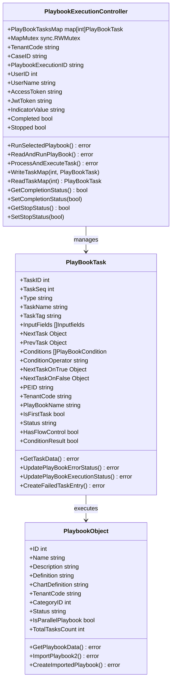
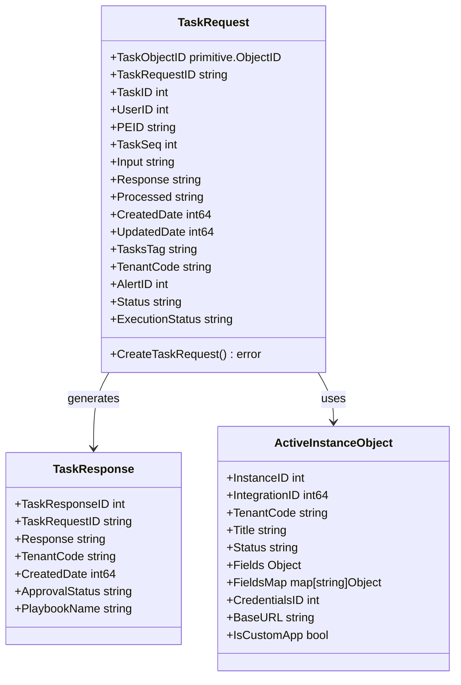
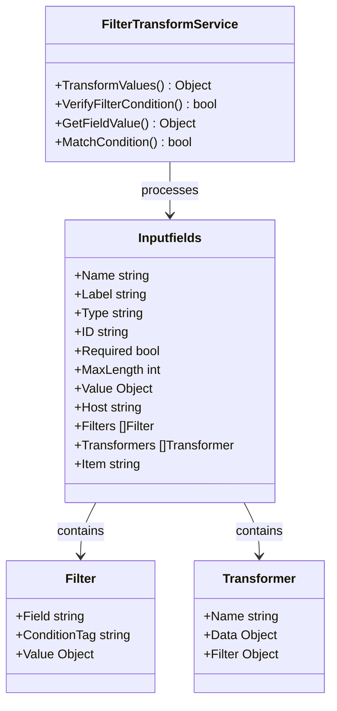
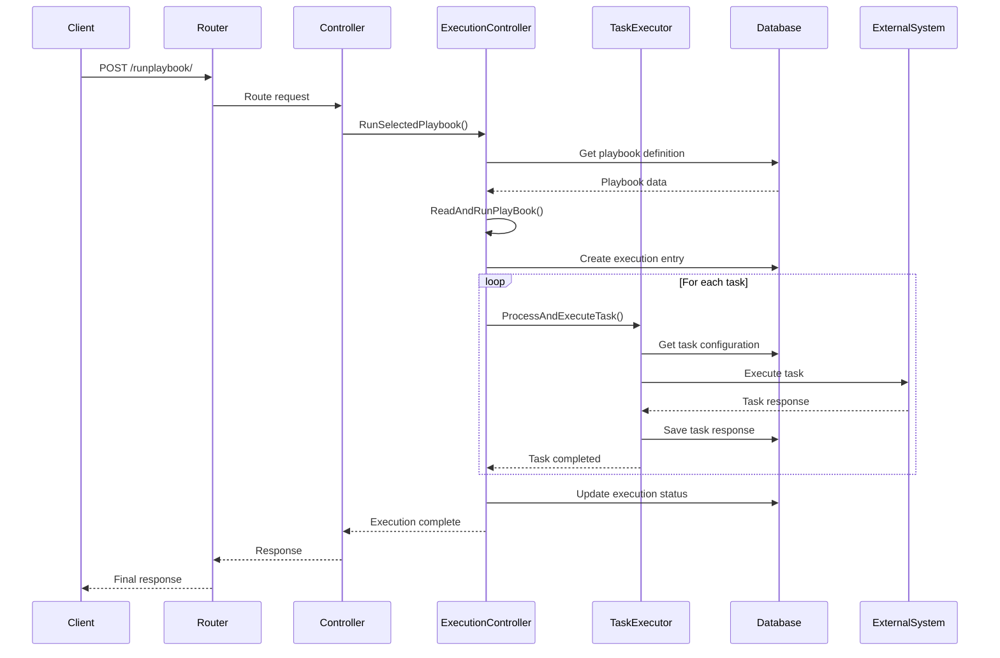
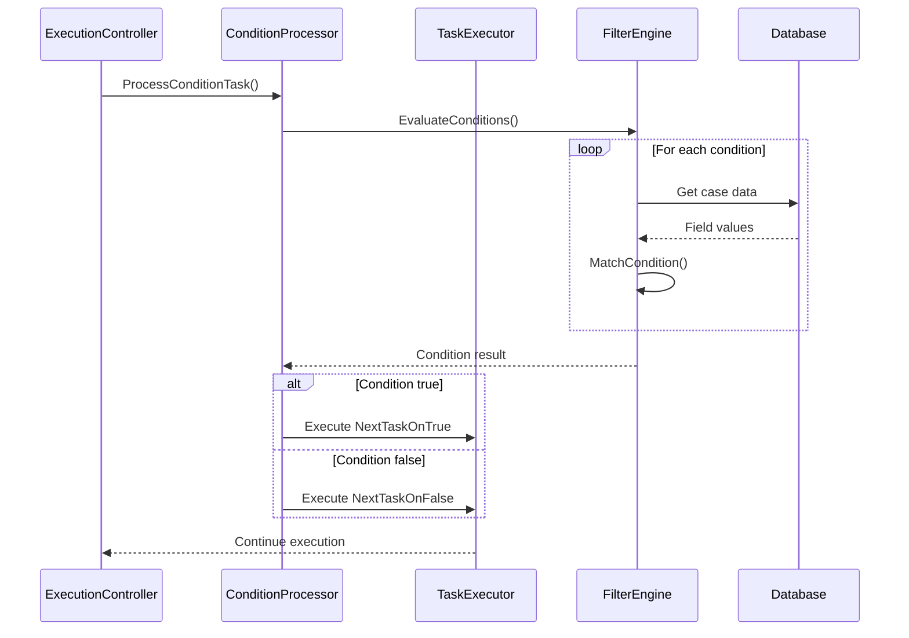
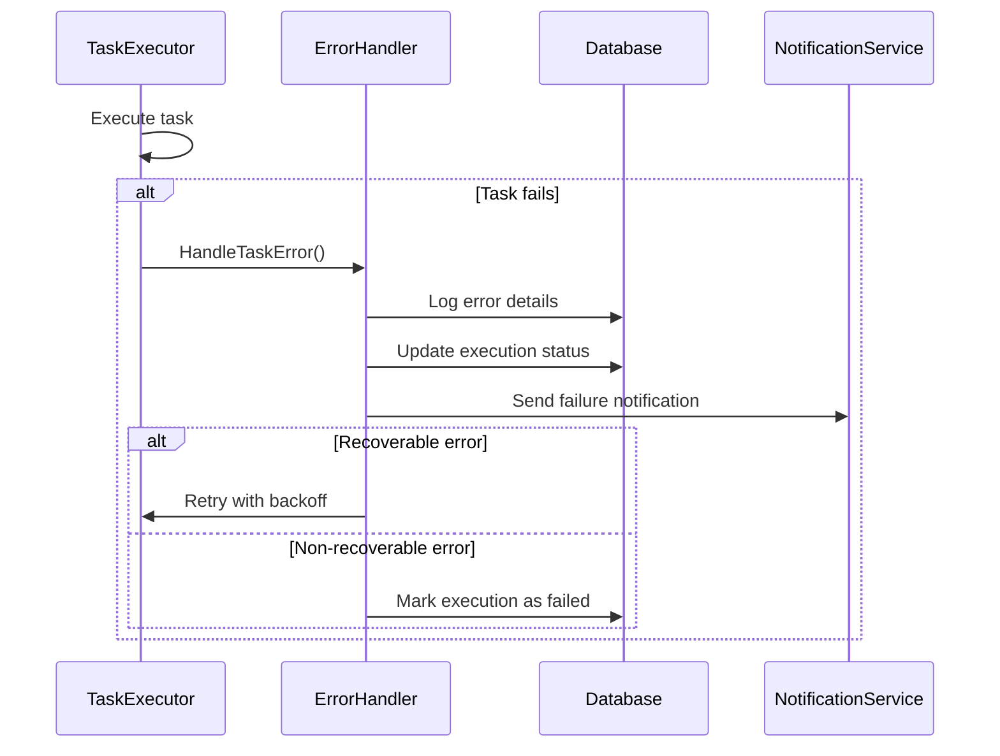
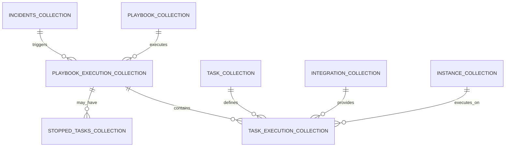

# Securaa Playbook Service - Low Level Design Document

## Document Information
- **Service Name**: Securaa Playbook Service
- **Version**: 1.0
- **Date**: September 11, 2025
- **Author**: Development Team
- **Related Documents**: [High Level Design](./HIGH_LEVEL_DESIGN.md)

## Table of Contents
1. [Overview](#overview)
2. [Detailed Component Design](#detailed-component-design)
3. [Class Diagrams](#class-diagrams)
4. [Sequence Diagrams](#sequence-diagrams)
5. [Database Schema](#database-schema)
6. [API Specifications](#api-specifications)
7. [Algorithm Specifications](#algorithm-specifications)
8. [Configuration Management](#configuration-management)
9. [Error Handling Implementation](#error-handling-implementation)
10. [Concurrency & Thread Safety](#concurrency--thread-safety)
11. [Performance Optimizations](#performance-optimizations)
12. [Testing Strategy](#testing-strategy)

---

## 1. Overview

The Low Level Design document provides detailed implementation specifications for the Securaa Playbook Service, including class structures, method signatures, algorithm implementations, and detailed interaction patterns.

### 1.1 Scope
This document covers:
- Detailed class and method specifications
- Database schema with indexes and constraints
- Complete API specifications with validation rules
- Concurrency patterns and thread safety mechanisms
- Performance optimization techniques
- Error handling and recovery strategies

---

## 2. Detailed Component Design

### 2.1 Core Package Structure

```
securaa_services/securaa_playbook/
├── main.go                     // Application entry point
├── app.go                      // Application initialization
├── controllers/                // HTTP request handlers
│   ├── playbookcontroller.go
│   ├── listController.go
│   ├── caseController.go
│   ├── supportcontroller.go
│   └── processController.go
├── executionControllers/       // Execution orchestration
│   ├── playbookExecutionController.go
│   ├── runTaskController.go
│   ├── conditionController.go
│   └── subPlaybookController.go
├── models/                     // Data models
│   ├── playbook.go
│   ├── case.go
│   ├── task.go
│   └── Response.go
├── executionModels/           // Execution-specific models
│   ├── playbook.go
│   ├── Tasks.go
│   └── incidents.go
├── services/                  // Business logic
│   ├── genericTaskService.go
│   ├── processService.go
│   └── filterNTransformService.go
├── utils/                     // Utility functions
│   ├── filterConditionUtils.go
│   ├── matchConditionUtils.go
│   └── executionUtils.go
├── handlers/                  // Error and response handlers
│   ├── errorHandler.go
│   └── taskResponse.go
├── constants/                 // Application constants
│   └── constants.go
└── cacheControllers/         // Cache management
    └── cacheController.go
```

### 2.2 Main Application Structure

#### 2.2.1 App Structure
```go
type App struct {
    Router             *mux.Router                    // HTTP router
    AccessTokenHashMap map[string]int64               // Session management
    DBSession          map[string]common.SessionStruct // Database sessions
    ConfigObject       config.ConfigStruct            // Configuration
    BuildType          string                         // Enterprise/MSSP
    LicenseType        string                         // License information
    RequestResponseLog bool                           // Logging flag
    DockerNodeID       string                         // Docker node identifier
}
```

#### 2.2.2 Initialization Flow
```go
func (a *App) Initialize() {
    // 1. Load configuration
    a.ConfigObject = utils.InitConfig()
    
    // 2. Initialize database sessions
    a.InitMongoSession(a.ConfigObject)
    
    // 3. Initialize access token map
    a.AccessTokenHashMap = make(map[string]int64)
    
    // 4. Setup HTTP router
    a.Router = mux.NewRouter()
    a.initializeRoutes()
    
    // 5. Initialize Docker client
    cli, err := client.NewEnvClient()
    a.DockerNodeID, err = docker.GetNodeID(cli)
    
    // 6. Start background services
    go cache.CacheHealthCheck("test")
    go counter.SetMaxActiveTasksUtilsCount(cli, a.ConfigObject, false)
    
    // 7. Update playbook status on startup
    err = controllers.UpdatePlaybookStatus(a.ConfigObject)
}
```

---

## 3. Class Diagrams

### 3.1 Playbook Execution Model



### 3.2 Task Execution Model



### 3.3 Filter & Transform Model



---

## 4. Sequence Diagrams

### 4.1 Playbook Execution Flow



### 4.2 Task Execution with Conditions



### 4.3 Error Handling Flow



---

## 5. Database Schema

### 5.1 MongoDB Collections Schema

#### 5.1.1 Playbook Collection
```javascript
{
  "_id": ObjectId,
  "id": 1001,                           // Auto-increment ID
  "name": "Malware Response Playbook",   // Unique per tenant
  "description": "Automated malware response workflow",
  "version": "1.0.0",
  "definition": "...",                   // JSON string of task definitions
  "chart_definition": "...",             // Visual representation
  "tenant_code": "tenant123",
  "category_id": 5,
  "status": "active",                    // active, draft, archived
  "created_date": 1694443200000,
  "updated_date": 1694443200000,
  "user_id": 1001,
  "group_id": 100,
  "type": "case",                        // case, indicator
  "filename": "1001_tenant123.json",
  "commit_id": "abc123",
  "list_names": ["suspicious_ips", "malware_domains"],
  "all_nodes_connected": "yes",
  "custom_utils_added": false,
  "custom_utils_names": [],
  "vertical_pb": false,
  "is_parallel_playbook": true,
  "total_tasks_count": 15,
  "total_utils_count": 3,
  "shard_bucket": 1                      // For sharding
}
// Indexes
db.playbook_collection.createIndex({"tenant_code": 1, "name": 1}, {unique: true})
db.playbook_collection.createIndex({"tenant_code": 1, "status": 1})
db.playbook_collection.createIndex({"category_id": 1, "status": 1})
db.playbook_collection.createIndex({"shard_bucket": 1})
```

#### 5.1.2 Playbook Execution Collection
```javascript
{
  "_id": ObjectId,
  "id": "pb_exec_123456",                // Execution ID
  "parent_playbook_execution_id": "pb_exec_123455",
  "pid": 1001,                           // Playbook ID
  "uid": 2001,                           // User ID
  "request_data": "...",                 // Original request
  "tenant_code": "tenant123",
  "alert_id": 50001,                     // Case/Incident ID
  "is_evidence": "n",
  "created_date": 1694443200000,
  "status": "active",
  "execution_status": "inprogress",      // inprogress, completed, failed, stopped
  "execution_completion_time": 1694443500000,
  "execution_error_msg": "",
  "execution_error_path": "",
  "username": "security_analyst",
  "indicator": "192.168.1.100",
  "playbook_stopped_manually": false,
  "stop_playbook_data": {
    "sub_playbook_execution_id": "pb_exec_sub_001"
  },
  "last_executed_task_seq": 5,
  "total_tasks_count": 15,
  "total_utils_count": 3,
  "playbook_name": "Malware Response",
  "playbook_runtime": 45000,             // milliseconds
  "source": "ui",                        // ui, api, scheduled
  "node_id": "docker_node_1",
  "shard_bucket": 1
}
// Indexes
db.playbook_execution_collection.createIndex({"tenant_code": 1, "alert_id": 1})
db.playbook_execution_collection.createIndex({"execution_status": 1, "created_date": -1})
db.playbook_execution_collection.createIndex({"uid": 1, "created_date": -1})
db.playbook_execution_collection.createIndex({"shard_bucket": 1})
```

#### 5.1.3 Task Execution Collection
```javascript
{
  "_id": ObjectId,
  "task_request_id": "task_req_789012",
  "description": "Block malicious IP",
  "logo_path": "lib/logo/firewall.png",
  "tenant_code": "tenant123",
  "name": "Block IP Address",
  "app_name": "Palo Alto Firewall",
  "task_id": 301,
  "user_id": 2001,
  "username": "security_analyst",
  "input": "...",                        // Serialized input data
  "processed": "y",                      // y, n
  "created_date": 1694443200000,
  "updated_date": 1694443300000,
  "tasks_tag": "palo_alto_block_ip",
  "rest_url": "https://firewall.api/block",
  "method": "POST",
  "alert_id": 50001,
  "integration_id": 15,
  "instance_id": 150,
  "task_handler": "palo_alto",
  "response": "...",                     // Serialized response
  "is_demo": false,
  "peid": "pb_exec_123456",              // Playbook execution ID
  "task_peid": "",                       // Sub-playbook execution ID
  "task_seq": 3,
  "is_condition": "n",
  "task_condition": "",
  "condition_operator": "",
  "is_evidence": "n",
  "status": "completed",                 // not_started, inprogress, completed, failed
  "playbook_id": "1001",
  "instance_name": "Production Firewall",
  "indicator_type": "ip",
  "task_response_time_stamp": 1694443300000,
  "reputation": "malicious",
  "category": "network_security",
  "function_name": "block_ip_address",
  "filename": "palo_alto_tasks.py",
  "credentials_required": true,
  "task_operator_id": "op_001",
  "indicator": "192.168.1.100",
  "case_description": "Malware infection detected",
  "type": "integration",
  "command": "",
  "generic": false,
  "headers": {
    "Content-Type": "application/json",
    "Authorization": "Bearer token123"
  },
  "content_type": "application/json",
  "request_body": "...",
  "request_type": "POST",
  "task_type": "blocking",
  "custom_task_name": "",
  "playbook_name": "Malware Response",
  "node_id": "docker_node_1",
  "iterate_task": false,
  "iteration_config": "",
  "execution_status": "completed",
  "shard_bucket": 1
}
// Indexes
db.task_execution_collection.createIndex({"peid": 1, "task_seq": 1})
db.task_execution_collection.createIndex({"tenant_code": 1, "alert_id": 1})
db.task_execution_collection.createIndex({"processed": 1, "created_date": 1})
db.task_execution_collection.createIndex({"shard_bucket": 1})
```

#### 5.1.4 Stopped Tasks Collection
```javascript
{
  "_id": ObjectId,
  "case_id": "50001",
  "peid": "pb_exec_123456",
  "task_seq": 5,
  "routine": "MAIN",                     // MAIN, SUB
  "task_name": "Block IP Address",
  "status": "stopped"                    // stopped, resumed
}
// Indexes
db.stopped_tasks_collection.createIndex({"peid": 1, "case_id": 1, "status": 1})
```

### 5.2 Data Relationships



---

## 6. API Specifications

### 6.1 Playbook Management APIs

#### 6.1.1 Create Playbook
```http
POST /createplaybook/
Content-Type: application/json
Authorization: Bearer {jwt_token}

Request Body:
{
  "name": "Malware Response Playbook",
  "description": "Automated response to malware incidents",
  "definition": "...",                    // JSON string
  "chart_definition": "...",              // Visual representation
  "category_id": 5,
  "type": "case",
  "tenant_code": "tenant123",
  "user_id": 1001,
  "version": "1.0.0",
  "is_parallel_playbook": true,
  "total_tasks_count": 15,
  "total_utils_count": 3
}

Response:
{
  "success": true,
  "data": {
    "playbook_id": 1001,
    "filename": "1001_tenant123.json",
    "commit_id": "abc123"
  },
  "error": "",
  "displayMessage": "Playbook created successfully",
  "time": 1694443200000
}
Validation Rules:
- name: Required, max 255 chars, unique per tenant
- description: Optional, max 1000 chars
- definition: Required, valid JSON
- category_id: Required, must exist
- type: Required, enum [case, indicator]
- tenant_code: Required, valid tenant
- user_id: Required, valid user
```

#### 6.1.2 Run Playbook
```http
POST /runplaybook/
Content-Type: application/json
Authorization: Bearer {jwt_token}

Request Body:
{
  "tenantcode": "tenant123",
  "playbook_name": "Malware Response Playbook",
  "case_id": "50001",
  "is_bot": "false",
  "uid": "1001",
  "username": "security_analyst",
  "type": "case",
  "indicator": "192.168.1.100",
  "playbook_execution_id": "",           // For resume
  "resume_playbook": "false"
}
Response:
{
  "success": true,
  "data": {
    "playbook_execution_id": "pb_exec_123456",
    "status": "inprogress",
    "total_tasks": 15,
    "estimated_duration": 300000         // milliseconds
  },
  "error": "",
  "displayMessage": "Playbook execution started",
  "time": 1694443200000
}

Validation Rules:
- tenantcode: Required, valid tenant
- playbook_name: Required, must exist and be active
- case_id: Required for type=case
- uid: Required, valid user
- type: Required, enum [case, indicator]
- indicator: Required for type=indicator
```
### 6.2 Task Management APIs

#### 6.2.1 Run Single Task
```http
POST /runtask/
Content-Type: application/json
Authorization: Bearer {jwt_token}

Request Body:
{
  "task_id": 301,
  "tenant_code": "tenant123",
  "case_id": 50001,
  "user_id": 1001,
  "input_fields": [
    {
      "name": "ip_address",
      "value": "192.168.1.100",
      "type": "string"
    }
  ],
  "instance_id": 150,
  "is_demo": false
}
Response:
{
  "success": true,
  "data": {
    "task_request_id": "task_req_789012",
    "status": "inprogress"
  },
  "error": "",
  "displayMessage": "Task execution started",
  "time": 1694443200000
}
```

### 6.3 Error Response Format

```json
{
  "success": false,
  "data": null,
  "error": "Invalid playbook configuration",
  "displayMessage": "The playbook contains invalid task definitions",
  "errorPath": "ExecutionController.ProcessAndExecuteTask",
  "status": "failed",
  "time": 1694443200000
}
```

---

## 7. Algorithm Specifications

### 7.1 Parallel Task Execution Algorithm

```go
func (executionController *PlaybookExecutionController) executeParallelTasks(
    tasks []executionModels.PlayBookTask,
    dockerNodeID string,
    mongodbSession mongo_driver.MongoClientWrapper,
    coreMongodbSession mongo_driver.MongoClientWrapper,
    configObject config.ConfigStruct,
    dbSession map[string]common.SessionStruct,
) error {
    
    var wg sync.WaitGroup
    var mutex sync.Mutex
    errorChan := make(chan error, len(tasks))
    panicChan := make(chan interface{}, len(tasks))
    ctx, cancel := context.WithCancel(context.Background())
    defer cancel()
    
    // Create stop lookup channel
    stopLookup := make(chan bool, 1)
    var lookupWg sync.WaitGroup
    lookupWg.Add(1)
    
    // Start stop lookup goroutine
    go func() {
        defer lookupWg.Done()
        ticker := time.NewTicker(2 * time.Second)
        defer ticker.Stop()
        
        for {
            select {
            case <-stopLookup:
                return
            case <-ticker.C:
                // Check if playbook should be stopped
                if executionController.checkStopCondition() {
                    cancel()
                    return
                }
            }
        }
    }()
    
    // Execute tasks in parallel
    for i, task := range tasks {
        wg.Add(1)
        go func(taskIndex int, t executionModels.PlayBookTask) {
            defer wg.Done()
            defer func() {
                if r := recover(); r != nil {
                    panicChan <- r
                }
            }()
            
            select {
            case <-ctx.Done():
                // Context cancelled, stop execution
                return
            default:
                // Execute task
                err := executionController.ProcessAndExecuteTask(
                    t.TaskSeq,
                    dockerNodeID,
                    mongodbSession,
                    coreMongodbSession,
                    configObject,
                    dbSession,
                    &wg,
                    "PARALLEL",
                    ctx,
                    panicChan,
                )
                
                if err != nil {
                    mutex.Lock()
                    select {
                    case errorChan <- err:
                    default:
                    }
                    mutex.Unlock()
                    
                    if t.StopOnError {
                        cancel() // Stop all parallel tasks
                    }
                }
            }
        }(i, task)
    }
    
    // Wait for all tasks to complete
    wg.Wait()
    
    // Stop the lookup goroutine
    close(stopLookup)
    lookupWg.Wait()
    
    // Check for errors
    close(errorChan)
    for err := range errorChan {
        if err != nil {
            return err
        }
    }
    
    // Check for panics
    close(panicChan)
    for panic := range panicChan {
        if panic != nil {
            return fmt.Errorf("panic in task execution: %v", panic)
        }
    }
    
    return nil
}
```

### 7.2 Condition Evaluation Algorithm

```go
func (cc *ConditionController) evaluateConditions(
    conditions []executionModels.PlayBookCondition,
    conditionOperator string,
    alertData models.RunPlayBookRequest2,
    executedConditions []executionModels.ExecutedConditionStatus,
) (bool, error) {
    
    if len(conditions) == 0 {
        return true, nil
    }
    
    var results []bool
    
    for _, condition := range conditions {
        result, err := cc.evaluateSingleCondition(
            condition,
            alertData,
            executedConditions,
        )
        if err != nil {
            return false, err
        }
        results = append(results, result)
    }
    
    // Apply logical operator
    switch strings.ToLower(conditionOperator) {
    case "and":
        return cc.applyAndOperator(results), nil
    case "or":
        return cc.applyOrOperator(results), nil
    default:
        return false, fmt.Errorf("unsupported condition operator: %s", conditionOperator)
    }
}

func (cc *ConditionController) evaluateSingleCondition(
    condition executionModels.PlayBookCondition,
    alertData models.RunPlayBookRequest2,
    executedConditions []executionModels.ExecutedConditionStatus,
) (bool, error) {
    // Get field value from case data or previous task response
    var fieldValue interface{}
    var err error
    if condition.ConditionKeyValue != nil {
        // Static value condition
        fieldValue = condition.ConditionKeyValue
    } else if condition.TaskName != "" {
        // Previous task response condition
        fieldValue, err = cc.getPreviousTaskResponse(
            condition.TaskName,
            condition.ConditionKey,
            executedConditions,
        )
        if err != nil {
            return false, err
        }
    } else {
        // Case field condition
        fieldValue = utils.GetFieldValue(alertData, condition.ConditionKey)
    }
    
    // Evaluate condition
    return utils.MatchCondition(
        fieldValue,
        condition.ConditionType,
        condition.ConditionValue,
    )
}

func (cc *ConditionController) applyAndOperator(results []bool) bool {
    for _, result := range results {
        if !result {
            return false
        }
    }
    return true
}
func (cc *ConditionController) applyOrOperator(results []bool) bool {
    for _, result := range results {
        if result {
            return true
        }
    }
    return false
}
```

### 7.3 Cache Management Algorithm

```go
type CacheManager struct {
    redisClient   *redis.Client
    localCache    *sync.Map
    ttlMap        *sync.Map
    mutex         sync.RWMutex
    cleanupTicker *time.Ticker
}

func (cm *CacheManager) Get(key string) (interface{}, bool) {
    cm.mutex.RLock()
    defer cm.mutex.RUnlock()
    // Check local cache first
    if value, exists := cm.localCache.Load(key); exists {
        // Check TTL
        if ttl, ok := cm.ttlMap.Load(key); ok {
            if time.Now().Unix() > ttl.(int64) {
                cm.localCache.Delete(key)
                cm.ttlMap.Delete(key)
                return nil, false
            }
            return value, true
        }
    }
    
    // Fall back to Redis
    result, err := cm.redisClient.Get(key).Result()
    if err != nil {
        return nil, false
    }
    
    // Parse and cache locally
    var value interface{}
    json.Unmarshal([]byte(result), &value)
    cm.localCache.Store(key, value)
    
    return value, true
}

func (cm *CacheManager) Set(key string, value interface{}, ttl time.Duration) error {
    cm.mutex.Lock()
    defer cm.mutex.Unlock()
    // Store in local cache
    cm.localCache.Store(key, value)
    if ttl > 0 {
        expiryTime := time.Now().Add(ttl).Unix()
        cm.ttlMap.Store(key, expiryTime)
    }
    // Store in Redis
    data, err := json.Marshal(value)
    if err != nil {
        return err
    }
    
    return cm.redisClient.Set(key, data, ttl).Err()
}

func (cm *CacheManager) startCleanupRoutine() {
    cm.cleanupTicker = time.NewTicker(5 * time.Minute)
    
    go func() {
        for range cm.cleanupTicker.C {
            now := time.Now().Unix()
            cm.ttlMap.Range(func(key, value interface{}) bool {
                if now > value.(int64) {
                    cm.localCache.Delete(key)
                    cm.ttlMap.Delete(key)
                }
                return true
            })
        }
    }()
}
```

---

## 8. Configuration Management

### 8.1 Configuration Structure

```go
type ConfigStruct struct {
    DatabaseConfig    DatabaseConfig    `json:"database"`
    RedisConfig       RedisConfig       `json:"redis"`
    DockerConfig      DockerConfig      `json:"docker"`
    SecurityConfig    SecurityConfig    `json:"security"`
    LoggingConfig     LoggingConfig     `json:"logging"`
    IntegrationConfig IntegrationConfig `json:"integration"`
}

type DatabaseConfig struct {
    MongoURI        string `json:"mongo_uri"`
    DatabaseName    string `json:"database_name"`
    MaxPoolSize     int    `json:"max_pool_size"`
    MinPoolSize     int    `json:"min_pool_size"`
    MaxIdleTime     int    `json:"max_idle_time"`
    ConnectTimeout  int    `json:"connect_timeout"`
    ShardBucketCount int   `json:"shard_bucket_count"`
}

type RedisConfig struct {
    Host            string `json:"host"`
    Port            int    `json:"port"`
    Password        string `json:"password"`
    Database        int    `json:"database"`
    MaxRetries      int    `json:"max_retries"`
    PoolSize        int    `json:"pool_size"`
    IdleTimeout     int    `json:"idle_timeout"`
}
type SecurityConfig struct {
    JWTSecret           string `json:"jwt_secret"`
    SessionTimeout      int    `json:"session_timeout"`
    MaxLoginAttempts    int    `json:"max_login_attempts"`
    PasswordComplexity  bool   `json:"password_complexity"`
    EncryptionKey       string `json:"encryption_key"`
}
```

### 8.2 Environment-Based Configuration

```go
func LoadConfiguration() ConfigStruct {
    var config ConfigStruct
    
    // Load from environment variables
    config.DatabaseConfig.MongoURI = getEnvOrDefault("MONGO_URI", "mongodb://localhost:27017")
    config.DatabaseConfig.DatabaseName = getEnvOrDefault("DB_NAME", "securaa_playbook")
    config.DatabaseConfig.MaxPoolSize = getEnvIntOrDefault("DB_MAX_POOL_SIZE", 100)
    
    config.RedisConfig.Host = getEnvOrDefault("REDIS_HOST", "localhost")
    config.RedisConfig.Port = getEnvIntOrDefault("REDIS_PORT", 6379)
    config.RedisConfig.Password = getEnvOrDefault("REDIS_PASSWORD", "")
    
    config.SecurityConfig.JWTSecret = getEnvOrDefault("JWT_SECRET", "")
    config.SecurityConfig.SessionTimeout = getEnvIntOrDefault("SESSION_TIMEOUT", 3600)
    
    // Load from config file if exists
    if configFile := os.Getenv("CONFIG_FILE"); configFile != "" {
        loadFromFile(&config, configFile)
    }
    
    // Validate configuration
    if err := validateConfig(config); err != nil {
        log.Fatal("Invalid configuration:", err)
    }
    
    return config
}

func validateConfig(config ConfigStruct) error {
    if config.DatabaseConfig.MongoURI == "" {
        return errors.New("mongo_uri is required")
    }
    
    if config.SecurityConfig.JWTSecret == "" {
        return errors.New("jwt_secret is required")
    }
    
    if config.DatabaseConfig.MaxPoolSize <= 0 {
        return errors.New("max_pool_size must be positive")
    }
    
    return nil
}
```

---

## 9. Error Handling Implementation

### 9.1 Error Types and Hierarchy

```go
type ErrorType string

const (
    ValidationError    ErrorType = "VALIDATION_ERROR"
    DatabaseError      ErrorType = "DATABASE_ERROR"
    IntegrationError   ErrorType = "INTEGRATION_ERROR"
    AuthenticationError ErrorType = "AUTHENTICATION_ERROR"
    AuthorizationError ErrorType = "AUTHORIZATION_ERROR"
    BusinessLogicError ErrorType = "BUSINESS_LOGIC_ERROR"
    SystemError        ErrorType = "SYSTEM_ERROR"
    NetworkError       ErrorType = "NETWORK_ERROR"
)

type ServiceError struct {
    Type        ErrorType `json:"type"`
    Code        string    `json:"code"`
    Message     string    `json:"message"`
    Details     string    `json:"details"`
    Timestamp   int64     `json:"timestamp"`
    RequestID   string    `json:"request_id"`
    UserID      int       `json:"user_id"`
    TenantCode  string    `json:"tenant_code"`
    StackTrace  string    `json:"stack_trace,omitempty"`
    Cause       error     `json:"-"`
}

func (e *ServiceError) Error() string {
    return fmt.Sprintf("[%s] %s: %s", e.Type, e.Code, e.Message)
}

func NewServiceError(errorType ErrorType, code string, message string) *ServiceError {
    return &ServiceError{
        Type:      errorType,
        Code:      code,
        Message:   message,
        Timestamp: time.Now().UnixMilli(),
    }
}
```

### 9.2 Error Handler Implementation

```go
func HandleError(err error, context string) models.Response {
    var response models.Response
    response.Success = false
    response.Time = time.Now().UnixMilli()
    
    if serviceErr, ok := err.(*ServiceError); ok {
        response.Error = serviceErr.Message
        response.ErrorPath = context
        response.Status = string(serviceErr.Type)
        
        // Log structured error
        logger.Error("Service Error", 
            "type", serviceErr.Type,
            "code", serviceErr.Code,
            "message", serviceErr.Message,
            "context", context,
            "timestamp", serviceErr.Timestamp,
        )
        
        // Determine appropriate HTTP status
        switch serviceErr.Type {
        case ValidationError:
            response.DisplayMessage = "Invalid input provided"
        case AuthenticationError:
            response.DisplayMessage = "Authentication required"
        case AuthorizationError:
            response.DisplayMessage = "Access denied"
        case DatabaseError:
            response.DisplayMessage = "Data operation failed"
        case IntegrationError:
            response.DisplayMessage = "External service unavailable"
        default:
            response.DisplayMessage = "An unexpected error occurred"
        }
    } else {
        // Handle generic errors
        response.Error = err.Error()
        response.ErrorPath = context
        response.Status = "error"
        response.DisplayMessage = "An unexpected error occurred"
        
        logger.Error("Unhandled Error", 
            "error", err.Error(),
            "context", context,
        )
    }
    
    return response
}
```

### 9.3 Retry Mechanism

```go
type RetryConfig struct {
    MaxAttempts   int           `json:"max_attempts"`
    InitialDelay  time.Duration `json:"initial_delay"`
    MaxDelay      time.Duration `json:"max_delay"`
    BackoffFactor float64       `json:"backoff_factor"`
    RetryableErrors []ErrorType `json:"retryable_errors"`
}

func RetryWithBackoff(
    operation func() error,
    config RetryConfig,
) error {
    var lastErr error
    delay := config.InitialDelay
    
    for attempt := 1; attempt <= config.MaxAttempts; attempt++ {
        err := operation()
        if err == nil {
            return nil
        }
        
        lastErr = err
        
        // Check if error is retryable
        if serviceErr, ok := err.(*ServiceError); ok {
            retryable := false
            for _, retryableType := range config.RetryableErrors {
                if serviceErr.Type == retryableType {
                    retryable = true
                    break
                }
            }
            if !retryable {
                return err
            }
        }
        
        if attempt < config.MaxAttempts {
            logger.Warn("Operation failed, retrying",
                "attempt", attempt,
                "max_attempts", config.MaxAttempts,
                "delay", delay,
                "error", err.Error(),
            )
            
            time.Sleep(delay)
            
            // Calculate next delay with exponential backoff
            delay = time.Duration(float64(delay) * config.BackoffFactor)
            if delay > config.MaxDelay {
                delay = config.MaxDelay
            }
        }
    }
    
    return fmt.Errorf("operation failed after %d attempts: %w", 
        config.MaxAttempts, lastErr)
}
```

---

## 10. Concurrency & Thread Safety

### 10.1 Task Map Thread Safety

```go
type ThreadSafeTaskMap struct {
    tasks map[int]executionModels.PlayBookTask
    mutex sync.RWMutex
}

func NewThreadSafeTaskMap() *ThreadSafeTaskMap {
    return &ThreadSafeTaskMap{
        tasks: make(map[int]executionModels.PlayBookTask),
    }
}

func (tsm *ThreadSafeTaskMap) Set(taskSeq int, task executionModels.PlayBookTask) {
    tsm.mutex.Lock()
    defer tsm.mutex.Unlock()
    tsm.tasks[taskSeq] = task
}

func (tsm *ThreadSafeTaskMap) Get(taskSeq int) (executionModels.PlayBookTask, bool) {
    tsm.mutex.RLock()
    defer tsm.mutex.RUnlock()
    task, exists := tsm.tasks[taskSeq]
    return task, exists
}

func (tsm *ThreadSafeTaskMap) GetAll() map[int]executionModels.PlayBookTask {
    tsm.mutex.RLock()
    defer tsm.mutex.RUnlock()
    
    // Create a copy to avoid external modifications
    copy := make(map[int]executionModels.PlayBookTask)
    for k, v := range tsm.tasks {
        copy[k] = v
    }
    return copy
}

func (tsm *ThreadSafeTaskMap) Delete(taskSeq int) {
    tsm.mutex.Lock()
    defer tsm.mutex.Unlock()
    delete(tsm.tasks, taskSeq)
}
```

### 10.2 Channel-Based Communication

```go
type TaskChannel struct {
    taskQueue    chan executionModels.PlayBookTask
    resultQueue  chan TaskResult
    errorQueue   chan error
    stopSignal   chan struct{}
    workerCount  int
    wg           sync.WaitGroup
}

type TaskResult struct {
    TaskSeq  int
    Success  bool
    Response string
    Error    error
}

func NewTaskChannel(bufferSize, workerCount int) *TaskChannel {
    return &TaskChannel{
        taskQueue:   make(chan executionModels.PlayBookTask, bufferSize),
        resultQueue: make(chan TaskResult, bufferSize),
        errorQueue:  make(chan error, bufferSize),
        stopSignal:  make(chan struct{}),
        workerCount: workerCount,
    }
}

func (tc *TaskChannel) Start() {
    for i := 0; i < tc.workerCount; i++ {
        tc.wg.Add(1)
        go tc.worker(i)
    }
}

func (tc *TaskChannel) worker(workerID int) {
    defer tc.wg.Done()
    
    for {
        select {
        case task := <-tc.taskQueue:
            result := tc.executeTask(task)
            tc.resultQueue <- result
            
        case <-tc.stopSignal:
            logger.Info("Worker stopping", "worker_id", workerID)
            return
        }
    }
}

func (tc *TaskChannel) SubmitTask(task executionModels.PlayBookTask) {
    select {
    case tc.taskQueue <- task:
        // Task submitted successfully
    case <-time.After(5 * time.Second):
        logger.Error("Task submission timeout", "task_seq", task.TaskSeq)
    }
}

func (tc *TaskChannel) Stop() {
    close(tc.stopSignal)
    tc.wg.Wait()
    close(tc.taskQueue)
    close(tc.resultQueue)
    close(tc.errorQueue)
}
```

### 10.3 Context-Based Cancellation

```go
func (executionController *PlaybookExecutionController) ProcessWithContext(
    ctx context.Context,
    task executionModels.PlayBookTask,
) error {
    
    // Create a derived context with timeout
    taskCtx, cancel := context.WithTimeout(ctx, 5*time.Minute)
    defer cancel()
    
    // Create result channel
    resultChan := make(chan error, 1)
    
    // Execute task in goroutine
    go func() {
        defer func() {
            if r := recover(); r != nil {
                resultChan <- fmt.Errorf("task panicked: %v", r)
            }
        }()
        
        err := executionController.executeTaskInternal(taskCtx, task)
        resultChan <- err
    }()
    
    // Wait for completion or cancellation
    select {
    case err := <-resultChan:
        return err
        
    case <-taskCtx.Done():
        if taskCtx.Err() == context.DeadlineExceeded {
            return NewServiceError(SystemError, "TASK_TIMEOUT", 
                fmt.Sprintf("Task %d timed out", task.TaskSeq))
        }
        return NewServiceError(SystemError, "TASK_CANCELLED", 
            fmt.Sprintf("Task %d was cancelled", task.TaskSeq))
    }
}
```

---

## 11. Performance Optimizations

### 11.1 Connection Pool Management

```go
type ConnectionPoolManager struct {
    mongoPool   *mongo.Client
    redisPool   *redis.Client
    httpPool    *http.Client
    config      PoolConfig
}

type PoolConfig struct {
    MongoMaxPoolSize    int
    MongoMinPoolSize    int
    MongoMaxIdleTime    time.Duration
    RedisPoolSize       int
    RedisIdleTimeout    time.Duration
    HTTPMaxIdleConns    int
    HTTPIdleConnTimeout time.Duration
}

func NewConnectionPoolManager(config PoolConfig) *ConnectionPoolManager {
    // Configure MongoDB connection pool
    mongoOpts := options.Client().
        SetMaxPoolSize(uint64(config.MongoMaxPoolSize)).
        SetMinPoolSize(uint64(config.MongoMinPoolSize)).
        SetMaxConnIdleTime(config.MongoMaxIdleTime)
    
    mongoClient, _ := mongo.Connect(context.Background(), mongoOpts)
    
    // Configure Redis connection pool
    redisClient := redis.NewClient(&redis.Options{
        PoolSize:    config.RedisPoolSize,
        IdleTimeout: config.RedisIdleTimeout,
    })
    
    // Configure HTTP client pool
    httpClient := &http.Client{
        Transport: &http.Transport{
            MaxIdleConns:        config.HTTPMaxIdleConns,
            IdleConnTimeout:     config.HTTPIdleConnTimeout,
            TLSHandshakeTimeout: 10 * time.Second,
        },
        Timeout: 30 * time.Second,
    }
    
    return &ConnectionPoolManager{
        mongoPool: mongoClient,
        redisPool: redisClient,
        httpPool:  httpClient,
        config:    config,
    }
}
```

### 11.2 Batch Operations

```go
func (service *TaskService) BatchUpdateTaskStatus(
    updates []TaskStatusUpdate,
) error {
    const batchSize = 1000
    
    for i := 0; i < len(updates); i += batchSize {
        end := i + batchSize
        if end > len(updates) {
            end = len(updates)
        }
        
        batch := updates[i:end]
        if err := service.processBatch(batch); err != nil {
            return err
        }
    }
    
    return nil
}

func (service *TaskService) processBatch(batch []TaskStatusUpdate) error {
    // Build bulk write operations
    var operations []mongo.WriteModel
    
    for _, update := range batch {
        filter := bson.M{"task_request_id": update.TaskRequestID}
        updateDoc := bson.M{
            "$set": bson.M{
                "status":         update.Status,
                "response":       update.Response,
                "updated_date":   time.Now().UnixMilli(),
            },
        }
        
        operation := mongo.NewUpdateOneModel().
            SetFilter(filter).
            SetUpdate(updateDoc)
        
        operations = append(operations, operation)
    }
    
    // Execute bulk write
    opts := options.BulkWrite().SetOrdered(false)
    _, err := service.collection.BulkWrite(
        context.Background(),
        operations,
        opts,
    )
    
    return err
}
```

### 11.3 Memory Management

```go
type ObjectPool struct {
    pool sync.Pool
}

func NewObjectPool(factory func() interface{}) *ObjectPool {
    return &ObjectPool{
        pool: sync.Pool{
            New: factory,
        },
    }
}

func (op *ObjectPool) Get() interface{} {
    return op.pool.Get()
}

func (op *ObjectPool) Put(obj interface{}) {
    op.pool.Put(obj)
}

// Example usage for task requests
var taskRequestPool = NewObjectPool(func() interface{} {
    return &models.TaskRequest{}
})

func ProcessTaskRequest(data []byte) error {
    // Get object from pool
    req := taskRequestPool.Get().(*models.TaskRequest)
    defer taskRequestPool.Put(req)
    
    // Reset object state
    *req = models.TaskRequest{}
    
    // Process request
    if err := json.Unmarshal(data, req); err != nil {
        return err
    }
    
    // ... process request
    
    return nil
}
```

---

## 12. Testing Strategy

### 12.1 Unit Testing Structure

```go
// Test file: controllers/playbookcontroller_test.go
package controllers

import (
    "testing"
    "github.com/stretchr/testify/assert"
    "github.com/stretchr/testify/mock"
)

type MockMongoSession struct {
    mock.Mock
}

func (m *MockMongoSession) FindSingleDocument(filter, opts, result interface{}) error {
    args := m.Called(filter, opts, result)
    return args.Error(0)
}

func TestPlaybookController_RunSelectedPlaybook(t *testing.T) {
    // Arrange
    mockSession := new(MockMongoSession)
    controller := NewPlaybookController()
    
    expectedPlaybook := models.PlaybookObject{
        ID:   1001,
        Name: "Test Playbook",
        Definition: `[{"task_seq": 1, "type": "start"}]`,
    }
    
    mockSession.On("FindSingleDocument", 
        mock.Anything, mock.Anything, mock.Anything).
        Return(nil).
        Run(func(args mock.Arguments) {
            result := args.Get(2).(*models.PlaybookObject)
            *result = expectedPlaybook
        })
    
    // Act
    result, err := controller.RunSelectedPlaybook(
        "test_tenant",
        "Test Playbook",
        "12345",
        mockSession,
    )
    
    // Assert
    assert.NoError(t, err)
    assert.NotEmpty(t, result.PlaybookExecutionID)
    mockSession.AssertExpectations(t)
}

func TestPlaybookExecutionController_ParallelExecution(t *testing.T) {
    // Test parallel task execution
    controller := &PlaybookExecutionController{
        PlayBookTasksMap: make(map[int]executionModels.PlayBookTask),
    }
    
    // Create test tasks
    tasks := []executionModels.PlayBookTask{
        {TaskSeq: 1, TaskName: "Task 1", Type: "integration"},
        {TaskSeq: 2, TaskName: "Task 2", Type: "integration"},
        {TaskSeq: 3, TaskName: "Task 3", Type: "integration"},
    }
    
    // Execute parallel tasks
    err := controller.executeParallelTasks(tasks, mockSession)
    
    assert.NoError(t, err)
    assert.Equal(t, 3, len(controller.PlayBookTasksMap))
}
```

### 12.2 Integration Testing

```go
// Test file: integration/playbook_execution_test.go
package integration

import (
    "testing"
    "context"
    "time"
)

func TestPlaybookExecutionEndToEnd(t *testing.T) {
    // Setup test environment
    testDB := setupTestDatabase(t)
    defer cleanupTestDatabase(testDB)
    
    testRedis := setupTestRedis(t)
    defer cleanupTestRedis(testRedis)
    
    // Create test playbook
    playbook := createTestPlaybook(t, testDB)
    
    // Create test case
    testCase := createTestCase(t, testDB)
    
    // Execute playbook
    executionID, err := executePlaybook(
        playbook.Name,
        testCase.ID,
        testDB,
        testRedis,
    )
    
    assert.NoError(t, err)
    assert.NotEmpty(t, executionID)
    
    // Wait for completion
    timeout := time.After(30 * time.Second)
    ticker := time.Tick(1 * time.Second)
    
    for {
        select {
        case <-timeout:
            t.Fatal("Playbook execution timeout")
        case <-ticker:
            status := getExecutionStatus(executionID, testDB)
            if status == "completed" {
                return
            }
            if status == "failed" {
                t.Fatal("Playbook execution failed")
            }
        }
    }
}
```

### 12.3 Performance Testing

```go
// Test file: performance/load_test.go
package performance

import (
    "testing"
    "sync"
    "time"
)

func BenchmarkParallelPlaybookExecution(b *testing.B) {
    controller := setupPlaybookController()
    
    b.ResetTimer()
    b.RunParallel(func(pb *testing.PB) {
        for pb.Next() {
            _, err := controller.RunSelectedPlaybook(
                "test_tenant",
                "Load Test Playbook",
                generateRandomCaseID(),
                mockSession,
            )
            if err != nil {
                b.Error(err)
            }
        }
    })
}

func TestConcurrentPlaybookExecution(t *testing.T) {
    const numGoroutines = 100
    const numExecutions = 10
    
    var wg sync.WaitGroup
    controller := setupPlaybookController()
    
    for i := 0; i < numGoroutines; i++ {
        wg.Add(1)
        go func(routineID int) {
            defer wg.Done()
            
            for j := 0; j < numExecutions; j++ {
                _, err := controller.RunSelectedPlaybook(
                    fmt.Sprintf("tenant_%d", routineID),
                    "Concurrent Test Playbook",
                    fmt.Sprintf("case_%d_%d", routineID, j),
                    mockSession,
                )
                
                if err != nil {
                    t.Errorf("Execution failed: %v", err)
                }
            }
        }(i)
    }
    
    wg.Wait()
}
```

---

## Conclusion

This Low Level Design document provides comprehensive implementation details for the Securaa Playbook Service, including:

- **Detailed component specifications** with class diagrams and method signatures
- **Complete database schema** with indexing strategies
- **API specifications** with validation rules and error handling
- **Algorithm implementations** for critical operations
- **Concurrency patterns** and thread safety mechanisms
- **Performance optimizations** and resource management
- **Testing strategies** for quality assurance

This document serves as the technical blueprint for implementing, maintaining, and extending the Securaa Playbook Service at the code level.
