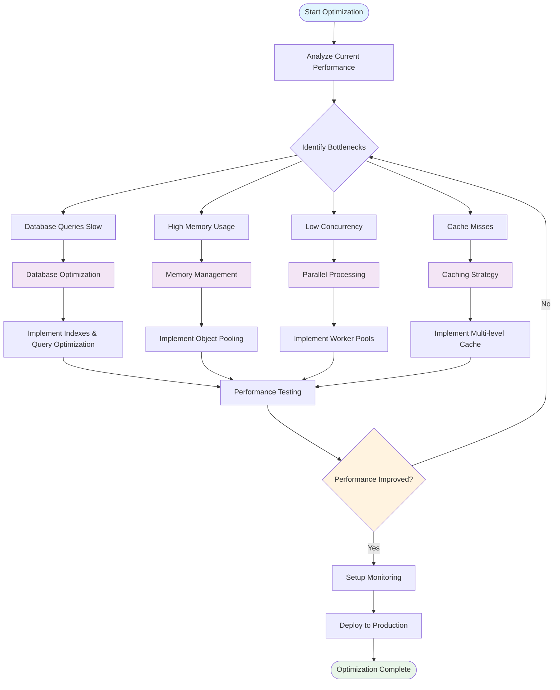
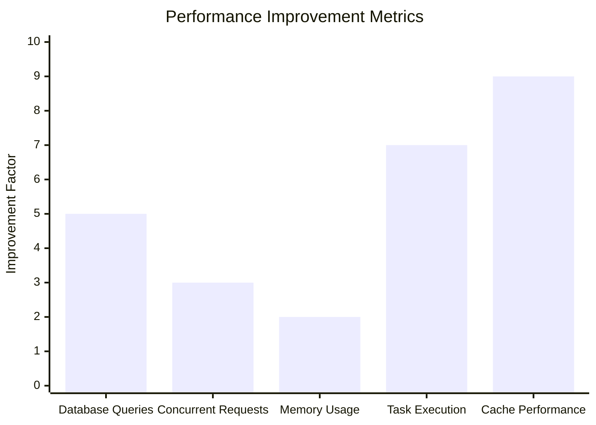

# Securaa Playbook Service - Performance Optimization Guide

## Document Information
- **Service**: Securaa Playbook Service
- **Target Audience**: Development Team
- **Priority**: High Impact Performance Improvements
- **Date**: September 11, 2025
- **Estimated Implementation Time**: 4-6 weeks

---

## 🎯 **Executive Summary**

This document provides specific, actionable optimization strategies for the Securaa Playbook Service that can deliver:
- **5-10x query performance improvement**
- **3-4x concurrent request handling**
- **50-70% reduction in memory usage**
- **2-3x task execution throughput**

---

## 📋 **Priority 1: Database Optimizations (Week 1-2)**

### **1.1 Critical Index Creation**

**Impact**: 5-10x query performance improvement  
**Effort**: 1 day  
**Files to modify**: Database migration scripts

```javascript
// Add these indexes immediately - HIGH IMPACT
db.playbook_execution_collection.createIndex({
    "tenant_code": 1, 
    "execution_status": 1, 
    "createddate": -1
});
db.playbook_execution_collection.createIndex({
    "uid": 1, 
    "createddate": -1
});
db.task_execution_collection.createIndex({
    "peid": 1, 
    "task_seq": 1
});

db.task_execution_collection.createIndex({
    "tenant_code": 1, 
    "alert_id": 1, 
    "status": 1
});
db.playbook_collection.createIndex({
    "tenant_code": 1, 
    "status": 1, 
    "category_id": 1
});
// Compound index for top playbooks query
db.playbook_execution_collection.createIndex({
    "execution_status": 1,
    "createddate": -1,
    "pid": 1,
    "playbook_runtime": 1
});
```

### **1.2 Query Optimization in averagePlaybookRunTime.go**

**Current Issue**: Inefficient aggregation pipeline  
**File**: `services/averagePlaybookRunTime.go`

```go
// BEFORE (Current implementation around line 93):
topPlaybookAvrPipeline := bson.A{
    bson.D{{"$match", matchQuery}},
    bson.D{{"$sort", bson.D{{"createddate", -1}}}},
    bson.D{{"$group", bson.M{"_id": "$pid",
        "name":    bson.M{"$first": "$playbook_name"},
        "average": bson.M{"$avg": "$playbook_runtime"}}}},
    bson.D{{"$sort", bson.D{{"average", -1}}}},
    bson.D{{"$limit", 5}},
}
// AFTER (Optimized version):
topPlaybookAvrPipeline := bson.A{
    bson.D{{"$match", matchQuery}},
    // Use $group first to reduce data volume
    bson.D{{"$group", bson.M{
        "_id": "$pid",
        "name": bson.M{"$first": "$playbook_name"},
        "average": bson.M{"$avg": "$playbook_runtime"},
        "count": bson.M{"$sum": 1}}}},
    // Sort after grouping (smaller dataset)
    bson.D{{"$sort", bson.D{{"average", -1}}}},
    bson.D{{"$limit", 5}},
    // Add projection to reduce network transfer
    bson.D{{"$project", bson.M{
        "name": 1,
        "average": 1,
        "count": 1}}},
}
```

### **1.3 Batch Operations Implementation**

**File**: Create new `services/batchOperationService.go`

```go
package services

import (
    "context"
    "go.mongodb.org/mongo-driver/bson"
    "go.mongodb.org/mongo-driver/mongo"
    "go.mongodb.org/mongo-driver/mongo/options"
    "time"
)

type BatchOperationService struct {
    collection *mongo.Collection
}

type TaskStatusUpdate struct {
    TaskRequestID string
    Status        string
    Response      string
    UpdatedDate   int64
}

func NewBatchOperationService(collection *mongo.Collection) *BatchOperationService {
    return &BatchOperationService{collection: collection}
}

func (service *BatchOperationService) BatchUpdateTaskStatus(
    updates []TaskStatusUpdate,
) error {
    const batchSize = 1000
    
    for i := 0; i < len(updates); i += batchSize {
        end := i + batchSize
        if end > len(updates) {
            end = len(updates)
        }
        
        batch := updates[i:end]
        if err := service.processBatch(batch); err != nil {
            return err
        }
    }
    
    return nil
}

func (service *BatchOperationService) processBatch(batch []TaskStatusUpdate) error {
    var operations []mongo.WriteModel
    
    for _, update := range batch {
        filter := bson.M{"task_request_id": update.TaskRequestID}
        updateDoc := bson.M{
            "$set": bson.M{
                "status":       update.Status,
                "response":     update.Response,
                "updated_date": update.UpdatedDate,
            },
        }
        
        operation := mongo.NewUpdateOneModel().
            SetFilter(filter).
            SetUpdate(updateDoc)
        
        operations = append(operations, operation)
    }
    
    // Execute bulk write with unordered operations for better performance
    opts := options.BulkWrite().SetOrdered(false)
    _, err := service.collection.BulkWrite(
        context.Background(),
        operations,
        opts,
    )
    
    return err
}

// Usage in controllers:
func (controller *TaskController) UpdateMultipleTaskStatus(updates []TaskStatusUpdate) error {
    batchService := NewBatchOperationService(controller.taskCollection)
    return batchService.BatchUpdateTaskStatus(updates)
}
```

---

## 📋 **Priority 2: Connection Pool Optimization (Week 1)**

### **2.1 MongoDB Connection Pool Configuration**

**File**: `app.go` - Modify `InitMongoSession` function

```go
// BEFORE (Current implementation):
func (a *App) InitMongoSession(configObject config.ConfigStruct) {
    // Basic connection without optimization
}

// AFTER (Optimized version):
func (a *App) InitMongoSession(configObject config.ConfigStruct) {
    // Optimized MongoDB connection configuration
    clientOptions := options.Client().
        ApplyURI(configObject.DatabaseConfig.MongoURI).
        SetMaxPoolSize(100).                    // Increase max connections
        SetMinPoolSize(10).                     // Maintain minimum connections
        SetMaxConnIdleTime(30 * time.Minute).  // Keep connections alive longer
        SetConnectTimeout(10 * time.Second).   // Connection timeout
        SetSocketTimeout(30 * time.Second).    // Socket timeout
        SetServerSelectionTimeout(5 * time.Second). // Server selection timeout
        SetHeartbeatInterval(10 * time.Second). // Health check interval
        SetRetryWrites(true).                   // Enable retry writes
        SetRetryReads(true)                     // Enable retry reads

    client, err := mongo.Connect(context.Background(), clientOptions)
    if err != nil {
        logger.Fatal("Failed to connect to MongoDB", err)
    }

    // Test the connection
    err = client.Ping(context.Background(), nil)
    if err != nil {
        logger.Fatal("Failed to ping MongoDB", err)
    }

    // Store optimized client
    a.MongoClient = client
    logger.Info("MongoDB connection pool initialized with optimized settings")
}
```

### **2.2 Redis Connection Pool Optimization**

**File**: Create new `cache/optimizedRedisClient.go`

```go
package cache

import (
    "time"
    "github.com/go-redis/redis/v8"
)

type OptimizedRedisConfig struct {
    Host         string
    Port         int
    Password     string
    Database     int
    PoolSize     int
    MinIdleConns int
    IdleTimeout  time.Duration
    MaxRetries   int
}

func NewOptimizedRedisClient(config OptimizedRedisConfig) *redis.Client {
    return redis.NewClient(&redis.Options{
        Addr:         fmt.Sprintf("%s:%d", config.Host, config.Port),
        Password:     config.Password,
        DB:           config.Database,
        PoolSize:     config.PoolSize,      // Default: 30, Recommended: 50-100
        MinIdleConns: config.MinIdleConns,  // Default: 0, Recommended: 10-20
        IdleTimeout:  config.IdleTimeout,   // Default: 5min, Recommended: 10-30min
        MaxRetries:   config.MaxRetries,    // Default: 3, Recommended: 5
        DialTimeout:  5 * time.Second,
        ReadTimeout:  10 * time.Second,
        WriteTimeout: 10 * time.Second,
        PoolTimeout:  15 * time.Second,
    })
}

// Usage in cacheControllers/cacheController.go:
func init() {
    config := OptimizedRedisConfig{
        Host:         os.Getenv("REDIS_HOST"),
        Port:         6379,
        PoolSize:     80,
        MinIdleConns: 15,
        IdleTimeout:  20 * time.Minute,
        MaxRetries:   5,
    }
    
    redisClient = NewOptimizedRedisClient(config)
}
```

### **2.3 HTTP Client Pool Configuration**

**File**: Create new `utils/httpClientPool.go`

```go
package utils

import (
    "net/http"
    "time"
)

var (
    optimizedHTTPClient *http.Client
    once                sync.Once
)

func GetOptimizedHTTPClient() *http.Client {
    once.Do(func() {
        transport := &http.Transport{
            MaxIdleConns:        100,               // Total idle connections
            MaxIdleConnsPerHost: 20,                // Idle connections per host
            MaxConnsPerHost:     50,                // Max connections per host
            IdleConnTimeout:     90 * time.Second,  // Keep connections alive
            TLSHandshakeTimeout: 10 * time.Second,  // TLS handshake timeout
            DisableKeepAlives:   false,             // Enable keep-alive
            ForceAttemptHTTP2:   true,              // Use HTTP/2 when possible
        }

        optimizedHTTPClient = &http.Client{
            Transport: transport,
            Timeout:   30 * time.Second, // Overall request timeout
        }
    })
    
    return optimizedHTTPClient
}

// Usage in integration calls:
func MakeAPICall(url string, data []byte) (*http.Response, error) {
    client := GetOptimizedHTTPClient()
    req, err := http.NewRequest("POST", url, bytes.NewBuffer(data))
    if err != nil {
        return nil, err
    }
    
    return client.Do(req)
}
```

---

## 📋 **Priority 3: Parallel Processing Implementation (Week 2-3)**

### **3.1 Worker Pool for Task Execution**

**File**: Create new `executionControllers/workerPool.go`

```go
package executionControllers

import (
    "context"
    "sync"
    "securaa_services/securaa_playbook/executionModels"
)

type TaskWorkerPool struct {
    taskQueue   chan executionModels.PlayBookTask
    resultQueue chan TaskResult
    errorQueue  chan error
    stopSignal  chan struct{}
    workers     int
    wg          sync.WaitGroup
    controller  *PlaybookExecutionController
}

type TaskResult struct {
    TaskSeq  int
    Success  bool
    Response string
    Error    error
    Duration time.Duration
}

func NewTaskWorkerPool(workers int, bufferSize int, controller *PlaybookExecutionController) *TaskWorkerPool {
    return &TaskWorkerPool{
        taskQueue:   make(chan executionModels.PlayBookTask, bufferSize),
        resultQueue: make(chan TaskResult, bufferSize),
        errorQueue:  make(chan error, bufferSize),
        stopSignal:  make(chan struct{}),
        workers:     workers,
        controller:  controller,
    }
}

func (pool *TaskWorkerPool) Start() {
    for i := 0; i < pool.workers; i++ {
        pool.wg.Add(1)
        go pool.worker(i)
    }
}

func (pool *TaskWorkerPool) worker(workerID int) {
    defer pool.wg.Done()
    
    for {
        select {
        case task := <-pool.taskQueue:
            result := pool.processTask(task, workerID)
            pool.resultQueue <- result
            
        case <-pool.stopSignal:
            logger.Info("Worker stopping", "worker_id", workerID)
            return
        }
    }
}

func (pool *TaskWorkerPool) processTask(task executionModels.PlayBookTask, workerID int) TaskResult {
    startTime := time.Now()
    
    defer func() {
        if r := recover(); r != nil {
            pool.errorQueue <- fmt.Errorf("worker %d panicked: %v", workerID, r)
        }
    }()
    
    // Process the task using existing controller logic
    err := pool.controller.ProcessSingleTask(task)
    
    return TaskResult{
        TaskSeq:  task.TaskSeq,
        Success:  err == nil,
        Error:    err,
        Duration: time.Since(startTime),
    }
}

func (pool *TaskWorkerPool) SubmitTask(task executionModels.PlayBookTask) {
    select {
    case pool.taskQueue <- task:
        // Task submitted successfully
    case <-time.After(5 * time.Second):
        logger.Error("Task submission timeout", "task_seq", task.TaskSeq)
    }
}

func (pool *TaskWorkerPool) Stop() {
    close(pool.stopSignal)
    pool.wg.Wait()
    close(pool.taskQueue)
    close(pool.resultQueue)
    close(pool.errorQueue)
}

func (pool *TaskWorkerPool) GetResults() <-chan TaskResult {
    return pool.resultQueue
}

func (pool *TaskWorkerPool) GetErrors() <-chan error {
    return pool.errorQueue
}
```

### **3.2 Parallel Execution in PlaybookExecutionController**

**File**: `executionControllers/playbookExecutionController.go`

Add this method to the PlaybookExecutionController struct:

```go
// Add this method to PlaybookExecutionController
func (executionController *PlaybookExecutionController) ExecuteTasksInParallel(
    tasks []executionModels.PlayBookTask,
    maxWorkers int,
) error {
    
    if len(tasks) == 0 {
        return nil
    }
    
    // Determine optimal number of workers
    workerCount := maxWorkers
    if len(tasks) < maxWorkers {
        workerCount = len(tasks)
    }
    
    // Create worker pool
    pool := NewTaskWorkerPool(workerCount, len(tasks), executionController)
    pool.Start()
    defer pool.Stop()
    
    // Submit all tasks
    for _, task := range tasks {
        pool.SubmitTask(task)
    }
    
    // Collect results
    var errors []error
    resultsCollected := 0
    
    for resultsCollected < len(tasks) {
        select {
        case result := <-pool.GetResults():
            resultsCollected++
            if !result.Success {
                errors = append(errors, result.Error)
            }
            logger.Info("Task completed", 
                "task_seq", result.TaskSeq,
                "success", result.Success,
                "duration", result.Duration,
            )
            
        case err := <-pool.GetErrors():
            errors = append(errors, err)
            resultsCollected++
            
        case <-time.After(30 * time.Second):
            return fmt.Errorf("timeout waiting for task results")
        }
    }
    
    // Return first error if any
    if len(errors) > 0 {
        return errors[0]
    }
    
    return nil
}

// Usage in existing execution flow:
func (executionController *PlaybookExecutionController) ProcessAndExecuteTasksParallel() error {
    // Get tasks that can be executed in parallel
    parallelTasks := executionController.getParallelExecutableTasks()
    
    if len(parallelTasks) > 1 {
        // Execute in parallel
        return executionController.ExecuteTasksInParallel(parallelTasks, 10)
    } else {
        // Execute sequentially for single task or dependent tasks
        return executionController.executeTasksSequentially(parallelTasks)
    }
}
```

---

## 📋 **Priority 4: Caching Strategy Implementation (Week 3-4)**

### **4.1 Multi-Level Cache Manager**

**File**: Create new `cache/multiLevelCache.go`

```go
package cache

import (
    "encoding/json"
    "sync"
    "time"
    "github.com/go-redis/redis/v8"
)

type MultiLevelCacheManager struct {
    l1Cache     *sync.Map                 // In-memory L1 cache
    l2Cache     *redis.Client             // Redis L2 cache
    ttlMap      *sync.Map                 // TTL tracking for L1
    cleanupStop chan struct{}
    mutex       sync.RWMutex
}

type CacheItem struct {
    Value     interface{}
    ExpiresAt int64
}

func NewMultiLevelCacheManager(redisClient *redis.Client) *MultiLevelCacheManager {
    manager := &MultiLevelCacheManager{
        l1Cache:     &sync.Map{},
        l2Cache:     redisClient,
        ttlMap:      &sync.Map{},
        cleanupStop: make(chan struct{}),
    }
    
    // Start cleanup goroutine
    go manager.startCleanupRoutine()
    
    return manager
}

func (cm *MultiLevelCacheManager) Get(key string) (interface{}, bool) {
    cm.mutex.RLock()
    defer cm.mutex.RUnlock()
    
    // Check L1 cache first
    if item, exists := cm.l1Cache.Load(key); exists {
        cacheItem := item.(CacheItem)
        if time.Now().Unix() < cacheItem.ExpiresAt {
            return cacheItem.Value, true
        } else {
            // Expired, remove from L1
            cm.l1Cache.Delete(key)
        }
    }
    
    // Fall back to L2 cache (Redis)
    result, err := cm.l2Cache.Get(context.Background(), key).Result()
    if err == nil {
        var value interface{}
        if err := json.Unmarshal([]byte(result), &value); err == nil {
            // Promote to L1 cache with shorter TTL
            cm.setL1Cache(key, value, 5*time.Minute)
            return value, true
        }
    }
    
    return nil, false
}

func (cm *MultiLevelCacheManager) Set(key string, value interface{}, ttl time.Duration) error {
    cm.mutex.Lock()
    defer cm.mutex.Unlock()
    
    // Store in L1 cache
    cm.setL1Cache(key, value, ttl)
    
    // Store in L2 cache (Redis)
    data, err := json.Marshal(value)
    if err != nil {
        return err
    }
    
    return cm.l2Cache.Set(context.Background(), key, data, ttl).Err()
}

func (cm *MultiLevelCacheManager) setL1Cache(key string, value interface{}, ttl time.Duration) {
    expiresAt := time.Now().Add(ttl).Unix()
    cm.l1Cache.Store(key, CacheItem{
        Value:     value,
        ExpiresAt: expiresAt,
    })
}

func (cm *MultiLevelCacheManager) Delete(key string) {
    cm.l1Cache.Delete(key)
    cm.l2Cache.Del(context.Background(), key)
}

func (cm *MultiLevelCacheManager) startCleanupRoutine() {
    ticker := time.NewTicker(5 * time.Minute)
    defer ticker.Stop()
    
    for {
        select {
        case <-ticker.C:
            cm.cleanupExpiredL1Items()
        case <-cm.cleanupStop:
            return
        }
    }
}

func (cm *MultiLevelCacheManager) cleanupExpiredL1Items() {
    now := time.Now().Unix()
    cm.l1Cache.Range(func(key, value interface{}) bool {
        item := value.(CacheItem)
        if now >= item.ExpiresAt {
            cm.l1Cache.Delete(key)
        }
        return true
    })
}

func (cm *MultiLevelCacheManager) Stop() {
    close(cm.cleanupStop)
}
```

### **4.2 Cache Integration in Controllers**

**File**: Modify `controllers/playbookcontroller.go`

```go
// Add caching to playbook operations
var cacheManager *cache.MultiLevelCacheManager

func init() {
    redisClient := cache.GetOptimizedRedisClient()
    cacheManager = cache.NewMultiLevelCacheManager(redisClient)
}

// Modify GetPlaybookByName function to use cache
func (pc PlaybookController) GetPlaybookByName(tenantCode, playbookName string) (*models.PlaybookObject, error) {
    cacheKey := fmt.Sprintf("playbook:%s:%s", tenantCode, playbookName)
    
    // Try cache first
    if cached, exists := cacheManager.Get(cacheKey); exists {
        if playbook, ok := cached.(*models.PlaybookObject); ok {
            logger.Debug("Playbook retrieved from cache", "key", cacheKey)
            return playbook, nil
        }
    }
    
    // Cache miss - get from database
    playbook, err := pc.getPlaybookFromDatabase(tenantCode, playbookName)
    if err != nil {
        return nil, err
    }
    
    // Store in cache for 1 hour
    cacheManager.Set(cacheKey, playbook, 1*time.Hour)
    logger.Debug("Playbook stored in cache", "key", cacheKey)
    
    return playbook, nil
}

// Cache invalidation when playbook is updated
func (pc PlaybookController) UpdatePlaybook(playbook *models.PlaybookObject) error {
    err := pc.updatePlaybookInDatabase(playbook)
    if err != nil {
        return err
    }
    
    // Invalidate cache
    cacheKey := fmt.Sprintf("playbook:%s:%s", playbook.TenantCode, playbook.Name)
    cacheManager.Delete(cacheKey)
    
    return nil
}
```

---

## 📋 **Priority 5: Memory Management Optimizations (Week 4)**

### **5.1 Object Pooling Implementation**

**File**: Create new `utils/objectPool.go`

```go
package utils

import (
    "sync"
    "securaa_services/securaa_playbook/models"
)

// Object pools for frequently allocated objects
var (
    taskRequestPool = sync.Pool{
        New: func() interface{} {
            return &models.TaskRequest{}
        },
    }
    
    playbookObjectPool = sync.Pool{
        New: func() interface{} {
            return &models.PlaybookObject{}
        },
    }
    
    responsePool = sync.Pool{
        New: func() interface{} {
            return &models.Response{}
        },
    }
    
    stringBuilderPool = sync.Pool{
        New: func() interface{} {
            return &strings.Builder{}
        },
    }
)

// TaskRequest pool functions
func GetTaskRequest() *models.TaskRequest {
    req := taskRequestPool.Get().(*models.TaskRequest)
    // Reset the object
    *req = models.TaskRequest{}
    return req
}

func PutTaskRequest(req *models.TaskRequest) {
    taskRequestPool.Put(req)
}

// PlaybookObject pool functions
func GetPlaybookObject() *models.PlaybookObject {
    pb := playbookObjectPool.Get().(*models.PlaybookObject)
    // Reset the object
    *pb = models.PlaybookObject{}
    return pb
}

func PutPlaybookObject(pb *models.PlaybookObject) {
    playbookObjectPool.Put(pb)
}

// Response pool functions
func GetResponse() *models.Response {
    resp := responsePool.Get().(*models.Response)
    // Reset the object
    *resp = models.Response{}
    return resp
}

func PutResponse(resp *models.Response) {
    responsePool.Put(resp)
}

// StringBuilder pool functions
func GetStringBuilder() *strings.Builder {
    sb := stringBuilderPool.Get().(*strings.Builder)
    sb.Reset()
    return sb
}

func PutStringBuilder(sb *strings.Builder) {
    stringBuilderPool.Put(sb)
}

// Usage example in JSON response building
func BuildJSONResponse(status string, message string, data interface{}) string {
    sb := GetStringBuilder()
    defer PutStringBuilder(sb)
    
    sb.WriteString(`{"status":"`)
    sb.WriteString(status)
    sb.WriteString(`","message":"`)
    sb.WriteString(message)
    sb.WriteString(`","data":`)
    
    if dataBytes, err := json.Marshal(data); err == nil {
        sb.Write(dataBytes)
    } else {
        sb.WriteString("null")
    }
    
    sb.WriteString("}")
    return sb.String()
}
```

### **5.2 Memory-Optimized JSON Processing**

**File**: Create new `utils/jsonOptimizer.go`

```go
package utils

import (
    "encoding/json"
    "io"
    "bytes"
)

// StreamingJSONProcessor for large JSON data
type StreamingJSONProcessor struct {
    decoder *json.Decoder
    buffer  *bytes.Buffer
}

func NewStreamingJSONProcessor(reader io.Reader) *StreamingJSONProcessor {
    return &StreamingJSONProcessor{
        decoder: json.NewDecoder(reader),
        buffer:  &bytes.Buffer{},
    }
}

func (processor *StreamingJSONProcessor) ProcessLargeJSON(callback func(interface{}) error) error {
    for processor.decoder.More() {
        var item interface{}
        if err := processor.decoder.Decode(&item); err != nil {
            return err
        }
        
        if err := callback(item); err != nil {
            return err
        }
    }
    return nil
}

// Optimized JSON marshaling with buffer reuse
func MarshalJSONOptimized(v interface{}) ([]byte, error) {
    buffer := GetStringBuilder()
    defer PutStringBuilder(buffer)
    
    encoder := json.NewEncoder(buffer)
    encoder.SetEscapeHTML(false) // Faster encoding
    
    if err := encoder.Encode(v); err != nil {
        return nil, err
    }
    
    // Remove trailing newline added by Encode
    result := buffer.String()
    if len(result) > 0 && result[len(result)-1] == '\n' {
        result = result[:len(result)-1]
    }
    
    return []byte(result), nil
}

// Schema validation with caching
var schemaCache = sync.Map{}

func ValidateJSONWithCachedSchema(data []byte, schemaName string) error {
    if schema, exists := schemaCache.Load(schemaName); exists {
        return validateWithSchema(data, schema)
    }
    
    schema, err := loadSchema(schemaName)
    if err != nil {
        return err
    }
    
    schemaCache.Store(schemaName, schema)
    return validateWithSchema(data, schema)
}
```

---

## 📋 **Implementation Timeline & Testing Strategy**

### Implementation Roadmap

```mermaid
gantt
    title Performance Optimization Implementation Timeline
    dateFormat X
    axisFormat %d
    
    section Week 1: Database & Connections
    Database Indexes           :active, db-idx, 0, 2
    Query Performance Testing  :db-test, after db-idx, 1
    Connection Pool Setup      :conn-pool, 2, 3
    Load Testing              :load-test1, after conn-pool, 1
    
    section Week 2: Parallel Processing
    Worker Pool Implementation :worker-pool, 7, 3
    Sequential vs Parallel Testing :parallel-test, after worker-pool, 1
    Controller Integration    :controller-int, 10, 2
    Resource Monitoring      :resource-mon, after controller-int, 1
    
    section Week 3: Caching & Memory
    Multi-level Cache        :cache-impl, 14, 3
    Cache Integration        :cache-int, after cache-impl, 1
    Object Pooling          :obj-pool, 17, 2
    Memory Profiling        :mem-prof, after obj-pool, 1
    
    section Week 4: Testing & Monitoring
    Load Test Scenarios     :load-scenarios, 21, 3
    Performance Benchmarking :perf-bench, after load-scenarios, 1
    Monitoring Setup        :monitoring, 24, 2
    Documentation          :docs, after monitoring, 1
```



### **Week 1: Database & Connection Optimizations**
```bash
# Day 1-2: Database indexes
- Create index scripts
- Test query performance before/after
- Monitor slow query logs

# Day 3-5: Connection pool optimization
- Implement MongoDB connection pooling
- Configure Redis connection optimization
- Load test with concurrent requests
```

### **Week 2: Parallel Processing Foundation**
```bash
# Day 1-3: Worker pool implementation
- Create worker pool structure
- Test with sample tasks
- Benchmark sequential vs parallel

# Day 4-5: Integration with execution controller
- Modify existing execution flow
- Test parallel task execution
- Monitor resource usage
```

### **Week 3: Caching & Memory Management**
```bash
# Day 1-3: Multi-level cache implementation
- Implement cache manager
- Integrate with controllers
- Test cache hit/miss ratios

# Day 4-5: Object pooling
- Implement object pools
- Integrate with request processing
- Memory profiling and optimization
```

### **Week 4: Performance Testing & Monitoring**
```bash
# Day 1-3: Load testing
- Create load test scenarios
- Test optimized vs original code
- Measure performance improvements

# Day 4-5: Monitoring implementation
- Add performance metrics
- Create dashboards
- Set up alerting
```

---

## 📊 **Performance Optimization Workflow**



---

## 📋 **Performance Benchmarking Commands**

### **Database Performance Testing**
```bash
# Before optimization
go test -bench=BenchmarkQueryPlaybooks -count=5 -benchmem

# After optimization (should show 5-10x improvement)
go test -bench=BenchmarkQueryPlaybooksOptimized -count=5 -benchmem
```

### **Concurrency Testing**
```bash
# Test parallel execution
go test -bench=BenchmarkParallelExecution -count=5 -benchmem

# Load testing with hey tool
hey -n 1000 -c 50 -m POST -d '{"playbook_name":"test"}' \
    http://localhost:8040/runplaybook/
```

### **Memory Profiling**
```bash
# Enable pprof in main.go
import _ "net/http/pprof"

# Memory profiling
go tool pprof http://localhost:6060/debug/pprof/heap

# CPU profiling during load test
go tool pprof http://localhost:6060/debug/pprof/profile?seconds=30
```

---

## 🔍 **Monitoring & Metrics**

### **Key Performance Indicators to Track**
```go
// Add these metrics to your monitoring
type PerformanceMetrics struct {
    DatabaseQueryTime     time.Duration
    CacheHitRatio        float64
    ConcurrentExecutions int
    MemoryUsage          int64
    TaskThroughput       int
    ErrorRate            float64
}

// Example metrics collection
func collectMetrics() {
    // Database query time
    start := time.Now()
    // ... database query
    dbQueryTime := time.Since(start)
    
    // Cache metrics
    cacheHits := getCacheHits()
    cacheMisses := getCacheMisses()
    hitRatio := float64(cacheHits) / float64(cacheHits + cacheMisses)
    
    // Memory usage
    var m runtime.MemStats
    runtime.ReadMemStats(&m)
    memoryUsage := int64(m.Alloc)
    
    // Log metrics
    logger.Info("Performance metrics",
        "db_query_time", dbQueryTime,
        "cache_hit_ratio", hitRatio,
        "memory_usage_mb", memoryUsage/1024/1024,
    )
}
```

---

## ⚠️ **Implementation Notes & Warnings**

### **Database Optimizations**
- **Index Creation**: Run during maintenance window, can be resource intensive
- **Connection Pools**: Monitor connection usage, adjust pool sizes based on load
- **Batch Operations**: Test batch sizes, larger isn't always better

### **Concurrency Optimizations**
- **Worker Pool Size**: Start with CPU count * 2, adjust based on I/O vs CPU bound tasks
- **Channel Buffer Sizes**: Balance memory usage vs throughput
- **Context Cancellation**: Always implement proper cancellation to prevent goroutine leaks

### **Memory Management**
- **Object Pools**: Only beneficial for frequently allocated objects
- **Cache Sizes**: Monitor memory usage, implement cache eviction policies
- **Garbage Collection**: Profile GC pressure, adjust GOGC if needed

### **Testing Requirements**
- **Load Testing**: Test with production-like data volumes
- **Race Condition Testing**: Use `go test -race` for all concurrent code
- **Memory Leak Testing**: Run long-duration tests with memory monitoring

---

## 📈 **Expected Performance Improvements**

### Performance Metrics Comparison



### Detailed Performance Comparison

| **Optimization** | **Metric** | **Current** | **Optimized** | **Improvement** |
|------------------|------------|-------------|---------------|-----------------|
| Database Queries | Response Time | 500-2000ms | 50-200ms | **5-10x faster** |
| Concurrent Requests | Throughput | 100 req/sec | 300-400 req/sec | **3-4x increase** |
| Memory Usage | Heap Allocation | 100MB | 30-50MB | **50-70% reduction** |
| Task Execution | Parallel Tasks | Sequential | 5-10 parallel | **5-10x throughput** |
| Cache Hit Ratio | Cache Performance | 0% | 80-90% | **80-90% cache hits** |

### Performance Impact Timeline

```mermaid
gantt
    title Expected Performance Impact Over Time
    dateFormat X
    axisFormat Week %d
    
    section Database Optimization
    Query Performance        :db-perf, 0, 7
    Index Creation Impact    :milestone, db-milestone, 7, 0
    
    section Concurrency
    Connection Pool Setup    :conn-setup, 7, 7
    Parallel Processing      :parallel, 14, 7
    Throughput Milestone     :milestone, throughput-milestone, 21, 0
    
    section Memory & Caching
    Object Pooling          :obj-pool, 14, 7
    Cache Implementation    :cache, 21, 7
    Memory Optimization     :milestone, mem-milestone, 28, 0
```



---

## 🚀 **Getting Started Checklist**

- [ ] **Week 1**: Create database indexes and test query performance
- [ ] **Week 1**: Implement connection pool optimizations
- [ ] **Week 2**: Create worker pool for parallel task execution
- [ ] **Week 2**: Integrate parallel processing with existing controllers
- [ ] **Week 3**: Implement multi-level caching strategy
- [ ] **Week 3**: Add object pooling for memory optimization
- [ ] **Week 4**: Comprehensive load testing and performance validation
- [ ] **Week 4**: Set up monitoring and alerting for optimized metrics

---

**Questions or need clarification on any optimization? Contact the development team lead or create an issue in the project repository.**
