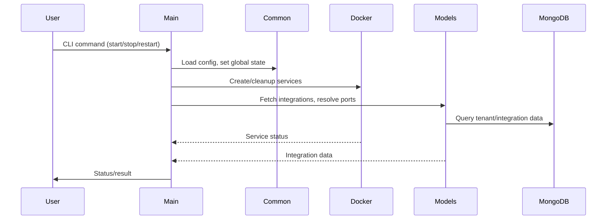
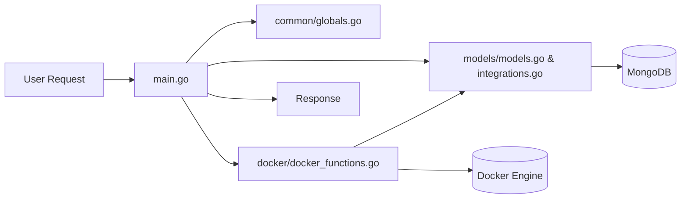

# High-Level Design (HLD) – zona_process_manager

---

## 1. System Architecture Overview

### Purpose & Objectives
- **zona_process_manager** orchestrates and manages the lifecycle of microservices and integrations in the Zona platform.
- Automates deployment, scaling, and health management of services using Docker and MongoDB.
- Dynamically configures integrations for multi-tenant environments.

### Architecture Pattern
- **Layered Modular Architecture**
  - Separation of concerns: main orchestration, configuration/state, service management, integration logic.
  - Microservices managed as Docker containers.

### Technology Stack
- **Language:** Go
- **Containerization:** Docker
- **Database:** MongoDB
- **Logging/Config:** securaa_lib (shared library)
- **Other:** Makefile for build/run automation

---

## 2. Architecture Diagrams (Mermaid)

### System Architecture Diagram
```mermaid
flowchart TD
    A[main.go (Orchestrator)] --> B[common/ (Global State)]
    A --> C[models/ (Business Logic & Integrations)]
    A --> D[docker/ (Service Management)]
    C --> E[integrations.go]
    C --> F[models.go]
    D --> G[docker_functions.go]
    B --> H[globals.go]
    A --> I[securaa_lib (External Libs)]
    A --> J[MongoDB]
    D --> K[Docker Engine]
```

### Component Interaction Diagram


### Data Flow Diagram


---

## 3. Component Analysis

### Major Modules/Components

#### 1. main.go (Orchestrator)
- **Purpose:** Entry point, parses commands, coordinates deployment, restart, and cleanup.
- **Responsibilities:**
  - Loads configuration
  - Initializes global state
  - Orchestrates Docker and integration logic
  - Handles patch-based restarts

#### 2. common/ (Global State & Utilities)
- **Purpose:** Shared state, configuration, and utility functions.
- **Responsibilities:**
  - Holds service maps (system, core, batch, app)
  - Manages DB sessions and integration lists
  - Provides server role detection and feature toggles

#### 3. docker/ (Service Management)
- **Purpose:** Docker orchestration and lifecycle management.
- **Responsibilities:**
  - Initializes service contexts
  - Verifies/creates Docker volumes
  - Creates/updates Docker services and replicas
  - Manages Zookeeper/Kafka for event streaming

#### 4. models/ (Business Logic & Integrations)
- **Purpose:** Data models and integration logic.
- **Responsibilities:**
  - Defines tenant, integration, and session structures
  - Fetches active integrations per tenant
  - Resolves ports and parameters for services

#### Inter-Component Relationships
- `main.go` coordinates all modules
- `common/` provides shared state to all
- `docker/` and `models/` interact via service contexts and integration data
- All modules use shared config and session objects

---

## 4. External Integrations

### Third-Party Services & APIs
- **Docker Engine:** Container orchestration
- **MongoDB:** Tenant/integration data storage
- **securaa_lib:** Logging, config, Docker, MongoDB, utilities

### Database Systems
- **MongoDB:** Used for storing tenant, integration, and system data

### External Dependencies
- **Go Modules:** Dependency management
- **Makefile:** Build/run automation

---

## 5. High-Level Data Flow

### User Request Processing Flow
1. User issues a CLI command (`start`, `stop`, `restart`).
2. `main.go` parses the command and loads configuration.
3. Global state is initialized in `common/`.
4. Docker services are created/cleaned up via `docker/`.
5. Integrations are fetched and configured via `models/`.
6. MongoDB is queried for tenant/integration data.
7. Services are deployed as Docker containers.
8. Status/result is returned to the user.

### Business Logic Execution Flow
- Integrations are dynamically resolved per tenant.
- Service contexts are updated based on integration and config data.
- Docker services are orchestrated for each required component.

### Response Generation Flow
- Service status and integration results are aggregated in `main.go`.
- Final status/result is output to the user (CLI or API).

---

## Mermaid Diagrams
- See above for architecture, component interaction, and data flow diagrams.

---

## Summary
This HLD provides a comprehensive overview of the zona_process_manager system, its architecture, major components, external integrations, and high-level data flows. The modular, layered design enables extensibility and robust orchestration of microservices and integrations in a multi-tenant environment.
