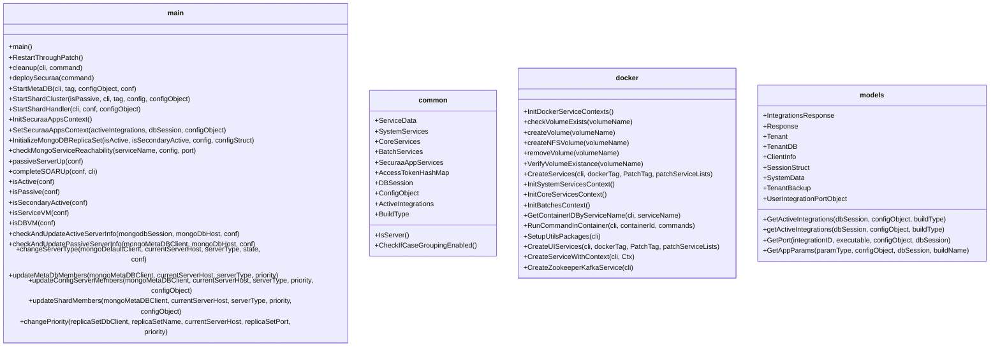
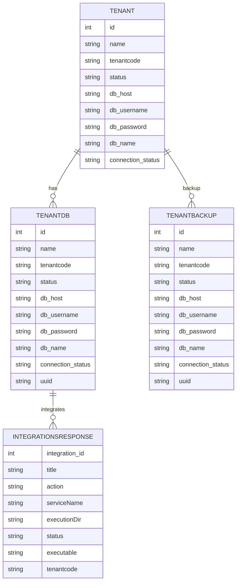
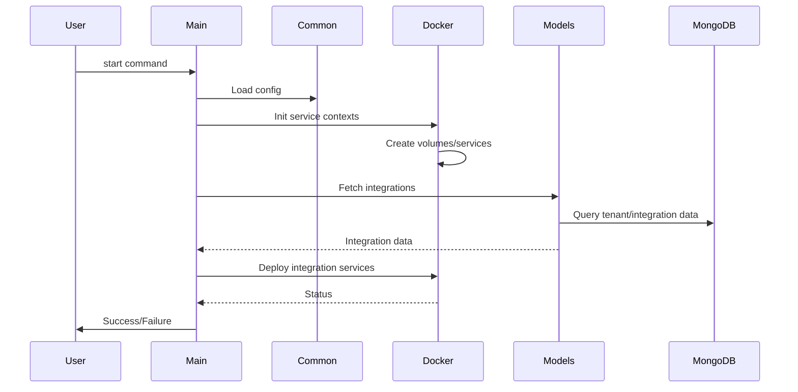
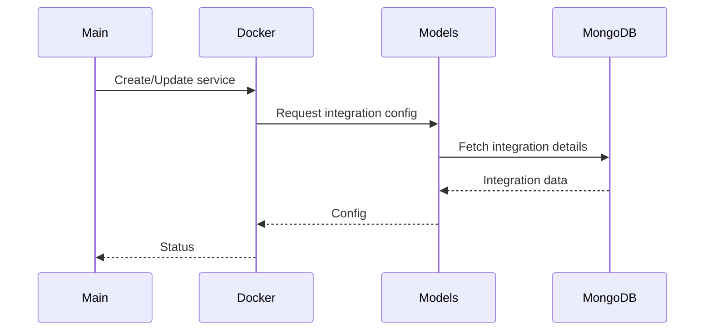
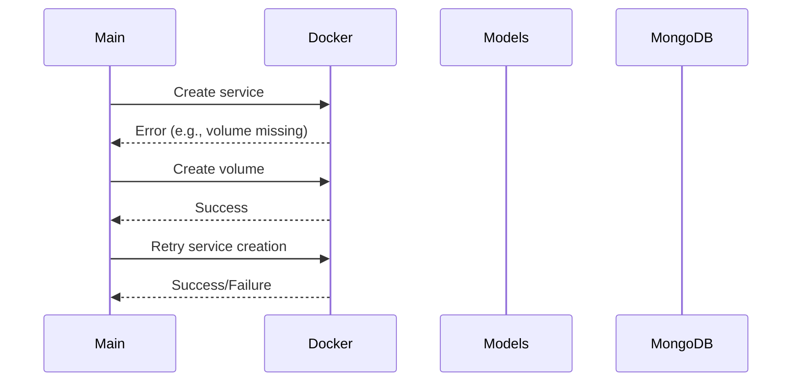

# Low-Level Design (LLD) – zona_process_manager

---

## 1. Detailed Component Design

### Class Diagrams (Mermaid)

### Data Structures & Relationships
- `ServiceData`: Represents a service with name, context, port, replicas.
- `IntegrationsResponse`: Integration metadata for tenants.
- `Tenant`, `TenantDB`, `TenantBackup`: Tenant and database details.
- `SessionStruct`: MongoDB session wrapper.
- Global maps: `SystemServices`, `CoreServices`, `BatchServices`, `SecuraaAppServices` (all map[string]ServiceData).

---

## 2. Database Design

### Entity Relationship Diagram (Mermaid)

### Table Schemas
- **TENANT**: id (int), name (string), tenantcode (string), status (string), db_host (string), db_username (string), db_password (string), db_name (string), connection_status (string)
- **TENANTDB**: id (int), name (string), tenantcode (string), status (string), db_host (string), db_username (string), db_password (string), db_name (string), connection_status (string), uuid (string)
- **INTEGRATIONSRESPONSE**: integration_id (int), title (string), action (string), serviceName (string), executionDir (string), status (string), executable (string), tenantcode (string)
- **TENANTBACKUP**: id (int), name (string), tenantcode (string), status (string), db_host (string), db_username (string), db_password (string), db_name (string), connection_status (string), uuid (string)

### Relationships
- One tenant can have multiple databases and backups.
- Each database can have multiple integrations.

---

## 3. API Design Details

> The codebase does not expose HTTP endpoints directly; orchestration is via CLI and Docker APIs. If extended to REST, typical endpoints would be:

| Endpoint | Method | Request Schema | Response Schema | Auth |
|----------|--------|---------------|----------------|------|
| /service/start | POST | {serviceName: string} | {status: string, details: object} | Token |
| /service/stop | POST | {serviceName: string} | {status: string} | Token |
| /integration/list | GET | - | [IntegrationsResponse] | Token |
| /tenant/list | GET | - | [Tenant] | Token |
| /status | GET | - | {services: [...], integrations: [...]} | Token |

- **Authentication:** Token-based (JWT or API key recommended)
- **Request/Response Schemas:** Use JSON, matching Go struct fields

---

## 4. Sequence Diagrams (Mermaid)

### Service Startup Workflow

### Inter-Service Communication

### Error Handling Scenario

---

## 5. Implementation Details

### Design Patterns
- **Singleton:** Global config/state objects in `common/`
- **Factory:** Service context creation in `docker/`
- **Repository:** Data access patterns in `models/`
- **Observer:** Patch-based restart monitoring

### Algorithms & Data Structures
- Maps for service contexts and integration lists
- Iterative service deployment and health checks
- Dynamic port and parameter resolution for integrations

### Code Organization
- `/main.go`: Orchestration logic
- `/common/`: Global state, utilities
- `/docker/`: Docker orchestration
- `/models/`: Data models, integration logic

---

## 6. Technical Specifications

### Configuration Management
- Centralized config object loaded at startup
- Shared across modules via `common/`
- Supports dynamic updates and patch-based restarts

### Error Handling Strategies
- Centralized logging via `securaa_lib`
- Error propagation and handling in all major methods
- Retry logic for critical operations (e.g., MongoDB reachability)

### Performance Considerations
- Asynchronous service startup and monitoring
- Efficient use of maps for service/integration lookup
- Docker-based scaling and replica management

---

## Summary
This LLD provides a detailed breakdown of the zona_process_manager codebase, including class diagrams, database design, (potential) API details, sequence diagrams, implementation patterns, and technical specifications. All diagrams use actual class and method names from the codebase for clarity and traceability.
