# Zona User Service - High Level Design (HLD)

## 🎯 **EXECUTIVE OVERVIEW**

### ⚠️ **CRITICAL SERVICE CLASSIFICATION**
The Zona User Service is a **mission-critical component** that serves as the foundation of the entire Securaa security platform ecosystem. This service is the central nervous system for security operations, handling all aspects of user identity, access control, and tenant management across the platform.

**Critical Impact Areas:**
- **Security Posture**: Controls access to all security operations and sensitive data
- **Compliance Requirements**: Manages audit trails and regulatory compliance
- **Business Continuity**: Essential for all platform operations and user workflows
- **Data Protection**: Enforces data access policies and tenant isolation
- **Operational Excellence**: Enables monitoring, alerting, and incident response

### 🎯 **BUSINESS CONTEXT & OBJECTIVES**

#### Primary Business Functions
- **Identity & Access Management (IAM)**: Centralized authentication and authorization
- **Multi-Tenant Security**: Secure isolation and resource management across tenants  
- **Compliance Management**: Audit trails, access controls, and regulatory compliance
- **Security Operations**: Real-time monitoring, threat detection, and incident response
- **Enterprise Integration**: Seamless integration with corporate identity systems

#### Key Business Stakeholders
- **Security Teams**: Threat analysts, SOC operators, security engineers
- **Compliance Officers**: Audit managers, risk assessors, compliance specialists
- **IT Operations**: Infrastructure teams, platform engineers, DevOps specialists
- **Business Users**: End users, administrators, tenant managers
- **Executive Leadership**: CISOs, CTOs, risk management executives

## 🏗️ **SYSTEM ARCHITECTURE OVERVIEW**

### **High-Level System Architecture**

```mermaid
graph TB
    subgraph "External Client Layer"
        WEB[Web Applications<br/>React/Angular SPAs]
        MOBILE[Mobile Applications<br/>iOS/Android]
        API_CLIENT[API Clients<br/>Third-party Systems]
        CLI[CLI Tools<br/>Administrative Scripts]
        DASHBOARD[Security Dashboards<br/>Management Consoles]
    end
    
    subgraph "Security Gateway Layer"
        LB[Load Balancer<br/>HAProxy/Nginx]
        WAF[Web Application Firewall<br/>ModSecurity/AWS WAF]
        DDOS[DDoS Protection<br/>CloudFlare/AWS Shield]
        PROXY[API Gateway<br/>Kong/Ambassador]
    end
    
    subgraph "Zona User Service Ecosystem"
        subgraph "Service Cluster"
            direction TB
            SVC1[Primary Instance<br/>Leader Node]
            SVC2[Secondary Instance<br/>Follower Node]  
            SVC3[Worker Instance<br/>Processing Node]
            SVC4[Standby Instance<br/>Hot Backup]
        end
        
        subgraph "WebSocket Layer"
            WS_MGR[WebSocket Manager<br/>Connection Pool]
            WS_HANDLER[Real-time Handler<br/>Event Processing]
            WS_CLUSTER[WebSocket Cluster<br/>Horizontal Scaling]
        end
        
        subgraph "Cache Layer"
            REDIS_SESSION[Redis Session Store<br/>User Sessions]
            REDIS_CACHE[Redis Cache<br/>Application Data]
            REDIS_PUBSUB[Redis Pub/Sub<br/>Real-time Events]
        end
    end
    
    subgraph "Authentication Provider Ecosystem"
        LOCAL_AUTH[Local Authentication<br/>bcrypt + JWT]
        LDAP_AD[LDAP/Active Directory<br/>Corporate Identity]
        SAML_IDP[SAML 2.0 Identity Provider<br/>Enterprise SSO]
        OAUTH2[OAuth2/OIDC Provider<br/>Third-party Auth]
        MFA_SERVICE[MFA Service<br/>TOTP/SMS/Hardware]
    end
    
    subgraph "Data Persistence Layer"
        subgraph "MongoDB Cluster"
            direction LR
            MONGO_PRIMARY[Primary Node<br/>Write Operations]
            MONGO_SECONDARY1[Secondary Node 1<br/>Read Replica]
            MONGO_SECONDARY2[Secondary Node 2<br/>Read Replica]
            MONGO_ARBITER[Arbiter Node<br/>Election Only]
        end
        
        subgraph "Backup & Archive"
            BACKUP_PRIMARY[Primary Backup<br/>Daily Snapshots]
            BACKUP_ARCHIVE[Archive Storage<br/>Long-term Retention]
            BACKUP_DR[Disaster Recovery<br/>Cross-region Backup]
        end
    end
    
    subgraph "External Integration Layer"
        EMAIL_SERVICE[Email Service<br/>SMTP/SendGrid]
        SMS_GATEWAY[SMS Gateway<br/>Twilio/AWS SNS]
        NOTIFICATION_HUB[Notification Hub<br/>Multi-channel Delivery]
        AUDIT_SERVICE[Audit Service<br/>Compliance Logging]
        METRICS_COLLECTOR[Metrics Collector<br/>Prometheus/DataDog]
    end
    
    subgraph "Security Infrastructure"
        KMS[Key Management Service<br/>Encryption Keys]
        HSM[Hardware Security Module<br/>Certificate Storage]
        VAULT[Secrets Management<br/>HashiCorp Vault]
        SIEM[SIEM Platform<br/>Splunk/ELK]
        THREAT_INTEL[Threat Intelligence<br/>Security Feeds]
    end
    
    subgraph "Monitoring & Observability"
        PROMETHEUS[Prometheus<br/>Metrics Collection]
        GRAFANA[Grafana<br/>Dashboards & Alerts]
        JAEGER[Jaeger<br/>Distributed Tracing]
        ELK_STACK[ELK Stack<br/>Log Aggregation]
        ALERTMANAGER[AlertManager<br/>Incident Response]
    end
    
    %% Client Connections
    WEB --> LB
    MOBILE --> LB
    API_CLIENT --> LB
    CLI --> LB
    DASHBOARD --> LB
    
    %% Security Gateway Flow
    LB --> WAF
    WAF --> DDOS
    DDOS --> PROXY
    PROXY --> SVC1
    PROXY --> SVC2
    PROXY --> SVC3
    
    %% Service Internal Connections
    SVC1 -.-> WS_MGR
    SVC2 -.-> WS_HANDLER
    SVC3 -.-> WS_CLUSTER
    
    SVC1 -.-> REDIS_SESSION
    SVC2 -.-> REDIS_CACHE
    SVC3 -.-> REDIS_PUBSUB
    
    %% Authentication Flow
    SVC1 --> LOCAL_AUTH
    SVC1 --> LDAP_AD
    SVC1 --> SAML_IDP
    SVC1 --> OAUTH2
    SVC1 --> MFA_SERVICE
    
    %% Data Layer Connections
    SVC1 -.-> MONGO_PRIMARY
    SVC2 -.-> MONGO_SECONDARY1
    SVC3 -.-> MONGO_SECONDARY2
    
    MONGO_PRIMARY -.-> MONGO_SECONDARY1
    MONGO_PRIMARY -.-> MONGO_SECONDARY2
    MONGO_PRIMARY -.-> MONGO_ARBITER
    
    %% Backup Connections
    MONGO_PRIMARY -.-> BACKUP_PRIMARY
    BACKUP_PRIMARY -.-> BACKUP_ARCHIVE
    BACKUP_PRIMARY -.-> BACKUP_DR
    
    %% External Service Connections
    SVC1 --> EMAIL_SERVICE
    SVC2 --> SMS_GATEWAY
    SVC3 --> NOTIFICATION_HUB
    SVC1 --> AUDIT_SERVICE
    SVC2 --> METRICS_COLLECTOR
    
    %% Security Infrastructure
    SVC1 -.-> KMS
    SVC2 -.-> HSM
    SVC3 -.-> VAULT
    AUDIT_SERVICE --> SIEM
    SVC1 --> THREAT_INTEL
    
    %% Monitoring Connections
    SVC1 --> PROMETHEUS
    SVC2 --> GRAFANA
    SVC3 --> JAEGER
    SVC1 --> ELK_STACK
    PROMETHEUS --> ALERTMANAGER
```

### **Enterprise Security Architecture**

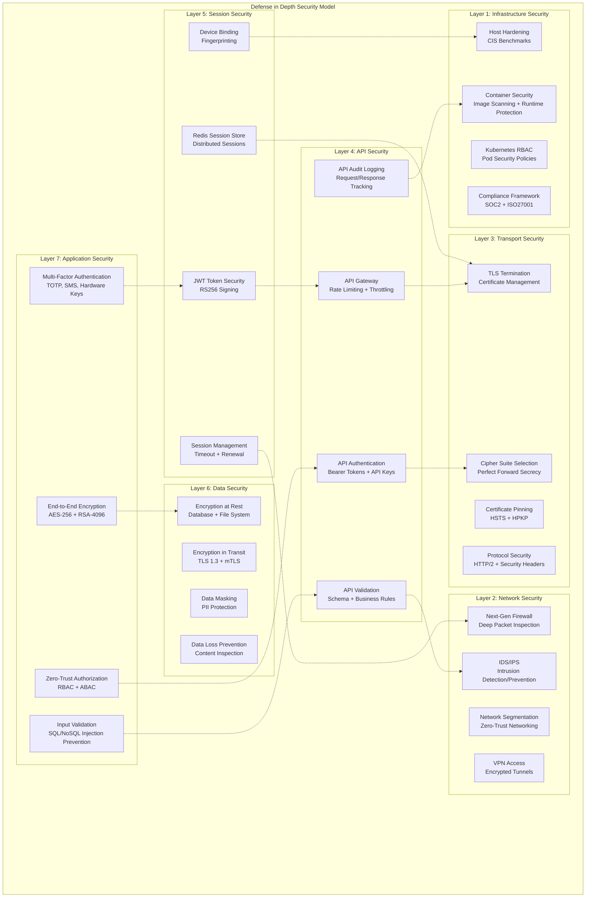

## 🎯 **CORE BUSINESS CAPABILITIES**

### **Enterprise Identity & Access Management**

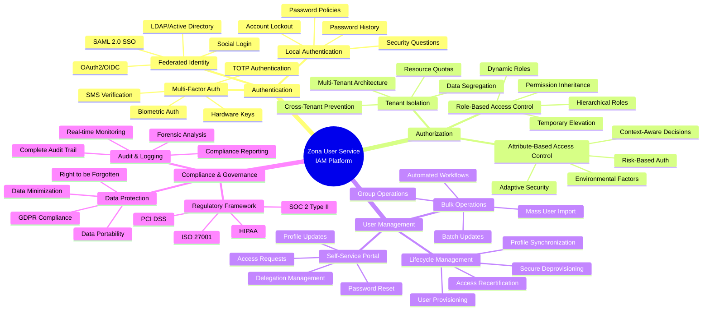

### **Multi-Tenant Architecture Capabilities**

```mermaid
graph TB
    subgraph "Tenant Management Ecosystem"
        subgraph "Tenant Onboarding"
            TENANT_CREATE[Tenant Creation<br/>Automated Provisioning]
            TENANT_CONFIG[Configuration<br/>Custom Settings]
            TENANT_BRANDING[White-Label<br/>Custom Branding]
            TENANT_INTEGRATION[Integration Setup<br/>External Systems]
        end
        
        subgraph "Resource Management"
            QUOTA_MGT[Resource Quotas<br/>CPU/Memory/Storage]
            RATE_LIMITING[API Rate Limiting<br/>Per-tenant Throttling]
            PERFORMANCE_SLA[Performance SLAs<br/>Guaranteed Response Times]
            COST_ALLOCATION[Cost Allocation<br/>Usage-based Billing]
        end
        
        subgraph "Data Isolation"
            LOGICAL_SEPARATION[Logical Separation<br/>Database Schemas]
            PHYSICAL_ISOLATION[Physical Isolation<br/>Dedicated Resources]
            ENCRYPTION_KEYS[Tenant-Specific Keys<br/>Crypto Boundaries]
            DATA_RESIDENCY[Data Residency<br/>Geographic Controls]
        end
        
        subgraph "Security Controls"
            TENANT_RBAC[Tenant-specific RBAC<br/>Role Hierarchies]
            CROSS_TENANT_PREVENTION[Cross-tenant Prevention<br/>Access Controls]
            SECURITY_POLICIES[Security Policies<br/>Custom Rules]
            COMPLIANCE_BOUNDARIES[Compliance Boundaries<br/>Regulatory Controls]
        end
        
        subgraph "Operational Excellence"
            MONITORING[Tenant Monitoring<br/>Usage Analytics]
            BACKUP_RECOVERY[Backup & Recovery<br/>Per-tenant Policies]
            DISASTER_RECOVERY[Disaster Recovery<br/>Business Continuity]
            SUPPORT_ESCALATION[Support Escalation<br/>Tenant-specific SLAs]
        end
    end
    
    %% Flow Connections
    TENANT_CREATE --> TENANT_CONFIG
    TENANT_CONFIG --> TENANT_BRANDING
    TENANT_BRANDING --> TENANT_INTEGRATION
    
    QUOTA_MGT --> RATE_LIMITING
    RATE_LIMITING --> PERFORMANCE_SLA
    PERFORMANCE_SLA --> COST_ALLOCATION
    
    LOGICAL_SEPARATION --> PHYSICAL_ISOLATION
    PHYSICAL_ISOLATION --> ENCRYPTION_KEYS
    ENCRYPTION_KEYS --> DATA_RESIDENCY
    
    TENANT_RBAC --> CROSS_TENANT_PREVENTION
    CROSS_TENANT_PREVENTION --> SECURITY_POLICIES
    SECURITY_POLICIES --> COMPLIANCE_BOUNDARIES
    
    MONITORING --> BACKUP_RECOVERY
    BACKUP_RECOVERY --> DISASTER_RECOVERY
    DISASTER_RECOVERY --> SUPPORT_ESCALATION
```

## 🔄 **CRITICAL BUSINESS PROCESSES**

### **User Authentication Flow**

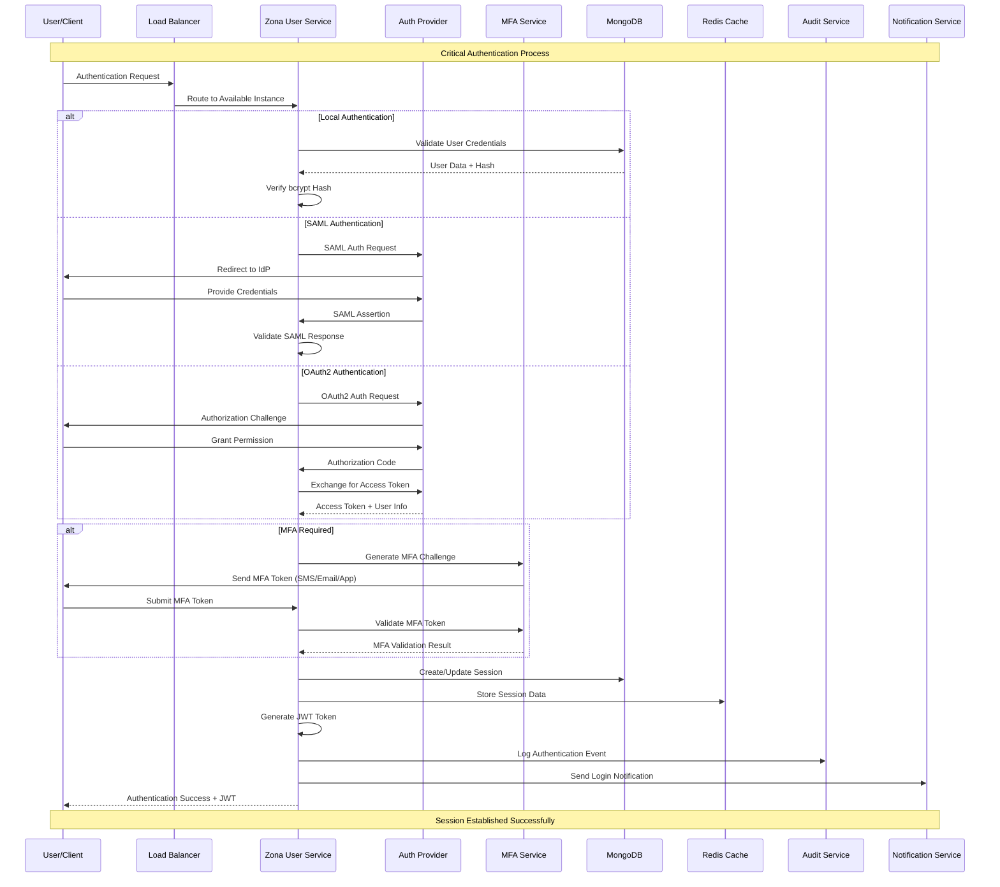

### **Real-Time Notification Flow**

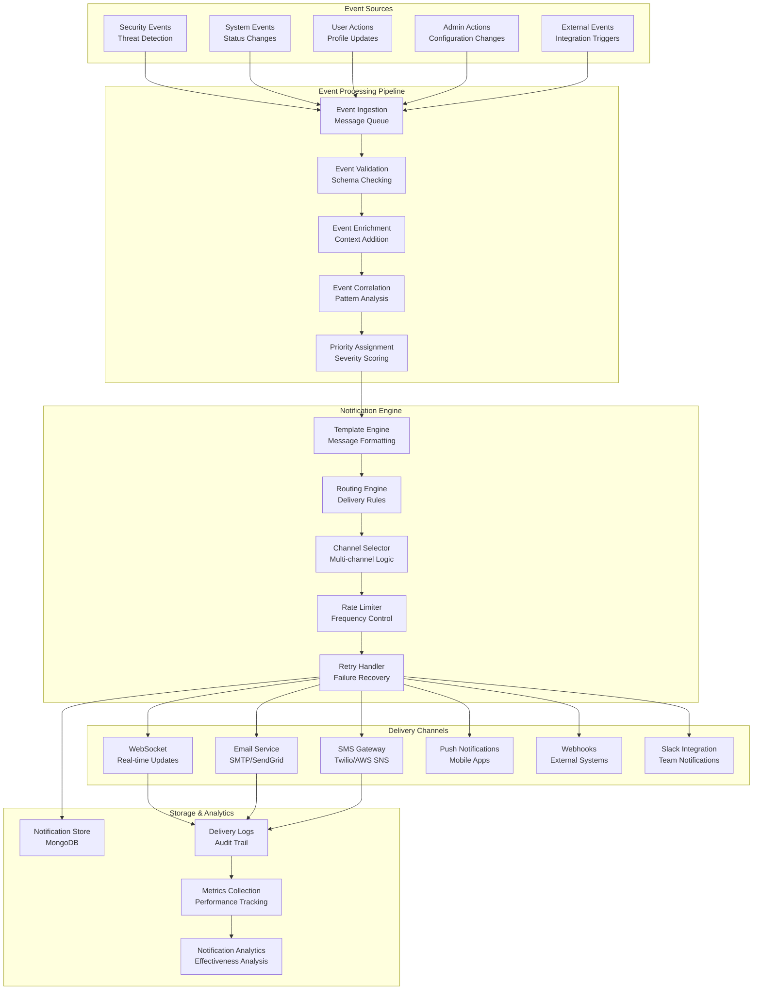

## 🛡️ **ENTERPRISE SECURITY STRATEGY**

### **Zero-Trust Security Model**

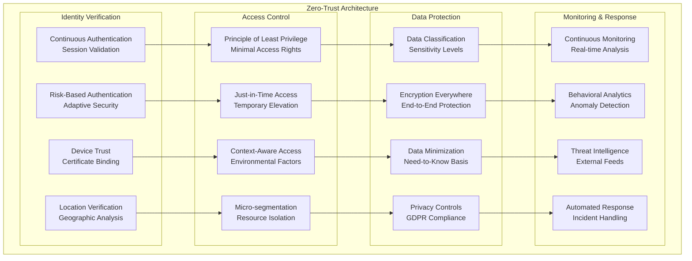

## 📊 **BUSINESS INTELLIGENCE & ANALYTICS**

### **Security Operations Dashboard**

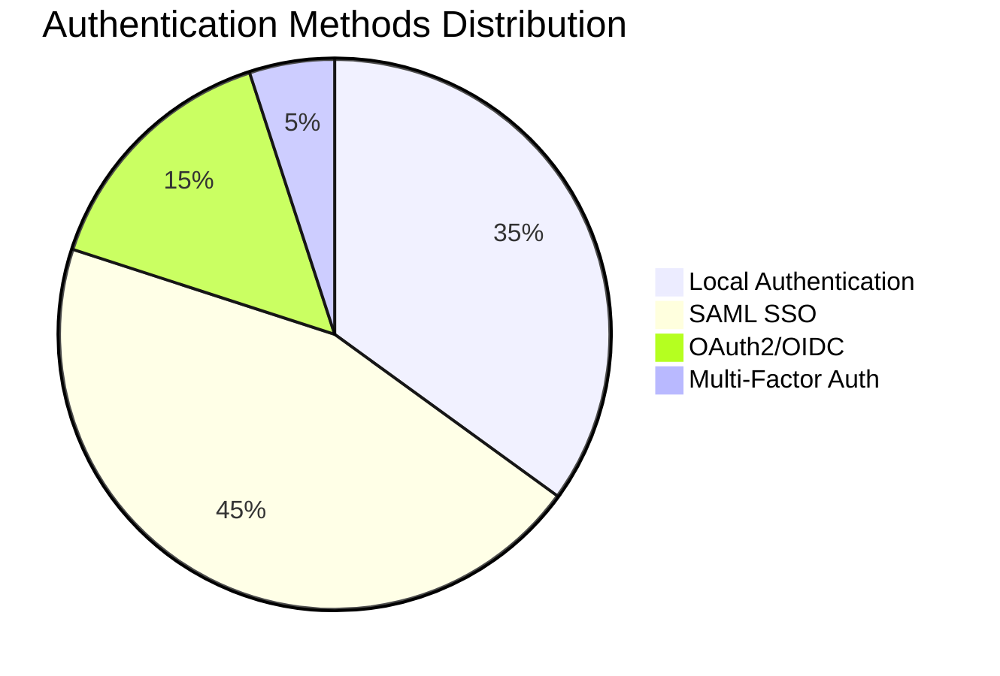

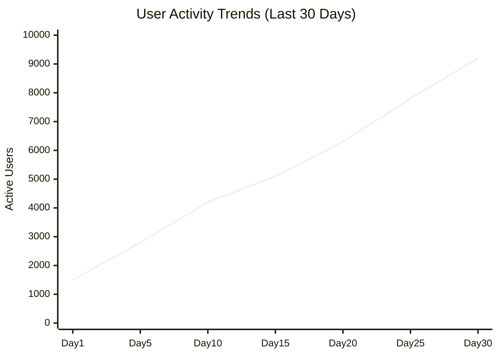

```mermaid
gitgraph
    commit id: "System Baseline"
    branch security-updates
    commit id: "MFA Implementation"
    commit id: "SAML Integration"
    checkout main
    merge security-updates
    commit id: "Production Release"
    branch compliance
    commit id: "GDPR Features"
    commit id: "SOC2 Controls"
    checkout main
    merge compliance
    commit id: "Compliance Ready"
    branch performance
    commit id: "Redis Clustering"
    commit id: "Auto-scaling"
    checkout main
    merge performance
    commit id: "Enterprise Scale"
```

## 🚀 **SCALABILITY & PERFORMANCE STRATEGY**

### **Horizontal Scaling Architecture**

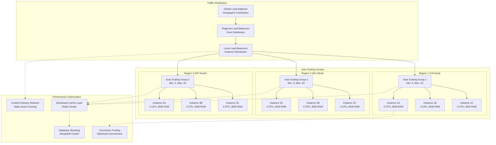

## 🔍 **INTEGRATION ARCHITECTURE**

### **External System Integration Map**

```mermaid
graph TB
    subgraph "Zona User Service Core"
        CORE[Zona User Service<br/>Authentication & Authorization]
    end
    
    subgraph "Identity Providers"
        OKTA[Okta<br/>Enterprise SSO]
        AZURE_AD[Azure AD<br/>Microsoft Identity]
        PING_ID[PingIdentity<br/>Federated SSO]
        GOOGLE_WORKSPACE[Google Workspace<br/>G Suite Integration]
        SALESFORCE[Salesforce<br/>CRM Integration]
    end
    
    subgraph "Communication Services"
        SENDGRID[SendGrid<br/>Email Delivery]
        TWILIO[Twilio<br/>SMS Gateway]
        SLACK_API[Slack API<br/>Team Communication]
        TEAMS[Microsoft Teams<br/>Enterprise Chat]
        WEBHOOK_ENDPOINTS[Custom Webhooks<br/>External Systems]
    end
    
    subgraph "Security Infrastructure"
        VAULT[HashiCorp Vault<br/>Secrets Management]
        KMS[AWS KMS<br/>Key Management]
        SPLUNK[Splunk<br/>SIEM Platform]
        CROWDSTRIKE[CrowdStrike<br/>Endpoint Protection]
        CARBON_BLACK[Carbon Black<br/>Threat Detection]
    end
    
    subgraph "Compliance & Audit"
        AUDIT_VAULT[Audit Vault<br/>Long-term Storage]
        COMPLIANCE_DB[Compliance Database<br/>Regulatory Data]
        GRC_PLATFORM[GRC Platform<br/>Risk Management]
        EVIDENCE_LOCKER[Evidence Locker<br/>Forensic Storage]
    end
    
    subgraph "Cloud Infrastructure"
        AWS_SERVICES[AWS Services<br/>Cloud Infrastructure]
        AZURE_SERVICES[Azure Services<br/>Hybrid Cloud]
        GCP_SERVICES[GCP Services<br/>Multi-cloud]
        KUBERNETES[Kubernetes<br/>Container Orchestration]
        TERRAFORM[Terraform<br/>Infrastructure as Code]
    end
    
    %% Integration Flows
    CORE <--> OKTA
    CORE <--> AZURE_AD
    CORE <--> PING_ID
    CORE <--> GOOGLE_WORKSPACE
    CORE <--> SALESFORCE
    
    CORE --> SENDGRID
    CORE --> TWILIO
    CORE --> SLACK_API
    CORE --> TEAMS
    CORE --> WEBHOOK_ENDPOINTS
    
    CORE <--> VAULT
    CORE <--> KMS
    CORE --> SPLUNK
    CORE --> CROWDSTRIKE
    CORE --> CARBON_BLACK
    
    CORE --> AUDIT_VAULT
    CORE --> COMPLIANCE_DB
    CORE <--> GRC_PLATFORM
    CORE --> EVIDENCE_LOCKER
    
    CORE -.-> AWS_SERVICES
    CORE -.-> AZURE_SERVICES
    CORE -.-> GCP_SERVICES
    CORE -.-> KUBERNETES
    CORE -.-> TERRAFORM
```

## 📋 **COMPLIANCE & GOVERNANCE FRAMEWORK**

### **Regulatory Compliance Matrix**

| Requirement | SOC 2 | ISO 27001 | GDPR | HIPAA | PCI DSS |
|-------------|-------|-----------|------|-------|---------|
| **Access Controls** | ✅ CC6.1-6.8 | ✅ A.9.1-9.4 | ✅ Art.32 | ✅ 164.312 | ✅ Req.7-8 |
| **Encryption** | ✅ CC6.7 | ✅ A.10.1 | ✅ Art.32 | ✅ 164.312 | ✅ Req.3-4 |
| **Audit Logging** | ✅ CC3.3 | ✅ A.12.4 | ✅ Art.30 | ✅ 164.312 | ✅ Req.10 |
| **Data Protection** | ✅ CC6.1 | ✅ A.13.1 | ✅ Art.25 | ✅ 164.306 | ✅ Req.3 |
| **Incident Response** | ✅ CC7.4 | ✅ A.16.1 | ✅ Art.33 | ✅ 164.308 | ✅ Req.12 |
| **Risk Management** | ✅ CC3.1 | ✅ A.12.6 | ✅ Art.35 | ✅ 164.308 | ✅ Req.12 |

### **Data Governance Architecture**

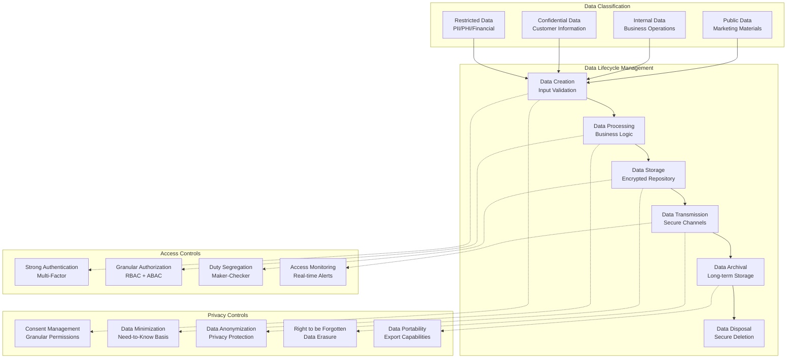

## 🎯 **BUSINESS CONTINUITY & DISASTER RECOVERY**

### **Business Continuity Strategy**

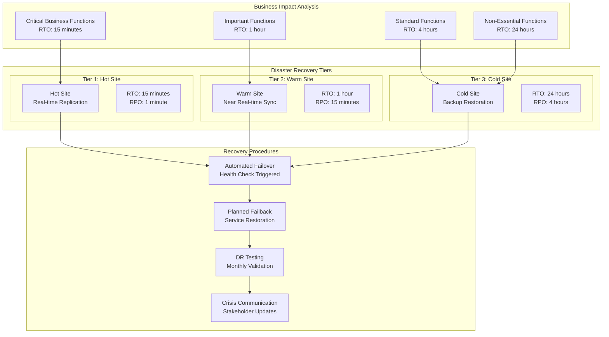

## 📈 **KEY PERFORMANCE INDICATORS**

### **Service Level Objectives (SLOs)**
- **Availability**: 99.99% uptime (52.6 minutes downtime/year)
- **Authentication Response Time**: < 100ms for 95th percentile
- **API Response Time**: < 200ms for 99th percentile
- **Throughput**: 10,000+ concurrent user sessions
- **Data Durability**: 99.999999999% (11 9's)
- **Recovery Time Objective (RTO)**: < 15 minutes
- **Recovery Point Objective (RPO)**: < 5 minutes

### **Security Metrics**
- **Authentication Success Rate**: > 99.5%
- **Failed Login Threshold**: < 2% of total attempts
- **MFA Adoption Rate**: > 95% for admin users
- **Session Timeout Compliance**: 100% enforcement
- **Encryption Coverage**: 100% data at rest and in transit
- **Vulnerability Detection**: < 24 hours for critical issues

### **Business Metrics**
- **User Onboarding Time**: < 5 minutes for new users
- **Password Reset Resolution**: < 2 minutes average
- **Tenant Provisioning**: < 30 minutes for new tenants
- **Compliance Audit Ready**: < 1 hour for data collection
- **Support Ticket Resolution**: < 4 hours for P1 issues
- **Cost per User**: Optimized for enterprise scale