# Zona User Service - Low Level Design (LLD)

## 🔧 **TECHNICAL ARCHITECTURE OVERVIEW**

### **Service Implementation Architecture**

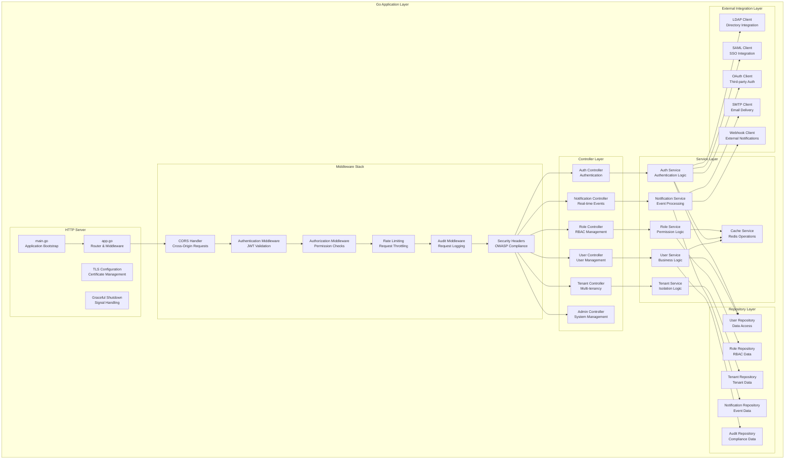

### **Code Structure & Package Organization**

```mermaid
graph TB
    subgraph "Project Root Structure"
        subgraph "Application Entry"
            MAIN_GO[main.go<br/>Bootstrap Application]
            APP_GO[app.go<br/>HTTP Server & Routes]
            DOCKERFILE[Dockerfile<br/>Container Build]
            MAKEFILE[Makefile<br/>Build Automation]
        end
        
        subgraph "Controllers Package"
            direction TB
            USER_CONTROLLER[userController.go<br/>User Management APIs]
            AUTH_CONTROLLER[oauth2Controller.go<br/>Authentication APIs]
            ROLE_CONTROLLER[rolecontroller.go<br/>Role Management]
            TENANT_CONTROLLER[tenantController.go<br/>Tenant Operations]
            NOTIFICATION_CONTROLLER[notificationController.go<br/>Real-time Events]
            TASK_CONTROLLER[taskcontroller.go<br/>Background Tasks]
            REPORT_CONTROLLER[reportController.go<br/>Analytics & Reports]
        end
        
        subgraph "Models Package"
            direction TB
            USER_MODEL[user.go<br/>User Entity & Schema]
            ROLE_MODEL[role.go<br/>Role & Permission Model]
            TENANT_MODEL[tenant.go<br/>Tenant Configuration]
            NOTIFICATION_MODEL[notification.go<br/>Event Structure]
            TASK_MODEL[task.go<br/>Background Job Model]
            RESPONSE_MODEL[Response.go<br/>API Response Format]
        end
        
        subgraph "Services Package"
            direction TB
            NOTIFICATION_SERVICE[notificationsServices.go<br/>Event Processing]
            AUTH_SERVICE[authService.go<br/>Authentication Logic]
            CACHE_SERVICE[cacheService.go<br/>Redis Operations]
            EMAIL_SERVICE[emailService.go<br/>Communication]
        end
        
        subgraph "Constants Package"
            CONSTANTS_GO[constants.go<br/>Application Constants]
            CONFIG_CONSTANTS[config.go<br/>Configuration Values]
        end
        
        subgraph "Templates Package"
            EMAIL_TEMPLATES[activation.html<br/>Email Templates]
            REPORT_TEMPLATES[layout.html<br/>Report Templates]
        end
        
        subgraph "Dependencies Package"
            UI_DEPS[uidependencies/<br/>Frontend Assets]
            D3_CHARTS[d3/<br/>Visualization Library]
            FONTS[fonts/<br/>Typography Assets]
        end
    end
    
    %% Package Dependencies
    MAIN_GO --> APP_GO
    APP_GO --> USER_CONTROLLER
    APP_GO --> AUTH_CONTROLLER
    APP_GO --> ROLE_CONTROLLER
    APP_GO --> TENANT_CONTROLLER
    APP_GO --> NOTIFICATION_CONTROLLER
    
    USER_CONTROLLER --> USER_MODEL
    AUTH_CONTROLLER --> USER_MODEL
    ROLE_CONTROLLER --> ROLE_MODEL
    TENANT_CONTROLLER --> TENANT_MODEL
    NOTIFICATION_CONTROLLER --> NOTIFICATION_MODEL
    
    USER_CONTROLLER --> NOTIFICATION_SERVICE
    AUTH_CONTROLLER --> AUTH_SERVICE
    NOTIFICATION_CONTROLLER --> CACHE_SERVICE
    
    ALL_CONTROLLERS --> CONSTANTS_GO
    NOTIFICATION_SERVICE --> EMAIL_TEMPLATES
    REPORT_CONTROLLER --> REPORT_TEMPLATES
```

## 🏗️ **DATABASE DESIGN & DATA MODELS**

### **MongoDB Collection Schema Architecture**

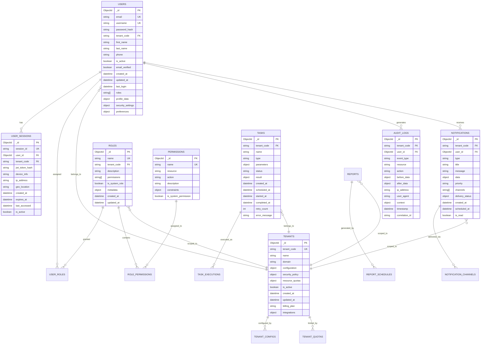

### **Redis Cache Schema Design**

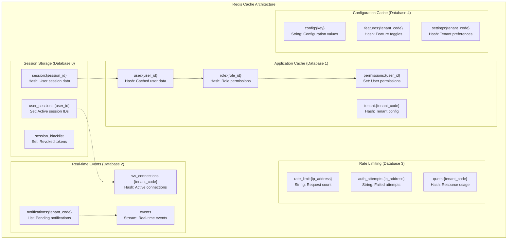

## 🔗 **API DESIGN & ENDPOINT SPECIFICATIONS**

### **RESTful API Architecture**

```mermaid
graph TB
    subgraph "API Endpoint Categories"
        subgraph "Authentication APIs"
            LOGIN[POST /auth/login<br/>User Authentication]
            LOGOUT[POST /auth/logout<br/>Session Termination]
            REFRESH[POST /auth/refresh<br/>Token Renewal]
            MFA[POST /auth/mfa/verify<br/>Multi-Factor Auth]
            SAML[GET/POST /auth/saml/*<br/>SAML SSO Flow]
            OAUTH[GET/POST /auth/oauth/*<br/>OAuth2 Flow]
        end
        
        subgraph "User Management APIs"
            GET_USERS[GET /users<br/>List Users]
            CREATE_USER[POST /users<br/>Create User]
            GET_USER[GET /users/{id}<br/>Get User Details]
            UPDATE_USER[PUT /users/{id}<br/>Update User]
            DELETE_USER[DELETE /users/{id}<br/>Delete User]
            USER_PROFILE[GET/PUT /users/profile<br/>User Profile]
        end
        
        subgraph "Role & Permission APIs"
            GET_ROLES[GET /roles<br/>List Roles]
            CREATE_ROLE[POST /roles<br/>Create Role]
            UPDATE_ROLE[PUT /roles/{id}<br/>Update Role]
            DELETE_ROLE[DELETE /roles/{id}<br/>Delete Role]
            ASSIGN_ROLE[POST /users/{id}/roles<br/>Assign Role]
            GET_PERMISSIONS[GET /permissions<br/>List Permissions]
        end
        
        subgraph "Tenant Management APIs"
            GET_TENANTS[GET /tenants<br/>List Tenants]
            CREATE_TENANT[POST /tenants<br/>Create Tenant]
            UPDATE_TENANT[PUT /tenants/{code}<br/>Update Tenant]
            TENANT_CONFIG[GET/PUT /tenants/{code}/config<br/>Tenant Configuration]
            TENANT_USERS[GET /tenants/{code}/users<br/>Tenant Users]
        end
        
        subgraph "Notification APIs"
            GET_NOTIFICATIONS[GET /notifications<br/>List Notifications]
            MARK_READ[PUT /notifications/{id}/read<br/>Mark as Read]
            WEBSOCKET[WS /ws<br/>Real-time Connection]
            SEND_NOTIFICATION[POST /notifications<br/>Send Notification]
        end
        
        subgraph "Administrative APIs"
            HEALTH_CHECK[GET /health<br/>Health Status]
            METRICS[GET /metrics<br/>Application Metrics]
            AUDIT_LOGS[GET /audit<br/>Audit Trail]
            SYSTEM_CONFIG[GET/PUT /config<br/>System Configuration]
            BULK_OPERATIONS[POST /bulk/*<br/>Batch Operations]
        end
    end
    
    %% API Flow Dependencies
    LOGIN --> GET_USERS
    LOGIN --> GET_ROLES
    LOGIN --> GET_NOTIFICATIONS
    CREATE_USER --> ASSIGN_ROLE
    UPDATE_TENANT --> TENANT_CONFIG
    WEBSOCKET --> SEND_NOTIFICATION
```

### **API Request/Response Flow Diagram**

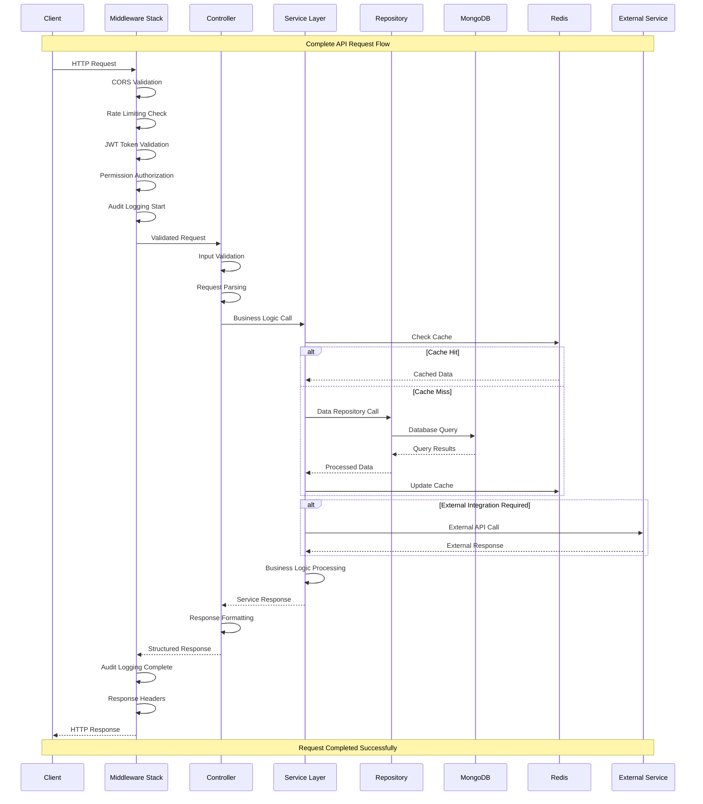

## 🔒 **SECURITY IMPLEMENTATION DETAILS**

### **Authentication & Authorization Flow**

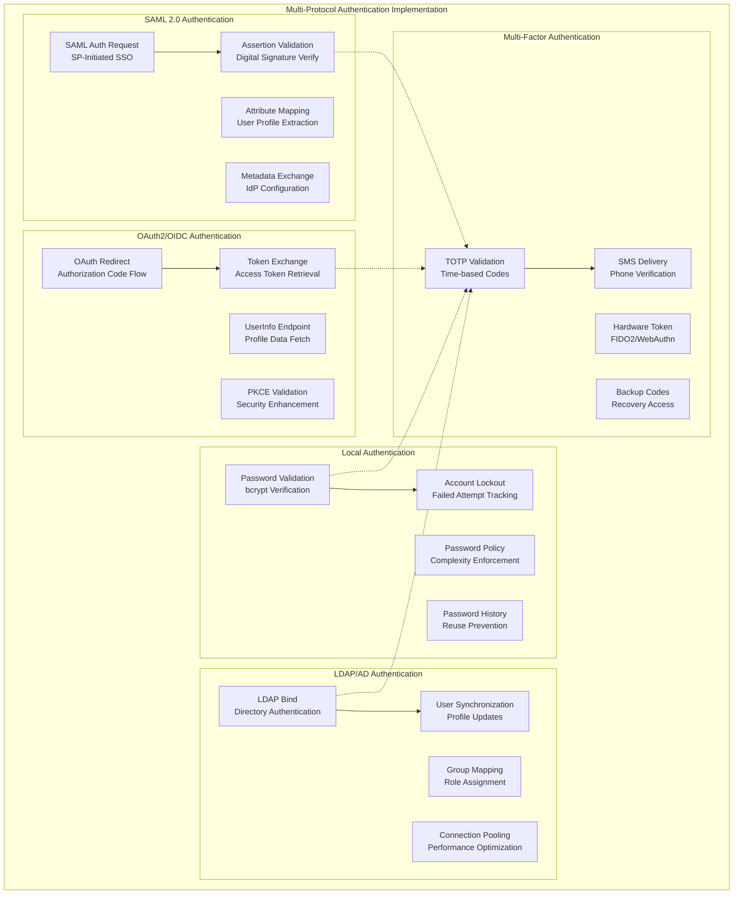

### **JWT Token Management Implementation**

```mermaid
graph TB
    subgraph "JWT Token Lifecycle"
        subgraph "Token Generation"
            USER_AUTH[User Authentication<br/>Successful Login]
            CLAIMS_BUILD[Claims Building<br/>User Context + Permissions]
            TOKEN_SIGN[Token Signing<br/>RS256 Algorithm]
            TOKEN_ISSUE[Token Issuance<br/>Access + Refresh Tokens]
        end
        
        subgraph "Token Validation"
            TOKEN_RECEIVE[Token Reception<br/>Request Header/Cookie]
            SIGNATURE_VERIFY[Signature Verification<br/>Public Key Validation]
            CLAIMS_VALIDATE[Claims Validation<br/>Expiry + Audience Check]
            BLACKLIST_CHECK[Blacklist Check<br/>Revoked Token Detection]
        end
        
        subgraph "Token Refresh"
            REFRESH_REQUEST[Refresh Request<br/>Refresh Token Submission]
            REFRESH_VALIDATE[Refresh Validation<br/>Token Integrity Check]
            NEW_TOKEN_ISSUE[New Token Issue<br/>Rotated Access Token]
            OLD_TOKEN_REVOKE[Old Token Revocation<br/>Security Cleanup]
        end
        
        subgraph "Token Revocation"
            LOGOUT_REQUEST[Logout Request<br/>User-Initiated]
            TOKEN_BLACKLIST[Token Blacklisting<br/>Redis Storage]
            SESSION_CLEANUP[Session Cleanup<br/>Cache Invalidation]
            AUDIT_LOG[Audit Logging<br/>Security Event]
        end
    end
    
    %% Token Flow
    USER_AUTH --> CLAIMS_BUILD
    CLAIMS_BUILD --> TOKEN_SIGN
    TOKEN_SIGN --> TOKEN_ISSUE
    
    TOKEN_RECEIVE --> SIGNATURE_VERIFY
    SIGNATURE_VERIFY --> CLAIMS_VALIDATE
    CLAIMS_VALIDATE --> BLACKLIST_CHECK
    
    REFRESH_REQUEST --> REFRESH_VALIDATE
    REFRESH_VALIDATE --> NEW_TOKEN_ISSUE
    NEW_TOKEN_ISSUE --> OLD_TOKEN_REVOKE
    
    LOGOUT_REQUEST --> TOKEN_BLACKLIST
    TOKEN_BLACKLIST --> SESSION_CLEANUP
    SESSION_CLEANUP --> AUDIT_LOG
```

### **Role-Based Access Control (RBAC) Implementation**

```mermaid
classDiagram
    class User {
        +ObjectId _id
        +string email
        +string tenant_code
        +string[] roles
        +validatePassword(password) bool
        +hasPermission(permission) bool
        +getRoles() Role[]
        +assignRole(roleId) error
        +removeRole(roleId) error
    }
    
    class Role {
        +ObjectId _id
        +string name
        +string tenant_code
        +string[] permissions
        +boolean is_system_role
        +addPermission(permission) error
        +removePermission(permission) error
        +getPermissions() Permission[]
        +validateTenantScope(tenantCode) bool
    }
    
    class Permission {
        +ObjectId _id
        +string name
        +string resource
        +string action
        +object constraints
        +validateConstraints(context) bool
        +getResourceActions() string[]
    }
    
    class Tenant {
        +ObjectId _id
        +string tenant_code
        +string name
        +object security_policy
        +object resource_quotas
        +validateUserAccess(userId) bool
        +enforceQuotas() error
        +getSecurityPolicy() SecurityPolicy
    }
    
    class SecurityPolicy {
        +int password_min_length
        +boolean require_mfa
        +int session_timeout
        +int max_concurrent_sessions
        +string[] allowed_ip_ranges
        +enforcePolicy(user) error
        +validateCompliance() bool
    }
    
    class Session {
        +ObjectId _id
        +string session_id
        +ObjectId user_id
        +string tenant_code
        +datetime expires_at
        +boolean is_active
        +validateSession() bool
        +extendSession() error
        +revokeSession() error
    }
    
    class AuditLog {
        +ObjectId _id
        +string tenant_code
        +ObjectId user_id
        +string event_type
        +string resource
        +string action
        +object context
        +datetime timestamp
        +logEvent(event) error
        +queryLogs(criteria) AuditLog[]
    }
    
    User ||--o{ Role : "has"
    Role ||--o{ Permission : "contains"
    User }o--|| Tenant : "belongs_to"
    Tenant ||--|| SecurityPolicy : "enforces"
    User ||--o{ Session : "maintains"
    User ||--o{ AuditLog : "generates"
    Role }o--|| Tenant : "scoped_to"
```

## 🚀 **DEPLOYMENT & INFRASTRUCTURE IMPLEMENTATION**

### **Container Orchestration Architecture**

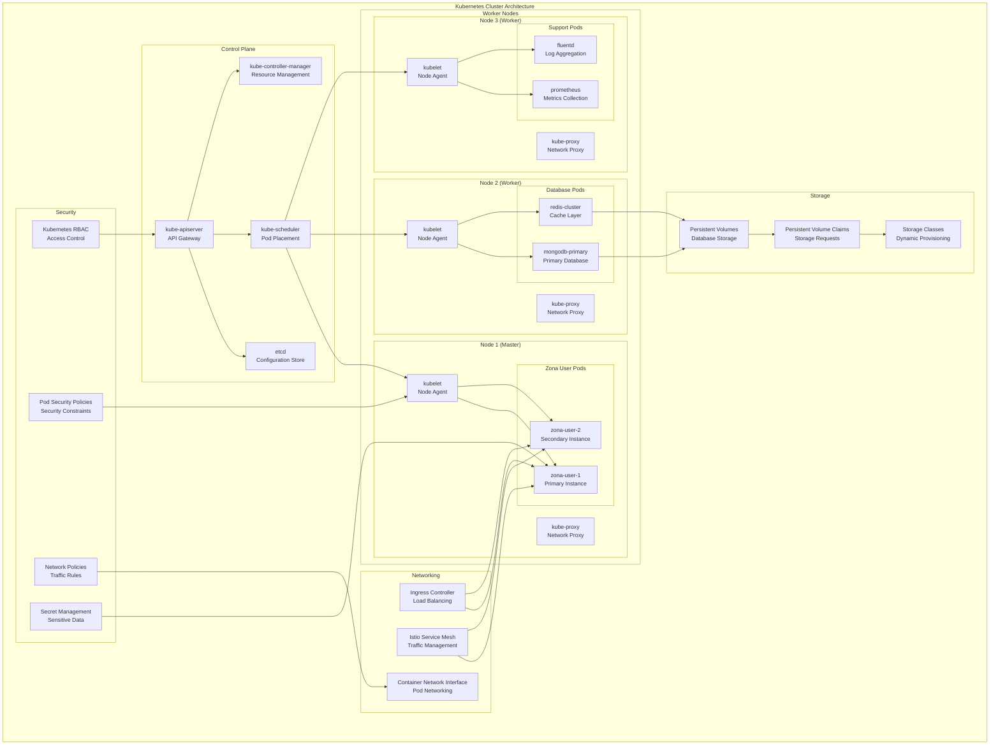

### **Production Deployment Configuration**

```yaml
# Kubernetes Deployment Configuration
apiVersion: apps/v1
kind: Deployment
metadata:
  name: zona-user-service
  namespace: securaa-production
  labels:
    app: zona-user-service
    version: "v2.1.0"
    environment: production
spec:
  replicas: 5
  strategy:
    type: RollingUpdate
    rollingUpdate:
      maxSurge: 2
      maxUnavailable: 1
  selector:
    matchLabels:
      app: zona-user-service
  template:
    metadata:
      labels:
        app: zona-user-service
        version: "v2.1.0"
        environment: production
      annotations:
        prometheus.io/scrape: "true"
        prometheus.io/port: "9090"
        prometheus.io/path: "/metrics"
    spec:
      securityContext:
        runAsNonRoot: true
        runAsUser: 1000
        fsGroup: 2000
      containers:
      - name: zona-user-service
        image: securaa/zona-user-service:v2.1.0
        imagePullPolicy: Always
        ports:
        - containerPort: 8000
          name: https
          protocol: TCP
        - containerPort: 9090
          name: metrics
          protocol: TCP
        env:
        - name: ENVIRONMENT
          value: "production"
        - name: LOG_LEVEL
          value: "info"
        - name: MONGO_URI
          valueFrom:
            secretKeyRef:
              name: database-secrets
              key: mongo-uri
        - name: REDIS_URI
          valueFrom:
            secretKeyRef:
              name: cache-secrets
              key: redis-uri
        - name: JWT_SECRET
          valueFrom:
            secretKeyRef:
              name: auth-secrets
              key: jwt-secret
        resources:
          requests:
            memory: "512Mi"
            cpu: "500m"
          limits:
            memory: "2Gi"
            cpu: "2000m"
        securityContext:
          allowPrivilegeEscalation: false
          readOnlyRootFilesystem: true
          capabilities:
            drop:
            - ALL
        livenessProbe:
          httpGet:
            path: /health/live
            port: 8000
            scheme: HTTPS
          initialDelaySeconds: 60
          periodSeconds: 30
          timeoutSeconds: 10
          failureThreshold: 3
        readinessProbe:
          httpGet:
            path: /health/ready
            port: 8000
            scheme: HTTPS
          initialDelaySeconds: 30
          periodSeconds: 10
          timeoutSeconds: 5
          failureThreshold: 3
        volumeMounts:
        - name: tls-certificates
          mountPath: /etc/ssl/certs
          readOnly: true
        - name: temp-storage
          mountPath: /tmp
        - name: config-volume
          mountPath: /app/config
          readOnly: true
      volumes:
      - name: tls-certificates
        secret:
          secretName: zona-user-tls
      - name: temp-storage
        emptyDir: {}
      - name: config-volume
        configMap:
          name: zona-user-config
      nodeSelector:
        node-type: security-workload
      tolerations:
      - key: "security-workload"
        operator: "Equal"
        value: "true"
        effect: "NoSchedule"
      affinity:
        podAntiAffinity:
          requiredDuringSchedulingIgnoredDuringExecution:
          - labelSelector:
              matchExpressions:
              - key: app
                operator: In
                values:
                - zona-user-service
            topologyKey: kubernetes.io/hostname
```

## 📊 **MONITORING & OBSERVABILITY IMPLEMENTATION**

### **Comprehensive Monitoring Architecture**

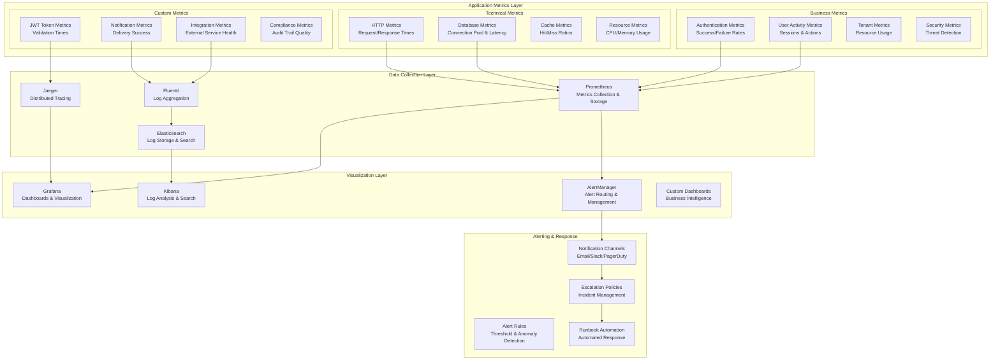

### **Performance Optimization Strategies**

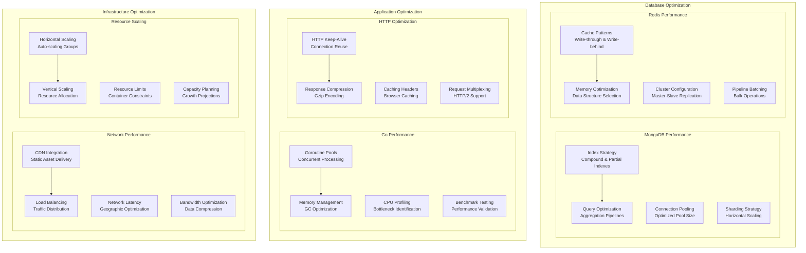

## 🧪 **TESTING STRATEGY & IMPLEMENTATION**

### **Comprehensive Testing Pyramid**

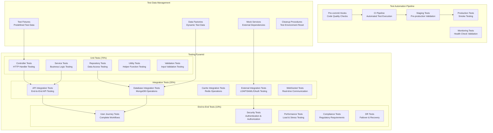

### **Security Testing Implementation**

```mermaid
graph TB
    subgraph "Security Testing Categories"
        subgraph "Static Application Security Testing (SAST)"
            CODE_ANALYSIS[Static Code Analysis<br/>SonarQube/Checkmarx]
            DEPENDENCY_SCAN[Dependency Scanning<br/>Vulnerability Detection]
            SECRET_DETECTION[Secret Detection<br/>Credential Scanning]
            COMPLIANCE_SCAN[Compliance Scanning<br/>Policy Validation]
        end
        
        subgraph "Dynamic Application Security Testing (DAST)"
            PENETRATION_TESTING[Penetration Testing<br/>Automated Security Testing]
            VULNERABILITY_SCAN[Vulnerability Scanning<br/>OWASP ZAP/Burp Suite]
            API_SECURITY_TEST[API Security Testing<br/>Authentication & Authorization]
            INPUT_VALIDATION_TEST[Input Validation Testing<br/>Injection Attacks]
        end
        
        subgraph "Interactive Application Security Testing (IAST)"
            RUNTIME_ANALYSIS[Runtime Security Analysis<br/>Real-time Monitoring]
            CODE_COVERAGE[Security Code Coverage<br/>Test Completeness]
            BEHAVIORAL_ANALYSIS[Behavioral Analysis<br/>Anomaly Detection]
            PERFORMANCE_IMPACT[Performance Impact Analysis<br/>Security Overhead]
        end
        
        subgraph "Infrastructure Security Testing"
            CONTAINER_SCAN[Container Image Scanning<br/>Trivy/Clair]
            KUBERNETES_SCAN[Kubernetes Security Scanning<br/>kube-bench/kube-hunter]
            NETWORK_SCAN[Network Security Scanning<br/>Port & Service Analysis]
            CONFIGURATION_AUDIT[Configuration Auditing<br/>Security Hardening]
        end
    end
    
    subgraph "Security Test Automation"
        SECURITY_PIPELINE[Security CI/CD Pipeline<br/>Automated Security Gates]
        THREAT_MODELING[Threat Modeling<br/>Risk Assessment]
        SECURITY_REGRESSION[Security Regression Testing<br/>Continuous Validation]
        COMPLIANCE_VALIDATION[Compliance Validation<br/>Regulatory Testing]
    end
    
    %% Security Testing Flow
    CODE_ANALYSIS --> SECURITY_PIPELINE
    PENETRATION_TESTING --> SECURITY_PIPELINE
    RUNTIME_ANALYSIS --> SECURITY_PIPELINE
    CONTAINER_SCAN --> SECURITY_PIPELINE
    
    SECURITY_PIPELINE --> THREAT_MODELING
    THREAT_MODELING --> SECURITY_REGRESSION
    SECURITY_REGRESSION --> COMPLIANCE_VALIDATION
```

## 🔧 **CONFIGURATION MANAGEMENT**

### **Environment Configuration Strategy**

```yaml
# Production Configuration Template
production:
  server:
    port: 8000
    tls:
      enabled: true
      cert_file: "/etc/ssl/certs/server.crt"
      key_file: "/etc/ssl/private/server.key"
      min_version: "1.2"
      max_version: "1.3"
      cipher_suites:
        - "TLS_AES_256_GCM_SHA384"
        - "TLS_CHACHA20_POLY1305_SHA256"
        - "TLS_AES_128_GCM_SHA256"
      
  database:
    mongodb:
      uri: "${MONGO_URI}"
      database: "securaa_production"
      max_pool_size: 200
      min_pool_size: 50
      connect_timeout_ms: 30000
      server_selection_timeout_ms: 30000
      socket_timeout_ms: 60000
      max_idle_time_ms: 300000
      
  cache:
    redis:
      cluster_endpoints:
        - "${REDIS_CLUSTER_1}"
        - "${REDIS_CLUSTER_2}"
        - "${REDIS_CLUSTER_3}"
      password: "${REDIS_PASSWORD}"
      max_retries: 3
      retry_delay_ms: 1000
      dial_timeout_ms: 5000
      read_timeout_ms: 3000
      write_timeout_ms: 3000
      pool_size: 100
      min_idle_connections: 20
      
  security:
    jwt:
      secret: "${JWT_SECRET}"
      issuer: "zona-user-service"
      audience: "securaa-platform"
      access_token_ttl: "15m"
      refresh_token_ttl: "7d"
      signing_method: "RS256"
      
    encryption:
      key: "${ENCRYPTION_KEY}"
      algorithm: "AES-256-GCM"
      
    session:
      timeout: "4h"
      max_concurrent_sessions: 3
      secure_cookies: true
      same_site: "strict"
      
    password_policy:
      min_length: 12
      require_uppercase: true
      require_lowercase: true
      require_numbers: true
      require_special_chars: true
      prevent_reuse_count: 12
      max_age_days: 90
      
  integrations:
    ldap:
      servers:
        - "${LDAP_SERVER_1}"
        - "${LDAP_SERVER_2}"
      base_dn: "${LDAP_BASE_DN}"
      bind_dn: "${LDAP_BIND_DN}"
      bind_password: "${LDAP_BIND_PASSWORD}"
      user_search_filter: "(uid=%s)"
      group_search_filter: "(memberUid=%s)"
      tls_enabled: true
      skip_cert_verify: false
      
    saml:
      entity_id: "zona-user-service"
      assertion_consumer_service_url: "https://api.securaa.com/auth/saml/acs"
      single_logout_service_url: "https://api.securaa.com/auth/saml/sls"
      metadata_url: "${SAML_METADATA_URL}"
      certificate_file: "/etc/ssl/certs/saml.crt"
      private_key_file: "/etc/ssl/private/saml.key"
      
    oauth2:
      providers:
        google:
          client_id: "${GOOGLE_CLIENT_ID}"
          client_secret: "${GOOGLE_CLIENT_SECRET}"
          redirect_url: "https://api.securaa.com/auth/oauth/google/callback"
          scopes: ["openid", "profile", "email"]
        microsoft:
          client_id: "${MICROSOFT_CLIENT_ID}"
          client_secret: "${MICROSOFT_CLIENT_SECRET}"
          redirect_url: "https://api.securaa.com/auth/oauth/microsoft/callback"
          scopes: ["openid", "profile", "email"]
          
    smtp:
      host: "${SMTP_HOST}"
      port: 587
      username: "${SMTP_USERNAME}"
      password: "${SMTP_PASSWORD}"
      from_address: "noreply@securaa.com"
      use_tls: true
      connection_pool_size: 10
      
    sms:
      provider: "twilio"
      account_sid: "${TWILIO_ACCOUNT_SID}"
      auth_token: "${TWILIO_AUTH_TOKEN}"
      from_number: "${TWILIO_FROM_NUMBER}"
      
  monitoring:
    metrics:
      enabled: true
      port: 9090
      path: "/metrics"
      
    logging:
      level: "info"
      format: "json"
      output: "stdout"
      
    tracing:
      enabled: true
      jaeger:
        endpoint: "${JAEGER_ENDPOINT}"
        sampler_type: "probabilistic"
        sampler_param: 0.1
        
    health_checks:
      enabled: true
      endpoints:
        - path: "/health"
          method: "GET"
        - path: "/health/ready"
          method: "GET"
        - path: "/health/live"
          method: "GET"
          
  compliance:
    audit_logging:
      enabled: true
      retention_days: 2555  # 7 years
      encryption_enabled: true
      remote_storage: true
      
    data_protection:
      gdpr_enabled: true
      data_retention_days: 1825  # 5 years
      anonymization_enabled: true
      right_to_be_forgotten: true
      
    regulatory:
      soc2_mode: true
      hipaa_mode: true
      pci_dss_mode: true
      iso27001_mode: true
```

## 📋 **OPERATIONAL PROCEDURES**

### **Deployment Automation Pipeline**

```mermaid
graph LR
    subgraph "CI/CD Pipeline"
        subgraph "Source Control"
            GIT[Git Repository<br/>Source Code]
            PR[Pull Request<br/>Code Review]
            MERGE[Merge to Main<br/>Integration]
        end
        
        subgraph "Build Stage"
            BUILD[Build Binary<br/>Go Compilation]
            TEST[Run Tests<br/>Unit & Integration]
            LINT[Code Linting<br/>Quality Checks]
            SECURITY_SCAN[Security Scanning<br/>SAST Analysis]
        end
        
        subgraph "Package Stage"
            DOCKER_BUILD[Docker Build<br/>Container Creation]
            IMAGE_SCAN[Image Scanning<br/>Vulnerability Detection]
            REGISTRY_PUSH[Registry Push<br/>Artifact Storage]
            HELM_PACKAGE[Helm Package<br/>Chart Creation]
        end
        
        subgraph "Deploy Stage"
            STAGING_DEPLOY[Staging Deployment<br/>Pre-production Testing]
            SMOKE_TESTS[Smoke Tests<br/>Basic Functionality]
            PROD_DEPLOY[Production Deployment<br/>Blue-Green Strategy]
            POST_DEPLOY[Post-deployment<br/>Health Validation]
        end
        
        subgraph "Monitoring Stage"
            METRICS_CHECK[Metrics Validation<br/>Performance Monitoring]
            ALERT_CONFIG[Alert Configuration<br/>Monitoring Setup]
            ROLLBACK[Automatic Rollback<br/>Failure Recovery]
            SUCCESS[Deployment Success<br/>Notification]
        end
    end
    
    %% Pipeline Flow
    GIT --> PR
    PR --> MERGE
    MERGE --> BUILD
    
    BUILD --> TEST
    TEST --> LINT
    LINT --> SECURITY_SCAN
    
    SECURITY_SCAN --> DOCKER_BUILD
    DOCKER_BUILD --> IMAGE_SCAN
    IMAGE_SCAN --> REGISTRY_PUSH
    REGISTRY_PUSH --> HELM_PACKAGE
    
    HELM_PACKAGE --> STAGING_DEPLOY
    STAGING_DEPLOY --> SMOKE_TESTS
    SMOKE_TESTS --> PROD_DEPLOY
    PROD_DEPLOY --> POST_DEPLOY
    
    POST_DEPLOY --> METRICS_CHECK
    METRICS_CHECK --> ALERT_CONFIG
    ALERT_CONFIG --> SUCCESS
    
    %% Failure Paths
    SMOKE_TESTS -.-> ROLLBACK
    METRICS_CHECK -.-> ROLLBACK
```

### **Incident Response Procedures**

```mermaid
graph TB
    subgraph "Incident Response Workflow"
        subgraph "Detection & Alerting"
            MONITORING[Monitoring Systems<br/>Automated Detection]
            ALERT[Alert Generation<br/>Severity Classification]
            ESCALATION[Alert Escalation<br/>On-call Engineer]
            TRIAGE[Initial Triage<br/>Impact Assessment]
        end
        
        subgraph "Response & Investigation"
            INCIDENT_COMMAND[Incident Command<br/>Response Coordination]
            INVESTIGATION[Root Cause Analysis<br/>Diagnostic Procedures]
            COMMUNICATION[Communication<br/>Stakeholder Updates]
            MITIGATION[Mitigation Actions<br/>Immediate Response]
        end
        
        subgraph "Resolution & Recovery"
            FIX_IMPLEMENTATION[Fix Implementation<br/>Code/Config Changes]
            TESTING[Solution Testing<br/>Validation Procedures]
            DEPLOYMENT[Emergency Deployment<br/>Hotfix Release]
            VERIFICATION[Solution Verification<br/>Health Confirmation]
        end
        
        subgraph "Post-Incident"
            POST_MORTEM[Post-mortem Analysis<br/>Lessons Learned]
            ACTION_ITEMS[Action Items<br/>Improvement Plans]
            DOCUMENTATION[Documentation Update<br/>Runbook Enhancement]
            TRAINING[Team Training<br/>Knowledge Sharing]
        end
    end
    
    %% Incident Flow
    MONITORING --> ALERT
    ALERT --> ESCALATION
    ESCALATION --> TRIAGE
    
    TRIAGE --> INCIDENT_COMMAND
    INCIDENT_COMMAND --> INVESTIGATION
    INVESTIGATION --> COMMUNICATION
    COMMUNICATION --> MITIGATION
    
    MITIGATION --> FIX_IMPLEMENTATION
    FIX_IMPLEMENTATION --> TESTING
    TESTING --> DEPLOYMENT
    DEPLOYMENT --> VERIFICATION
    
    VERIFICATION --> POST_MORTEM
    POST_MORTEM --> ACTION_ITEMS
    ACTION_ITEMS --> DOCUMENTATION
    DOCUMENTATION --> TRAINING
```

## 🎯 **PERFORMANCE BENCHMARKS & TARGETS**

### **Service Level Objectives (SLOs)**

| Metric Category | Objective | Target | Measurement |
|----------------|-----------|--------|-------------|
| **Availability** | Service Uptime | 99.99% | Monthly rolling window |
| **Performance** | Authentication Response | < 100ms (p95) | Request duration |
| **Performance** | API Response Time | < 200ms (p99) | End-to-end latency |
| **Scalability** | Concurrent Users | 10,000+ | Peak load capacity |
| **Reliability** | Error Rate | < 0.1% | Request success ratio |
| **Security** | Auth Success Rate | > 99.5% | Authentication attempts |
| **Recovery** | RTO (Recovery Time) | < 15 minutes | Incident response |
| **Recovery** | RPO (Recovery Point) | < 5 minutes | Data loss window |

### **Resource Utilization Targets**

```mermaid
gantt
    title Resource Utilization Timeline
    dateFormat X
    axisFormat %s
    
    section CPU Usage
    Baseline Load    :0, 30
    Normal Load      :30, 60
    Peak Load        :60, 80
    Critical Threshold :crit, 80, 90
    
    section Memory Usage
    Baseline Memory  :0, 40
    Normal Memory    :40, 70
    Peak Memory      :70, 85
    Memory Critical  :crit, 85, 95
    
    section Network I/O
    Baseline Network :0, 25
    Normal Network   :25, 50
    Peak Network     :50, 75
    Network Critical :crit, 75, 90
```

## 🔒 **SECURITY IMPLEMENTATION CHECKLIST**

### **Security Controls Implementation Status**

| Security Control | Implementation Status | Validation Method |
|-----------------|----------------------|-------------------|
| **Multi-Factor Authentication** | ✅ Implemented | Automated testing + Manual verification |
| **JWT Token Security** | ✅ Implemented | Security scanning + Penetration testing |
| **Role-Based Access Control** | ✅ Implemented | Permission matrix testing |
| **Tenant Data Isolation** | ✅ Implemented | Cross-tenant access testing |
| **Encryption at Rest** | ✅ Implemented | Database encryption verification |
| **Encryption in Transit** | ✅ Implemented | TLS configuration validation |
| **Input Validation** | ✅ Implemented | Injection attack testing |
| **Audit Logging** | ✅ Implemented | Log completeness verification |
| **Session Management** | ✅ Implemented | Session security testing |
| **Rate Limiting** | ✅ Implemented | Load testing + DoS simulation |
| **CORS Protection** | ✅ Implemented | Cross-origin request testing |
| **CSRF Protection** | ✅ Implemented | CSRF attack simulation |
| **SQL/NoSQL Injection Prevention** | ✅ Implemented | Injection attack testing |
| **XSS Protection** | ✅ Implemented | Script injection testing |
| **Security Headers** | ✅ Implemented | Header configuration validation |

This comprehensive Low Level Design document provides detailed technical specifications, implementation details, code structure, database schemas, API designs, security implementations, deployment configurations, and operational procedures for the Zona User Service. The document includes extensive diagrams, code examples, and configuration templates to guide development and operations teams in implementing and maintaining this critical security service.