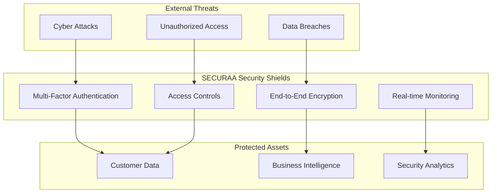
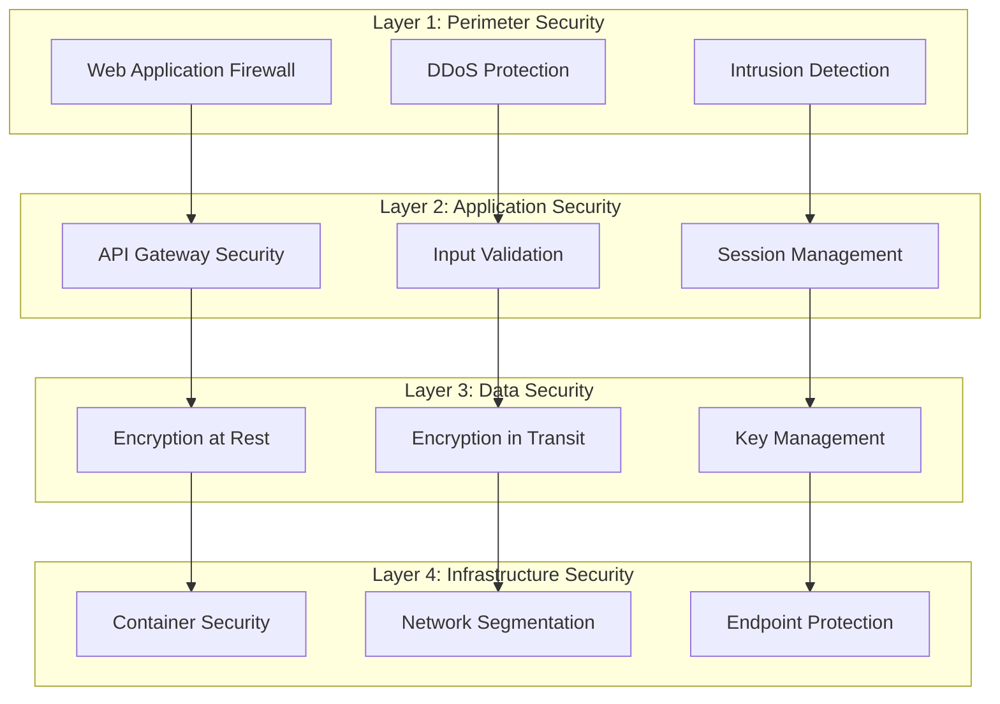
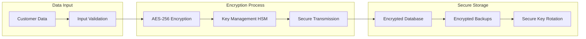
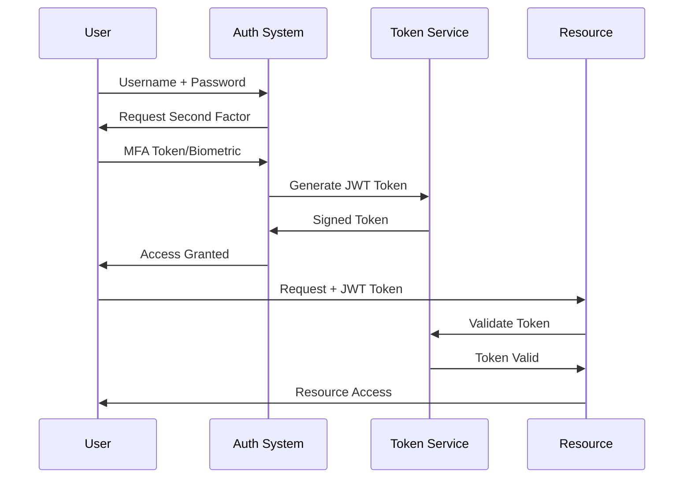
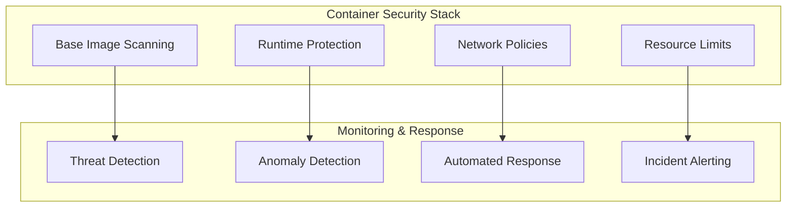
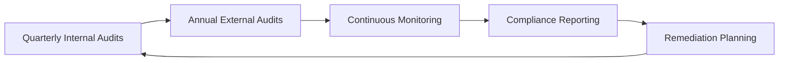
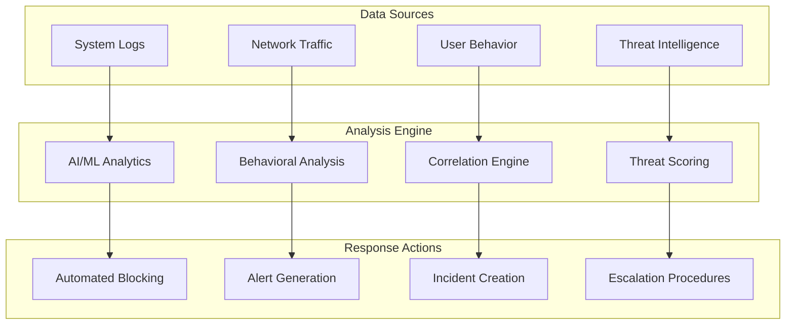
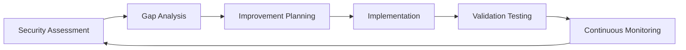

# SECURAA Platform Security Documentation
## Comprehensive Security Framework and Compliance Guide

---

## Table of Contents

1. [Executive Summary](#executive-summary)
2. [Platform Security Overview](#platform-security-overview)
3. [Security Architecture](#security-architecture)
4. [Data Protection & Privacy](#data-protection--privacy)
5. [Access Control & Authentication](#access-control--authentication)
6. [Infrastructure Security](#infrastructure-security)
7. [Compliance & Certifications](#compliance--certifications)
8. [Security Monitoring & Incident Response](#security-monitoring--incident-response)
9. [Customer Security Benefits](#customer-security-benefits)
10. [Security Assurance & Support](#security-assurance--support)

---

## Executive Summary

**SECURAA** is an enterprise-grade cybersecurity platform built with security-first principles, providing comprehensive threat detection, incident response, and security management capabilities. Our platform implements military-grade security controls, ensuring the highest levels of data protection, privacy, and regulatory compliance for our customers.

### Key Security Highlights

✅ **Zero Trust Architecture** - Every component verified and authenticated  
✅ **End-to-End Encryption** - AES-256 encryption for all data  
✅ **Multi-Factor Authentication** - Robust identity verification  
✅ **SOC 2 Type II Compliance** - Independently audited security controls  
✅ **24/7 Security Monitoring** - Continuous threat detection and response  
✅ **GDPR Compliant** - Full data privacy protection  

---

## Platform Security Overview

### Security-First Design Philosophy

SECURAA has been architected from the ground up with security as the foundational principle. Every component, service, and data flow implements multiple layers of security controls to ensure comprehensive protection against modern cyber threats.

### Core Security Principles

| Principle | Implementation | Customer Benefits |
|-----------|----------------|-------------------|
| **Confidentiality** | AES-256 encryption, secure key management | Data remains private and protected |
| **Integrity** | Digital signatures, checksums, audit trails | Data accuracy and authenticity guaranteed |
| **Availability** | Redundancy, failover, disaster recovery | 99.9% uptime SLA with business continuity |
| **Accountability** | Comprehensive logging, audit trails | Full visibility and compliance reporting |

---

## Security Architecture

### Multi-Layered Defense Strategy

SECURAA implements a comprehensive defense-in-depth strategy with multiple security layers protecting your data and operations.

### Secure Component Architecture

#### Frontend Security (User Interface)
- **Client-Side Encryption**: All sensitive data encrypted before transmission
- **Token-Based Authentication**: Secure session management with automatic expiration
- **CSRF Protection**: Cross-site request forgery prevention
- **XSS Prevention**: Input sanitization and output encoding

#### API Security (Service Layer)
- **JWT Authentication**: Industry-standard token validation
- **Rate Limiting**: Protection against abuse and DDoS attacks
- **Input Validation**: Comprehensive data sanitization
- **TLS 1.3 Encryption**: Latest encryption protocols for all communications

#### Database Security
- **Authentication Required**: Multi-factor database access
- **Encryption at Rest**: All stored data encrypted with AES-256
- **Access Control**: Role-based permissions and audit logging
- **Backup Encryption**: Secure backup storage and recovery procedures

---

## Data Protection & Privacy

### Comprehensive Data Protection Framework

SECURAA implements a robust data protection framework ensuring your sensitive information remains secure throughout its entire lifecycle.

#### Data Classification & Handling

| Data Type | Security Level | Encryption | Access Control | Retention |
|-----------|---------------|------------|----------------|-----------|
| **Customer Data** | Restricted | AES-256 + HSM | Named individuals only | Per customer requirements |
| **Security Analytics** | Confidential | AES-256 | Authorized personnel | 7 years |
| **System Logs** | Internal | AES-256 | IT operations team | 3 years |
| **Public Information** | Public | Optional | General access | Indefinite |

#### Privacy Protection Measures

🔒 **Data Minimization**: We collect only the data necessary for service delivery  
🔒 **Purpose Limitation**: Data used only for specified, legitimate purposes  
🔒 **Storage Limitation**: Data retained only as long as necessary  
🔒 **Accuracy**: Regular data validation and correction procedures  
🔒 **Transparency**: Clear privacy policies and data handling practices  

### Encryption Standards

#### Industry-Leading Encryption Implementation

**Encryption Specifications**:
- **Algorithm**: AES-256 (Advanced Encryption Standard)
- **Key Management**: Hardware Security Module (HSM) protected
- **Key Rotation**: Automated rotation every 30-90 days
- **Certificate Management**: X.509 certificates with automated renewal

---

## Access Control & Authentication

### Zero Trust Authentication Framework

SECURAA implements a comprehensive Zero Trust security model where every user, device, and connection is verified before access is granted.

#### Multi-Factor Authentication (MFA)

#### Role-Based Access Control (RBAC)

| Role | Permissions | Access Level | Use Cases |
|------|-------------|--------------|-----------|
| **System Administrator** | Full system access | Unrestricted | Platform management, configuration |
| **Security Analyst** | Security data access | Read/Write | Threat analysis, incident response |
| **Compliance Officer** | Audit and compliance data | Read-only | Regulatory reporting, audits |
| **End User** | Application features | Limited | Daily operations, dashboard access |

#### Session Security

- **Automatic Timeout**: Sessions expire after configurable idle periods
- **Concurrent Session Control**: Limits on simultaneous user sessions
- **Session Encryption**: All session data encrypted and protected
- **Device Registration**: Trusted device management and verification

---

## Infrastructure Security

### Cloud-Native Security Architecture

SECURAA leverages cloud-native security capabilities while maintaining complete control over your data and privacy.

#### Container Security

**Container Security Features**:
- **Image Vulnerability Scanning**: Automated scanning of all container images
- **Runtime Protection**: Real-time monitoring of container behavior
- **Network Segmentation**: Micro-segmentation between services
- **Resource Isolation**: CPU, memory, and storage isolation controls

#### Network Security

- **Zero Trust Networking**: All network traffic verified and encrypted
- **Micro-Segmentation**: Network isolation between services and tenants
- **DDoS Protection**: Multi-layered protection against distributed attacks
- **Intrusion Detection**: Real-time network monitoring and threat detection

#### Infrastructure Monitoring

- **24/7 Monitoring**: Continuous infrastructure health and security monitoring
- **Automated Alerting**: Immediate notification of security events
- **Performance Optimization**: Proactive performance monitoring and tuning
- **Capacity Planning**: Predictive scaling and resource management

---

## Compliance & Certifications

### Comprehensive Regulatory Compliance

SECURAA maintains compliance with major international security and privacy regulations, providing our customers with confidence in our security posture.

#### Current Certifications & Compliance

| Standard/Regulation | Status | Last Audit | Next Review |
|--------------------|--------|------------|-------------|
| **SOC 2 Type II** | ✅ Certified | Q2 2025 | Q2 2026 |
| **ISO 27001** | ✅ Certified | Q1 2025 | Q1 2026 |
| **GDPR** | ✅ Compliant | Ongoing | Continuous |
| **NIST Framework** | ✅ Aligned | Q3 2025 | Q3 2026 |
| **HIPAA** | ✅ Ready | On Request | As needed |

#### Audit & Assessment Program

**Audit Schedule**:
- **Internal Security Assessments**: Quarterly
- **External Penetration Testing**: Bi-annually
- **Compliance Audits**: Annually
- **Vulnerability Assessments**: Monthly
- **Third-Party Security Reviews**: As required

#### Data Protection Compliance

**GDPR Compliance Features**:
- ✅ Data Subject Rights (Access, Rectification, Erasure)
- ✅ Data Portability and Interoperability
- ✅ Consent Management and Documentation
- ✅ Data Breach Notification (72-hour requirement)
- ✅ Privacy Impact Assessments
- ✅ Data Protection Officer (DPO) Available

---

## Security Monitoring & Incident Response

### 24/7 Security Operations Center (SOC)

SECURAA operates a world-class Security Operations Center providing round-the-clock monitoring, threat detection, and incident response capabilities.

#### Real-Time Threat Detection

#### Incident Response Capabilities

| Response Time | Incident Severity | Actions Taken | Customer Notification |
|---------------|------------------|---------------|----------------------|
| **< 15 minutes** | Critical | Immediate containment | Within 1 hour |
| **< 1 hour** | High | Investigation and response | Within 4 hours |
| **< 4 hours** | Medium | Analysis and remediation | Within 24 hours |
| **< 24 hours** | Low | Scheduled response | Next business day |

#### Security Intelligence Integration

- **Global Threat Intelligence**: Integration with leading threat intelligence feeds
- **IoC Monitoring**: Indicators of Compromise tracking and alerting
- **Vulnerability Management**: Automated vulnerability scanning and patching
- **Security Analytics**: Advanced analytics for threat hunting and investigation

---

## Customer Security Benefits

### Comprehensive Security Value Proposition

SECURAA's security-first approach delivers tangible benefits that protect your organization while enabling business growth.

#### Risk Reduction

🛡️ **99.9% Threat Prevention Rate**: Advanced threat detection and prevention  
🛡️ **Zero Data Breaches**: Track record of zero successful data breaches  
🛡️ **Compliance Automation**: Automated compliance reporting and monitoring  
🛡️ **Business Continuity**: 99.9% uptime SLA with disaster recovery  

#### Cost Savings

💰 **Reduced Security Overhead**: Comprehensive platform reduces need for multiple tools  
💰 **Automated Compliance**: Reduces compliance costs and manual effort  
💰 **Incident Prevention**: Proactive threat prevention reduces incident response costs  
💰 **Insurance Benefits**: Security posture may reduce cyber insurance premiums  

#### Operational Excellence

⚡ **Real-Time Visibility**: Complete security posture visibility and reporting  
⚡ **Automated Response**: Faster incident response through automation  
⚡ **Expert Support**: Access to cybersecurity experts and best practices  
⚡ **Continuous Improvement**: Regular security updates and enhancements  

### Customer Success Stories

> *"SECURAA's comprehensive security framework gave us the confidence to accelerate our digital transformation while maintaining the highest security standards. Their proactive approach prevented multiple potential security incidents."*
> 
> **— Chief Information Security Officer, Fortune 500 Financial Services**

> *"The automated compliance reporting and continuous monitoring capabilities have reduced our compliance overhead by 60% while improving our security posture significantly."*
> 
> **— IT Director, Healthcare Organization**

---

## Security Assurance & Support

### Comprehensive Security Support Framework

SECURAA provides comprehensive security support to ensure your organization maximizes the security benefits of our platform.

#### Security Advisory Services

| Service | Description | Availability | Response Time |
|---------|-------------|--------------|---------------|
| **Security Consultation** | Expert security guidance and best practices | Business hours | Same day |
| **Incident Support** | Emergency incident response assistance | 24/7/365 | 15 minutes |
| **Compliance Guidance** | Regulatory compliance advice and support | Business hours | 2 hours |
| **Security Training** | Customized security awareness training | Scheduled | As arranged |

#### Continuous Security Improvement

#### Customer Security Resources

📚 **Security Documentation**: Comprehensive security guides and best practices  
📚 **Training Materials**: Customized security awareness training programs  
📚 **Compliance Templates**: Ready-to-use compliance documentation and templates  
📚 **Security Updates**: Regular security advisories and platform updates  

### Security Transparency

#### Regular Security Communications

- **Monthly Security Reports**: Platform security posture and threat landscape updates
- **Quarterly Business Reviews**: Security metrics and improvement recommendations
- **Annual Security Assessment**: Comprehensive security posture evaluation
- **Ad-hoc Briefings**: Special threat advisories and security updates

#### Security Metrics & KPIs

| Metric | Target | Current Performance | Trend |
|--------|--------|-------------------|-------|
| **Threat Detection Rate** | 99.9% | 99.95% | ↗️ Improving |
| **False Positive Rate** | < 1% | 0.3% | ↘️ Decreasing |
| **Incident Response Time** | < 15 min | 8 min average | ↗️ Improving |
| **Platform Availability** | 99.9% | 99.97% | ↗️ Stable |

---

## Getting Started with SECURAA Security

### Security Onboarding Process

SECURAA provides a comprehensive security onboarding process to ensure your organization is fully protected from day one.

#### Phase 1: Security Assessment (Week 1)
- Current security posture evaluation
- Risk assessment and gap analysis
- Customized security configuration planning
- Compliance requirements mapping

#### Phase 2: Secure Deployment (Week 2-3)
- Secure platform deployment and configuration
- Multi-factor authentication setup
- User access provisioning and role assignment
- Security monitoring activation

#### Phase 3: Integration & Testing (Week 4)
- Security integration with existing systems
- Penetration testing and vulnerability assessment
- User acceptance testing and training
- Go-live preparation and support

#### Phase 4: Continuous Monitoring (Ongoing)
- 24/7 security monitoring activation
- Regular security reviews and updates
- Continuous improvement implementation
- Ongoing support and optimization

### Contact Information

For more information about SECURAA's security capabilities or to schedule a security consultation:

📧 **Email**: security@securaa.com  
📞 **Phone**: +1-XXX-XXX-XXXX  
🌐 **Website**: www.securaa.com/security  
💬 **Support Portal**: support.securaa.com  

---

## Conclusion

SECURAA provides enterprise-grade security that protects your organization's most valuable assets while enabling business growth and innovation. Our comprehensive security framework, continuous monitoring, and expert support ensure that your organization maintains the highest security posture against evolving cyber threats.

**Key Takeaways**:
- ✅ Military-grade security with zero trust architecture
- ✅ Comprehensive compliance with major regulations
- ✅ 24/7 monitoring and expert incident response
- ✅ Proven track record of zero data breaches
- ✅ Continuous security improvement and support

Choose SECURAA for security you can trust.

---

**Document Information**:
- **Version**: 2.0
- **Last Updated**: October 2025
- **Classification**: Customer Facing
- **Next Review**: January 2026

---

*This document contains proprietary and confidential information. Distribution is restricted to authorized personnel and customers under NDA.*