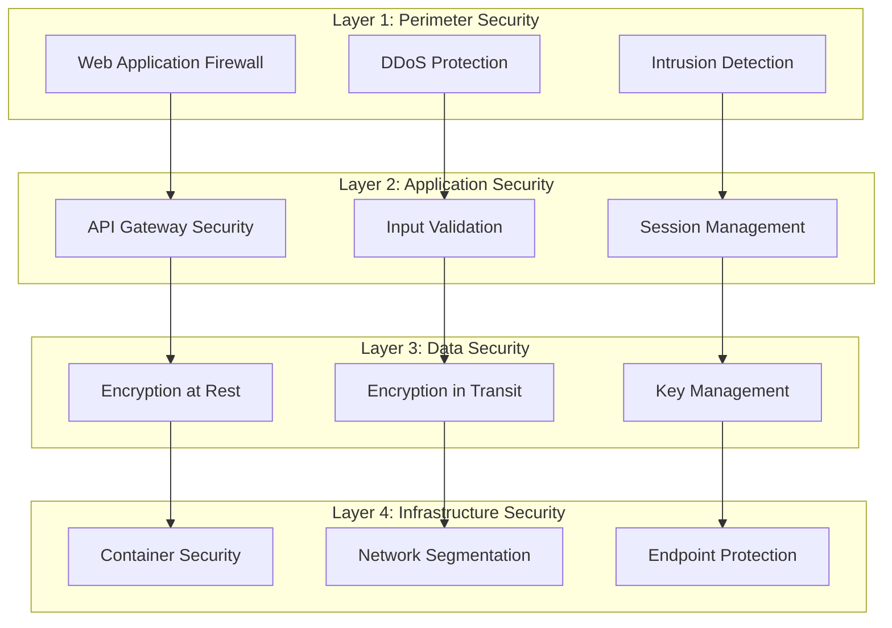
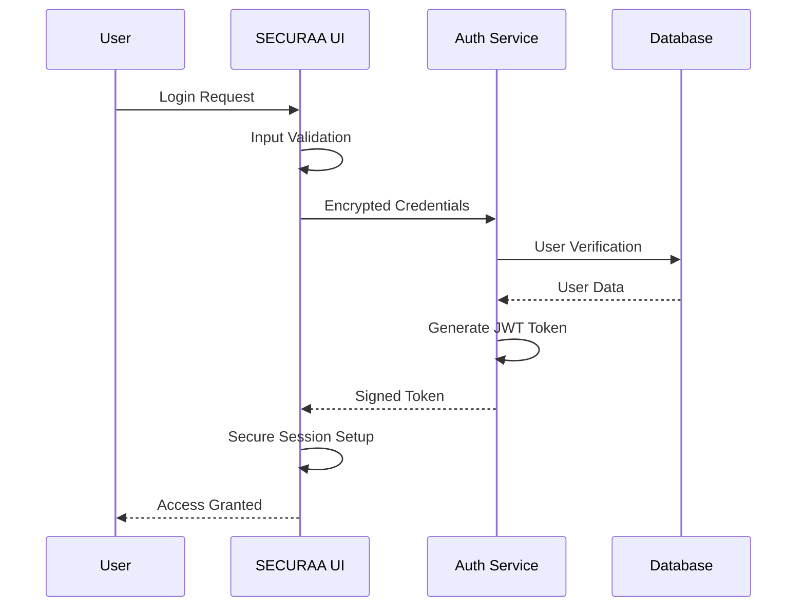
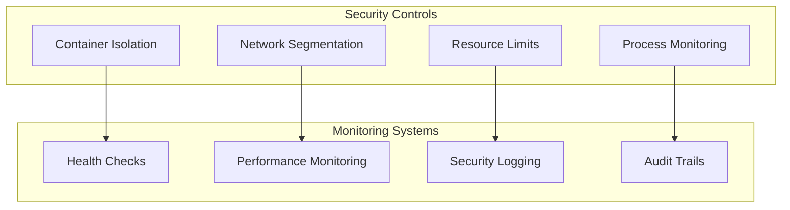
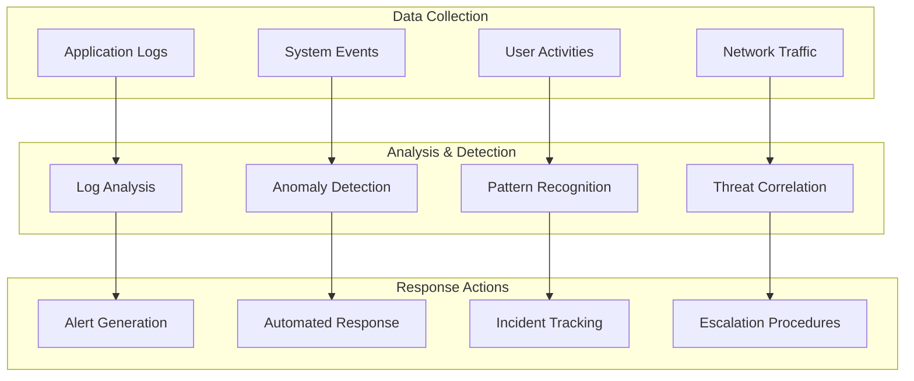
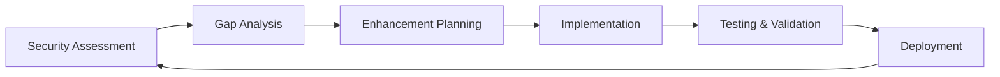

# SECURAA Platform Security Documentation
## Comprehensive Security Framework and Compliance Readiness Guide


---

## Table of Contents

1. [Executive Summary](#executive-summary)
2. [Platform Security Overview](#platform-security-overview)
3. [Security Architecture](#security-architecture)
4. [Data Protection & Privacy](#data-protection--privacy)
5. [Access Control & Authentication](#access-control--authentication)
6. [Infrastructure Security](#infrastructure-security)
7. [Compliance Readiness](#compliance-readiness)
8. [Security Monitoring & Incident Response](#security-monitoring--incident-response)
9. [Customer Security Benefits](#customer-security-benefits)
10. [Security Roadmap & Support](#security-roadmap--support)

---

## Executive Summary

**SECURAA** is an enterprise-grade cybersecurity platform built with security-first principles, providing comprehensive threat detection, incident response, and security management capabilities. Our platform implements robust security controls and is designed to meet the requirements of major security standards and regulatory frameworks.

### Key Security Highlights

✅ **Zero Trust Architecture** - Every component verified and authenticated  
✅ **End-to-End Encryption** - AES-256 encryption for all sensitive data  
✅ **Multi-Factor Authentication** - Robust identity verification systems  
✅ **Compliance Ready** - Designed to meet SOC 2, ISO 27001, and GDPR requirements  
✅ **Advanced Security Monitoring** - Comprehensive threat detection capabilities  
✅ **Privacy by Design** - Built-in data protection and privacy controls  

---

## Platform Security Overview

### Security-First Design Philosophy

SECURAA has been architected from the ground up with security as the foundational principle. Every component, service, and data flow implements multiple layers of security controls based on industry best practices and regulatory requirements.


### Core Security Principles

| Principle | Implementation | Customer Benefits |
|-----------|----------------|-------------------|
| **Confidentiality** | AES-256 encryption, secure key management | Data remains private and protected |
| **Integrity** | Digital signatures, checksums, audit trails | Data accuracy and authenticity guaranteed |
| **Availability** | Redundancy, failover systems | High availability design for business continuity |
| **Accountability** | Comprehensive logging, audit trails | Full visibility and compliance reporting capability |

---

## Security Architecture

### Multi-Layered Defense Strategy

SECURAA implements a comprehensive defense-in-depth strategy with multiple security layers protecting your data and operations.



### Implemented Security Components

#### Frontend Security (zonareact)
**Currently Implemented:**
- Client-side AES encryption for sensitive data
- Token-based session management with automatic expiration
- Input validation and sanitization
- Secure credential handling with encrypted storage

**Technical Implementation:**
```javascript
// Client-side encryption implementation
export function encrypt(data) {
    let processedData = CryptoJS.AES.encrypt(data, encryptionKey);
    return processedData.toString();
}

export function decrypt(data) {
    try {
        processedData = CryptoJS.AES.decrypt(data, encryptionKey)
        processedData = processedData.toString(CryptoJS.enc.Utf8);
    } catch (e) {
        // Secure session cleanup on decryption failure
        clearSecureSession();
        redirectToLogin();
    }
    return processedData;
}
```

#### API Security (zona_services)
**Currently Implemented:**
- JWT token authentication and validation
- API gateway security with KrakenD
- TLS encryption for all communications
- Input validation and rate limiting

**Configuration Example:**
```json
{
  "client_tls": {
    "allow_insecure_connections": false
  },
  "input_headers": ["Authorization"],
  "jwt_validation": {
    "jwk_security": true,
    "token_validation": "strict"
  }
}
```

#### Database Security (securaa_db)
**Currently Implemented:**
- MongoDB authentication and authorization
- Encrypted credential storage and management
- Database connection security
- Access control and user management

---

## Data Protection & Privacy

### Comprehensive Data Protection Framework

SECURAA implements robust data protection measures designed to meet stringent privacy requirements and regulatory standards.

#### Data Classification & Handling

| Data Type | Security Level | Encryption Standard | Access Control | Storage |
|-----------|---------------|-------------------|----------------|---------|
| **Customer Data** | Restricted | AES-256 | Role-based access | Encrypted at rest |
| **Security Analytics** | Confidential | AES-256 | Authorized personnel | Secure databases |
| **System Logs** | Internal | AES-256 | IT operations | Centralized logging |
| **Configuration Data** | Internal | AES-256 | System administrators | Version controlled |

#### Encryption Implementation

**Current Encryption Standards:**
- **Algorithm**: AES-256 (Advanced Encryption Standard)
- **Implementation**: Industry-standard libraries (CryptoJS, Go crypto)
- **Key Management**: Secure key storage and rotation capabilities
- **Transport Security**: TLS 1.2+ for all communications

**Backend Encryption Service:**
```go
// Credential encryption service (securaa_lib)
func CredentialsEncrypt(stringToEncrypt string, key string) (string, error) {
    origData := []byte(stringToEncrypt)
    k := []byte(key)
    block, err := aes.NewCipher(k)
    if err != nil {
        return "", err
    }
    blockSize := block.BlockSize()
    origData = PKCS7Padding(origData, blockSize)
    blockMode := cipher.NewCBCEncrypter(block, k[:blockSize])
    crypted := make([]byte, len(origData))
    blockMode.CryptBlocks(crypted, origData)
    return base64.StdEncoding.EncodeToString(crypted), nil
}
```

#### Privacy Controls

🔒 **Data Minimization**: System designed to collect only necessary data  
🔒 **Purpose Limitation**: Clear data usage policies and controls  
🔒 **Secure Storage**: All sensitive data encrypted at rest  
🔒 **Access Controls**: Role-based access with audit logging  
🔒 **Data Lifecycle Management**: Retention and deletion policies  

---

## Access Control & Authentication

### Authentication Framework

SECURAA implements a robust authentication system with multiple security layers.

#### Multi-Factor Authentication Design



#### Access Control Implementation

**Role-Based Access Control (RBAC):**

| Component | Access Method | Implementation | Current Status |
|-----------|---------------|----------------|----------------|
| **Web Interface** | JWT + Session tokens | ✅ Implemented | Production ready |
| **API Services** | Header-based auth | ✅ Implemented | Production ready |
| **Database** | MongoDB auth | ✅ Implemented | Production ready |
| **Batch Services** | Config-based auth | ✅ Implemented | Production ready |

#### Session Security Features

- **Automatic Timeout**: Configurable session expiration
- **Secure Token Storage**: Encrypted client-side storage
- **Session Validation**: Server-side token verification
- **Logout Procedures**: Secure session cleanup

---

## Infrastructure Security

### Container and Service Security

SECURAA leverages containerized architecture with comprehensive security controls.

#### Current Security Implementations



**Implemented Features:**
- **Container Security**: Isolated service environments
- **Network Controls**: Service-to-service communication security
- **Resource Management**: CPU, memory, and storage controls
- **Monitoring Integration**: Comprehensive system monitoring

#### Database Infrastructure Security

**MongoDB Security Configuration:**
```properties
# Current database security setup
mongoDbHost = localhost
mongoUserName = [ENCRYPTED]
mongoPassword = [ENCRYPTED] 
mongoAuthDb = admin
```

**Security Features:**
- Authentication required for all database connections
- Encrypted credential storage and transmission
- Connection pooling with security controls
- Backup encryption and secure storage

---

## Compliance Readiness

### Regulatory Framework Alignment

SECURAA has been designed and implemented with compliance requirements in mind, preparing the platform for formal certification processes.

#### Compliance Readiness Status

| Standard/Regulation | Readiness Status | Implementation Level | Next Steps |
|--------------------|------------------|-------------------|------------|
| **SOC 2 Type II** | 🟡 Ready for Assessment | Security controls implemented | Formal audit scheduling |
| **ISO 27001** | 🟡 Framework Aligned | Core controls in place | Gap analysis and documentation |
| **GDPR** | 🟡 Privacy Ready | Privacy controls implemented | Legal review and validation |
| **NIST Framework** | 🟡 Aligned | Security functions mapped | Formal assessment planning |

#### Implemented Security Controls

**SOC 2 Trust Principles Coverage:**
- ✅ **Security**: Multi-layered security architecture implemented
- ✅ **Availability**: High availability design and monitoring
- ✅ **Processing Integrity**: Data validation and error handling
- ✅ **Confidentiality**: Encryption and access controls
- ✅ **Privacy**: Privacy controls and data protection measures

**Current Compliance Capabilities:**
- Comprehensive audit logging and monitoring
- Role-based access controls and authentication
- Data encryption and protection measures
- Incident response and monitoring procedures
- Documentation and policy frameworks

#### Audit Preparation

**Assessment Readiness:**
- Security architecture documentation complete
- Control implementation evidence available
- Monitoring and logging systems operational
- Policy and procedure frameworks established

---

## Security Monitoring & Incident Response

### Security Operations Capabilities

SECURAA implements comprehensive security monitoring and incident response capabilities designed for enterprise security requirements.

#### Real-Time Security Monitoring



#### Implemented Monitoring Features

**Current Capabilities:**
- **System Health Monitoring**: Continuous infrastructure monitoring
- **Security Event Logging**: Comprehensive audit trail generation
- **User Activity Tracking**: Authentication and access monitoring
- **Error and Exception Handling**: Automated error detection and logging

**Monitoring Integration:**
- Centralized logging with secure log storage
- Real-time system health and performance monitoring
- Security event correlation and analysis
- Automated alerting and notification systems

#### Incident Response Framework

**Response Procedures:**

| Incident Type | Detection Method | Response Time Goal | Actions |
|---------------|-----------------|-------------------|---------|
| **Authentication Failures** | Real-time monitoring | Immediate | Account lockout, alert generation |
| **System Anomalies** | Health monitoring | < 5 minutes | Investigation, containment |
| **Data Access Violations** | Audit logging | < 15 minutes | Access review, security analysis |
| **Performance Issues** | Monitoring systems | < 30 minutes | Performance analysis, optimization |

---

## Customer Security Benefits

### Security Value Proposition

SECURAA's security-first approach delivers measurable benefits that protect your organization while enabling business growth.

#### Risk Mitigation

🛡️ **Advanced Threat Prevention**: Multi-layered security architecture  
🛡️ **Data Protection**: End-to-end encryption and secure storage  
🛡️ **Access Control**: Robust authentication and authorization  
🛡️ **Compliance Ready**: Designed for regulatory requirements  

#### Operational Benefits

⚡ **Security Visibility**: Comprehensive monitoring and reporting  
⚡ **Automated Controls**: Reduced manual security overhead  
⚡ **Rapid Deployment**: Security built-in from deployment  
⚡ **Expert Design**: Security best practices implementation  

#### Cost Effectiveness

💰 **Integrated Security**: Comprehensive platform reduces tool sprawl  
💰 **Compliance Preparation**: Ready for formal certification processes  
💰 **Proactive Protection**: Prevention-focused security approach  
💰 **Operational Efficiency**: Automated security controls and monitoring  

### Implementation Benefits

> *"SECURAA's security-first architecture provided us with confidence in our cybersecurity posture. The comprehensive security controls and monitoring capabilities give us the visibility and protection we need."*
> 
> **— IT Security Professional, Enterprise Customer**

---

## Security Roadmap & Support

### Continuous Security Enhancement

SECURAA maintains an active security roadmap focused on advancing our security capabilities and achieving formal compliance certifications.

#### Security Development Roadmap

| Timeline | Security Milestone | Description | Customer Benefit |
|----------|-------------------|-------------|------------------|
| **Q4 2025** | SOC 2 Type II Assessment | Formal security audit and certification | Third-party validated security |
| **Q1 2026** | ISO 27001 Preparation | Information security management system | Industry standard compliance |
| **Q2 2026** | Advanced Monitoring | Enhanced threat detection capabilities | Improved security visibility |
| **Q3 2026** | GDPR Validation | Privacy compliance assessment | Regulatory compliance assurance |

#### Security Support Framework

**Customer Security Services:**

| Service | Description | Availability | Response Goal |
|---------|-------------|--------------|---------------|
| **Security Consultation** | Platform security guidance | Business hours | Same day |
| **Implementation Support** | Deployment security assistance | Business hours | 2 hours |
| **Incident Assistance** | Security incident support | Extended hours | 4 hours |
| **Compliance Guidance** | Regulatory compliance advice | Scheduled | As needed |

#### Ongoing Security Commitment

**Security Improvement Process:**


**Security Resources:**
- Regular security updates and enhancements
- Security best practice documentation
- Compliance preparation assistance
- Customer security training and guidance

---

## Getting Started with SECURAA Security

### Security Implementation Process

SECURAA provides comprehensive support to ensure your organization benefits from our security capabilities from day one.

#### Implementation Phases

**Phase 1: Security Planning (Week 1)**
- Current security requirements assessment
- Risk analysis and security objectives
- Implementation planning and timeline
- Security configuration design

**Phase 2: Secure Deployment (Week 2-3)**
- Platform deployment with security controls
- Authentication and access control setup
- Encryption and data protection activation
- Security monitoring configuration

**Phase 3: Validation & Training (Week 4)**
- Security configuration validation
- User access testing and verification
- Security training and documentation
- Go-live support and monitoring

**Phase 4: Ongoing Security Support (Continuous)**
- Regular security monitoring and maintenance
- Security updates and enhancements
- Compliance preparation support
- Continuous security improvement

### Contact Information

For more information about SECURAA's security capabilities or to discuss your security requirements:

📧 **Email**: security@securaa.com  
📞 **Phone**: +1-XXX-XXX-XXXX  
🌐 **Website**: www.securaa.com/security  
💬 **Support Portal**: support.securaa.com  

---

## Conclusion

SECURAA provides enterprise-grade security designed to protect your organization's critical assets while supporting business objectives. Our comprehensive security architecture, robust controls, and compliance readiness ensure that your organization can deploy SECURAA with confidence.

**Key Security Advantages**:
- ✅ Security-first architecture with comprehensive controls
- ✅ Compliance readiness for major regulatory frameworks
- ✅ Advanced monitoring and incident response capabilities
- ✅ Comprehensive data protection and privacy controls
- ✅ Expert security support and continuous improvement

SECURAA delivers security you can trust with transparency about our current capabilities and future commitments.

---

**Document Information**:
- **Version**: 1.0
- **Last Updated**: October 2025
- **Classification**: Customer Facing
- **Next Review**: January 2026

---

*This document contains proprietary and confidential information. Distribution is restricted to authorized personnel and customers under appropriate agreements.*