# High-Level Design (HLD) - Zona Custom Services

## 1. Executive Summary

### 1.1 System Purpose and Overview

Zona Custom Services represents a sophisticated Go-based microservice architecture designed specifically for security automation platforms. This system serves as the backbone for integration and task management capabilities, enabling organizations to create, manage, and execute custom security applications and workflows. The service is architected to handle complex multi-tenant environments while maintaining high performance, security, and scalability standards.

The primary mission of Zona Custom Services is to provide a unified platform where security teams can:
- Design and deploy custom security applications tailored to their specific needs
- Create and manage complex task workflows with interdependencies
- Import and export complete application configurations for portability and backup
- Process security events in real-time with automated response capabilities
- Maintain complete data isolation between different organizational tenants
- Scale seamlessly from small deployments to enterprise-level installations

### 1.2 Architecture Philosophy and Design Principles

The system is built on several key architectural principles that guide its design and implementation:

**Microservices Architecture**: Zona Custom Services follows a microservices architectural pattern, operating as a standalone, independently deployable service. This approach provides several benefits including independent scaling, technology flexibility, and fault isolation. The service communicates with other components through well-defined REST APIs, ensuring loose coupling and high cohesion.

**Layered Architecture Pattern**: The internal structure follows a strict layered architecture with clear separation of concerns:
- **Presentation Layer** (Controllers): Handles HTTP requests, input validation, and response formatting
- **Business Logic Layer** (Services): Contains core business rules, workflows, and processing logic  
- **Data Access Layer** (Models): Manages data structures, database interactions, and data validation
- **Infrastructure Layer**: Provides cross-cutting concerns like logging, security, and configuration management

**Multi-Tenant by Design**: The architecture is inherently designed for multi-tenancy, supporting both shared database models for smaller deployments and completely isolated database instances for enterprise MSSP (Managed Security Service Provider) environments. This flexibility allows the system to adapt to different organizational requirements and compliance needs.

**Security-First Approach**: Security is not an afterthought but a core design principle. Every component includes built-in security measures including field-level encryption, tenant isolation, comprehensive authentication and authorization mechanisms, and audit logging capabilities.

### 1.3 Technology Foundation

**Programming Language and Runtime**: Built with Go 1.17, leveraging Go's excellent concurrency model, memory efficiency, and strong standard library. Go's garbage collection and built-in HTTP server capabilities make it ideal for building high-performance web services.

**Web Framework**: Utilizes Gorilla Mux for HTTP routing, providing powerful URL routing capabilities, middleware support, and flexible request handling. Gorilla Mux offers better performance and flexibility compared to Go's standard HTTP router while maintaining simplicity.

**Database Technology**: MongoDB serves as the primary data store, chosen for its:
- Document-oriented structure that naturally fits complex security data models
- Built-in sharding capabilities for horizontal scaling
- Flexible schema design supporting evolving security requirements
- Excellent performance for read-heavy workloads common in security applications
- Native support for multi-tenant architectures

**Caching Strategy**: Redis provides high-performance caching capabilities for:
- Application configuration caching to reduce database load
- Session management and token storage
- Frequently accessed integration listings
- Real-time data that requires sub-second access times

### 1.4 Core Capabilities and Features

**Custom Application Management**: The system provides comprehensive capabilities for managing custom security applications. Users can create, configure, and deploy applications with complex parameter sets, file uploads (including logos), and integration-specific configurations. The system supports both generic applications that can be reused across tenants and highly customized applications tailored for specific use cases.

**Generic Task Creation and Execution**: One of the most powerful features is the ability to create and manage generic tasks that can be composed into complex workflows. These tasks support:
- Complex input parameter definitions with validation rules
- Dependency management between tasks
- Real-time execution monitoring and status tracking
- Output field mapping for downstream task consumption
- Error handling and retry mechanisms

**Data Export/Import Functionality**: The system includes sophisticated export/import capabilities that enable:
- Complete application configuration portability between environments
- Backup and disaster recovery scenarios
- Template-based application deployment across multiple tenants
- Version control and change management for application configurations

**Integration Management**: Comprehensive integration management features allow for:
- Connection management with external systems
- Credential storage with encryption and secure access
- API endpoint configuration and testing
- Health monitoring and status reporting
- Rate limiting and throttling capabilities

**Event Processing and Case Ingestion**: Real-time event processing capabilities include:
- High-volume security event ingestion from multiple sources
- Event correlation and analysis workflows
- Automated case creation and management
- Custom event processing rules and filters
- Integration with SIEM and other security platforms

**Multi-Tenant Support**: Enterprise-grade multi-tenancy includes:
- Complete data isolation between tenants
- Tenant-specific database instances (MSSP mode)
- Shared infrastructure with logical separation (single-tenant mode)
- Per-tenant configuration and customization
- Independent scaling and resource allocation

**License Management**: Sophisticated licensing capabilities support:
- Trial license limitations and usage tracking
- Enterprise license validation and feature enabling
- Usage monitoring and compliance reporting
- Automated license renewal and notification systems

## 2. System Architecture

### 2.1 Overall System Architecture

The Zona Custom Services architecture is designed as a modern, cloud-native microservice that operates within a larger security automation ecosystem. The system is structured in multiple layers, each with specific responsibilities and clear interfaces between them. This architectural approach ensures maintainability, scalability, and testability while providing the flexibility needed for complex security workflows.

#### 2.1.1 Architectural Layers Explanation

**Client Layer**: The topmost layer represents various client applications that interact with the Zona Custom Services. This includes web-based dashboards for security analysts, mobile applications for on-the-go monitoring, and programmatic API clients for automated integrations. Each client type may have different authentication and authorization requirements, but all interact through the same standardized REST API interface.

**Load Balancing and Gateway Layer**: This layer provides the entry point for all external traffic. The Application Load Balancer distributes incoming requests across multiple service instances, ensuring high availability and optimal resource utilization. The API Gateway, when present, provides additional services such as rate limiting, API versioning, request/response transformation, and centralized authentication policies.

**Application Core**: The heart of the system consists of the Zona Custom Service itself, which is structured in sublayers:
- **HTTP Layer**: Manages all HTTP-related concerns including routing, middleware processing, and protocol handling
- **Controller Layer**: Contains the business logic controllers that handle specific functional areas
- **Service Layer**: Implements core business logic and orchestrates complex operations
- **Model Layer**: Defines data structures and handles data validation and transformation

**External Dependencies**: The system integrates with several external services and libraries:
- **Securaa Libraries**: A collection of specialized libraries providing security, configuration, and utility functions
- **Database Layer**: MongoDB instances configured for multi-tenant operations
- **Caching Layer**: Redis for high-performance data caching and session management
- **External APIs**: Integration with cloud services, identity providers, and third-party security tools

### 2.1.2 High-Level Architecture Diagram

```mermaid
graph TB
    subgraph "External Clients"
        UI[Web UI Dashboard<br/>Security Analyst Interface]
        API[API Clients<br/>Automated Integrations]
        MOBILE[Mobile Apps<br/>On-the-go Monitoring]
    end
    
    subgraph "Load Balancing & Gateway"
        LB[Application Load Balancer<br/>Traffic Distribution & Health Checks]
        GATEWAY[API Gateway<br/>Rate Limiting, Authentication, Versioning]
    end
    
    subgraph "Zona Custom Service - Port 8063"
        subgraph "Application Layer"
            MAIN[main.go<br/>Application Entry Point<br/>Service Bootstrap]
            APP[app.go<br/>Application Configuration<br/>Dependency Injection]
        end
        
        subgraph "HTTP Layer"
            ROUTER[Gorilla Mux Router<br/>URL Pattern Matching<br/>Route Management]
            MW[Middleware Chain<br/>Authentication, Authorization<br/>Logging, CORS, Security Headers]
        end
        
        subgraph "Controller Layer"
            CAC[CustomAppController<br/>• App Lifecycle Management<br/>• Integration Listings<br/>• App Deletion & Status]
            GAC[GenericAppController<br/>• Generic App CRUD<br/>• Task Management<br/>• Field Validation]
            EC[ExportController<br/>• Application Export<br/>• Configuration Import<br/>• Data Transformation]
            IC[IntegrationController<br/>• Integration APIs<br/>• Task Input Management<br/>• Ingestion Timing]
            EVC[EventsController<br/>• Event Processing<br/>• Case Management<br/>• Real-time Monitoring]
            GTC[GenericTaskController<br/>• Task Operations<br/>• Workflow Management<br/>• Dependency Resolution]
            CC[CacheController<br/>• Cache Management<br/>• Performance Optimization<br/>• Data Consistency]
        end
        
        subgraph "Service Layer"
            ES[ExportService<br/>• Business Logic for Export/Import<br/>• Data Sanitization & Validation<br/>• Dependency Mapping]
            IS[IntegrationService<br/>• Integration Management Logic<br/>• API Configuration<br/>• Connection Health Monitoring]
            IMS[ImportService<br/>• Configuration Import Processing<br/>• Version Compatibility<br/>• Rollback Capabilities]
            EVS[EventsService<br/>• Event Processing Logic<br/>• Real-time Analytics<br/>• Alert Generation]
        end
        
        subgraph "Handler Layer"
            EH[ErrorHandler<br/>• Centralized Error Processing<br/>• Error Classification & Logging<br/>• User-friendly Error Messages]
        end
        
        subgraph "Model Layer"
            RESP[Response Models<br/>• Standardized API Responses<br/>• Error Code Definitions]
            INT[Integration Models<br/>• Application Configurations<br/>• Field Definitions & Validation]
            TASK[Task Models<br/>• Task Definitions<br/>• Workflow Structures]
            EXPORT[Export Models<br/>• Data Transfer Objects<br/>• Import/Export Schemas]
            PROC[Process Models<br/>• Background Job Definitions<br/>• Process Status Tracking]
        end
    end
    
    subgraph "External Dependencies"
        subgraph "Securaa Libraries"
            SLIB[securaa_lib<br/>Core Security Functions<br/>Encryption/Decryption<br/>Token Management]
            SCONFIG[securaa_lib/config<br/>Configuration Management<br/>Environment-specific Settings<br/>Dynamic Configuration Updates]
            SUTILS[securaa_lib/utils<br/>Utility Functions<br/>Data Transformation<br/>Helper Methods]
            SLOG[securaa_lib/securaalog<br/>Structured Logging<br/>Log Levels & Categories<br/>Audit Trail Management]
            SCACHE[securaa_lib/cache<br/>Distributed Caching<br/>Cache Strategies<br/>Performance Optimization]
            SCOMMON[securaa_lib/common<br/>Common Data Structures<br/>Shared Business Logic<br/>Cross-service Utilities]
            SMONGO[securaa_lib/mongo_driver<br/>MongoDB Abstraction<br/>Connection Management<br/>Query Optimization]
        end
        
        subgraph "Database Layer"
            MONGO_CORE[(MongoDB Core - localhost<br/>System Configuration<br/>License Management<br/>Tenant Registry)]
            MONGO_T1[(MongoDB Tenant 1<br/>Tenant-specific Data<br/>Isolated Collections<br/>Backup & Recovery)]
            MONGO_T2[(MongoDB Tenant 2<br/>Independent Schema<br/>Custom Configurations<br/>Scaling Policies)]
            MONGO_TN[(MongoDB Tenant N<br/>Multi-tenant Architecture<br/>Resource Allocation<br/>Performance Tuning)]
        end
        
        subgraph "Caching Layer"
            REDIS[(Redis Cache<br/>Session Storage<br/>Application Listings Cache<br/>Real-time Data Buffer)]
        end
        
        subgraph "External APIs"
            AWS_API[AWS Services<br/>Cloud Infrastructure<br/>Storage & Computing<br/>Monitoring & Logging]
            SAML_API[SAML Identity Provider<br/>Single Sign-On<br/>User Authentication<br/>Role Management]
            SECURITY_API[Security APIs<br/>Threat Intelligence<br/>Vulnerability Data<br/>Compliance Reporting]
        end
    end
    
    subgraph "Infrastructure"
        DOCKER[Docker Container<br/>Application Packaging<br/>Environment Consistency<br/>Deployment Automation]
        K8S[Kubernetes Cluster<br/>Container Orchestration<br/>Auto-scaling & Health Checks<br/>Service Discovery]
        ECR[AWS ECR Registry<br/>Container Image Storage<br/>Version Management<br/>Security Scanning]
        CLOUDWATCH[AWS CloudWatch<br/>Metrics Collection<br/>Log Aggregation<br/>Alert Management]
        ELK[ELK Stack<br/>Log Analysis<br/>Search & Visualization<br/>Performance Monitoring]
    end
    
    %% Client Connections
    UI --> LB
    API --> LB
    MOBILE --> LB
    
    %% Gateway Layer
    LB --> GATEWAY
    GATEWAY --> ROUTER
    
    %% Application Flow
    MAIN --> APP
    APP --> ROUTER
    ROUTER --> MW
    
    %% Middleware to Controllers
    MW --> CAC
    MW --> GAC
    MW --> EC
    MW --> IC
    MW --> EVC
    MW --> GTC
    MW --> CC
    
    %% Controllers to Services
    CAC --> ES
    GAC --> ES
    EC --> ES
    IC --> IS
    EVC --> EVS
    GTC --> IS
    CC --> SCACHE
    
    %% Services to Models
    ES --> RESP
    ES --> INT
    IS --> TASK
    IMS --> EXPORT
    EVS --> PROC
    
    %% Error Handling
    CAC --> EH
    GAC --> EH
    EC --> EH
    IC --> EH
    EVC --> EH
    
    %% External Library Dependencies
    APP --> SLIB
    MW --> SCONFIG
    MW --> SUTILS
    MW --> SLOG
    MW --> SCACHE
    MW --> SCOMMON
    MW --> SMONGO
    
    %% Database Connections
    SMONGO --> MONGO_CORE
    SMONGO --> MONGO_T1
    SMONGO --> MONGO_T2
    SMONGO --> MONGO_TN
    
    %% Cache Connections
    SCACHE --> REDIS
    
    %% External API Connections
    MW --> AWS_API
    MW --> SAML_API
    IS --> SECURITY_API
    
    %% Infrastructure
    DOCKER --> K8S
    DOCKER --> ECR
    ROUTER --> CLOUDWATCH
    SLOG --> ELK
    
    %% Styling
    classDef controller fill:#e1f5fe,stroke:#0277bd,stroke-width:2px
    classDef service fill:#f3e5f5,stroke:#7b1fa2,stroke-width:2px
    classDef database fill:#e8f5e8,stroke:#2e7d32,stroke-width:2px
    classDef external fill:#fff3e0,stroke:#f57c00,stroke-width:2px
    classDef infrastructure fill:#fce4ec,stroke:#c2185b,stroke-width:2px
    
    class CAC,GAC,EC,IC,EVC,GTC,CC controller
    class ES,IS,IMS,EVS service
    class MONGO_CORE,MONGO_T1,MONGO_T2,MONGO_TN,REDIS database
    class SLIB,SCONFIG,SUTILS,SLOG,SCACHE,SCOMMON,SMONGO external
    class DOCKER,K8S,ECR,CLOUDWATCH,ELK infrastructure
```

### 2.2 Component Interaction Architecture

The component interaction architecture demonstrates how different parts of the system communicate and collaborate to fulfill business requirements. This architecture emphasizes loose coupling between components while maintaining high cohesion within each component's responsibilities.

#### 2.2.1 Inter-Component Communication Patterns

**Request-Response Pattern**: The primary communication pattern between the presentation layer (controllers) and business logic layer (services) follows a synchronous request-response model. Controllers receive HTTP requests, validate input parameters, and delegate business logic to appropriate service classes. Services process the business logic and return structured responses that controllers format into HTTP responses.

**Service Orchestration**: Complex business operations often require coordination between multiple services. For example, the application export process involves the ExportService coordinating with integration data retrieval, task dependency mapping, and data sanitization operations. This orchestration is handled through direct service-to-service calls within the same application instance.

**Event-Driven Patterns**: For certain operations, especially those involving cache invalidation and background processing, the system uses event-driven communication patterns. When an application is created or modified, events are triggered to update caches, notify dependent systems, and trigger background processing tasks.

**Database Access Patterns**: All database access is abstracted through the model layer, which provides a consistent interface for data operations. The system uses the repository pattern implementation through the Securaa MongoDB driver library, ensuring consistent error handling, connection management, and query optimization across all database operations.

### 2.2.2 Component Architecture Diagram

```mermaid
graph LR
    subgraph "Zona Custom Service Components"
        subgraph "HTTP Request Controllers"
            A[CustomAppController<br/>━━━━━━━━━━━━━━<br/>• DeleteApp()<br/>  └ Validates deletion permissions<br/>  └ Updates task statuses<br/>  └ Invalidates related caches<br/>• GetIntegrationList()<br/>  └ Retrieves active integrations<br/>  └ Filters by tenant context<br/>  └ Caches results for performance]
            
            B[GenericAppController<br/>━━━━━━━━━━━━━━<br/>• UpsertGenericApp()<br/>  └ Handles file uploads (logos)<br/>  └ Processes form data & validation<br/>  └ Manages integration lifecycle<br/>• UpsertGenericTask()<br/>  └ Creates/updates task definitions<br/>  └ Handles dependency mapping<br/>• VerifyGenericTask()<br/>  └ Validates task configurations<br/>  └ Checks execution prerequisites]
            
            C[ExportController<br/>━━━━━━━━━━━━━━<br/>• ExportApp()<br/>  └ Orchestrates data export process<br/>  └ Handles data sanitization<br/>  └ Manages dependency resolution<br/>• ImportApp()<br/>  └ Processes import configurations<br/>  └ Validates compatibility<br/>  └ Handles rollback scenarios]
            
            D[IntegrationController<br/>━━━━━━━━━━━━━━<br/>• GetTaskInput()<br/>  └ Retrieves task input schemas<br/>  └ Handles parameter validation<br/>• GetNextIngestionStartTime()<br/>  └ Calculates optimal timing<br/>  └ Considers system load & schedules]
            
            E[EventsController<br/>━━━━━━━━━━━━━━<br/>• GetEvents()<br/>  └ Processes event queries<br/>  └ Handles pagination & filtering<br/>  └ Formats response data<br/>• ProcessEvents()<br/>  └ Real-time event processing<br/>  └ Triggers automated responses]
        end
        
        subgraph "Business Logic Services"
            F[ExportService<br/>━━━━━━━━━━━━━━<br/>• ExportIntegration()<br/>  └ Coordinates export workflow<br/>  └ Handles data transformation<br/>  └ Manages dependency mapping<br/>• CheckIfIntegrationNameExist()<br/>  └ Validates uniqueness constraints<br/>  └ Prevents naming conflicts<br/>• MapTaskDependencies()<br/>  └ Resolves task relationships<br/>  └ Maintains referential integrity]
            
            G[IntegrationService<br/>━━━━━━━━━━━━━━<br/>• GetIntegrationEventsAPI()<br/>  └ Manages events API configuration<br/>  └ Handles endpoint validation<br/>• SetIntegrationEventsAPI()<br/>  └ Updates API configurations<br/>  └ Validates connectivity<br/>• GetTaskInputFields()<br/>  └ Retrieves dynamic input schemas<br/>  └ Handles field validation rules]
            
            H[ImportService<br/>━━━━━━━━━━━━━━<br/>• ImportIntegration()<br/>  └ Processes import operations<br/>  └ Handles version compatibility<br/>  └ Manages transaction rollbacks<br/>• ValidateImportData()<br/>  └ Schema validation & verification<br/>  └ Dependency consistency checks]
            
            I[EventsService<br/>━━━━━━━━━━━━━━<br/>• ProcessEvents()<br/>  └ Real-time event processing<br/>  └ Event correlation & analysis<br/>• GenerateAlerts()<br/>  └ Automated alert generation<br/>  └ Escalation management]
        end
        
        subgraph "Data Models & Structures"
            J[Response Models<br/>━━━━━━━━━━━━━━<br/>• Response Structure<br/>  └ Standardized API responses<br/>  └ Error code definitions<br/>  └ Success/failure indicators<br/>• Error Handling<br/>  └ Consistent error formatting<br/>  └ User-friendly messages<br/>  └ Debug information inclusion]
            
            K[Integration Models<br/>━━━━━━━━━━━━━━<br/>• GenericIntegrationObject<br/>  └ Application configuration data<br/>  └ Field definitions & validation<br/>  └ Tenant association management<br/>• Field Structures<br/>  └ Dynamic field definitions<br/>  └ Validation rule specifications<br/>  └ Encryption requirements]
            
            L[Task Models<br/>━━━━━━━━━━━━━━<br/>• TaskData Structure<br/>  └ Task definition & configuration<br/>  └ Dependency specifications<br/>  └ Execution parameters<br/>• Workflow Models<br/>  └ Task sequence definitions<br/>  └ Conditional logic support<br/>  └ Error handling specifications]
            
            M[Export Models<br/>━━━━━━━━━━━━━━<br/>• ExportObject Structure<br/>  └ Complete app export format<br/>  └ Version compatibility info<br/>  └ Dependency mappings<br/>• ImportObject Structure<br/>  └ Import validation schemas<br/>  └ Rollback information<br/>  └ Conflict resolution data]
        end
        
        subgraph "Cross-Cutting Concerns"
            N[ErrorHandler<br/>━━━━━━━━━━━━━━<br/>• HandleError()<br/>  └ Centralized error processing<br/>  └ Error classification & routing<br/>  └ Logging & monitoring integration<br/>• Error Recovery<br/>  └ Automatic retry mechanisms<br/>  └ Graceful degradation strategies<br/>  └ User notification management]
            
            O[CacheManager<br/>━━━━━━━━━━━━━━<br/>• Cache Operations<br/>  └ Distributed cache management<br/>  └ Cache invalidation strategies<br/>  └ Performance optimization<br/>• Cache Policies<br/>  └ TTL management<br/>  └ Eviction strategies<br/>  └ Consistency guarantees]
        end
    end
    
    %% Controller to Service Relationships
    A --> F
    A --> G
    B --> F
    B --> G
    C --> F
    C --> H
    D --> G
    E --> I
    
    %% Service to Model Relationships
    F --> J
    F --> K
    F --> M
    G --> L
    G --> K
    H --> M
    H --> K
    I --> J
    I --> L
    
    %% Cross-cutting Concern Relationships
    A --> N
    B --> N
    C --> N
    D --> N
    E --> N
    
    F --> O
    G --> O
    H --> O
    I --> O
    
    %% Model Interdependencies
    K --> L
    M --> K
    J --> K
    
    style A fill:#e3f2fd,stroke:#1976d2,stroke-width:2px
    style B fill:#e3f2fd,stroke:#1976d2,stroke-width:2px
    style C fill:#e3f2fd,stroke:#1976d2,stroke-width:2px
    style D fill:#e3f2fd,stroke:#1976d2,stroke-width:2px
    style E fill:#e3f2fd,stroke:#1976d2,stroke-width:2px
    style F fill:#f3e5f5,stroke:#7b1fa2,stroke-width:2px
    style G fill:#f3e5f5,stroke:#7b1fa2,stroke-width:2px
    style H fill:#f3e5f5,stroke:#7b1fa2,stroke-width:2px
    style I fill:#f3e5f5,stroke:#7b1fa2,stroke-width:2px
    style J fill:#e8f5e8,stroke:#388e3c,stroke-width:2px
    style K fill:#e8f5e8,stroke:#388e3c,stroke-width:2px
    style L fill:#e8f5e8,stroke:#388e3c,stroke-width:2px
    style M fill:#e8f5e8,stroke:#388e3c,stroke-width:2px
    style N fill:#fff3e0,stroke:#f57c00,stroke-width:2px
    style O fill:#fff3e0,stroke:#f57c00,stroke-width:2px
```

This component architecture demonstrates the clear separation of concerns and the flow of data and control through the system. Each component has well-defined responsibilities and interfaces, making the system maintainable and extensible.

## 3. Data Architecture and Database Design

### 3.1 Database Architecture Philosophy

The data architecture of Zona Custom Services is designed around the principles of multi-tenancy, data isolation, and scalability. The system employs MongoDB as its primary database technology due to its document-oriented nature, which naturally accommodates the complex and varied data structures required by security applications. The architecture supports two distinct operational modes: single-tenant deployment for smaller organizations and multi-tenant MSSP (Managed Security Service Provider) deployment for enterprise environments.

#### 3.1.1 Multi-Tenant Data Strategy

**Complete Data Isolation (MSSP Mode)**: In MSSP mode, each tenant receives a completely separate database instance. This approach provides the highest level of data isolation and security, ensuring that tenant data never coexists in the same database. Each tenant database maintains its own collections, indexes, and backup schedules. This model is ideal for organizations with strict compliance requirements or those handling highly sensitive data where data bleeding between tenants cannot be tolerated.

**Logical Separation (Single-Tenant Mode)**: For smaller deployments or development environments, the system supports a shared database model with logical tenant separation. In this mode, all tenant data resides in the same database but is strictly separated through tenant_code fields in every document. Database queries automatically include tenant filters to ensure complete data isolation at the application level.

**Core Database Functions**: Regardless of the tenant mode, a core database (localhost) maintains system-wide information including tenant registry, license management, system configuration, and sequence counters. This central repository ensures consistency across all tenant instances while maintaining operational efficiency.

### 3.1.2 Database Design and Entity Relationships

```mermaid
erDiagram
    TENANTS ||--o{ INTEGRATIONS : owns
    INTEGRATIONS ||--o{ TASKS : contains
    INTEGRATIONS ||--o{ ACTIVE_INSTANCES : spawns
    TASKS ||--o{ CASE_INGESTION : configures
    TASKS ||--o{ EVENTS_API : utilizes
    ACTIVE_INSTANCES ||--o{ EXECUTION_HISTORY : generates
    LICENSE_INFO ||--o{ TENANTS : governs
    COUNTERS ||--o{ INTEGRATIONS : sequences
    COUNTERS ||--o{ TASKS : sequences
    COUNTERS ||--o{ ACTIVE_INSTANCES : sequences
    
    TENANTS {
        string tenant_code PK "Unique tenant identifier"
        string tenant_name "Human-readable tenant name"
        string db_host "Database host for MSSP mode"
        string db_name "Database name for tenant"
        string status "active, inactive, suspended"
        string connection_status "connected, disconnected, error"
        json configuration "Tenant-specific settings"
        timestamp created_at "Tenant creation timestamp"
        timestamp updated_at "Last modification timestamp"
        string contact_email "Primary contact email"
        json compliance_settings "Compliance and regulatory settings"
    }
    
    INTEGRATIONS {
        int integration_id PK "Auto-generated unique identifier"
        string title "Integration display name"
        string description "Detailed description of integration"
        string version "Version number for tracking"
        string category "Functional category classification"
        string tenant_code FK "Reference to owning tenant"
        json fields "Dynamic configuration fields array"
        string status "active, inactive, deleted, draft"
        string logo "Path to integration logo file"
        bool generic_app "Flag indicating generic/reusable app"
        int user_id "User who created the integration"
        bool add_instance "Flag to auto-create instance"
        timestamp created_ts "Creation timestamp"
        timestamp updated_ts "Last modification timestamp"
        json metadata "Additional metadata and tags"
    }
    
    TASKS {
        int id PK "Auto-generated task identifier"
        int integration_id FK "Parent integration reference"
        string name "Human-readable task name"
        string task_tag "Unique tag for task identification"
        string task_handler "Handler class for task execution"
        json fields "Task input/output field definitions"
        string status "active, inactive, draft, deleted"
        string tenant_code "Tenant ownership identifier"
        bool ingest_cases "Flag for case ingestion capability"
        json case_ingestion_config "Case ingestion configuration"
        json events_api_config "Events API configuration"
        string logo_path "Path to task logo"
        int execution_order "Order in workflow execution"
        json validation_rules "Input validation specifications"
        json error_handling "Error handling configuration"
        timestamp created_ts "Task creation timestamp"
        timestamp updated_ts "Last modification timestamp"
    }
    
    ACTIVE_INSTANCES {
        int instance_id PK "Auto-generated instance identifier"
        int integration_id FK "Reference to parent integration"
        string title "Instance display name"
        string tenant_code "Tenant ownership identifier"
        json fields "Instance-specific configuration fields"
        string status "active, inactive, error, maintenance"
        string base_url "Base URL for API endpoints"
        int credentials_id "Reference to stored credentials"
        int user_id "User who created instance"
        bool is_encrypted "Encryption flag for sensitive data"
        json health_check_config "Health monitoring configuration"
        json rate_limiting "Rate limiting configuration"
        json monitoring_settings "Monitoring and alerting settings"
        timestamp created_ts "Instance creation timestamp"
        timestamp updated_ts "Last modification timestamp"
        timestamp last_health_check "Last health check execution"
    }
    
    EXECUTION_HISTORY {
        string id PK "Unique execution identifier"
        int instance_id FK "Reference to active instance"
        string tenant_code "Tenant context"
        timestamp start_time "Execution start time"
        timestamp end_time "Execution completion time"
        string status "success, failure, timeout, cancelled"
        json results "Execution results and output data"
        json error_details "Error information if failed"
        int records_processed "Number of records processed"
        json performance_metrics "Execution performance data"
        json system_resources "Resource utilization during execution"
    }
    
    CASE_INGESTION {
        int id PK "Case ingestion configuration ID"
        int task_id FK "Reference to parent task"
        json dependent_tasks "List of dependent task configurations"
        json field_mapping "Field mapping specifications"
        string config_data "Serialized configuration data"
        json scheduling_config "Ingestion scheduling configuration"
        json filtering_rules "Data filtering and processing rules"
        bool auto_create_cases "Automatic case creation flag"
        json escalation_rules "Alert and escalation specifications"
    }
    
    EVENTS_API {
        int id PK "Events API configuration ID"
        int task_id FK "Reference to parent task"
        json api_endpoints "API endpoint configurations"
        json authentication_config "API authentication settings"
        json data_mapping "Event data mapping specifications"
        json filtering_criteria "Event filtering rules"
        int polling_interval "Polling frequency in seconds"
        json retry_config "Retry and error handling configuration"
        timestamp last_poll "Last successful poll timestamp"
    }
    
    LICENSE_INFO {
        string license_type PK "trial, enterprise, community"
        json license_details "License terms and restrictions"
        int max_integrations "Maximum allowed integrations"
        int max_tenants "Maximum allowed tenants"
        json feature_flags "Enabled/disabled features"
        timestamp expiry_date "License expiration date"
        json usage_metrics "Current usage statistics"
        json compliance_features "Compliance and audit features"
    }
    
    COUNTERS {
        string counter_name PK "Counter identifier"
        int current_value "Current counter value"
        int increment_by "Increment step size"
        timestamp last_updated "Last update timestamp"
        json metadata "Counter metadata and description"
    }
```

### 3.1.3 Data Model Explanations

**Tenants Collection**: The foundation of the multi-tenant architecture, this collection maintains comprehensive information about each organizational tenant. It includes not only basic identification information but also database connection details for MSSP deployments, status tracking, and tenant-specific configuration settings. The collection supports both active tenant management and historical tracking for compliance purposes.

**Integrations Collection**: This collection stores the core application definitions that users create within the system. Each integration represents a complete security application with its configuration, field definitions, and metadata. The flexible JSON fields structure accommodates varying integration requirements while maintaining data consistency through validation rules.

**Tasks Collection**: Tasks represent the building blocks of security workflows. This collection stores task definitions, their input/output specifications, and execution configurations. The relationship between tasks and integrations allows for complex workflow composition, while the case ingestion and events API configurations enable real-time security operations.

**Active Instances Collection**: When integrations are deployed for actual use, they create active instances that contain runtime configuration, credentials, and operational status. This separation between integration definitions (templates) and active instances (runtime) provides flexibility for testing, staging, and production deployments.

**Execution History Collection**: This collection maintains a comprehensive audit trail of all task executions, including performance metrics, results, and error information. This data is crucial for debugging, performance optimization, and compliance reporting.

### 3.2 Multi-Tenant Database Architecture

The multi-tenant architecture is designed to provide complete flexibility in deployment models while maintaining consistent application behavior regardless of the chosen approach.

```mermaid
graph TB
    subgraph "Application Instance"
        APP[Zona Custom Service<br/>Single Application Instance<br/>Handles All Tenants]
        SESSION_MAP[Database Session Map<br/>tenant_code → connection<br/>Connection Pool Management<br/>Health Monitoring]
    end
    
    subgraph "Core Database - localhost"
        CORE_DB[(Core MongoDB<br/>System Configuration<br/>Cross-tenant Data<br/>License Management)]
        subgraph "Core Collections"
            TENANTS[tenants<br/>• Tenant registry<br/>• Connection configs<br/>• Status tracking<br/>• Compliance settings]
            LICENSE[license_info<br/>• License validation<br/>• Feature flags<br/>• Usage tracking<br/>• Expiry management]
            COUNTERS[counters<br/>• Sequence generation<br/>• Global counters<br/>• ID management<br/>• Consistency control]
            CONFIG[system_config<br/>• Global settings<br/>• Environment configs<br/>• Feature toggles<br/>• Operational parameters]
        end
    end
    
    subgraph "Tenant Database Architecture"
        subgraph "MSSP Mode - Isolated Databases"
            subgraph "Tenant A - Complete Isolation"
                T1_DB[(Tenant A Database<br/>Dedicated MongoDB Instance<br/>Independent Scaling<br/>Isolated Backups)]
                subgraph "Tenant A Collections"
                    T1_INT[integrations<br/>• App definitions<br/>• Configuration data<br/>• Custom fields<br/>• Version control]
                    T1_TASKS[tasks<br/>• Workflow definitions<br/>• Execution specs<br/>• Dependencies<br/>• Validation rules]
                    T1_INST[active_instances<br/>• Runtime configs<br/>• Credentials<br/>• Health status<br/>• Performance metrics]
                    T1_EVENTS[events<br/>• Security events<br/>• Real-time data<br/>• Processed cases<br/>• Alert history]
                    T1_HISTORY[execution_history<br/>• Audit trails<br/>• Performance data<br/>• Error logs<br/>• Compliance records]
                end
            end
            
            subgraph "Tenant B - Complete Isolation"
                T2_DB[(Tenant B Database<br/>Separate Infrastructure<br/>Independent Operations<br/>Dedicated Resources)]
                subgraph "Tenant B Collections"
                    T2_INT[integrations<br/>• Custom applications<br/>• Unique configurations<br/>• Specialized workflows<br/>• Industry-specific data]
                    T2_TASKS[tasks<br/>• Complex workflows<br/>• Multi-step processes<br/>• Custom logic<br/>• Integration points]
                    T2_INST[active_instances<br/>• Production configs<br/>• Secure credentials<br/>• Monitoring data<br/>• Health checks]
                    T2_EVENTS[events<br/>• Event processing<br/>• Case management<br/>• Incident response<br/>• Threat analysis]
                    T2_HISTORY[execution_history<br/>• Detailed audit logs<br/>• Forensic data<br/>• Performance analysis<br/>• Compliance reporting]
                end
            end
        end
        
        subgraph "Single-Tenant Mode - Logical Separation"
            SHARED_DB[(Shared MongoDB<br/>Single Database Instance<br/>Logical Tenant Separation<br/>Tenant-filtered Queries)]
            subgraph "Shared Collections with Tenant Filtering"
                SHARED_INT[integrations<br/>• tenant_code filter<br/>• Cross-tenant isolation<br/>• Shared infrastructure<br/>• Cost optimization]
                SHARED_TASKS[tasks<br/>• Tenant-scoped queries<br/>• Filtered operations<br/>• Shared resources<br/>• Efficiency focus]
                SHARED_INST[active_instances<br/>• Tenant boundaries<br/>• Logical isolation<br/>• Shared database<br/>• Query optimization]
                SHARED_EVENTS[events<br/>• Tenant filtering<br/>• Data separation<br/>• Shared storage<br/>• Performance tuning]
            end
        end
    end
    
    subgraph "Request Processing Flow"
        REQ[Incoming Request<br/>Contains Tenant Context]
        TENANT_ID[Extract Tenant Code<br/>From Authentication Token<br/>Or Request Parameters]
        DB_SELECT[Database Connection Selection<br/>Based on Deployment Mode<br/>And Tenant Configuration]
        PROCESS[Execute Business Logic<br/>With Tenant Context<br/>And Appropriate Database]
    end
    
    %% Application Connections
    APP --> SESSION_MAP
    SESSION_MAP --> CORE_DB
    
    %% Core Database Structure
    CORE_DB --> TENANTS
    CORE_DB --> LICENSE
    CORE_DB --> COUNTERS
    CORE_DB --> CONFIG
    
    %% MSSP Mode Connections
    SESSION_MAP --> T1_DB
    SESSION_MAP --> T2_DB
    
    T1_DB --> T1_INT
    T1_DB --> T1_TASKS
    T1_DB --> T1_INST
    T1_DB --> T1_EVENTS
    T1_DB --> T1_HISTORY
    
    T2_DB --> T2_INT
    T2_DB --> T2_TASKS
    T2_DB --> T2_INST
    T2_DB --> T2_EVENTS
    T2_DB --> T2_HISTORY
    
    %% Single-Tenant Mode Connections
    SESSION_MAP --> SHARED_DB
    
    SHARED_DB --> SHARED_INT
    SHARED_DB --> SHARED_TASKS
    SHARED_DB --> SHARED_INST
    SHARED_DB --> SHARED_EVENTS
    
    %% Request Processing Flow
    REQ --> TENANT_ID
    TENANT_ID --> DB_SELECT
    DB_SELECT --> SESSION_MAP
    SESSION_MAP --> PROCESS
    
    %% Styling
    style CORE_DB fill:#e8f5e8,stroke:#388e3c,stroke-width:3px
    style T1_DB fill:#e3f2fd,stroke:#1976d2,stroke-width:2px
    style T2_DB fill:#e3f2fd,stroke:#1976d2,stroke-width:2px
    style SHARED_DB fill:#fff3e0,stroke:#f57c00,stroke-width:2px
    style APP fill:#f3e5f5,stroke:#7b1fa2,stroke-width:3px
```

### 3.2.1 Database Connection Management Strategy

**Connection Pooling**: The system maintains sophisticated connection pools for each database connection, optimized for the specific workload patterns of security applications. Connection pools are configured with appropriate minimum and maximum connection limits, idle timeout values, and health check intervals to ensure optimal performance and resource utilization.

**Health Monitoring**: Each database connection includes comprehensive health monitoring capabilities that continuously verify connectivity, response times, and query performance. Failed connections trigger automatic reconnection attempts with exponential backoff, ensuring system resilience in the face of network issues or database maintenance.

**Tenant-Aware Routing**: The session map acts as an intelligent router that directs database operations to the appropriate database instance based on tenant context. This routing is transparent to the application logic, allowing the same code to work seamlessly across different deployment models.

### 3.3 Data Security and Compliance

**Field-Level Encryption**: Sensitive data fields are encrypted at the application level before storage using AES encryption with tenant-specific keys. This ensures that even database administrators cannot access sensitive information without proper application-level credentials.

**Audit Trail Maintenance**: All data modifications are automatically logged with comprehensive audit information including user identity, timestamp, before/after values, and business context. This audit trail supports compliance requirements and forensic analysis capabilities.

**Backup and Recovery**: The system supports automated backup strategies tailored to each deployment model. MSSP deployments can implement tenant-specific backup schedules and retention policies, while single-tenant deployments utilize shared backup infrastructure with logical separation.

**Data Retention Policies**: Configurable data retention policies automatically archive or purge old data based on tenant-specific requirements and compliance obligations. The system maintains referential integrity during data lifecycle operations and provides reporting on data retention compliance.

## 4. API Design and Request Processing Architecture

### 4.1 RESTful API Design Philosophy

The Zona Custom Services API follows RESTful design principles with a focus on security, consistency, and developer experience. The API is designed to be intuitive for security professionals while providing the flexibility needed for complex automation scenarios. Every endpoint is carefully designed to follow REST conventions while accommodating the unique requirements of security application management.

#### 4.1.1 API Endpoint Structure and Organization

The API is organized into logical functional groups, each served by dedicated controllers. This organization provides clear separation of concerns and makes the API easier to understand and maintain. Each endpoint follows consistent naming conventions and HTTP method usage patterns.

**Application Management Endpoints**: These endpoints handle the lifecycle of custom applications, from creation and configuration to deletion and status management. The endpoints support both simple applications and complex multi-component integrations with sophisticated configuration requirements.

**Generic Task Endpoints**: Task management endpoints provide comprehensive CRUD operations for task definitions, validation, and execution management. These endpoints support complex task relationships, dependency management, and workflow composition.

**Export/Import Endpoints**: Data portability endpoints enable complete application and configuration export/import operations. These endpoints handle complex dependency resolution, version compatibility, and data transformation requirements.

**Integration Management Endpoints**: These endpoints manage the operational aspects of integrations, including input parameter management, execution timing, and health monitoring.

**Event Processing Endpoints**: Real-time event processing endpoints handle security event ingestion, case management, and real-time monitoring capabilities.

### 4.1.2 Comprehensive API Endpoints Overview

| Endpoint Pattern | HTTP Method | Controller | Functional Purpose | Request/Response Characteristics |
|------------------|-------------|------------|--------------------|---------------------------------|
| `/apps/v1/app` | DELETE | CustomAppController | **Application Deletion**<br/>Handles complete application removal including task status updates and cache invalidation | Request: JSON body with integration_id and tenant_code<br/>Response: Success confirmation with cleanup status |
| `/apps/v1/integration-name/{tenant-code}` | GET | CustomAppController | **Integration List Retrieval**<br/>Returns filtered list of active integrations for specified tenant | Request: Path parameter for tenant context<br/>Response: Array of integration names and metadata |
| `/apps/v1/app/generic` | POST | GenericAppController | **Generic Application Upsert**<br/>Creates new or updates existing generic applications with multipart form support | Request: Multipart form with JSON fields, file uploads<br/>Response: Application ID and creation/update status |
| `/apps/v1/task/generic` | POST | GenericAppController | **Generic Task Management**<br/>Handles task creation, modification, and configuration | Request: JSON task definition with validation rules<br/>Response: Task ID and configuration status |
| `/apps/v1/task/generic/{tenant-code}/{integration-id}/{task-id}` | GET | GenericAppController | **Task Information Retrieval**<br/>Returns detailed task configuration and metadata | Request: Path parameters for context<br/>Response: Complete task definition and runtime info |
| `/apps/v1/task/verify-generic` | POST | GenericAppController | **Task Validation**<br/>Validates task configuration and execution prerequisites | Request: Task definition for validation<br/>Response: Validation results with error details |
| `/apps/v1/task/fields/{tenant-code}/{task-id}` | GET | GenericAppController | **Task Output Fields**<br/>Returns available output fields for task result consumption | Request: Task identification parameters<br/>Response: Field definitions and data types |
| `/apps/v1/task/output-fields/{tenant-code}/{task-id}` | GET | GenericAppController | **Task Array Output Fields**<br/>Returns array-structured output fields for complex results | Request: Task context parameters<br/>Response: Array field specifications |
| `/apps/v1/app/export` | POST | ExportController | **Application Export**<br/>Exports complete application configurations with dependency resolution | Request: List of integration IDs and export options<br/>Response: Serialized application data |
| `/apps/v1/app/import` | POST | ExportController | **Application Import**<br/>Imports application configurations with validation and conflict resolution | Request: Serialized application data and import options<br/>Response: Import status and conflict resolution results |
| `/apps/v1/task/input/{tenant-code}/{task-id}` | GET | IntegrationController | **Task Input Schema**<br/>Returns input parameter specifications for task execution | Request: Task identification<br/>Response: Input schema with validation rules |
| `/casepanel/v1/events/{tenant-code}/{instance-id}/{case-id}/{off-set}/{limit}` | GET | EventsController | **Event Retrieval**<br/>Returns paginated security events with filtering capabilities | Request: Context parameters and pagination options<br/>Response: Paginated event list with metadata |
| `/apps/v1/case-ingestion-start-time/{tenant-code}/{instance-id}` | GET | IntegrationController | **Ingestion Timing**<br/>Returns optimal start time for case ingestion processes | Request: Instance context<br/>Response: Calculated start time with optimization data |
| `/apps/v1/task/generic-validate` | POST | GenericAppController | **Task Deletion Validation**<br/>Validates if task can be safely deleted without breaking dependencies | Request: Task identification and validation criteria<br/>Response: Validation status with dependency analysis |
| `/updateUserSessionExpiretime/{accesstoken}/{exiprytime}/` | GET | UtilityController | **Session Management**<br/>Updates user session expiration times for active tokens | Request: Token and expiry time parameters<br/>Response: Session update confirmation |

### 4.2 Request/Response Processing Flow

The request processing architecture is designed to handle complex security workflows while maintaining performance and reliability. Each request passes through multiple layers of processing, validation, and transformation before generating a response.

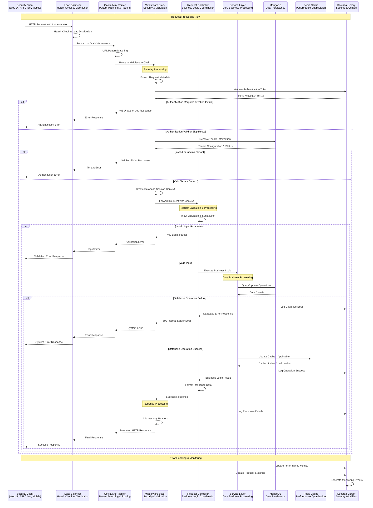

### 4.2.1 Request Processing Layer Details

**Load Balancer Layer**: The load balancer performs intelligent traffic distribution based on instance health, current load, and response times. It continuously monitors backend instances and automatically removes unhealthy instances from the rotation. The load balancer also implements connection pooling and keep-alive mechanisms to optimize network performance.

**Router Layer**: The Gorilla Mux router provides sophisticated URL pattern matching capabilities, supporting complex route parameters, regular expressions, and conditional routing. The router maintains route performance metrics and supports dynamic route registration for plugin-based extensibility.

**Middleware Layer**: The middleware stack implements cross-cutting concerns in a layered approach:
- **Security Middleware**: Handles authentication, authorization, and security header injection
- **Logging Middleware**: Provides comprehensive request/response logging with correlation IDs
- **Tenant Middleware**: Resolves tenant context and database session management
- **Validation Middleware**: Implements input sanitization and basic validation rules
- **Monitoring Middleware**: Collects performance metrics and health indicators

**Controller Layer**: Controllers act as orchestrators, coordinating between the HTTP protocol and business logic. They handle input validation, format conversion, and response generation while delegating actual business processing to service classes.

**Service Layer**: The service layer contains the core business logic and domain-specific processing. Services are stateless and designed for easy testing and reuse. They coordinate complex operations, handle business rule validation, and manage transactional boundaries.

### 4.3 Authentication and Authorization Architecture

The system implements a multi-layered security model that provides comprehensive authentication and authorization capabilities while maintaining performance and usability.

```mermaid
graph TB
    subgraph "Client Security Layer"
        HTTPS[HTTPS/TLS 1.3<br/>• Certificate validation<br/>• Encrypted communication<br/>• Perfect forward secrecy]
        CLIENT_CERT[Client Certificates<br/>• Mutual TLS authentication<br/>• Certificate-based identity<br/>• PKI integration]
        API_KEY[API Key Authentication<br/>• Service-to-service auth<br/>• Rate limiting by key<br/>• Scope-based access]
    end
    
    subgraph "Gateway Security Layer"
        WAF[Web Application Firewall<br/>• OWASP Top 10 protection<br/>• SQL injection prevention<br/>• XSS attack mitigation<br/>• Custom rule engine]
        RATE_LIMIT[Rate Limiting<br/>• Per-client rate limits<br/>• Adaptive throttling<br/>• DDoS protection<br/>• Burst handling]
        IP_FILTER[IP Filtering & Geofencing<br/>• Whitelist/blacklist management<br/>• Geographic restrictions<br/>• Threat intelligence integration<br/>• Real-time blocking]
        DDoS[DDoS Protection<br/>• Traffic analysis<br/>• Anomaly detection<br/>• Automatic mitigation<br/>• Cloud-based defense]
    end
    
    subgraph "Application Security Layer"
        subgraph "Authentication Services"
            JWT_AUTH[JWT Token Validation<br/>• Stateless authentication<br/>• Token signature verification<br/>• Expiration management<br/>• Refresh token support]
            SAML_AUTH[SAML Integration<br/>• Enterprise SSO<br/>• Identity federation<br/>• Attribute mapping<br/>• Multi-IdP support]
            SESSION_MGT[Session Management<br/>• Session lifecycle<br/>• Concurrent session control<br/>• Session timeout handling<br/>• Security event logging]
            TOKEN_STORE[Token Store Management<br/>• In-memory token cache<br/>• Token revocation<br/>• Cleanup routines<br/>• Performance optimization]
        end
        
        subgraph "Authorization Services"
            RBAC[Role-Based Access Control<br/>• Fine-grained permissions<br/>• Role hierarchy<br/>• Dynamic role assignment<br/>• Permission inheritance]
            TENANT_ISOLATION[Tenant Isolation<br/>• Complete data separation<br/>• Tenant-scoped operations<br/>• Cross-tenant prevention<br/>• Audit trail maintenance]
            RESOURCE_AUTHZ[Resource Authorization<br/>• Object-level permissions<br/>• Contextual access control<br/>• Dynamic policy evaluation<br/>• Inheritance rules]
            API_AUTHZ[API Authorization<br/>• Endpoint-level security<br/>• Method-specific controls<br/>• Parameter validation<br/>• Scope verification]
        end
        
        subgraph "Data Protection Services"
            FIELD_ENCRYPTION[Field-Level Encryption<br/>• AES-256 encryption<br/>• Key rotation management<br/>• Tenant-specific keys<br/>• Selective encryption]
            DATA_MASKING[Data Masking<br/>• Sensitive data obfuscation<br/>• Context-aware masking<br/>• Reversible anonymization<br/>• Compliance support]
            SECURE_STORAGE[Secure Storage<br/>• Encrypted at rest<br/>• Key management integration<br/>• Backup encryption<br/>• Audit logging]
            KEY_MANAGEMENT[Key Management<br/>• HSM integration<br/>• Key lifecycle management<br/>• Rotation policies<br/>• Escrow capabilities]
        end
        
        subgraph "Input Security Services"
            INPUT_VALIDATION[Input Validation<br/>• Schema-based validation<br/>• Data type checking<br/>• Range validation<br/>• Custom validators]
            XSS_PROTECTION[XSS Protection<br/>• Content sanitization<br/>• Output encoding<br/>• CSP header injection<br/>• Script filtering]
            INJECTION_PREVENTION[Injection Prevention<br/>• Parameterized queries<br/>• Command injection prevention<br/>• LDAP injection protection<br/>• NoSQL injection security]
            CSRF_PROTECTION[CSRF Protection<br/>• Token-based validation<br/>• Same-site cookies<br/>• Referer checking<br/>• Custom header validation]
        end
    end
    
    subgraph "Infrastructure Security Layer"
        NETWORK_SEC[Network Security<br/>• VPC isolation<br/>• Private subnets<br/>• NAT gateway routing<br/>• Network ACLs]
        FIREWALL[Firewall Rules<br/>• Port-based filtering<br/>• Protocol restrictions<br/>• Source IP validation<br/>• Stateful inspection]
        SECURITY_GROUPS[Security Groups<br/>• Instance-level rules<br/>• Dynamic membership<br/>• Tag-based policies<br/>• Automatic updates]
        VPC[Virtual Private Cloud<br/>• Network isolation<br/>• CIDR management<br/>• Peering connections<br/>• Flow logging]
    end
    
    subgraph "Database Security Layer"
        DB_ENCRYPTION[Database Encryption<br/>• Transparent data encryption<br/>• Key management service<br/>• Performance optimization<br/>• Compliance support]
        DB_ACCESS_CONTROL[Database Access Control<br/>• Authentication integration<br/>• Role-based DB access<br/>• Query-level permissions<br/>• Connection limits]
        DB_AUDIT[Database Audit Logging<br/>• Query logging<br/>• Access tracking<br/>• Change auditing<br/>• Compliance reporting]
        BACKUP_ENCRYPTION[Backup Encryption<br/>• Encrypted backups<br/>• Key management<br/>• Restore validation<br/>• Offsite security]
    end
    
    subgraph "Monitoring & Compliance Layer"
        SECURITY_LOGS[Security Event Logging<br/>• Centralized log collection<br/>• Real-time monitoring<br/>• Event correlation<br/>• Forensic analysis]
        THREAT_DETECTION[Threat Detection<br/>• Behavioral analysis<br/>• Anomaly detection<br/>• Machine learning models<br/>• Real-time alerting]
        COMPLIANCE_AUDIT[Compliance Auditing<br/>• Regulatory reporting<br/>• Audit trail maintenance<br/>• Policy compliance<br/>• Automated assessments]
        VULNERABILITY_SCAN[Vulnerability Scanning<br/>• Automated security scans<br/>• Dependency analysis<br/>• Configuration assessment<br/>• Remediation tracking]
    end
    
    %% Security Flow Connections
    HTTPS --> WAF
    CLIENT_CERT --> WAF
    API_KEY --> WAF
    
    WAF --> RATE_LIMIT
    RATE_LIMIT --> IP_FILTER
    IP_FILTER --> DDoS
    
    DDoS --> JWT_AUTH
    JWT_AUTH --> SAML_AUTH
    SAML_AUTH --> SESSION_MGT
    SESSION_MGT --> TOKEN_STORE
    
    TOKEN_STORE --> RBAC
    RBAC --> TENANT_ISOLATION
    TENANT_ISOLATION --> RESOURCE_AUTHZ
    RESOURCE_AUTHZ --> API_AUTHZ
    
    API_AUTHZ --> FIELD_ENCRYPTION
    FIELD_ENCRYPTION --> DATA_MASKING
    DATA_MASKING --> SECURE_STORAGE
    SECURE_STORAGE --> KEY_MANAGEMENT
    
    KEY_MANAGEMENT --> INPUT_VALIDATION
    INPUT_VALIDATION --> XSS_PROTECTION
    XSS_PROTECTION --> INJECTION_PREVENTION
    INJECTION_PREVENTION --> CSRF_PROTECTION
    
    CSRF_PROTECTION --> NETWORK_SEC
    NETWORK_SEC --> FIREWALL
    FIREWALL --> SECURITY_GROUPS
    SECURITY_GROUPS --> VPC
    
    VPC --> DB_ENCRYPTION
    DB_ENCRYPTION --> DB_ACCESS_CONTROL
    DB_ACCESS_CONTROL --> DB_AUDIT
    DB_AUDIT --> BACKUP_ENCRYPTION
    
    BACKUP_ENCRYPTION --> SECURITY_LOGS
    SECURITY_LOGS --> THREAT_DETECTION
    THREAT_DETECTION --> COMPLIANCE_AUDIT
    COMPLIANCE_AUDIT --> VULNERABILITY_SCAN
    
    %% Styling
    style HTTPS fill:#c8e6c9,stroke:#2e7d32,stroke-width:2px
    style WAF fill:#ffcdd2,stroke:#d32f2f,stroke-width:2px
    style JWT_AUTH fill:#e1f5fe,stroke:#0277bd,stroke-width:2px
    style TENANT_ISOLATION fill:#f3e5f5,stroke:#7b1fa2,stroke-width:2px
    style FIELD_ENCRYPTION fill:#fff3e0,stroke:#f57c00,stroke-width:2px
    style DB_ENCRYPTION fill:#e8f5e8,stroke:#388e3c,stroke-width:2px
```

### 4.3.1 Multi-Factor Authentication Flow

The authentication system supports multiple authentication methods that can be used independently or in combination for enhanced security:

**JWT Token Authentication**: Stateless authentication using JSON Web Tokens with digital signatures. Tokens include user identity, tenant context, role information, and expiration data. The system supports both access tokens for API calls and refresh tokens for session management.

**SAML Integration**: Enterprise-grade Single Sign-On integration supporting multiple identity providers. The SAML implementation includes attribute mapping, role synchronization, and session federation capabilities.

**Session Management**: Comprehensive session lifecycle management including creation, validation, renewal, and termination. The system maintains session state in Redis for performance while providing fallback mechanisms for high availability.

**API Key Authentication**: Service-to-service authentication using API keys with scope-based access control. API keys support rate limiting, usage analytics, and automatic rotation capabilities.

## 5. Scalability and Performance Architecture

### 5.1 Horizontal Scalability Strategy

The Zona Custom Services architecture is designed for horizontal scalability from the ground up, supporting growth from small single-tenant deployments to large-scale multi-tenant enterprise environments. The scalability strategy encompasses multiple dimensions including application instances, database capacity, caching performance, and infrastructure resources.

#### 5.1.1 Application Layer Scaling

**Stateless Application Design**: The core application is designed to be completely stateless, with all session and state information stored in external systems (Redis for sessions, MongoDB for persistent data). This stateless design enables seamless horizontal scaling by allowing any application instance to handle any request without dependency on local state.

**Load Balancer Distribution**: Multiple application instances operate behind sophisticated load balancers that distribute traffic based on various algorithms including round-robin, least connections, and weighted routing. The load balancers continuously monitor instance health and automatically remove unhealthy instances from rotation.

**Auto-scaling Capabilities**: The system supports automatic scaling based on various metrics including CPU utilization, memory usage, request queue depth, and custom business metrics. Auto-scaling policies can be configured to handle predictable load patterns (time-based scaling) and unpredictable traffic spikes (metric-based scaling).

**Container Orchestration**: Deployment using container orchestration platforms (Kubernetes) provides advanced scaling capabilities including:
- Pod auto-scaling based on resource metrics
- Horizontal pod autoscaling with custom metrics
- Vertical pod autoscaling for resource optimization
- Cluster auto-scaling for infrastructure expansion

### 5.1.2 Scalability Architecture Diagram

```mermaid
graph TB
    subgraph "Traffic Distribution Layer"
        INTERNET[Internet Traffic<br/>Global User Base<br/>API Consumers<br/>Mobile Applications]
        CDN[Content Delivery Network<br/>• Static asset delivery<br/>• Geographic distribution<br/>• Edge caching<br/>• DDoS protection]
        WAF[Web Application Firewall<br/>• Security filtering<br/>• Attack mitigation<br/>• Rate limiting<br/>• Geographic blocking]
        GLB[Global Load Balancer<br/>• DNS-based routing<br/>• Health-based failover<br/>• Geographic distribution<br/>• Traffic splitting]
    end
    
    subgraph "Application Layer Scaling"
        subgraph "Auto Scaling Group 1 - Region A"
            ALB1[Application Load Balancer<br/>• Health checks<br/>• SSL termination<br/>• Path-based routing<br/>• Target group management]
            ASG1[Auto Scaling Group<br/>• Min: 2 instances<br/>• Max: 20 instances<br/>• Desired: 4 instances<br/>• Scaling policies]
            SVC1[Service Instance 1<br/>Port 8063<br/>Health: Healthy<br/>Load: 45%]
            SVC2[Service Instance 2<br/>Port 8063<br/>Health: Healthy<br/>Load: 38%]
            SVC3[Service Instance 3<br/>Port 8063<br/>Health: Healthy<br/>Load: 52%]
            SVC4[Service Instance N<br/>Port 8063<br/>Health: Healthy<br/>Load: 41%]
        end
        
        subgraph "Auto Scaling Group 2 - Region B"
            ALB2[Application Load Balancer<br/>• Failover capability<br/>• Cross-AZ distribution<br/>• Sticky sessions<br/>• Connection draining]
            ASG2[Auto Scaling Group<br/>• Geographic redundancy<br/>• Independent scaling<br/>• Disaster recovery<br/>• Load balancing]
            SVC5[Service Instance 5<br/>Standby Region<br/>Health: Healthy<br/>Load: 23%]
            SVC6[Service Instance 6<br/>Standby Region<br/>Health: Healthy<br/>Load: 28%]
        end
    end
    
    subgraph "Database Scaling Architecture"
        subgraph "MongoDB Cluster - Primary"
            MONGO_PRIMARY[(MongoDB Primary<br/>• Read/Write operations<br/>• Oplog maintenance<br/>• Index management<br/>• Backup coordination)]
            MONGO_SECONDARY1[(MongoDB Secondary 1<br/>• Read operations<br/>• Replication lag: 2ms<br/>• Backup source<br/>• Failover candidate)]
            MONGO_SECONDARY2[(MongoDB Secondary 2<br/>• Read operations<br/>• Replication lag: 3ms<br/>• Analytics workload<br/>• Reporting queries)]
            MONGO_ARBITER[(MongoDB Arbiter<br/>• Election participation<br/>• Quorum maintenance<br/>• No data storage<br/>• Lightweight instance)]
        end
        
        subgraph "MongoDB Cluster - Secondary Region"
            MONGO_DR_PRIMARY[(MongoDB DR Primary<br/>• Disaster recovery<br/>• Cross-region replication<br/>• Independent operation<br/>• Backup retention)]
            MONGO_DR_SECONDARY[(MongoDB DR Secondary<br/>• DR read operations<br/>• Long-term backups<br/>• Compliance storage<br/>• Archive management)]
        end
        
        subgraph "Database Sharding Strategy"
            MONGOS[MongoDB Router (mongos)<br/>• Query routing<br/>• Load distribution<br/>• Chunk management<br/>• Balancer coordination]
            CONFIG_SERVERS[Config Servers<br/>• Metadata storage<br/>• Chunk distribution<br/>• Balancer state<br/>• Cluster topology]
            
            SHARD1[(Shard 1<br/>Tenant Range: A-G<br/>Chunk Count: 1,247<br/>Size: 2.3TB)]
            SHARD2[(Shard 2<br/>Tenant Range: H-N<br/>Chunk Count: 1,156<br/>Size: 2.1TB)]
            SHARD3[(Shard 3<br/>Tenant Range: O-U<br/>Chunk Count: 1,398<br/>Size: 2.6TB)]
            SHARD4[(Shard 4<br/>Tenant Range: V-Z<br/>Chunk Count: 892<br/>Size: 1.8TB)]
        end
    end
    
    subgraph "Caching Layer Scaling"
        subgraph "Redis Cluster - Primary"
            REDIS_MASTER[Redis Cluster Master<br/>• Write operations<br/>• Cluster coordination<br/>• Slot management<br/>• Failover detection]
            REDIS_REPLICA1[Redis Replica 1<br/>• Read operations<br/>• Failover candidate<br/>• Backup source<br/>• Load distribution]
            REDIS_REPLICA2[Redis Replica 2<br/>• Read scaling<br/>• Geographic distribution<br/>• Performance optimization<br/>• Hot data caching]
        end
        
        subgraph "Redis Sentinel"
            SENTINEL1[Sentinel 1<br/>Monitoring<br/>Failover<br/>Configuration]
            SENTINEL2[Sentinel 2<br/>Monitoring<br/>Failover<br/>Configuration]
            SENTINEL3[Sentinel 3<br/>Monitoring<br/>Failover<br/>Configuration]
        end
        
        subgraph "Cache Distribution"
            CACHE_L1[L1 Cache - Application<br/>• In-memory caching<br/>• Request-scoped data<br/>• Configuration cache<br/>• Session fragments]
            CACHE_L2[L2 Cache - Redis<br/>• Distributed caching<br/>• Cross-instance sharing<br/>• Session storage<br/>• Result caching]
            CACHE_L3[L3 Cache - CDN<br/>• Static content<br/>• API responses<br/>• Geographic caching<br/>• Edge optimization]
        end
    end
    
    subgraph "Monitoring & Auto-Scaling"
        CLOUDWATCH[CloudWatch Metrics<br/>• CPU utilization<br/>• Memory usage<br/>• Request count<br/>• Response times<br/>• Error rates]
        
        AUTO_SCALING[Auto Scaling Policies<br/>• Scale-out triggers<br/>• Scale-in policies<br/>• Cooldown periods<br/>• Health checks]
        
        CUSTOM_METRICS[Custom Metrics<br/>• Business KPIs<br/>• Tenant utilization<br/>• Database performance<br/>• Cache hit rates]
        
        ALERTS[Alerting System<br/>• Threshold monitoring<br/>• Predictive alerting<br/>• Escalation policies<br/>• Integration hooks]
    end
    
    %% Traffic Flow
    INTERNET --> CDN
    CDN --> WAF
    WAF --> GLB
    
    %% Load Distribution
    GLB --> ALB1
    GLB --> ALB2
    
    %% Application Scaling
    ALB1 --> ASG1
    ALB2 --> ASG2
    
    ASG1 --> SVC1
    ASG1 --> SVC2
    ASG1 --> SVC3
    ASG1 --> SVC4
    
    ASG2 --> SVC5
    ASG2 --> SVC6
    
    %% Database Connections
    SVC1 --> MONGOS
    SVC2 --> MONGOS
    SVC3 --> MONGOS
    SVC4 --> MONGOS
    SVC5 --> MONGOS
    SVC6 --> MONGOS
    
    %% Database Replication
    MONGO_PRIMARY --> MONGO_SECONDARY1
    MONGO_PRIMARY --> MONGO_SECONDARY2
    MONGO_PRIMARY --> MONGO_ARBITER
    MONGO_PRIMARY --> MONGO_DR_PRIMARY
    MONGO_DR_PRIMARY --> MONGO_DR_SECONDARY
    
    %% Sharding Architecture
    MONGOS --> CONFIG_SERVERS
    MONGOS --> SHARD1
    MONGOS --> SHARD2
    MONGOS --> SHARD3
    MONGOS --> SHARD4
    
    %% Cache Connections
    SVC1 --> REDIS_MASTER
    SVC2 --> REDIS_REPLICA1
    SVC3 --> REDIS_REPLICA2
    SVC4 --> REDIS_MASTER
    SVC5 --> REDIS_MASTER
    SVC6 --> REDIS_REPLICA1
    
    %% Cache Replication
    REDIS_MASTER --> REDIS_REPLICA1
    REDIS_MASTER --> REDIS_REPLICA2
    
    %% Sentinel Monitoring
    SENTINEL1 --> REDIS_MASTER
    SENTINEL2 --> REDIS_REPLICA1
    SENTINEL3 --> REDIS_REPLICA2
    
    %% Cache Hierarchy
    SVC1 --> CACHE_L1
    CACHE_L1 --> CACHE_L2
    CACHE_L2 --> CACHE_L3
    
    %% Monitoring Connections
    ASG1 --> CLOUDWATCH
    ASG2 --> CLOUDWATCH
    CLOUDWATCH --> AUTO_SCALING
    AUTO_SCALING --> ASG1
    AUTO_SCALING --> ASG2
    
    CLOUDWATCH --> CUSTOM_METRICS
    CUSTOM_METRICS --> ALERTS
    
    %% Styling
    style INTERNET fill:#e3f2fd,stroke:#1976d2,stroke-width:2px
    style SVC1,SVC2,SVC3,SVC4,SVC5,SVC6 fill:#c8e6c9,stroke:#388e3c,stroke-width:2px
    style MONGO_PRIMARY fill:#ffcdd2,stroke:#d32f2f,stroke-width:3px
    style REDIS_MASTER fill:#fff3e0,stroke:#f57c00,stroke-width:3px
    style AUTO_SCALING fill:#f3e5f5,stroke:#7b1fa2,stroke-width:2px
```

### 5.2 Database Performance and Scaling

#### 5.2.1 MongoDB Scaling Strategies

**Replica Set Configuration**: The primary database scaling approach uses MongoDB replica sets with optimized read preferences. The replica set configuration includes a primary node for write operations and multiple secondary nodes for read operations, with automatic failover capabilities.

**Sharding Implementation**: For large-scale deployments, the system supports MongoDB sharding based on tenant identifiers. This approach provides horizontal database scaling while maintaining tenant data isolation. Each shard contains a complete replica set for high availability.

**Index Optimization**: Comprehensive indexing strategies are implemented based on query patterns:
- Compound indexes for complex queries
- Text indexes for search functionality  
- TTL indexes for automatic data expiration
- Sparse indexes for optional fields
- Partial indexes for conditional data

**Connection Pool Optimization**: Database connection pools are tuned for optimal performance with configurations adjusted for:
- Maximum connection limits based on instance capacity
- Minimum connection pools for consistent performance
- Connection timeout settings for reliability
- Health check intervals for connection validity

#### 5.2.2 Caching Performance Strategy

**Multi-Level Caching**: The system implements a sophisticated multi-level caching strategy:

**L1 Cache (Application Level)**: In-memory caching within each application instance for frequently accessed configuration data, reducing database queries for common operations.

**L2 Cache (Distributed Redis)**: Shared caching across all application instances using Redis cluster for session data, integration listings, and computed results.

**L3 Cache (CDN/Edge)**: Content delivery network caching for static assets, API responses, and geographically distributed content.

**Cache Invalidation Strategy**: Intelligent cache invalidation ensures data consistency while maximizing cache hit rates:
- Event-driven invalidation for data changes
- Time-based expiration for ephemeral data
- Tag-based invalidation for related data groups
- Conditional invalidation based on business rules

### 5.3 Performance Optimization Techniques

#### 5.3.1 Application Performance Optimization

**Goroutine Management**: Optimal use of Go's concurrency model with goroutine pools for handling concurrent requests while avoiding goroutine leaks and excessive memory usage.

**Memory Management**: Efficient memory usage through:
- Object pooling for frequently created objects
- Memory-mapped files for large data sets
- Garbage collection tuning for low latency
- Memory profiling and optimization

**Database Query Optimization**: 
- Prepared statement usage for repeated queries
- Batch operations for bulk data processing
- Query result caching for expensive operations
- Connection pooling for database efficiency

**Network Optimization**:
- HTTP/2 support for multiplexed connections
- Compression for large responses
- Keep-alive connections for persistent clients
- Request/response optimization

#### 5.3.2 Performance Monitoring and Tuning

**Real-time Performance Metrics**: Comprehensive performance monitoring including:
- Response time percentiles (P50, P95, P99)
- Throughput measurements (requests per second)
- Error rate tracking and alerting
- Resource utilization monitoring (CPU, memory, network)

**Capacity Planning**: Data-driven capacity planning using historical metrics and predictive analytics to anticipate scaling needs before performance degradation occurs.

**Performance Testing**: Regular performance testing including:
- Load testing for normal usage patterns
- Stress testing for peak capacity determination  
- Endurance testing for long-running stability
- Spike testing for sudden load increases

## 6. Deployment and Infrastructure Architecture

### 6.1 Container and Orchestration Strategy

The deployment architecture leverages containerization and orchestration technologies to provide scalable, reliable, and maintainable infrastructure. The system is designed to run efficiently in various environments from development laptops to large-scale production clusters.

#### 6.1.1 Containerization Approach

**Docker Container Design**: The application is packaged as a lightweight Docker container based on minimal base images for security and performance. The container includes only essential runtime dependencies, reducing attack surface and improving startup times.

**Multi-stage Build Process**: The Docker build process uses multi-stage builds to optimize container size:
- Build stage: Includes development tools and dependencies for compilation
- Runtime stage: Contains only production runtime and compiled artifacts
- Security scanning: Automated vulnerability scanning during build process

**Container Security**: Security-hardened containers following best practices:
- Non-root user execution
- Read-only filesystem where possible  
- Minimal package installation
- Regular base image updates
- Security scanning integration

### 6.1.2 Kubernetes Deployment Architecture

```mermaid
graph TB
    subgraph "Development Environment"
        DEV_CODE[Source Code Repository<br/>• Git version control<br/>• Branch protection rules<br/>• Code review requirements<br/>• Automated testing hooks]
        DEV_BUILD[Local Development<br/>• Docker Compose setup<br/>• Local database instances<br/>• Debug configurations<br/>• Hot reload capabilities]
        DEV_TEST[Unit & Integration Tests<br/>• Automated test suites<br/>• Code coverage reporting<br/>• Performance benchmarks<br/>• Security scans]
    end
    
    subgraph "CI/CD Pipeline"
        GIT_WEBHOOK[Git Webhooks<br/>• Push notifications<br/>• Pull request triggers<br/>• Branch policies<br/>• Automated workflows]
        
        CI_PIPELINE[Continuous Integration<br/>• Automated builds<br/>• Test execution<br/>• Quality gates<br/>• Artifact generation]
        
        SECURITY_SCAN[Security & Quality Scanning<br/>• SAST analysis<br/>• Dependency scanning<br/>• License compliance<br/>• Code quality metrics]
        
        BUILD_ARTIFACTS[Build Artifacts<br/>• Docker images<br/>• Helm charts<br/>• Configuration files<br/>• Documentation]
        
        CD_PIPELINE[Continuous Deployment<br/>• Environment promotion<br/>• Automated deployments<br/>• Rollback capabilities<br/>• Deployment validation]
    end
    
    subgraph "Container Registry & Artifacts"
        ECR[AWS ECR / Container Registry<br/>• Image storage & versioning<br/>• Vulnerability scanning<br/>• Access control policies<br/>• Geographic replication]
        
        HELM_REPO[Helm Chart Repository<br/>• Chart versioning<br/>• Dependency management<br/>• Release management<br/>• Template validation]
        
        ARTIFACT_STORE[Artifact Storage<br/>• Binary storage<br/>• Version management<br/>• Access controls<br/>• Audit logging]
    end
    
    subgraph "Kubernetes Production Cluster"
        subgraph "Control Plane"
            K8S_API[Kubernetes API Server<br/>• Cluster management<br/>• Authentication/Authorization<br/>• Resource scheduling<br/>• State management]
            ETCD[etcd Cluster<br/>• Configuration storage<br/>• Service discovery<br/>• Cluster state<br/>• Backup management]
            SCHEDULER[Kubernetes Scheduler<br/>• Pod placement<br/>• Resource allocation<br/>• Affinity rules<br/>• Constraint satisfaction]
            CONTROLLER[Controller Manager<br/>• Resource controllers<br/>• Lifecycle management<br/>• Desired state maintenance<br/>• Event processing]
        end
        
        subgraph "Worker Nodes - Compute Layer"
            subgraph "Node Pool 1 - Application Tier"
                NODE1[Worker Node 1<br/>• CPU: 8 cores<br/>• Memory: 32GB<br/>• Storage: 100GB SSD<br/>• Network: 10Gbps]
                NODE2[Worker Node 2<br/>• High availability pair<br/>• Auto-scaling capable<br/>• Resource monitoring<br/>• Health checks]
            end
            
            subgraph "Node Pool 2 - Database Tier"
                NODE3[Worker Node 3<br/>• Storage optimized<br/>• High IOPS capability<br/>• Persistent volumes<br/>• Backup integration]
                NODE4[Worker Node 4<br/>• Database replicas<br/>• Cross-AZ distribution<br/>• Disaster recovery<br/>• Performance monitoring]
            end
        end
        
        subgraph "Application Workloads"
            DEPLOYMENT[Zona Custom Deployment<br/>• Replica count: 3-10<br/>• Rolling update strategy<br/>• Resource requests/limits<br/>• Health probes]
            
            SERVICE[Kubernetes Service<br/>• Load balancing<br/>• Service discovery<br/>• Port management<br/>• Session affinity]
            
            INGRESS[Ingress Controller<br/>• TLS termination<br/>• Path-based routing<br/>• Rate limiting<br/>• Request authentication]
            
            HPA[Horizontal Pod Autoscaler<br/>• CPU-based scaling<br/>• Memory-based scaling<br/>• Custom metrics support<br/>• Predictive scaling]
            
            VPA[Vertical Pod Autoscaler<br/>• Resource optimization<br/>• Right-sizing pods<br/>• Resource recommendations<br/>• Automatic updates]
            
            PDB[Pod Disruption Budget<br/>• Availability guarantees<br/>• Maintenance windows<br/>• Graceful shutdowns<br/>• SLA compliance]
        end
        
        subgraph "Storage & Data"
            PV[Persistent Volumes<br/>• Database storage<br/>• Log storage<br/>• Configuration storage<br/>• Backup storage]
            
            PVC[Persistent Volume Claims<br/>• Storage requests<br/>• Access modes<br/>• Storage classes<br/>• Retention policies]
            
            CONFIGMAP[ConfigMaps & Secrets<br/>• Application configuration<br/>• Environment variables<br/>• Database credentials<br/>• API keys]
        end
    end
    
    subgraph "External Data Services"
        MONGODB[MongoDB Atlas/Self-managed<br/>• Multi-tenant databases<br/>• Replica sets<br/>• Automatic backups<br/>• Performance monitoring]
        
        REDIS_CLUSTER[Redis Cluster/ElastiCache<br/>• Distributed caching<br/>• Session storage<br/>• High availability<br/>• Automatic failover]
        
        EXTERNAL_APIS[External API Services<br/>• SAML Identity Providers<br/>• Cloud services<br/>• Security APIs<br/>• Monitoring services]
    end
    
    subgraph "Monitoring & Observability"
        PROMETHEUS[Prometheus<br/>• Metrics collection<br/>• Time series database<br/>• Alert manager integration<br/>• Service discovery]
        
        GRAFANA[Grafana Dashboards<br/>• Visualization<br/>• Real-time monitoring<br/>• Alert visualization<br/>• Custom dashboards]
        
        ELK_STACK[ELK/EFK Stack<br/>• Log aggregation<br/>• Search & analysis<br/>• Kibana visualization<br/>• Log retention]
        
        JAEGER[Distributed Tracing<br/>• Request tracing<br/>• Performance analysis<br/>• Service dependencies<br/>• Bottleneck identification]
    end
    
    %% Development Flow
    DEV_CODE --> GIT_WEBHOOK
    DEV_BUILD --> CI_PIPELINE
    DEV_TEST --> CI_PIPELINE
    
    %% CI/CD Flow
    GIT_WEBHOOK --> CI_PIPELINE
    CI_PIPELINE --> SECURITY_SCAN
    SECURITY_SCAN --> BUILD_ARTIFACTS
    BUILD_ARTIFACTS --> CD_PIPELINE
    
    %% Artifact Management
    BUILD_ARTIFACTS --> ECR
    BUILD_ARTIFACTS --> HELM_REPO
    BUILD_ARTIFACTS --> ARTIFACT_STORE
    
    %% Deployment Flow
    CD_PIPELINE --> K8S_API
    ECR --> DEPLOYMENT
    HELM_REPO --> DEPLOYMENT
    
    %% Kubernetes Architecture
    K8S_API --> ETCD
    K8S_API --> SCHEDULER
    K8S_API --> CONTROLLER
    
    SCHEDULER --> NODE1
    SCHEDULER --> NODE2
    SCHEDULER --> NODE3
    SCHEDULER --> NODE4
    
    %% Application Deployment
    DEPLOYMENT --> SERVICE
    SERVICE --> INGRESS
    DEPLOYMENT --> HPA
    DEPLOYMENT --> VPA
    DEPLOYMENT --> PDB
    
    %% Storage
    DEPLOYMENT --> PV
    PV --> PVC
    DEPLOYMENT --> CONFIGMAP
    
    %% External Services
    DEPLOYMENT --> MONGODB
    DEPLOYMENT --> REDIS_CLUSTER
    DEPLOYMENT --> EXTERNAL_APIS
    
    %% Monitoring
    DEPLOYMENT --> PROMETHEUS
    PROMETHEUS --> GRAFANA
    DEPLOYMENT --> ELK_STACK
    DEPLOYMENT --> JAEGER
    
    %% Styling
    style DEV_CODE fill:#e3f2fd,stroke:#1976d2,stroke-width:2px
    style DEPLOYMENT fill:#c8e6c9,stroke:#388e3c,stroke-width:3px
    style MONGODB fill:#fff3e0,stroke:#f57c00,stroke-width:2px
    style PROMETHEUS fill:#f3e5f5,stroke:#7b1fa2,stroke-width:2px
    style K8S_API fill:#ffcdd2,stroke:#d32f2f,stroke-width:3px
```

### 6.2 Environment Management and Deployment Pipeline

#### 6.2.1 Multi-Environment Strategy

**Development Environment**: Local development environments using Docker Compose for rapid development and testing. Includes hot-reload capabilities, debug configurations, and local database instances.

**Staging Environment**: Production-like environment for integration testing, performance validation, and user acceptance testing. Mirrors production configuration with reduced scale.

**Production Environment**: High-availability production environment with full monitoring, backup, and disaster recovery capabilities. Includes blue-green deployment support for zero-downtime updates.

#### 6.2.2 Deployment Strategies

**Rolling Deployments**: Default deployment strategy using Kubernetes rolling updates to ensure zero downtime during application updates. Includes configurable update strategies and rollback capabilities.

**Blue-Green Deployments**: For critical updates, blue-green deployments provide instant rollback capabilities and complete environment validation before traffic switching.

**Canary Deployments**: Gradual traffic shifting for new versions, allowing real-world validation with minimal risk exposure.

## 7. Monitoring, Observability, and Operational Excellence

### 7.1 Comprehensive Monitoring Strategy

The monitoring and observability architecture provides comprehensive visibility into system performance, security events, and business operations. This multi-layered approach ensures rapid issue detection, root cause analysis capabilities, and proactive performance optimization.

#### 7.1.1 Monitoring Architecture

**Application Performance Monitoring (APM)**: Comprehensive application-level monitoring including request tracing, error tracking, performance profiling, and user experience monitoring.

**Infrastructure Monitoring**: System-level monitoring covering resource utilization, network performance, storage usage, and infrastructure health.

**Business Metrics Monitoring**: Domain-specific monitoring for security operations including integration success rates, event processing performance, and tenant utilization patterns.

**Security Event Monitoring**: Specialized monitoring for security-related events including authentication failures, authorization violations, and suspicious activity patterns.

### 7.1.2 Observability Stack Architecture

```mermaid
graph TB
    subgraph "Application Metrics Collection"
        APP_METRICS[Application Metrics<br/>• Request/response metrics<br/>• Business logic performance<br/>• Error rates & categorization<br/>• Custom business KPIs]
        
        HTTP_METRICS[HTTP Layer Metrics<br/>• Request latency (P50, P95, P99)<br/>• Throughput (RPS)<br/>• Status code distribution<br/>• Endpoint performance]
        
        DB_METRICS[Database Metrics<br/>• Query performance<br/>• Connection pool usage<br/>• Transaction success rates<br/>• Index utilization]
        
        CACHE_METRICS[Cache Performance<br/>• Hit/miss ratios<br/>• Eviction rates<br/>• Memory usage<br/>• Network overhead]
        
        BUSINESS_METRICS[Business Logic Metrics<br/>• Integration success rates<br/>• Task execution times<br/>• Export/import operations<br/>• Tenant utilization patterns]
        
        SECURITY_METRICS[Security Event Metrics<br/>• Authentication success/failure<br/>• Authorization violations<br/>• Data access patterns<br/>• Anomaly detection]
    end
    
    subgraph "Infrastructure Metrics Collection"
        CPU_METRICS[CPU Utilization<br/>• Per-core utilization<br/>• Load averages<br/>• Context switches<br/>• Process statistics]
        
        MEMORY_METRICS[Memory Usage<br/>• RAM utilization<br/>• Swap usage<br/>• Memory leaks detection<br/>• GC performance]
        
        DISK_METRICS[Disk I/O Performance<br/>• Read/write IOPS<br/>• Queue depth<br/>• Latency measurements<br/>• Space utilization]
        
        NETWORK_METRICS[Network Performance<br/>• Bandwidth utilization<br/>• Packet loss<br/>• Connection statistics<br/>• Error rates]
        
        CONTAINER_METRICS[Container Metrics<br/>• Resource limits<br/>• Restart counts<br/>• Health check status<br/>• Lifecycle events]
        
        K8S_METRICS[Kubernetes Metrics<br/>• Pod health & status<br/>• Resource quotas<br/>• Node capacity<br/>• Cluster events]
    end
    
    subgraph "Log Collection & Processing"
        APP_LOGS[Application Logs<br/>• Structured JSON logging<br/>• Log levels (DEBUG-FATAL)<br/>• Correlation IDs<br/>• Context information]
        
        ACCESS_LOGS[HTTP Access Logs<br/>• Request/response logging<br/>• Client information<br/>• Performance timing<br/>• Status codes]
        
        ERROR_LOGS[Error & Exception Logs<br/>• Stack traces<br/>• Error categorization<br/>• Recovery actions<br/>• Impact assessment]
        
        AUDIT_LOGS[Security Audit Logs<br/>• Authentication events<br/>• Data access logs<br/>• Configuration changes<br/>• Compliance tracking]
        
        SYSTEM_LOGS[System & Infrastructure Logs<br/>• Operating system logs<br/>• Container runtime logs<br/>• Kubernetes events<br/>• Security system logs]
        
        BUSINESS_LOGS[Business Process Logs<br/>• Workflow execution<br/>• Integration operations<br/>• Data processing events<br/>• User activity tracking]
    end
    
    subgraph "Metrics Processing & Storage"
        PROMETHEUS[Prometheus<br/>• Time-series metrics storage<br/>• Pull-based collection<br/>• Service discovery<br/>• Alert rule evaluation<br/>• Query language (PromQL)]
        
        INFLUXDB[InfluxDB (Optional)<br/>• High-cardinality metrics<br/>• Long-term storage<br/>• Advanced querying<br/>• Downsampling & retention]
        
        METRICS_GATEWAY[Metrics Gateway<br/>• Protocol translation<br/>• Rate limiting<br/>• Batching & buffering<br/>• Format normalization]
        
        CUSTOM_COLLECTORS[Custom Metrics Collectors<br/>• Business metric extraction<br/>• Database statistics<br/>• External system monitoring<br/>• SLA tracking]
    end
    
    subgraph "Log Processing & Storage"
        FLUENTD[Fluentd/Fluent Bit<br/>• Log collection & forwarding<br/>• Format standardization<br/>• Filtering & routing<br/>• Buffer management]
        
        LOGSTASH[Logstash<br/>• Log parsing & transformation<br/>• Data enrichment<br/>• Multi-input processing<br/>• Output routing]
        
        ELASTICSEARCH[Elasticsearch<br/>• Full-text search<br/>• Log indexing & storage<br/>• Query performance<br/>• Cluster management]
        
        LOG_ROTATION[Log Rotation & Retention<br/>• Automated cleanup<br/>• Compression strategies<br/>• Archive management<br/>• Compliance policies]
    end
    
    subgraph "Visualization & Analytics"
        GRAFANA[Grafana Dashboards<br/>• Real-time visualization<br/>• Custom dashboards<br/>• Alert visualization<br/>• Team collaboration<br/>• Data source integration]
        
        KIBANA[Kibana<br/>• Log search & analysis<br/>• Visual analytics<br/>• Dashboard creation<br/>• Data exploration<br/>• Machine learning integration]
        
        CUSTOM_DASHBOARDS[Custom Analytics Dashboards<br/>• Business intelligence<br/>• Executive reporting<br/>• Trend analysis<br/>• Capacity planning]
        
        MOBILE_DASHBOARDS[Mobile Monitoring Apps<br/>• On-call notifications<br/>• Critical metric tracking<br/>• Incident response<br/>• Executive summaries]
    end
    
    subgraph "Alerting & Notification"
        ALERT_MANAGER[Prometheus AlertManager<br/>• Alert routing & grouping<br/>• Notification delivery<br/>• Alert suppression<br/>• Escalation policies]
        
        CUSTOM_ALERTING[Custom Alert Rules<br/>• Business logic alerts<br/>• SLA violation detection<br/>• Anomaly detection<br/>• Predictive alerting]
        
        NOTIFICATION_CHANNELS[Notification Channels<br/>• Email notifications<br/>• Slack/Teams integration<br/>• SMS alerts<br/>• Webhook callbacks<br/>• Mobile push notifications]
        
        INCIDENT_MANAGEMENT[Incident Management<br/>• PagerDuty integration<br/>• On-call scheduling<br/>• Escalation workflows<br/>• Post-incident analysis]
    end
    
    subgraph "Distributed Tracing"
        JAEGER[Jaeger Tracing<br/>• Request tracing<br/>• Service dependency mapping<br/>• Performance bottlenecks<br/>• Error root cause analysis]
        
        ZIPKIN[Zipkin (Alternative)<br/>• Distributed tracing<br/>• Latency analysis<br/>• Service communication<br/>• Performance optimization]
        
        OPENTELEMETRY[OpenTelemetry<br/>• Standardized instrumentation<br/>• Multi-vendor support<br/>• Trace correlation<br/>• Context propagation]
        
        TRACE_ANALYSIS[Trace Analysis Tools<br/>• Performance profiling<br/>• Dependency analysis<br/>• Error correlation<br/>• Optimization recommendations]
    end
    
    %% Metrics Collection Flow
    APP_METRICS --> PROMETHEUS
    HTTP_METRICS --> PROMETHEUS
    DB_METRICS --> PROMETHEUS
    CACHE_METRICS --> PROMETHEUS
    BUSINESS_METRICS --> PROMETHEUS
    SECURITY_METRICS --> PROMETHEUS
    
    CPU_METRICS --> PROMETHEUS
    MEMORY_METRICS --> PROMETHEUS
    DISK_METRICS --> PROMETHEUS
    NETWORK_METRICS --> PROMETHEUS
    CONTAINER_METRICS --> PROMETHEUS
    K8S_METRICS --> PROMETHEUS
    
    %% Alternative Storage
    BUSINESS_METRICS --> INFLUXDB
    CUSTOM_COLLECTORS --> METRICS_GATEWAY
    METRICS_GATEWAY --> PROMETHEUS
    
    %% Log Collection Flow
    APP_LOGS --> FLUENTD
    ACCESS_LOGS --> FLUENTD
    ERROR_LOGS --> FLUENTD
    AUDIT_LOGS --> FLUENTD
    SYSTEM_LOGS --> FLUENTD
    BUSINESS_LOGS --> FLUENTD
    
    FLUENTD --> LOGSTASH
    LOGSTASH --> ELASTICSEARCH
    
    %% Visualization Connections
    PROMETHEUS --> GRAFANA
    INFLUXDB --> GRAFANA
    ELASTICSEARCH --> KIBANA
    
    GRAFANA --> CUSTOM_DASHBOARDS
    KIBANA --> CUSTOM_DASHBOARDS
    CUSTOM_DASHBOARDS --> MOBILE_DASHBOARDS
    
    %% Alerting Flow
    PROMETHEUS --> ALERT_MANAGER
    CUSTOM_COLLECTORS --> CUSTOM_ALERTING
    ALERT_MANAGER --> NOTIFICATION_CHANNELS
    CUSTOM_ALERTING --> NOTIFICATION_CHANNELS
    NOTIFICATION_CHANNELS --> INCIDENT_MANAGEMENT
    
    %% Tracing Flow
    APP_METRICS --> JAEGER
    HTTP_METRICS --> JAEGER
    JAEGER --> OPENTELEMETRY
    OPENTELEMETRY --> TRACE_ANALYSIS
    
    %% Alternative Tracing
    OPENTELEMETRY --> ZIPKIN
    ZIPKIN --> TRACE_ANALYSIS
    
    %% Styling
    style PROMETHEUS fill:#ff6b35,stroke:#d84315,stroke-width:3px
    style GRAFANA fill:#ff9800,stroke:#e65100,stroke-width:2px
    style ELASTICSEARCH fill:#005571,stroke:#00363d,stroke-width:2px
    style JAEGER fill:#60a5fa,stroke:#1e40af,stroke-width:2px
    style ALERT_MANAGER fill:#dc2626,stroke:#991b1b,stroke-width:2px
```

### 7.2 Operational Excellence Practices

#### 7.2.1 Site Reliability Engineering (SRE) Practices

**Service Level Objectives (SLOs)**: Well-defined SLOs for critical system metrics:
- **Availability**: 99.9% uptime for production services
- **Latency**: 95th percentile response time under 500ms
- **Error Rate**: Less than 0.1% error rate for API calls
- **Throughput**: Sustained handling of peak load with auto-scaling

**Error Budget Management**: Systematic tracking of error budgets to balance feature velocity with system reliability. Error budget depletion triggers engineering focus on reliability improvements.

**Chaos Engineering**: Regular chaos engineering exercises to validate system resilience, including:
- Network partition testing
- Database failover scenarios
- Container termination testing
- Load spike simulations

#### 7.2.2 Incident Response and Management

**Incident Response Procedures**: Comprehensive incident response procedures including:
- Automated incident detection and alerting
- Clear escalation procedures and on-call rotations
- Incident command structure for major incidents
- Post-incident review processes and improvement tracking

**Disaster Recovery Planning**: Complete disaster recovery procedures including:
- Regular backup validation and restoration testing
- Cross-region failover capabilities
- Recovery time and recovery point objectives
- Communication plans for extended outages

**Business Continuity**: Business continuity planning covering:
- Critical business function identification
- Alternative operating procedures
- Vendor and supplier contingency plans
- Communication strategies for stakeholders

## 8. Comprehensive Process Flows and Workflows

This section provides detailed process flowcharts that illustrate the key workflows and operational processes within the Zona Custom Services system. These flowcharts complement the architectural diagrams by showing the step-by-step execution paths for critical system operations.

### 8.1 Application Startup and Initialization Process

The application startup process is critical for ensuring proper system initialization, database connectivity, and service readiness. This process handles both single-tenant and multi-tenant configurations while establishing all necessary connections and background services.

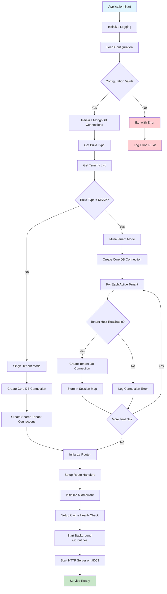

**Startup Process Explanation**: The application startup follows a carefully orchestrated sequence ensuring all dependencies are properly initialized. The process begins with logging setup and configuration validation, followed by database connection establishment. The system then determines the deployment mode (single-tenant vs. multi-tenant) and configures database sessions accordingly. Finally, HTTP routing, middleware, and background services are initialized before the server starts accepting requests.

### 8.2 HTTP Request Processing and Middleware Chain

The HTTP request processing pipeline demonstrates how requests flow through various middleware layers before reaching business logic controllers. This process ensures proper authentication, authorization, and tenant isolation for every request.

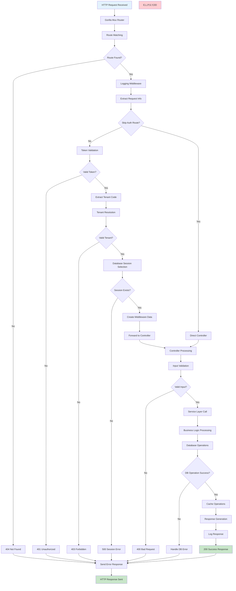

**Request Processing Explanation**: Each HTTP request passes through a comprehensive middleware chain that handles logging, authentication, authorization, and tenant resolution. The system validates tokens, resolves tenant contexts, and ensures proper database session selection before forwarding requests to business logic controllers. Error handling is built into every step, ensuring appropriate HTTP status codes and error messages are returned for various failure scenarios.

### 8.3 Generic Application Creation and Update Workflow

The application creation and update process is one of the most complex workflows in the system, handling multipart form data, file uploads, field encryption, and both new application creation and updates to existing applications.

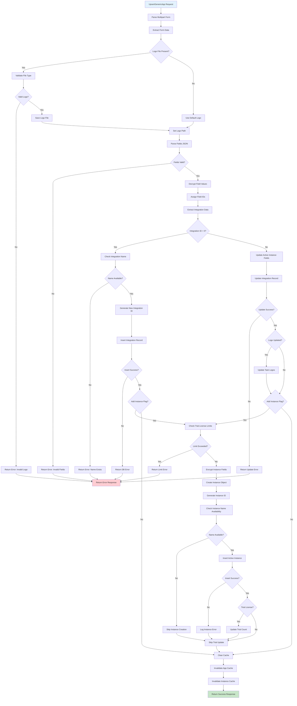

**Application Creation/Update Explanation**: This workflow handles the complex process of creating or updating security applications. It manages file uploads (logos), field validation and encryption, integration record management, and optional instance creation. The process includes comprehensive error handling, license limit checking for trial accounts, and cache invalidation to ensure data consistency across the system.

### 8.4 Application Export Process

The export process enables users to extract application configurations for backup, migration, or sharing purposes. This workflow sanitizes sensitive data and maintains referential integrity between tasks and integrations.

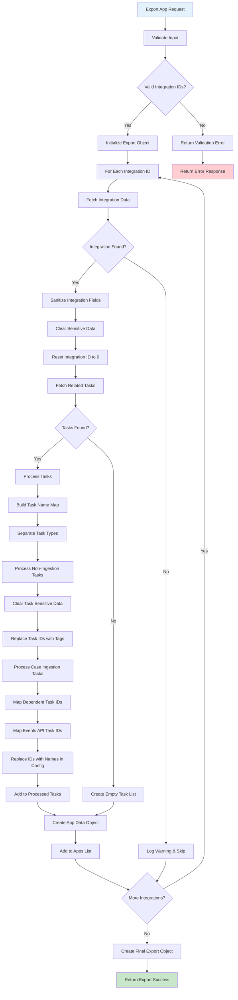

**Export Process Explanation**: The export workflow creates portable application packages by extracting integration and task configurations while sanitizing sensitive information. The process handles complex task dependency mapping, replacing internal IDs with portable name references, and ensuring that exported configurations can be safely shared or imported into different environments.

### 8.5 Application Import and Migration Process

The import process complements the export functionality by allowing users to restore or migrate application configurations. This workflow handles both new application creation and updates to existing applications.

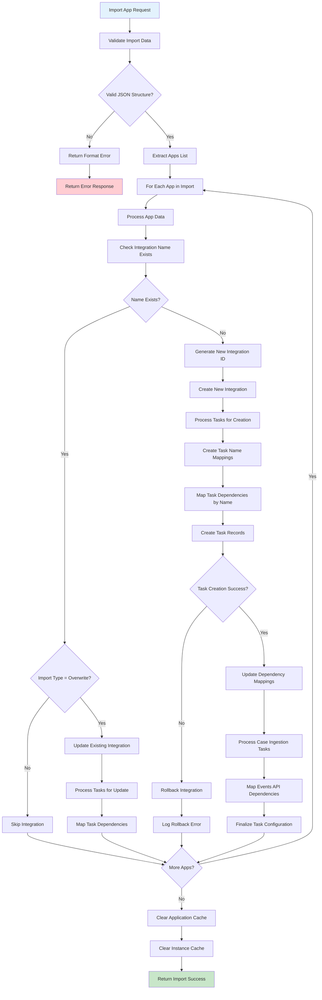

**Import Process Explanation**: The import workflow processes exported application packages, handling both creation of new applications and updates to existing ones. The system carefully maps task dependencies by name, maintains referential integrity, and includes rollback capabilities for error scenarios. Cache invalidation ensures that imported changes are immediately visible across the system.

### 8.6 Database Connection Management and Health Monitoring

Database connection management is critical for system reliability, especially in multi-tenant environments where connections must be established and maintained for multiple tenant databases.

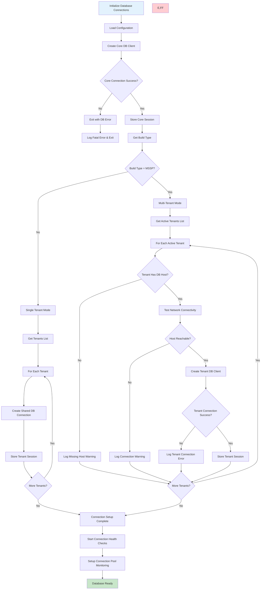

**Database Connection Management Explanation**: The connection management process handles both single-tenant and multi-tenant database configurations. For multi-tenant deployments, the system attempts to establish connections to all active tenant databases, gracefully handling connection failures while ensuring the system remains operational. Health monitoring and connection pooling ensure optimal database performance and reliability.

### 8.7 Authentication and Authorization Workflow

The authentication and authorization process ensures secure access to system resources while supporting both authenticated and public endpoints.

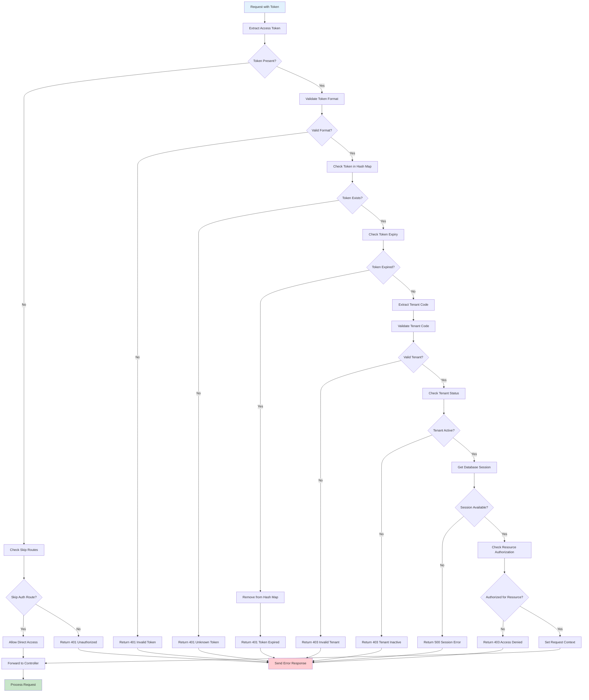

**Authentication/Authorization Explanation**: This workflow implements comprehensive security controls for all system access. The process validates access tokens, checks expiration, resolves tenant contexts, and ensures users have appropriate permissions for requested resources. The system supports both authenticated endpoints and public routes (such as health checks) while maintaining strict security boundaries.

### 8.8 Multi-Tenant Data Isolation Process

Data isolation is fundamental to multi-tenant security, ensuring that tenant data remains completely separated and secure from unauthorized access.

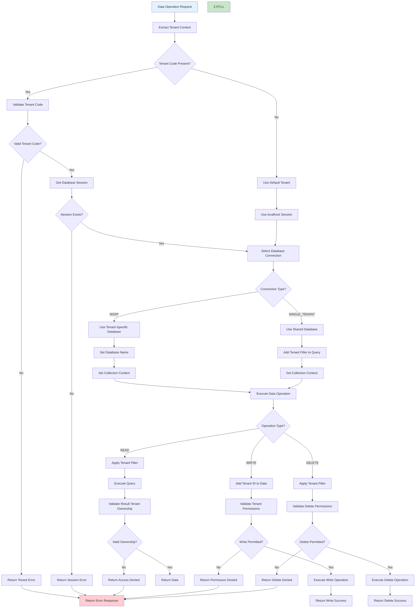

**Multi-Tenant Data Isolation Explanation**: This critical security workflow ensures complete data separation between tenants. The system supports two isolation models: separate databases (MSSP mode) and shared database with tenant filtering. All data operations include tenant validation to prevent cross-tenant data access, maintaining strict security boundaries while supporting efficient multi-tenant operations.

### 8.9 Cache Management and Performance Optimization

The caching system optimizes performance while maintaining data consistency through intelligent cache management strategies.

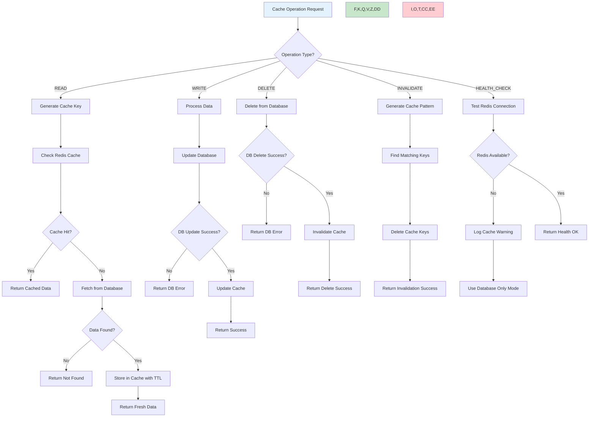

**Cache Management Explanation**: The caching workflow implements a write-through cache pattern with automatic fallback to database-only mode when cache services are unavailable. The system handles cache hits/misses, maintains data consistency through coordinated updates, and provides intelligent invalidation patterns for related data. Health monitoring ensures system resilience during cache outages.

### 8.10 Background Task Processing and System Maintenance

Background services handle essential system maintenance tasks including health monitoring, session cleanup, and metrics collection.

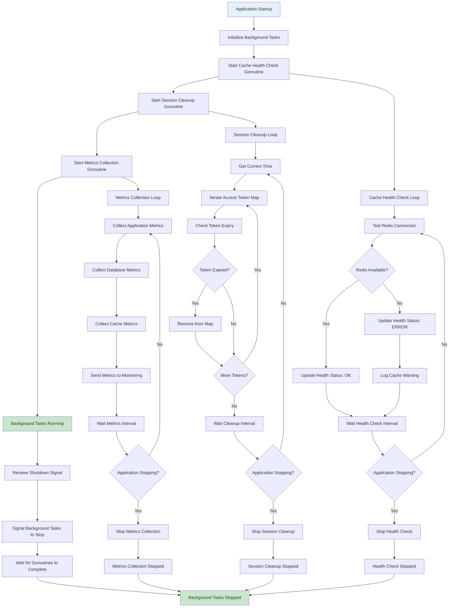

**Background Task Processing Explanation**: The system runs essential background services using Go goroutines for health monitoring, session management, and metrics collection. These services operate independently with proper graceful shutdown handling, ensuring system cleanliness and reliable monitoring data. The background tasks provide the foundation for operational excellence and system observability.

---

This comprehensive High-Level Design document provides detailed architectural guidance for the Zona Custom Services system, covering all aspects from system overview through operational excellence and detailed process workflows. The architecture is designed to be scalable, secure, and maintainable while meeting the complex requirements of modern security automation platforms.