# Low-Level Design (Low Level Design) - Securaa Custom Services

## 1. Implementation Overview

### 1.1 Technology Stack
- **Language**: Go 1.17
- **Web Framework**: Gorilla Mux
- **Database**: MongoDB with official Go driver
- **Cache**: Redis
- **Authentication**: JWT tokens with SAML integration
- **Encryption**: AES encryption for sensitive data
- **Containerization**: Docker
- **Build System**: Make with custom Makefile

### 1.2 Project Structure Analysis

```
zona_custom/
├── main.go                 # Application entry point
├── app.go                  # Application initialization and routing
├── go.mod                  # Go module dependencies
├── Dockerfile             # Container configuration
├── Makefile              # Build automation
├── constants/
│   └── constants.go       # Application constants
├── controllers/           # HTTP request handlers
│   ├── customAppController.go
│   ├── genericAppController.go
│   ├── exportController.go
│   ├── integrationController.go
│   └── eventsController.go
├── handlers/              # Error handling
│   └── errorHandler.go
├── models/                # Data structures
│   ├── Response.go
│   ├── export.go
│   ├── process.go
│   └── customtaskhandler.go
└── services/              # Business logic
    ├── exportservice.go
    ├── importservice.go
    ├── integrationservice.go
    └── eventsService.go
```

## 2. Detailed Component Design

### 2.1 Application Bootstrap (`main.go` & `app.go`)

#### 2.1.1 Main Function Flow

```go
func main() {
    securaalog.Init("CORE_SERVICE_LOGS")  // Initialize logging
    app := App{}                          // Create app instance
    app.Initialize()                      // Setup dependencies
    app.Run(":8063")                     // Start HTTP server
}
```

#### 2.1.2 App Structure Design

```go
type App struct {
    Router             *mux.Router                    // HTTP router
    AccessTokenHashMap map[string]int64               // Token cache
    DBSession          map[string]common.SessionStruct // DB connections
    ConfigObject       config.ConfigStruct           // Configuration
    BuildType          string                        // Deployment type
    RequestResponseLog bool                          // Logging flag
}
```

#### 2.1.3 Initialization Sequence

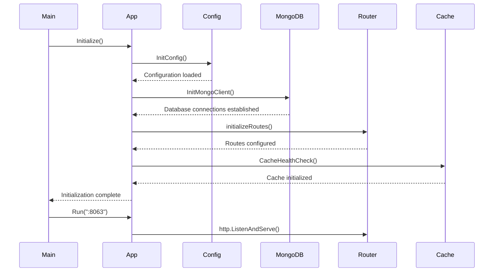

### 2.2 Database Connection Management

#### 2.2.1 Multi-Tenant Connection Strategy

```go
func (a *App) InitMongoClient(configObject config.ConfigStruct) {
    a.DBSession = make(map[string]common.SessionStruct)
    
    // Initialize core database connection
    mongoDbClient, err := mongo_driver.NewMongoClientWrapper(configObject, nil)
    clientStruct := common.SessionStruct{
        DBName: config["mongoDB"],
        Client: mongoDbClient,
    }
    a.DBSession["localhost"] = clientStruct
    
    // Initialize tenant-specific connections
    tenantsList, _ := utils.GetAllTenants2(mongoDbClient, configObject)
    for _, tenantData := range tenantsList {
        if a.BuildType == "mssp" && tenantData.Status == "active" {
            // MSSP: Each tenant has separate database
            tenantDBClient, _ := mongo_driver.NewMongoClientWrapper(configObject, tenantData)
            clientStruct := common.SessionStruct{
                DBName: tenantDBClient.DBName,
                Client: tenantDBClient,
            }
            a.DBSession[tenantCode] = clientStruct
        } else {
            // Single tenant: Shared database with tenant isolation
            // Implementation for single-tenant architecture
        }
    }
}
```

#### 2.2.2 Connection Pool Management

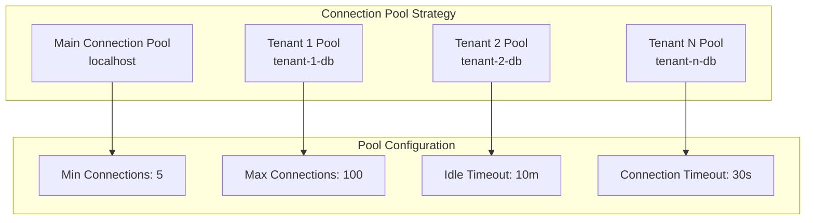

### 2.3 Middleware Implementation

#### 2.3.1 Logging Middleware

```go
func (a *App) loggingMiddleware(next http.Handler) http.Handler {
    return http.HandlerFunc(func(w http.ResponseWriter, r *http.Request) {
        middleWareData := common.MiddleWareData{
            LogRequestResponse:   a.RequestResponseLog,
            DBSession:          a.DBSession,
            ConfigObject:       a.ConfigObject,
            AccessTokenHashMap: a.AccessTokenHashMap,
        }
        
        err := common.MiddleWareForMongoDriver(next, w, r, 
            constants.SkipRoutes, constants.SkipURI, middleWareData)
        
        if err != nil {
            logger.Error("Error in Middleware : ", err.Error())
            utils.RespondWithJSON(w, http.StatusOK, 
                common.HandleError(err, "Error in creating Tenant Session"))
            return
        }
    })
}
```

#### 2.3.2 Middleware Processing Flow

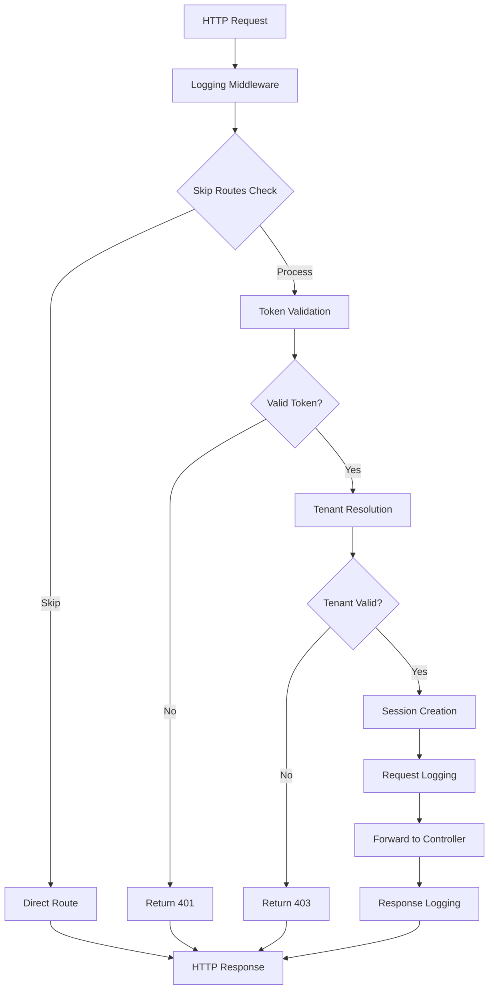

### 2.4 Controller Layer Implementation

#### 2.4.1 Custom App Controller

```go
type CustomAppController struct{}

func (gc CustomAppController) DeleteApp(w http.ResponseWriter, r *http.Request, 
    dbSession map[string]common.SessionStruct, configObject config.ConfigStruct) {
    
    response := models.Response{}
    deleteAppRequest := models.DeleteApp{}
    
    // Step 1: Decode request
    decoder := json.NewDecoder(r.Body)
    if err := decoder.Decode(&deleteAppRequest); err != nil {
        utils.RespondWithJSON(w, http.StatusOK, 
            handlers.HandleError(err, "Error in Reading Request"))
        return
    }
    defer r.Body.Close()
    
    // Step 2: Get database client
    mongoDBClient := dbSession[deleteAppRequest.TenantCode].Client
    
    // Step 3: Business logic execution
    err := deleteAppRequest.UpdateTasksStatus(mongoDBClient, configObject)
    if err != nil {
        utils.RespondWithJSON(w, http.StatusOK, 
            handlers.HandleError(err, "Error in updating task status"))
        return
    }
    
    // Step 4: Update database
    colQuerier := bson.M{"integration_id": deleteAppRequest.IntegrationID}
    change := bson.M{"$set": bson.M{"status": "deleted"}}
    mongoDBClient.CollectionName = config["mongoIntegartionCollection"]
    err = mongoDBClient.UpdateSingleDocument(colQuerier, change, nil, false)
    
    // Step 5: Cache invalidation
    RemoveAppListingCache(deleteAppRequest.TenantCode)
    RemoveActiveInstanceCache(deleteAppRequest.TenantCode)
    
    // Step 6: Response
    response.Success = true
    response.DisplayMessage = "App Deleted"
    utils.RespondWithJSON(w, http.StatusOK, response)
}
```

#### 2.4.2 Generic App Controller - UpsertGenericApp

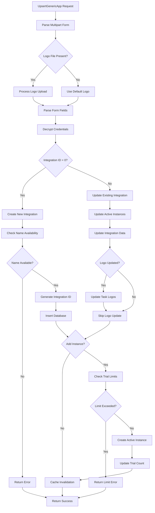

### 2.5 Service Layer Implementation

#### 2.5.1 Export Service Architecture

```go
func ExportIntegration(dbSession map[string]common.SessionStruct, 
    config config.Config, req models.ExportAppInputStruct) models.Response {
    
    var response models.Response
    var integrations models.ExportObject
    var apps []models.AppData
    
    tenantCode := req.Tenantcode
    mongoDBClient := dbSession[tenantCode].Client
    
    for _, eachIntegrationID := range req.IntegrationIds {
        var integrationObj models.AppData
        
        // Step 1: Fetch integration data
        var appObj models.GenericIntegrationObject
        mongoDBClient.CollectionName = config["mongoIntegartionCollection"]
        err := mongoDBClient.FindSingleDocument(
            bson.M{"integration_id": eachIntegrationID, "status": "active"}, 
            nil, &appObj)
        
        // Step 2: Sanitize sensitive data
        var updatedFields []models.Field
        for _, eachfield := range appObj.Fields {
            eachfield.Value = "" // Remove sensitive values
            updatedFields = append(updatedFields, eachfield)
        }
        
        // Step 3: Fetch related tasks
        var tasksResponse []models.TaskData
        mongoDBClient.CollectionName = config["taskCollection"]
        err = mongoDBClient.FindMultipleDocuments(
            bson.M{"integration_id": integrationID, "status": bson.M{"$in": status}}, 
            nil, &tasksResponse)
        
        // Step 4: Process tasks and dependencies
        altTasksResponse := processTasks(tasksResponse)
        
        integrationObj.App = appObj
        integrationObj.Tasks = altTasksResponse
        apps = append(apps, integrationObj)
    }
    
    integrations.Apps = apps
    response.Success = true
    response.Data = integrations
    return response
}
```

#### 2.5.2 Task Dependency Mapping

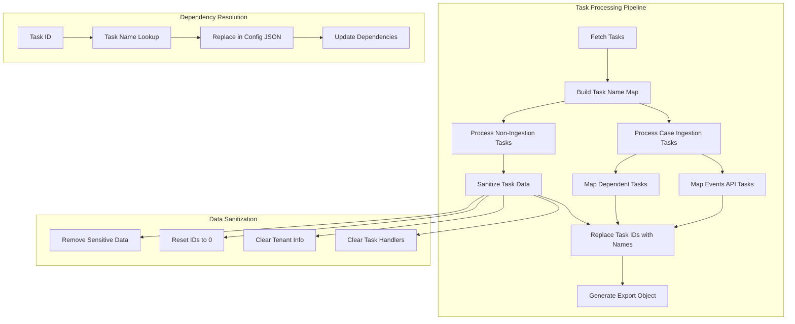

### 2.6 Data Models Implementation

#### 2.6.1 Core Data Structures

```go
// Response model - Standard API response
type Response struct {
    Success        bool        `json:"success"`
    Data           interface{} `json:"data,omitempty"`
    Error          string      `json:"error,omitempty"`
    Time           int64       `json:"time,omitempty"`
    DisplayMessage string      `json:"displaymessage,omitempty"`
    Status         string      `json:"status,omitempty"`
    ErrorPath      string      `json:"errorpath,omitempty"`
    SessionExpired bool        `json:"sessionexpired,omitempty"`
    FileName       string      `json:"filename,omitempty"`
    Field          []string    `json:"field,omitempty"`
    Count          int         `json:"count,omitempty"`
}

// GenericIntegrationObject - Integration data structure
type GenericIntegrationObject struct {
    IntegrationID int           `json:"integration_id" bson:"integration_id"`
    Title         string        `json:"title" bson:"title"`
    Description   string        `json:"description" bson:"description"`
    Version       string        `json:"version" bson:"version"`
    Category      string        `json:"category" bson:"category"`
    TenantCode    string        `json:"tenant_code" bson:"tenant_code"`
    Fields        []Field       `json:"fields" bson:"fields"`
    Status        string        `json:"status" bson:"status"`
    Logo          string        `json:"logo" bson:"logo"`
    GenericApp    bool          `json:"generic_app" bson:"generic_app"`
    UserID        int           `json:"user_id" bson:"user_id"`
    AddInstance   bool          `json:"add_instance" bson:"add_instance"`
}

// TaskData - Task information structure
type TaskData struct {
    ID                  int    `json:"id" bson:"id"`
    Name                string `json:"name" bson:"name"`
    TasksTag            string `json:"tasks_tag" bson:"tasks_tag"`
    TaskHandler         string `json:"task_handler" bson:"task_handler"`
    IntegrationID       int    `json:"integration_id" bson:"integration_id"`
    Fields              string `json:"fields" bson:"fields"`
    Status              string `json:"status" bson:"status"`
    Tenantcode          string `json:"tenantcode" bson:"tenantcode"`
    IngestCases         bool   `json:"ingest_cases" bson:"ingest_cases"`
    CaseIngestionConfig string `json:"case_ingestion_config" bson:"case_ingestion_config"`
    EventsAPIConfig     string `json:"events_api_config" bson:"events_api_config"`
    LogoPath            string `json:"logo_path" bson:"logo_path"`
}
```

#### 2.6.2 Data Validation & Transformation

```mermaid
flowchart LR
    subgraph "Input Validation"
        A[Raw Input] --> B[JSON Decode]
        B --> C[Structure Validation]
        C --> D[Business Rules Check]
        D --> E[Sanitization]
    end
    
    subgraph "Data Transformation"
        F[Database Model] --> G[Field Encryption]
        G --> H[Tenant Mapping]
        H --> I[Timestamp Addition]
        I --> J[ID Generation]
    end
    
    subgraph "Output Serialization"
        K[Internal Model] --> L[Response Model]
        L --> M[JSON Encode]
        M --> N[HTTP Response]
    end
    
    E --> F
    J --> K
```

### 2.7 Error Handling Strategy

#### 2.7.1 Error Handler Implementation

```go
func HandleError(err error, message string) models.Response {
    response := models.Response{
        Success:        false,
        Error:          err.Error(),
        DisplayMessage: message,
        Time:           time.Now().UnixNano() / 1000000,
    }
    
    // Log error details
    logger.Error("Error: %s, Message: %s", err.Error(), message)
    
    return response
}
```

#### 2.7.2 Error Flow Hierarchy

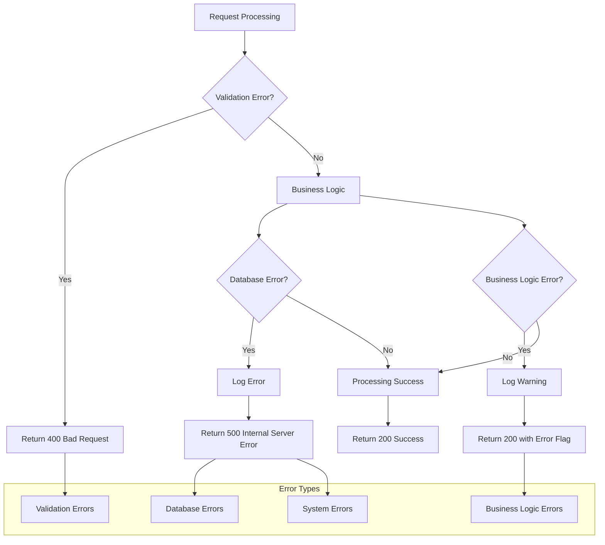

### 2.8 Authentication & Authorization

#### 2.8.1 Token Management

```go
type App struct {
    AccessTokenHashMap map[string]int64  // Token -> Expiry mapping
    // ... other fields
}

func (a *App) UpdateUserSessionExpiryTime(accessToken string, expiryTime int64) {
    a.AccessTokenHashMap[accessToken] = expiryTime
}

func (a *App) ValidateToken(token string) bool {
    expiryTime, exists := a.AccessTokenHashMap[token]
    if !exists {
        return false
    }
    
    currentTime := time.Now().UnixNano() / 1000000
    return currentTime < expiryTime
}
```

#### 2.8.2 Security Flow

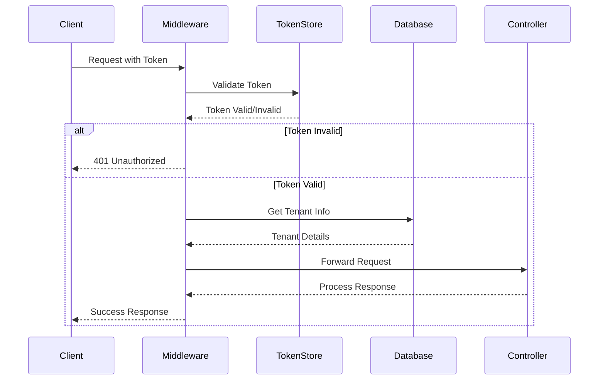

### 2.9 Caching Strategy

#### 2.9.1 Cache Implementation

```go
func RemoveAppListingCache(tenantCode string) {
    cacheKey := fmt.Sprintf("app_listing_%s", tenantCode)
    cache.Delete(cacheKey)
}

func RemoveActiveInstanceCache(tenantCode string) {
    cacheKey := fmt.Sprintf("active_instances_%s", tenantCode)
    cache.Delete(cacheKey)
}

func GetAppListingFromCache(tenantCode string) ([]models.AppData, bool) {
    cacheKey := fmt.Sprintf("app_listing_%s", tenantCode)
    data, exists := cache.Get(cacheKey)
    if exists {
        var apps []models.AppData
        json.Unmarshal(data, &apps)
        return apps, true
    }
    return nil, false
}
```

#### 2.9.2 Cache Invalidation Strategy

```mermaid
graph TB
    subgraph "Cache Operations"
        A[Create/Update Operation] --> B[Invalidate Related Cache]
        C[Delete Operation] --> D[Invalidate Related Cache]
        E[Read Operation] --> F{Cache Hit?}
        F -->|Yes| G[Return Cached Data]
        F -->|No| H[Fetch from DB]
        H --> I[Store in Cache]
        I --> J[Return Data]
    end
    
    subgraph "Cache Keys"
        K[app_listing_{tenant}]
        L[active_instances_{tenant}]
        M[integration_list_{tenant}]
    end
    
    B --> K
    B --> L
    D --> K
    D --> L
```

### 2.10 Configuration Management

#### 2.10.1 Configuration Structure

```go
type ConfigStruct struct {
    ConfigFilePath string
    ConfigData     map[string]string
}

func InitConfig() ConfigStruct {
    config := ConfigStruct{
        ConfigFilePath: "/opt/securaa/conf/securaa.conf",
        ConfigData:     make(map[string]string),
    }
    
    // Load configuration from file
    configData, err := config.ReadConfig()
    if err != nil {
        logger.Error("Failed to load configuration: %v", err)
    }
    
    config.ConfigData = configData
    return config
}
```

#### 2.10.2 Configuration Flow

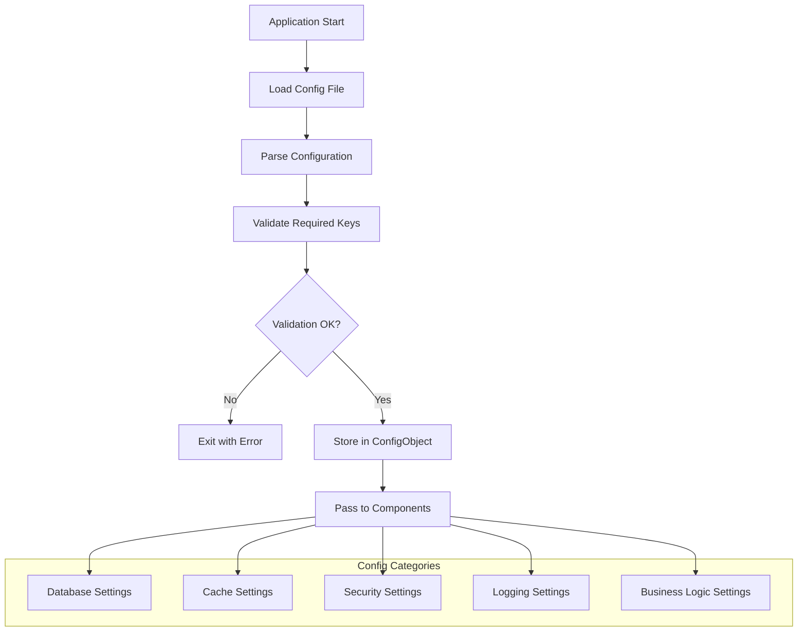

### 2.11 Database Operations

#### 2.11.1 CRUD Operations Pattern

```go
// Generic database operation wrapper
type DatabaseOperations struct {
    Client         mongo_driver.MongoClientWrapper
    CollectionName string
}

func (db *DatabaseOperations) Create(document interface{}) error {
    db.Client.CollectionName = db.CollectionName
    return db.Client.InsertSingleDocument(document, nil)
}

func (db *DatabaseOperations) Read(filter bson.M, result interface{}) error {
    db.Client.CollectionName = db.CollectionName
    return db.Client.FindSingleDocument(filter, nil, result)
}

func (db *DatabaseOperations) Update(filter bson.M, update bson.M) error {
    db.Client.CollectionName = db.CollectionName
    return db.Client.UpdateSingleDocument(filter, update, nil, false)
}

func (db *DatabaseOperations) Delete(filter bson.M) error {
    db.Client.CollectionName = db.CollectionName
    return db.Client.DeleteSingleDocument(filter, nil)
}
```

#### 2.11.2 Transaction Management

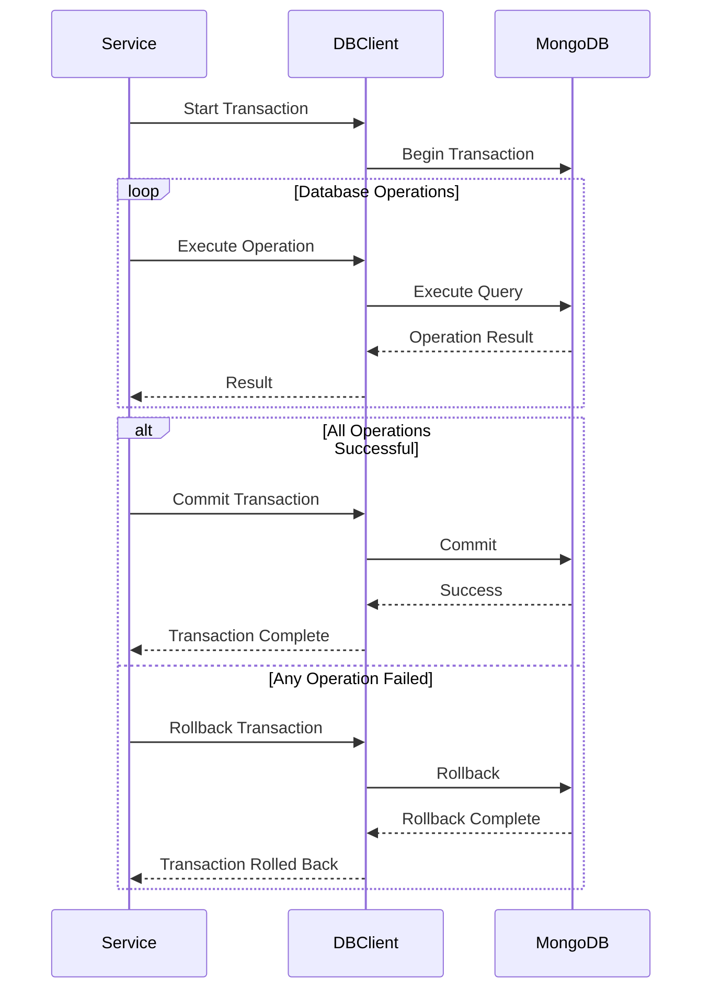

### 2.12 Logging Implementation

#### 2.12.1 Structured Logging

```go
var logger = securaalog.New("zona_custom")

func LogRequest(r *http.Request) {
    logger.Info("Request received",
        "method", r.Method,
        "url", r.URL.String(),
        "remote_addr", r.RemoteAddr,
        "user_agent", r.UserAgent(),
    )
}

func LogError(operation string, err error, context map[string]interface{}) {
    logger.Error("Operation failed",
        "operation", operation,
        "error", err.Error(),
        "context", context,
    )
}

func LogPerformance(operation string, duration time.Duration) {
    logger.Info("Operation completed",
        "operation", operation,
        "duration_ms", duration.Milliseconds(),
    )
}
```

#### 2.12.2 Log Levels & Categories

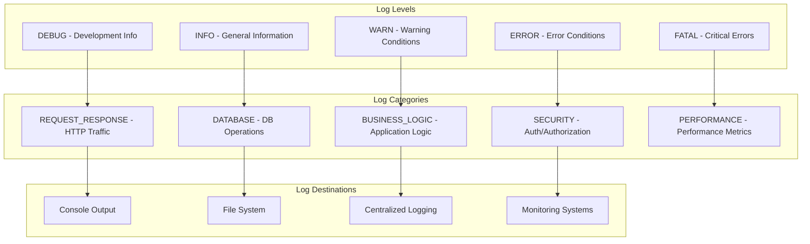

## 3. Performance Considerations

### 3.1 Optimization Strategies

#### 3.1.1 Database Query Optimization
- Use appropriate indexes on frequently queried fields
- Implement query result caching for read-heavy operations
- Use batch operations for bulk data manipulation
- Implement connection pooling for database efficiency

#### 3.1.2 Memory Management
- Implement proper cleanup of temporary objects
- Use connection pooling to avoid resource leaks
- Monitor goroutine lifecycle for concurrent operations
- Implement request timeout mechanisms

#### 3.1.3 Network Optimization
- Compress HTTP responses for large payloads
- Implement request/response caching
- Use HTTP/2 where supported
- Minimize JSON payload sizes

### 3.2 Scalability Considerations

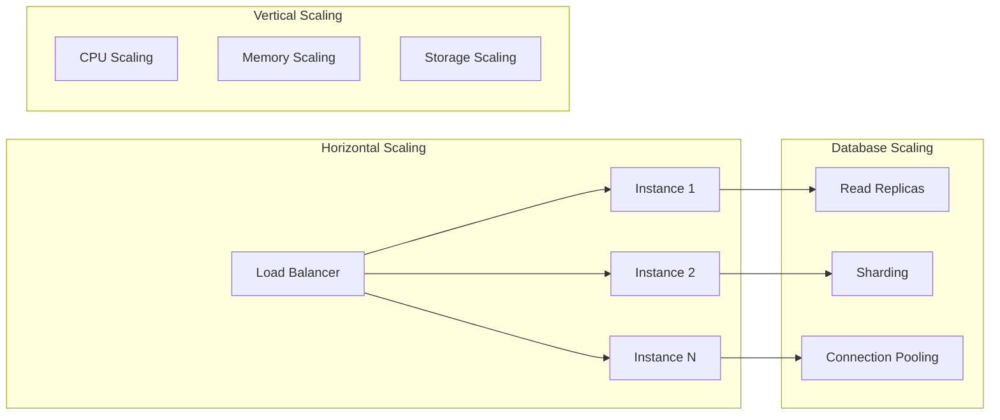

## 4. Testing Strategy

### 4.1 Unit Testing Structure

```go
func TestDeleteApp(t *testing.T) {
    // Arrange
    controller := NewCustomAppController()
    mockDBSession := createMockDBSession()
    mockConfig := createMockConfig()
    
    // Act
    response := controller.DeleteApp(nil, createMockRequest(), mockDBSession, mockConfig)
    
    // Assert
    assert.True(t, response.Success)
    assert.Equal(t, "App Deleted", response.DisplayMessage)
}
```

### 4.2 Integration Testing

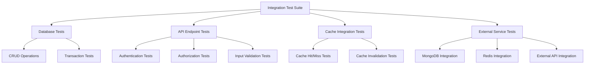

## 5. Security Implementation

### 5.1 Data Encryption

```go
func EncryptSensitiveFields(fields map[string]string, config config.ConfigStruct) (map[string]string, error) {
    encryptedFields := make(map[string]string)
    encryptionKey := config["zonaCredentialsEncryptDecryptKey"]
    
    for key, value := range fields {
        if isSensitiveField(key) {
            encryptedValue, err := utils.CredentialsEncrypt(value, encryptionKey)
            if err != nil {
                return nil, err
            }
            encryptedFields[key] = encryptedValue
        } else {
            encryptedFields[key] = value
        }
    }
    
    return encryptedFields, nil
}

func isSensitiveField(fieldName string) bool {
    sensitiveFields := []string{"password", "api_key", "secret", "token"}
    for _, sensitive := range sensitiveFields {
        if strings.Contains(strings.ToLower(fieldName), sensitive) {
            return true
        }
    }
    return false
}
```

### 5.2 Input Sanitization

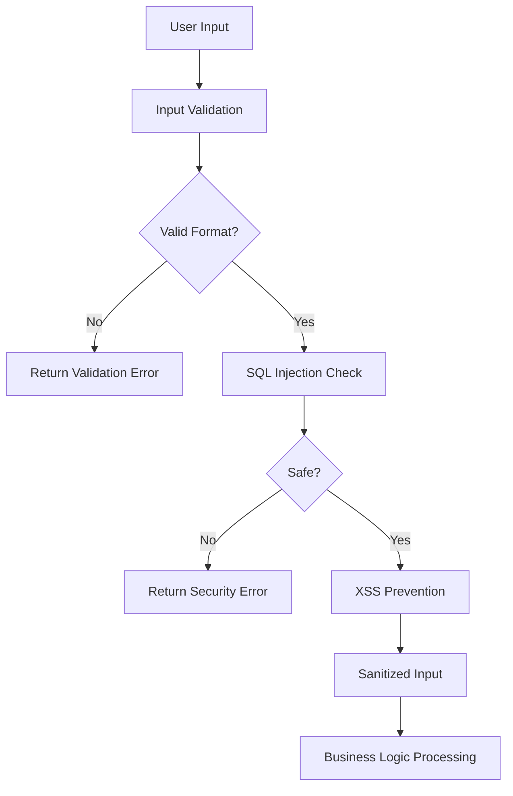

## 6. Deployment & Operations

### 6.1 Build Process

```makefile
# Build configuration from Makefile
build: builddir
	$(BUILD_ENV) go build -mod vendor $(BUILD_FLAGS) -o build/$(TARGET)

image_ecr: builddir
	DOCKER_BUILDKIT=1 docker build --pull \
	-t $(RUNTIME_DOCKER_IMAGE_ECR):latest \
	--build-arg TARGET=$(TARGET) \
	--build-arg GIT_REF=$(GIT_REF) \
	--build-arg BUILD_VERSION=$(BUILD_VERSION) .
```

### 6.2 Health Monitoring

```go
func HealthCheck() http.HandlerFunc {
    return func(w http.ResponseWriter, r *http.Request) {
        health := struct {
            Status    string `json:"status"`
            Database  string `json:"database"`
            Cache     string `json:"cache"`
            Version   string `json:"version"`
            Timestamp int64  `json:"timestamp"`
        }{
            Status:    "healthy",
            Database:  checkDatabaseHealth(),
            Cache:     checkCacheHealth(),
            Version:   BuildVersion,
            Timestamp: time.Now().Unix(),
        }
        
        w.Header().Set("Content-Type", "application/json")
        json.NewEncoder(w).Encode(health)
    }
}
```

This comprehensive Low-Level Design document provides detailed implementation specifications for the Securaa Custom Services application, covering all major components, data flows, and architectural decisions at the code level.