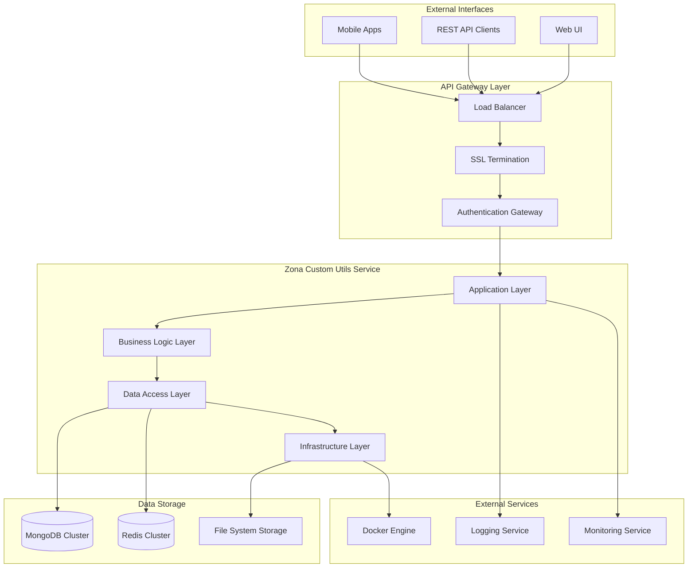
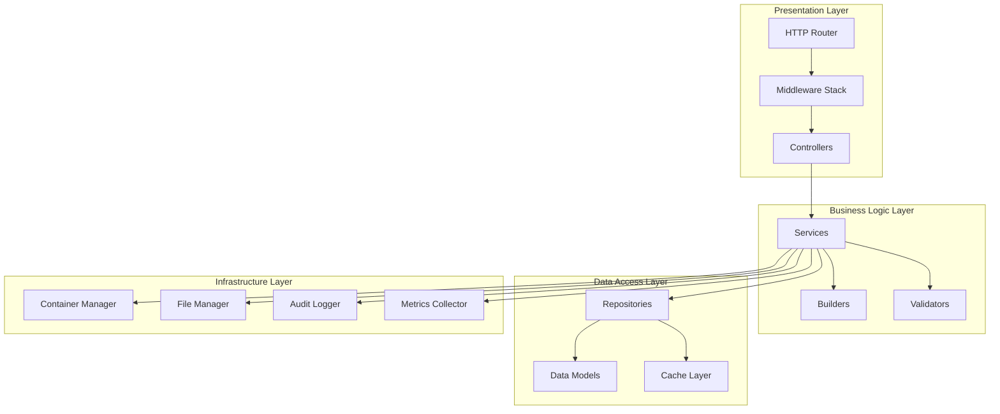
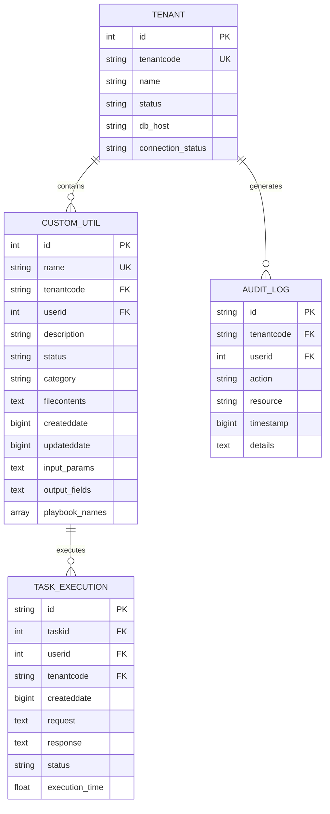
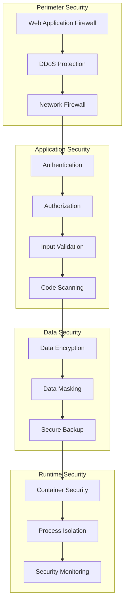
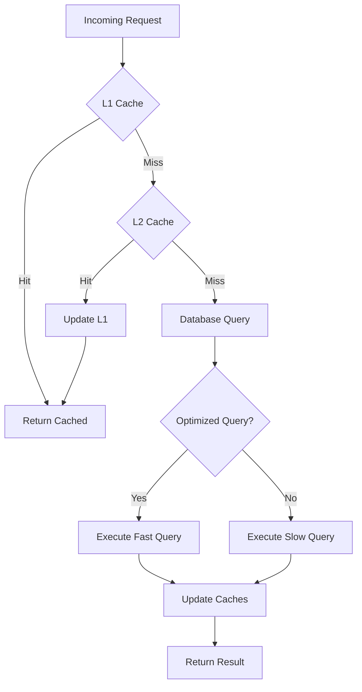
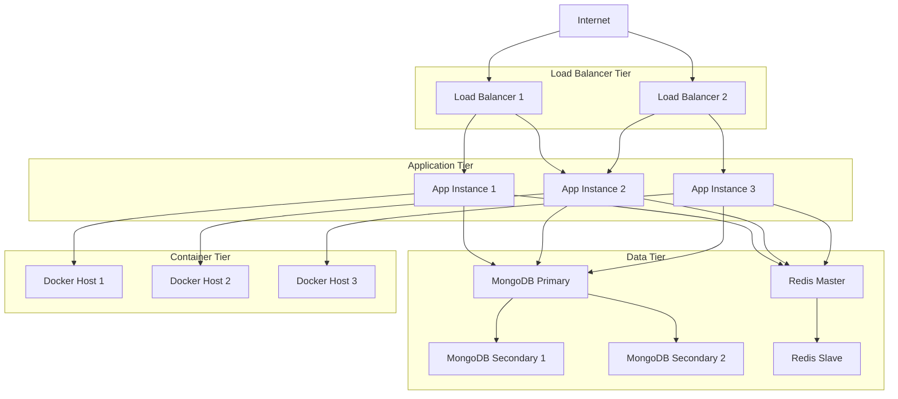
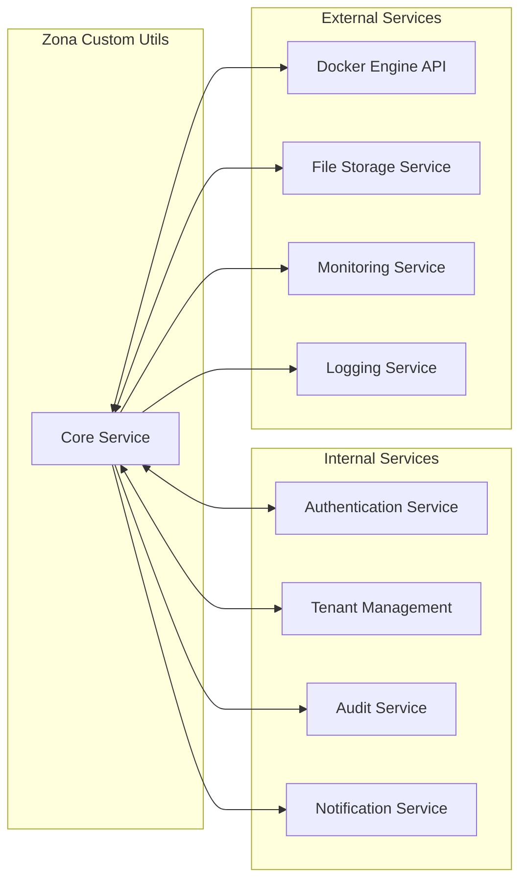
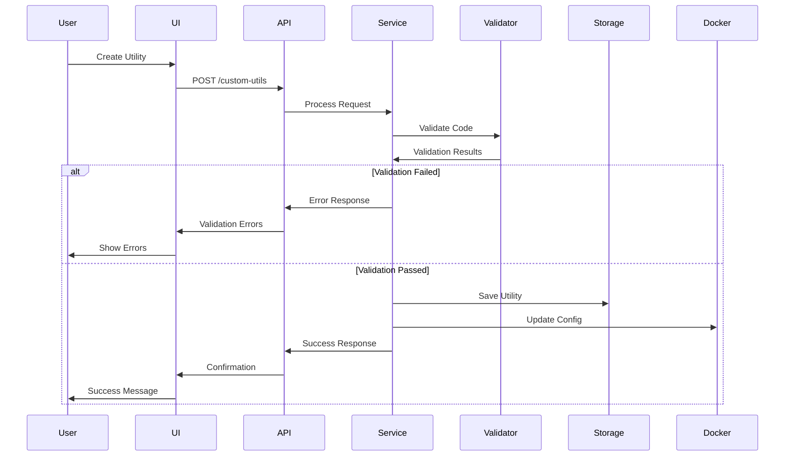
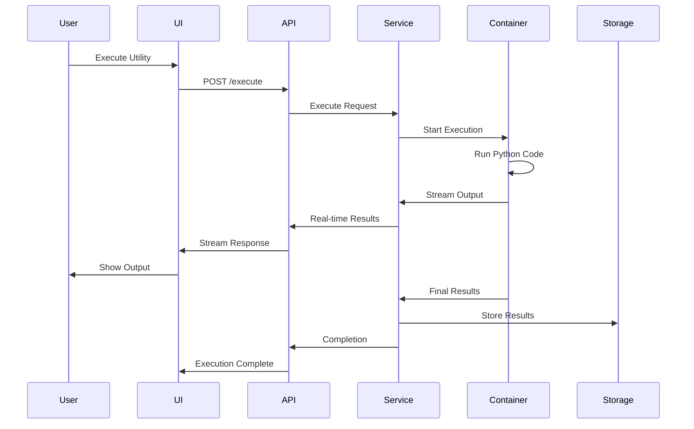
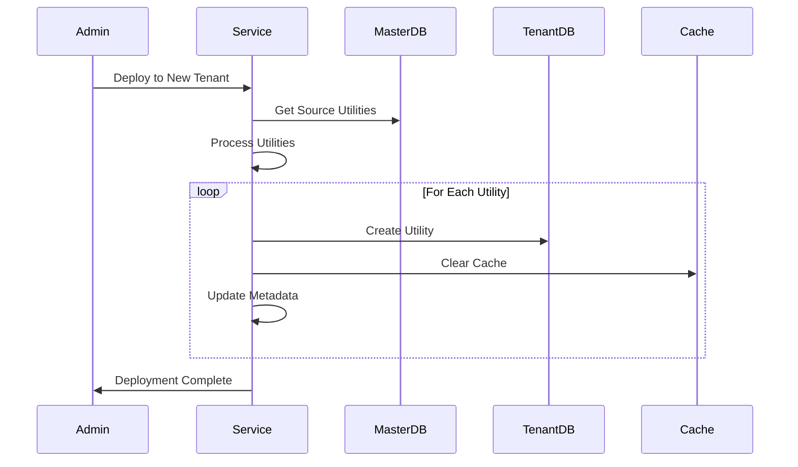

# Zona Custom Utils Service - High-Level Design (HLD)

## Table of Contents
1. [Executive Summary](#executive-summary)
2. [System Overview](#system-overview)
3. [Business Requirements](#business-requirements)
4. [Solution Architecture](#solution-architecture)
5. [Component Architecture](#component-architecture)
6. [Data Architecture](#data-architecture)
7. [Security Architecture](#security-architecture)
8. [Performance Architecture](#performance-architecture)
9. [Deployment Architecture](#deployment-architecture)
10. [Integration Architecture](#integration-architecture)
11. [Business Process Flows](#business-process-flows)
12. [Non-Functional Requirements](#non-functional-requirements)

## Executive Summary

The Zona Custom Utils Service is a microservice designed to enable users to create, manage, and execute custom utility functions in a secure, multi-tenant environment. The service supports Python-based transformers and scripts, providing isolated execution environments through containerization while maintaining comprehensive audit trails and performance optimization.

### Key Business Value
- **Extensibility**: Allows users to create custom data processing utilities
- **Security**: Provides secure code validation and isolated execution
- **Multi-tenancy**: Supports multiple tenants with data isolation
- **Scalability**: Designed for high-volume, concurrent operations
- **Compliance**: Comprehensive audit logging for regulatory requirements

### Solution Approach
- **Microservice Architecture**: Self-contained service with clear boundaries
- **Container-based Execution**: Docker containers for secure Python code execution
- **Multi-tier Caching**: Redis and in-memory caching for performance
- **Multi-tenant Data Model**: Isolated data storage per tenant
- **Event-driven Processing**: Asynchronous operations for non-critical tasks

## System Overview

### System Context
The Zona Custom Utils Service operates within a larger ecosystem of microservices, providing custom utility management capabilities. It integrates with:

- **Authentication Services**: For user authentication and authorization
- **Tenant Management**: For multi-tenant configuration and isolation
- **Container Orchestration**: For isolated execution environments
- **Monitoring Infrastructure**: For observability and alerting
- **Storage Services**: For persistent data and file management

## Business Requirements

### Functional Requirements

#### FR-001: Custom Utility Management
- Users must be able to create custom Python utilities
- System must validate Python syntax and security
- Users must be able to update existing utilities
- Users must be able to delete utilities they own
- System must maintain version history

#### FR-002: Code Validation and Security
- System must validate Python syntax before saving
- System must scan for prohibited code patterns
- System must prevent execution of malicious code
- System must provide detailed validation feedback

#### FR-003: Utility Execution
- Users must be able to execute their custom utilities
- System must provide real-time execution output
- System must support parameterized execution
- System must handle execution timeouts gracefully

#### FR-004: Multi-tenant Support
- System must isolate data between tenants
- System must support tenant-specific configurations
- System must enable cross-tenant utility copying
- System must maintain tenant-level audit trails

#### FR-005: Export/Import Functionality
- Users must be able to export utilities
- Users must be able to import utilities
- System must support bulk operations
- System must validate imported utilities

#### FR-006: Audit and Compliance
- System must log all user actions
- System must maintain execution history
- System must provide compliance reporting
- System must support data retention policies

### Non-Functional Requirements

#### NFR-001: Performance
- API response time < 500ms for read operations
- API response time < 2s for write operations
- System must support 1000+ concurrent users
- Utility execution timeout < 300 seconds

#### NFR-002: Scalability
- System must scale horizontally
- Must support 100+ tenants
- Must handle 10,000+ utilities per tenant
- Database must support sharding

#### NFR-003: Availability
- System uptime > 99.9%
- Recovery time < 5 minutes
- Data backup every 24 hours
- Multi-region disaster recovery

#### NFR-004: Security
- All data encrypted at rest and in transit
- Role-based access control
- Code execution in isolated environments
- Regular security audits

#### NFR-005: Usability
- Intuitive web interface
- Comprehensive API documentation
- Real-time feedback and validation
- Multi-language support

## Solution Architecture

### Architectural Principles
1. **Single Responsibility**: Each component has a well-defined purpose
2. **Loose Coupling**: Components interact through well-defined interfaces
3. **High Cohesion**: Related functionality is grouped together
4. **Separation of Concerns**: Clear boundaries between different aspects
5. **Fail-Safe Design**: Graceful degradation under failure conditions

### Architecture Patterns
- **Layered Architecture**: Clear separation between presentation, business, and data layers
- **Repository Pattern**: Abstracted data access layer
- **Builder Pattern**: Complex object construction
- **Middleware Pattern**: Cross-cutting concerns handling
- **Circuit Breaker**: Fault tolerance for external service calls

### Technology Decisions

#### Programming Language: Go
**Rationale**: 
- High performance and low latency
- Excellent concurrency support
- Strong ecosystem for microservices
- Easy deployment and maintenance

#### Database: MongoDB
**Rationale**:
- Document-based model fits utility metadata
- Horizontal scaling capabilities
- Rich querying capabilities
- Multi-tenant support

#### Cache: Redis
**Rationale**:
- High-performance in-memory storage
- Advanced data structures
- Pub/Sub capabilities
- Clustering support

#### Container Runtime: Docker
**Rationale**:
- Isolated execution environment
- Resource management
- Portability across environments
- Extensive ecosystem

## Component Architecture

### Component Responsibilities

#### Presentation Layer
- **HTTP Router**: Route incoming requests to appropriate controllers
- **Middleware Stack**: Handle authentication, logging, and cross-cutting concerns
- **Controllers**: Process HTTP requests and generate responses

#### Business Logic Layer
- **Services**: Implement core business logic and orchestrate operations
- **Builders**: Construct complex objects and configurations
- **Validators**: Validate input data and business rules

#### Data Access Layer
- **Repositories**: Abstract data access operations
- **Data Models**: Define data structures and relationships
- **Cache Layer**: Provide high-performance data access

#### Infrastructure Layer
- **Container Manager**: Manage Docker container lifecycle
- **File Manager**: Handle file system operations
- **Audit Logger**: Record audit trails and compliance data
- **Metrics Collector**: Gather performance and operational metrics

## Data Architecture

### Logical Data Model

### Data Storage Strategy

#### Primary Data Storage (MongoDB)
- **Collections**: Utilities, executions, audit logs, tenants
- **Sharding Strategy**: Shard by tenant code for horizontal scaling
- **Replica Sets**: 3-node replica sets for high availability
- **Backup Strategy**: Daily backups with point-in-time recovery

#### Cache Strategy (Redis)
- **L1 Cache**: Application-level caching (5 minutes TTL)
- **L2 Cache**: Redis caching (1 hour TTL)
- **Cache Keys**: Hierarchical naming convention
- **Eviction Policy**: LRU with memory limit enforcement

#### File Storage
- **Code Files**: Encrypted Python files on network storage
- **Logs**: Execution logs on distributed file system
- **Backups**: Compressed archives on object storage

### Data Security
- **Encryption at Rest**: AES-256 encryption for all stored data
- **Encryption in Transit**: TLS 1.3 for all network communication
- **Data Masking**: Sensitive data masked in logs and non-production environments
- **Access Control**: Role-based access with principle of least privilege

## Security Architecture

### Security Layers

### Authentication and Authorization

#### Authentication Flow
1. User provides credentials to authentication service
2. Authentication service validates credentials
3. JWT token issued with user claims and permissions
4. Token included in subsequent API requests
5. Service validates token and extracts user context

#### Authorization Model
- **Role-Based Access Control (RBAC)**
- **Tenant-based isolation**
- **Resource-level permissions**
- **Operation-level granularity**

#### Permission Matrix
| Role | Create Utils | Read Utils | Execute Utils | Delete Utils | Admin Functions |
|------|--------------|------------|---------------|--------------|-----------------|
| User | Own | Own | Own | No | No |
| Creator | Own | Own | Own | Own | No |
| Admin | All | All | All | All | Limited |
| Super Admin | All | All | All | All | All |

### Code Security

#### Validation Rules
- **Syntax Validation**: Python AST parsing
- **Security Scanning**: Pattern-based security checks
- **Dependency Analysis**: Package security assessment
- **Resource Limits**: Memory and CPU constraints

#### Prohibited Patterns
- File system access (`open()`, `file()`)
- Network operations (`socket`, `urllib`, `requests`)
- Process execution (`subprocess`, `os.system`)
- System imports (`os`, `sys`, `subprocess`)

## Performance Architecture

### Performance Strategy

### Performance Targets

#### Response Time Requirements
| Operation | Target | Maximum |
|-----------|--------|---------|
| Get Utility List | < 200ms | 500ms |
| Create Utility | < 1s | 2s |
| Validate Code | < 500ms | 1s |
| Execute Utility | < 10s | 300s |
| Export/Import | < 5s | 30s |

#### Throughput Requirements
| Metric | Target | Peak |
|--------|--------|------|
| Requests/Second | 1000 | 5000 |
| Concurrent Users | 100 | 500 |
| Utility Executions/Minute | 60 | 300 |

### Optimization Strategies

#### Database Optimization
- **Indexing Strategy**: Compound indexes for common query patterns
- **Query Optimization**: Aggregation pipelines for complex queries
- **Connection Pooling**: Reuse database connections
- **Read Replicas**: Distribute read load across replicas

#### Caching Strategy
- **Multi-level Caching**: Application, Redis, and database caching
- **Cache Warming**: Pre-populate frequently accessed data
- **Cache Invalidation**: Event-driven cache updates
- **Cache Partitioning**: Distribute cache load

#### Application Optimization
- **Goroutine Pooling**: Reuse goroutines for concurrent operations
- **Memory Management**: Efficient memory allocation and garbage collection
- **Compression**: Compress large responses
- **Connection Reuse**: HTTP connection pooling

## Deployment Architecture

### Production Environment

### Deployment Strategy
- **Blue-Green Deployment**: Zero-downtime deployments
- **Rolling Updates**: Gradual rollout of new versions
- **Canary Releases**: Limited exposure testing
- **Automated Rollback**: Quick recovery from failed deployments

### Environment Management
- **Development**: Single instance for development and testing
- **Staging**: Production-like environment for validation
- **Production**: High-availability multi-instance deployment
- **Disaster Recovery**: Secondary region for business continuity

## Integration Architecture

### External Service Integration

### Integration Patterns

#### Synchronous Integration
- **REST API**: For real-time operations requiring immediate response
- **Direct Database Access**: For high-performance data operations
- **File System Access**: For code storage and retrieval

#### Asynchronous Integration
- **Event Publishing**: For audit logging and notifications
- **Message Queues**: For long-running operations
- **Batch Processing**: For bulk operations and maintenance tasks

## Business Process Flows

### Custom Utility Creation Flow

### Utility Execution Flow

### Multi-Tenant Deployment Flow

## Non-Functional Requirements

### Availability Requirements
- **Uptime Target**: 99.9% (8.76 hours downtime per year)
- **Planned Maintenance**: Maximum 4 hours per month
- **Recovery Time Objective (RTO)**: 15 minutes
- **Recovery Point Objective (RPO)**: 1 hour

### Scalability Requirements
- **Horizontal Scaling**: Auto-scaling based on load
- **Vertical Scaling**: Resource scaling for individual instances
- **Database Scaling**: Sharding and read replicas
- **Cache Scaling**: Redis clustering for distributed caching

### Reliability Requirements
- **Mean Time Between Failures (MTBF)**: > 720 hours
- **Mean Time To Recovery (MTTR)**: < 15 minutes
- **Error Rate**: < 0.1% for API requests
- **Data Consistency**: Eventual consistency for non-critical data

### Maintainability Requirements
- **Code Coverage**: > 80% for unit tests
- **Documentation**: Comprehensive API and architecture documentation
- **Monitoring**: Full observability with metrics, logs, and traces
- **Deployment**: Automated CI/CD pipeline with rollback capability

### Compliance Requirements
- **Data Privacy**: GDPR and CCPA compliance
- **Security Standards**: SOC 2 Type II certification
- **Audit Logging**: Complete audit trail for all operations
- **Data Retention**: Configurable retention policies per tenant

---

*This High-Level Design document provides a comprehensive overview of the Zona Custom Utils Service architecture, focusing on business requirements, solution approach, and architectural decisions. It serves as a foundation for detailed technical implementation and stakeholder communication.*