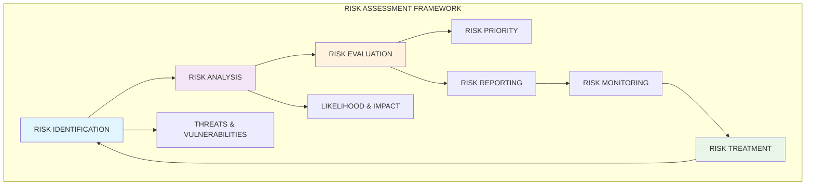
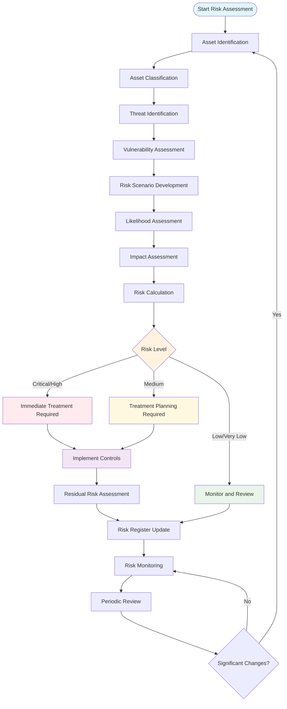
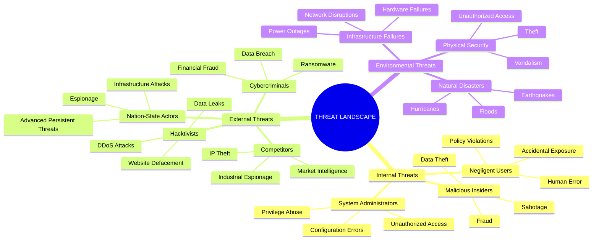
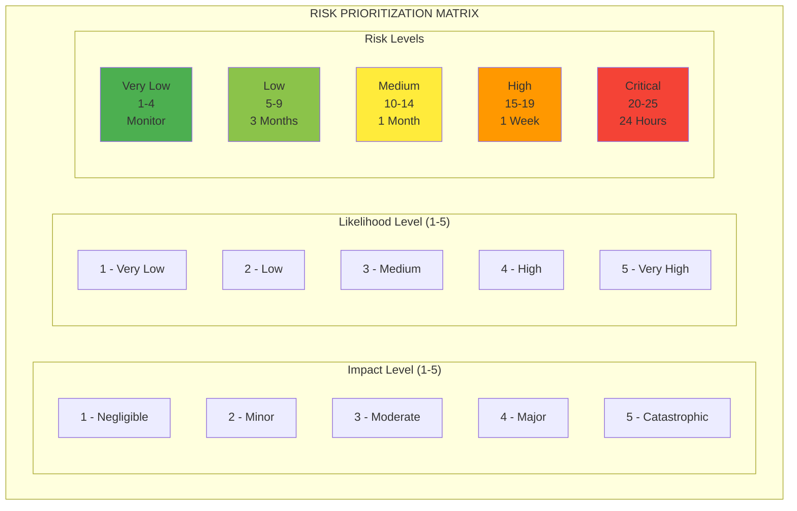
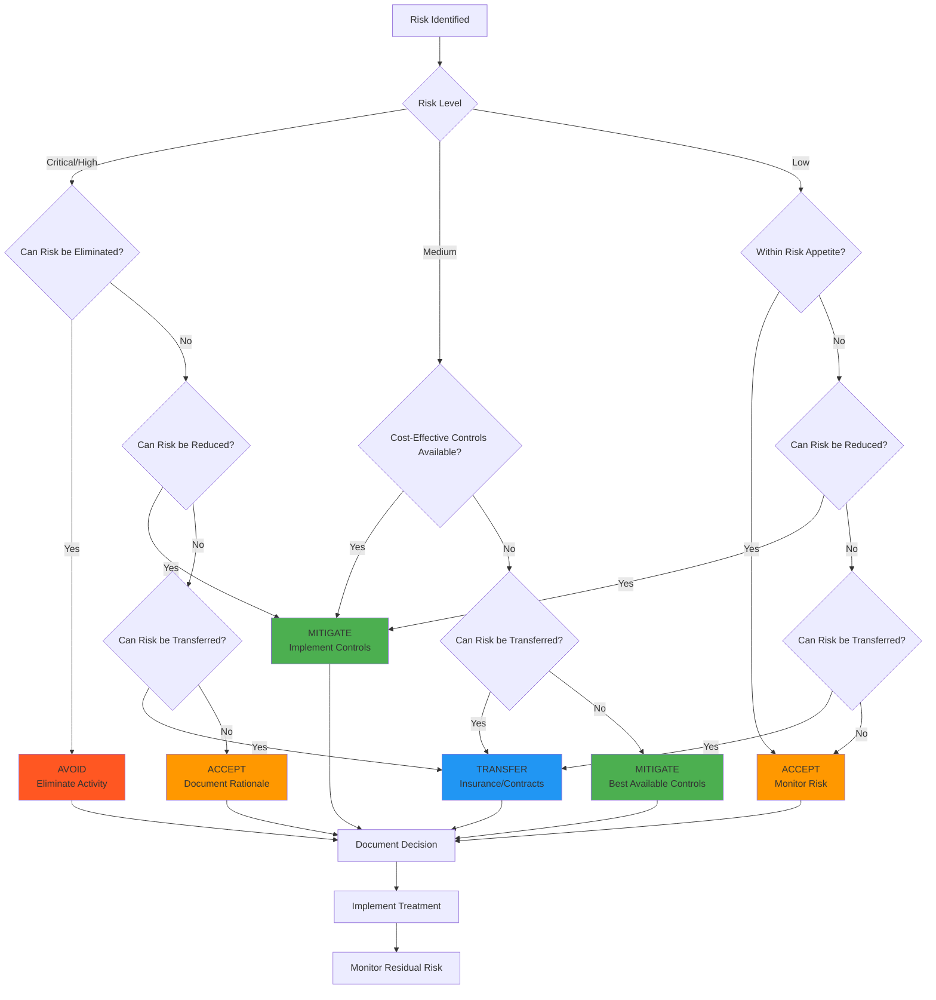
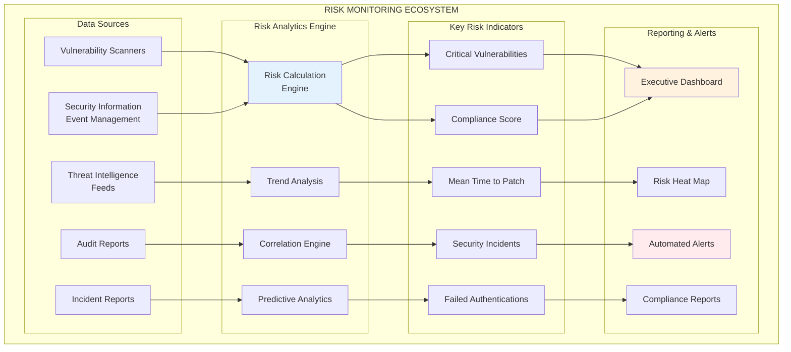
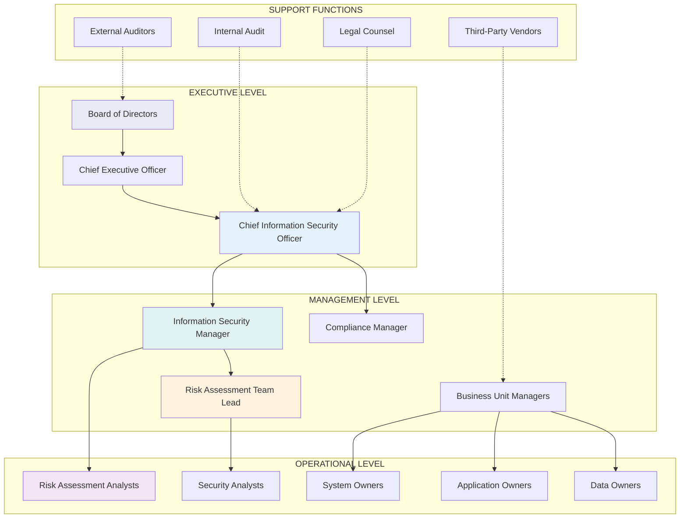
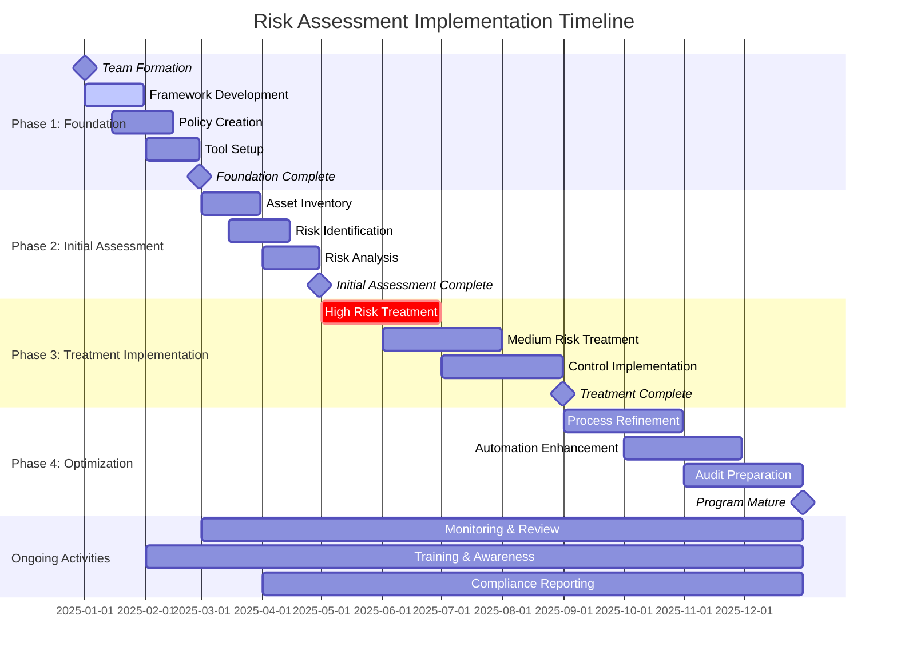

# SECURAA Information Security Risk Assessment Process
## Documented and Approved Risk Assessment Framework

---

## Document Control

| **Document Title** | Information Security Risk Assessment Process |
|-------------------|---------------------------------------------|
| **Document ID** | SECURAA-ISRA-001 |
| **Version** | 1.0 |
| **Effective Date** | October 2025 |
| **Next Review** | October 2026 |
| **Owner** | Information Security Team |
| **Approved By** | Chief Information Security Officer |
| **Classification** | Internal Use |

---

## Table of Contents

1. [Executive Summary](#executive-summary)
2. [Purpose and Scope](#purpose-and-scope)
3. [Risk Assessment Framework](#risk-assessment-framework)
4. [Risk Assessment Methodology](#risk-assessment-methodology)
5. [Risk Identification Process](#risk-identification-process)
6. [Risk Analysis and Evaluation](#risk-analysis-and-evaluation)
7. [Risk Treatment and Mitigation](#risk-treatment-and-mitigation)
8. [Risk Monitoring and Review](#risk-monitoring-and-review)
9. [Roles and Responsibilities](#roles-and-responsibilities)
10. [Risk Assessment Templates](#risk-assessment-templates)
11. [Implementation Guidelines](#implementation-guidelines)
12. [Compliance and Audit Requirements](#compliance-and-audit-requirements)

---

## Executive Summary

This document establishes the formal Information Security Risk Assessment process for SECURAA, ensuring systematic identification, analysis, evaluation, and treatment of information security risks across all organizational assets, systems, and processes.

The risk assessment process is designed to:
- Provide a consistent, repeatable approach to identifying and managing security risks
- Enable informed decision-making regarding risk treatment options
- Support compliance with regulatory requirements and industry standards
- Facilitate continuous improvement of the organization's security posture

### Key Process Elements

- **Risk Identification**: Systematic discovery of threats, vulnerabilities, and potential impacts
- **Risk Analysis**: Qualitative and quantitative assessment of likelihood and impact
- **Risk Evaluation**: Determination of risk acceptance criteria and treatment priorities
- **Risk Treatment**: Implementation of controls and mitigation strategies
- **Risk Monitoring**: Ongoing assessment and review of risk landscape changes

---

## Purpose and Scope

### Purpose

This Information Security Risk Assessment process serves to:

1. **Establish** a standardized methodology for identifying, analyzing, and treating information security risks
2. **Ensure** consistent risk assessment practices across all SECURAA systems and operations
3. **Provide** decision-makers with accurate risk information for informed security investments
4. **Support** compliance with ISO 27001, SOC 2, NIST Framework, and other regulatory requirements
5. **Enable** proactive risk management and incident prevention
6. **Facilitate** continuous improvement of security controls and processes

### Scope

This process applies to:

#### In Scope
- All SECURAA information systems and applications
- Cloud infrastructure and services (AWS, Azure, etc.)
- Network infrastructure and communications
- Physical facilities and access controls
- Human resources and personnel security
- Third-party services and vendor relationships
- Data processing and storage systems
- Business processes involving information assets

#### Out of Scope
- Financial risk assessments (covered by Finance team)
- Operational risk assessments (covered by Operations team)
- Strategic business risks (covered by Executive team)
- Legal and regulatory compliance risks (covered by Legal team)

---

## Risk Assessment Framework

### Risk Assessment Model

SECURAA utilizes a comprehensive risk assessment framework based on industry best practices:

### Risk Categories

Information security risks are categorized into the following areas:

#### 1. Technical Risks
- **Application Security**: Code vulnerabilities, insecure configurations
- **Infrastructure Security**: Network vulnerabilities, system hardening
- **Data Security**: Encryption failures, data leakage
- **Access Control**: Authentication bypass, privilege escalation

#### 2. Operational Risks
- **Process Failures**: Inadequate procedures, human error
- **Change Management**: Unauthorized changes, configuration drift
- **Incident Response**: Delayed detection, inadequate response
- **Business Continuity**: Service disruption, disaster recovery

#### 3. Compliance Risks
- **Regulatory Non-compliance**: GDPR, SOC 2, ISO 27001 violations
- **Contractual Violations**: SLA breaches, customer requirements
- **Industry Standards**: PCI DSS, HIPAA, sector-specific requirements
- **Internal Policy**: Deviation from approved procedures

#### 4. External Risks
- **Cyber Threats**: Advanced persistent threats, ransomware
- **Vendor Risks**: Third-party security failures, supply chain attacks
- **Environmental**: Natural disasters, facility security
- **Economic**: Market conditions affecting security investments

---

## Risk Assessment Methodology

### Risk Assessment Approach

SECURAA employs a hybrid approach combining qualitative and quantitative risk assessment methods:

#### Qualitative Assessment
- Descriptive risk scenarios and impact analysis
- Expert judgment and stakeholder consultation
- Risk matrices for likelihood and impact scoring
- Suitable for strategic and operational risks

#### Quantitative Assessment
- Mathematical models and statistical analysis
- Asset valuation and loss calculations
- Annualized Loss Expectancy (ALE) calculations
- Suitable for financial and technical risks

### Risk Calculation Formula

**Risk Level = Likelihood × Impact × Asset Value × Threat Capability**

Where:
- **Likelihood**: Probability of threat occurrence (1-5 scale)
- **Impact**: Consequence severity if risk materializes (1-5 scale)
- **Asset Value**: Criticality and value of affected assets (1-5 scale)
- **Threat Capability**: Sophistication and resources of threat actor (1-5 scale)

### Risk Scoring Matrix

| Risk Score | Risk Level | Description | Action Required |
|------------|------------|-------------|-----------------|
| 81-100 | **Critical** | Immediate threat to business operations | Immediate action within 24 hours |
| 61-80 | **High** | Significant risk requiring prompt attention | Action within 1 week |
| 41-60 | **Medium** | Moderate risk requiring planned response | Action within 1 month |
| 21-40 | **Low** | Minor risk with acceptable impact | Action within 3 months |
| 1-20 | **Very Low** | Minimal risk with negligible impact | Monitor and review quarterly |

---

## Risk Identification Process

### Asset Inventory and Classification

#### Step 1: Asset Identification
Maintain comprehensive inventory of all information assets:

**Information Assets:**
- Customer data and personally identifiable information (PII)
- Intellectual property and trade secrets
- Financial records and business intelligence
- System configurations and security credentials
- Source code and technical documentation

**Technology Assets:**
- Servers, workstations, and mobile devices
- Network infrastructure and security appliances
- Cloud services and virtual environments
- Applications and software licenses
- Backup systems and disaster recovery resources

**Process Assets:**
- Business processes and workflows
- Security procedures and policies
- Change management processes
- Incident response procedures
- Training and awareness programs

#### Step 2: Asset Classification
Classify assets based on confidentiality, integrity, and availability requirements:

| Classification | Confidentiality | Integrity | Availability | Examples |
|----------------|----------------|-----------|--------------|----------|
| **Critical** | Highly sensitive | Mission critical | 99.9% uptime | Customer PII, payment data |
| **High** | Sensitive | Important | 99% uptime | Business intelligence, source code |
| **Medium** | Internal use | Standard | 95% uptime | Internal documentation, logs |
| **Low** | Public | Non-critical | 90% uptime | Marketing materials, public info |

### Threat Identification

#### Comprehensive Threat Landscape

#### Internal Threats
- **Malicious Insiders**: Employees with unauthorized access or malicious intent
- **Negligent Users**: Accidental data exposure or security policy violations
- **System Administrators**: Privileged access abuse or configuration errors
- **Contractors**: Third-party personnel with system access

#### External Threats
- **Cybercriminals**: Financially motivated threat actors
- **Nation-State Actors**: Advanced persistent threats (APTs)
- **Hacktivists**: Ideologically motivated attackers
- **Competitors**: Industrial espionage and competitive intelligence
- **Script Kiddies**: Opportunistic attackers using automated tools

#### Environmental Threats
- **Natural Disasters**: Earthquakes, floods, hurricanes
- **Infrastructure Failures**: Power outages, network disruptions
- **Physical Security**: Unauthorized facility access, theft
- **Supply Chain**: Hardware/software tampering, vendor compromises

### Vulnerability Assessment

#### Technical Vulnerabilities
- **Software Vulnerabilities**: Unpatched systems, zero-day exploits
- **Configuration Weaknesses**: Default passwords, unnecessary services
- **Network Security**: Unencrypted communications, weak protocols
- **Access Controls**: Weak authentication, excessive privileges

#### Process Vulnerabilities
- **Inadequate Procedures**: Missing or outdated security policies
- **Training Gaps**: Insufficient security awareness and education
- **Change Management**: Unauthorized modifications, inadequate testing
- **Incident Response**: Delayed detection, poor communication

#### Physical Vulnerabilities
- **Facility Security**: Inadequate access controls, surveillance gaps
- **Environmental Controls**: Temperature, humidity, fire suppression
- **Equipment Security**: Unattended systems, removable media
- **Disposal Procedures**: Inadequate data destruction, equipment recycling

---

## Risk Analysis and Evaluation

### Likelihood Assessment

Evaluate the probability of each identified risk scenario:

#### Likelihood Criteria

| Level | Score | Description | Frequency |
|-------|-------|-------------|-----------|
| **Very High** | 5 | Almost certain to occur | Multiple times per year |
| **High** | 4 | Likely to occur | Once per year |
| **Medium** | 3 | Possible occurrence | Once every 2-3 years |
| **Low** | 2 | Unlikely to occur | Once every 4-5 years |
| **Very Low** | 1 | Rare occurrence | Once every 6+ years |

#### Factors Influencing Likelihood
- **Threat Actor Motivation**: Financial gain, espionage, disruption
- **Threat Actor Capability**: Skills, resources, access
- **Vulnerability Exploitability**: Ease of exploitation, available tools
- **Current Control Effectiveness**: Strength of existing safeguards
- **Historical Data**: Previous incidents, industry trends

### Impact Assessment

Evaluate the potential consequences if the risk materializes:

#### Impact Criteria

| Level | Score | Financial Impact | Operational Impact | Reputational Impact |
|-------|-------|------------------|-------------------|-------------------|
| **Catastrophic** | 5 | >$1M loss | Complete service failure | Severe brand damage |
| **Major** | 4 | $100K-$1M loss | Significant disruption | Major reputation impact |
| **Moderate** | 3 | $10K-$100K loss | Moderate disruption | Notable reputation impact |
| **Minor** | 2 | $1K-$10K loss | Minor disruption | Limited reputation impact |
| **Negligible** | 1 | <$1K loss | Minimal disruption | No reputation impact |

#### Impact Categories

**Financial Impact:**
- Direct monetary losses from incidents
- Regulatory fines and legal costs
- Recovery and remediation expenses
- Lost revenue and business opportunities

**Operational Impact:**
- Service disruption and downtime
- Data loss or corruption
- Process inefficiencies
- Resource allocation for incident response

**Compliance Impact:**
- Regulatory violations and sanctions
- Audit findings and corrective actions
- Certification revocation or suspension
- Legal liability and litigation

**Reputational Impact:**
- Customer trust and confidence loss
- Media coverage and public perception
- Competitive disadvantage
- Stakeholder relationship damage

### Risk Evaluation Process

#### Risk Acceptance Criteria

Establish clear criteria for risk acceptance decisions:

**Acceptable Risks:**
- Low probability, low impact risks
- Risks with adequate controls in place
- Residual risks after treatment
- Risks within organizational risk appetite

**Unacceptable Risks:**
- High probability, high impact risks
- Risks exceeding regulatory requirements
- Risks threatening business continuity
- Risks beyond organizational risk tolerance

#### Risk Prioritization Matrix

---

## Risk Treatment and Mitigation

### Risk Treatment Options

#### Risk Treatment Decision Framework

#### 1. Risk Mitigation (Reduce)
Implement controls to reduce likelihood or impact:

**Preventive Controls:**
- Access controls and authentication systems
- Encryption and data protection measures
- Network security and firewalls
- Security awareness training

**Detective Controls:**
- Monitoring and logging systems
- Intrusion detection and prevention
- Vulnerability scanning and assessment
- Security audits and reviews

**Corrective Controls:**
- Incident response procedures
- Backup and recovery systems
- Patch management processes
- Business continuity plans

#### 2. Risk Transfer (Share)
Transfer risk to third parties:

**Insurance:**
- Cyber liability insurance
- Errors and omissions coverage
- Business interruption insurance
- Directors and officers coverage

**Contractual Transfer:**
- Service level agreements with vendors
- Indemnification clauses
- Limitation of liability provisions
- Performance bonds and guarantees

#### 3. Risk Avoidance (Eliminate)
Eliminate activities that create unacceptable risks:

**Technology Decisions:**
- Avoid unsupported software and systems
- Eliminate unnecessary services and protocols
- Discontinue high-risk business activities
- Reject vendor relationships with poor security

#### 4. Risk Acceptance (Retain)
Accept risks that are within organizational tolerance:

**Acceptance Criteria:**
- Low probability and low impact risks
- Risks where treatment cost exceeds benefit
- Residual risks after implementing controls
- Strategic risks necessary for business objectives

### Control Implementation Framework

#### Control Selection Process

1. **Identify Applicable Controls**: Review regulatory requirements and best practices
2. **Assess Control Effectiveness**: Evaluate potential risk reduction
3. **Analyze Cost-Benefit**: Compare implementation costs to risk reduction benefits
4. **Consider Feasibility**: Assess technical and operational feasibility
5. **Select Optimal Controls**: Choose controls that provide best risk/cost ratio

#### Control Categories

**Administrative Controls:**
- Policies and procedures
- Training and awareness programs
- Background checks and clearances
- Segregation of duties

**Technical Controls:**
- Access control systems
- Encryption and cryptography
- Network security appliances
- Monitoring and logging tools

**Physical Controls:**
- Facility access controls
- Environmental monitoring
- Equipment security
- Media protection

### Risk Treatment Plan Template

#### Risk Treatment Plan Components

| Component | Description | Requirements |
|-----------|-------------|--------------|
| **Risk ID** | Unique risk identifier | Format: RISK-YYYY-###
| **Risk Description** | Detailed risk scenario | Clear, concise description |
| **Risk Owner** | Responsible individual | Named person with authority |
| **Current Risk Level** | Pre-treatment risk score | Likelihood × Impact rating |
| **Target Risk Level** | Post-treatment risk score | Acceptable residual risk |
| **Treatment Option** | Selected risk response | Mitigate/Transfer/Avoid/Accept |
| **Control Measures** | Specific controls to implement | Detailed control descriptions |
| **Implementation Timeline** | Project schedule and milestones | Start/end dates, dependencies |
| **Resource Requirements** | Budget and personnel needs | Cost estimates, FTE requirements |
| **Success Criteria** | Measurable outcomes | Specific, measurable indicators |
| **Monitoring Plan** | Ongoing assessment approach | Frequency, methods, reporting |

---

## Risk Monitoring and Review

### Continuous Risk Monitoring

#### Risk Monitoring Dashboard Framework

#### Monitoring Objectives
- Track changes in risk landscape and threat environment
- Assess effectiveness of implemented risk treatments
- Identify new risks and emerging threats
- Validate risk assessment assumptions and methodologies
- Support risk-based decision making

#### Key Risk Indicators (KRIs)

**Technical KRIs:**
- Number of critical vulnerabilities detected
- Mean time to patch deployment
- Security incident frequency and severity
- Failed authentication attempts
- Data loss prevention alerts

**Operational KRIs:**
- Policy compliance violations
- Training completion rates
- Audit finding severity and frequency
- Vendor security assessment scores
- Business continuity test results

**Strategic KRIs:**
- Regulatory compliance status
- Customer security complaints
- Security investment as percentage of IT budget
- Third-party risk assessment results
- Security certification maintenance status

### Risk Review Process

#### Periodic Risk Reviews

**Quarterly Reviews:**
- Update risk registers with new risks and changes
- Assess progress on risk treatment plans
- Review key risk indicator trends
- Evaluate control effectiveness
- Report to executive management

**Annual Reviews:**
- Comprehensive risk assessment update
- Risk methodology and criteria review
- Risk appetite and tolerance evaluation
- Stakeholder consultation and feedback
- Risk management program effectiveness assessment

#### Triggered Reviews

Risk assessments must be conducted when:
- Significant organizational changes occur
- New systems or technologies are implemented
- Major security incidents are experienced
- Regulatory requirements change
- Business strategy or objectives shift

#### Risk Reporting Framework

**Executive Dashboard:**
- Risk heat map with top 10 risks
- Key risk indicator trends
- Risk treatment progress summary
- Regulatory compliance status
- Investment recommendations

**Management Reports:**
- Detailed risk register updates
- Control implementation status
- Incident impact on risk profile
- Resource allocation requests
- Training and awareness metrics

**Operational Reports:**
- Daily security monitoring summaries
- Weekly vulnerability assessment results
- Monthly compliance checking reports
- Quarterly risk assessment updates
- Annual risk management review

---

## Roles and Responsibilities

### Risk Assessment Team Structure

#### Organizational Risk Management Hierarchy

#### Chief Information Security Officer (CISO)
**Primary Responsibilities:**
- Overall accountability for risk management program
- Risk appetite and tolerance determination
- Risk treatment decision approval
- Resource allocation for risk management activities
- Board and executive reporting

**Specific Duties:**
- Approve risk assessment methodology and procedures
- Review and approve significant risk treatment plans
- Oversee risk management program effectiveness
- Ensure regulatory compliance and audit readiness
- Champion risk-aware culture throughout organization

#### Information Security Manager
**Primary Responsibilities:**
- Day-to-day risk management program operation
- Risk assessment coordination and facilitation
- Risk register maintenance and updates
- Treatment plan implementation oversight
- Training and awareness program management

**Specific Duties:**
- Conduct regular risk assessments and reviews
- Maintain comprehensive risk documentation
- Coordinate cross-functional risk activities
- Monitor and report on risk treatment progress
- Develop risk management policies and procedures

#### Risk Assessment Analysts
**Primary Responsibilities:**
- Technical risk analysis and evaluation
- Threat and vulnerability research
- Risk modeling and quantification
- Control effectiveness assessment
- Risk monitoring and reporting

**Specific Duties:**
- Perform detailed risk assessments and analysis
- Research emerging threats and vulnerabilities
- Develop and maintain risk assessment tools
- Support business units with risk evaluation
- Prepare risk reports and presentations

#### System and Application Owners
**Primary Responsibilities:**
- Asset identification and classification
- Risk identification within their domains
- Risk treatment implementation
- Ongoing risk monitoring and reporting
- Compliance with security policies

**Specific Duties:**
- Maintain accurate asset inventories
- Report security incidents and vulnerabilities
- Implement approved risk treatments
- Participate in risk assessment activities
- Ensure proper change management procedures

#### Business Unit Managers
**Primary Responsibilities:**
- Business risk context and impact assessment
- Resource provision for risk treatment
- Risk acceptance decisions within authority
- Risk awareness promotion within units
- Business continuity planning

**Specific Duties:**
- Identify business risks and requirements
- Support risk assessment activities
- Approve risk treatment plans for their areas
- Ensure staff compliance with security policies
- Report significant changes affecting risk profile

### Training and Competency Requirements

#### Risk Assessment Training Program

**Foundation Training (All Staff):**
- Information security awareness
- Risk management concepts
- Incident reporting procedures
- Policy and procedure overview
- 4 hours annually, completion tracking

**Specialized Training (Risk Team):**
- Risk assessment methodologies
- Threat analysis techniques
- Control evaluation methods
- Risk modeling and quantification
- 40 hours annually, certification required

**Leadership Training (Management):**
- Risk governance and oversight
- Risk-based decision making
- Regulatory compliance requirements
- Business continuity planning
- 16 hours annually, assessment required

---

## Risk Assessment Templates

### Risk Register Template

#### Risk Identification Template

| Field | Description | Example |
|-------|-------------|---------|
| **Risk ID** | Unique identifier | RISK-2025-001 |
| **Risk Title** | Brief descriptive name | Unauthorized Data Access |
| **Risk Category** | Primary risk type | Technical |
| **Asset(s) Affected** | Impacted systems/data | Customer Database |
| **Threat Source** | Origin of threat | External Attacker |
| **Vulnerability** | Exploitable weakness | Weak Authentication |
| **Risk Scenario** | Detailed description | External attacker exploits weak authentication to access customer database |
| **Likelihood** | Probability (1-5) | 3 - Possible |
| **Impact** | Consequence (1-5) | 4 - Major |
| **Risk Score** | Likelihood × Impact | 12 - Medium |
| **Risk Owner** | Responsible party | IT Security Manager |
| **Date Identified** | Discovery date | 2025-01-15 |
| **Status** | Current state | Active |

#### Risk Treatment Template

| Field | Description | Example |
|-------|-------------|---------|
| **Treatment Option** | Selected response | Mitigate |
| **Control Measures** | Specific controls | Multi-factor authentication, account lockout |
| **Implementation Date** | Target completion | 2025-03-01 |
| **Resource Requirements** | Budget/personnel | $25,000, 2 FTE months |
| **Success Criteria** | Measurable outcomes | 99% MFA adoption, <0.1% failed login rate |
| **Residual Risk** | Post-treatment risk | 6 - Low |
| **Monitoring Plan** | Ongoing assessment | Monthly authentication reports |
| **Review Date** | Next assessment | 2025-06-01 |

### Risk Assessment Questionnaire

#### Technical Risk Assessment Questions

**Application Security:**
1. Are all applications regularly tested for security vulnerabilities?
2. Is secure coding training provided to development teams?
3. Are code reviews conducted before production deployment?
4. Is input validation implemented for all user inputs?
5. Are authentication and authorization controls properly implemented?

**Infrastructure Security:**
1. Are all systems regularly patched and updated?
2. Is network traffic encrypted in transit?
3. Are firewalls and intrusion detection systems deployed?
4. Is network segmentation implemented for critical systems?
5. Are system configurations hardened according to standards?

**Data Security:**
1. Is sensitive data encrypted at rest and in transit?
2. Are data classification and handling procedures implemented?
3. Is data loss prevention technology deployed?
4. Are backup and recovery procedures tested regularly?
5. Is secure data disposal practiced for end-of-life media?

#### Operational Risk Assessment Questions

**Process Controls:**
1. Are security policies and procedures documented and current?
2. Is segregation of duties implemented for critical processes?
3. Are change management procedures followed consistently?
4. Is incident response capability tested and maintained?
5. Are vendor security requirements defined and enforced?

**Human Resources:**
1. Are background checks conducted for all personnel?
2. Is security awareness training provided regularly?
3. Are user access rights reviewed and updated promptly?
4. Is privileged access monitored and controlled?
5. Are termination procedures followed for departing employees?

---

## Implementation Guidelines

### Risk Assessment Implementation Roadmap

#### 12-Month Implementation Timeline

#### Phase 1: Foundation (Months 1-2)
**Objectives:**
- Establish risk assessment framework and methodology
- Define roles, responsibilities, and governance structure
- Develop initial policies and procedures
- Set up risk register and tracking systems

**Key Activities:**
- Form risk assessment team and assign responsibilities
- Develop risk assessment methodology and criteria
- Create risk register template and tracking system
- Conduct initial asset inventory and classification
- Provide foundation training to key personnel

**Deliverables:**
- Risk assessment policy and procedures
- Risk register template and system
- Asset inventory and classification
- Team charter and responsibilities
- Training completion records

#### Phase 2: Initial Assessment (Months 3-4)
**Objectives:**
- Conduct comprehensive baseline risk assessment
- Identify and document all significant risks
- Prioritize risks and develop treatment plans
- Establish monitoring and reporting processes

**Key Activities:**
- Perform enterprise-wide risk identification
- Conduct threat and vulnerability assessments
- Analyze and evaluate identified risks
- Develop initial risk treatment plans
- Implement risk monitoring and reporting

**Deliverables:**
- Complete risk register with all identified risks
- Risk analysis and evaluation reports
- Prioritized risk treatment plans
- Risk monitoring and reporting framework
- Executive risk assessment summary

#### Phase 3: Treatment Implementation (Months 5-8)
**Objectives:**
- Implement approved risk treatment measures
- Deploy security controls and safeguards
- Establish ongoing monitoring capabilities
- Begin regular risk review processes

**Key Activities:**
- Execute risk treatment plans according to priority
- Implement technical and administrative controls
- Deploy monitoring and detection capabilities
- Conduct first quarterly risk review
- Refine processes based on lessons learned

**Deliverables:**
- Implemented security controls and safeguards
- Updated risk register with residual risks
- Quarterly risk review report
- Process improvement recommendations
- Control effectiveness measurements

#### Phase 4: Optimization (Months 9-12)
**Objectives:**
- Optimize risk assessment processes and tools
- Enhance monitoring and reporting capabilities
- Integrate risk management into business processes
- Prepare for external audit and certification

**Key Activities:**
- Refine risk assessment methodology and tools
- Enhance automation and integration capabilities
- Conduct annual comprehensive risk review
- Prepare for compliance audits
- Plan for continuous improvement

**Deliverables:**
- Optimized risk assessment processes
- Enhanced monitoring and reporting tools
- Annual risk assessment report
- Audit readiness documentation
- Continuous improvement plan

### Success Factors and Best Practices

#### Critical Success Factors

**Executive Support:**
- Clear mandate and authority from senior leadership
- Adequate resource allocation and budget approval
- Regular executive engagement and oversight
- Integration with business strategy and objectives

**Stakeholder Engagement:**
- Active participation from business unit leaders
- Collaboration between IT and business teams
- Clear communication of roles and expectations
- Regular feedback and process improvement

**Process Maturity:**
- Well-defined and documented procedures
- Consistent methodology and criteria application
- Regular training and competency development
- Continuous monitoring and improvement

**Technology Enablement:**
- Appropriate tools and systems for risk management
- Integration with existing security infrastructure
- Automated monitoring and reporting capabilities
- Scalable and flexible technology platforms

#### Best Practices

**Risk Assessment Quality:**
- Use multiple sources for threat intelligence
- Validate assumptions with historical data
- Involve subject matter experts in assessments
- Document rationale for all risk decisions
- Regular review and update of assessments

**Communication and Reporting:**
- Tailor communications to audience needs
- Use visual representations for complex data
- Provide actionable recommendations
- Maintain transparency in risk reporting
- Encourage open dialogue about risks

**Process Improvement:**
- Regularly benchmark against industry practices
- Solicit feedback from stakeholders and auditors
- Monitor key performance indicators
- Implement lessons learned from incidents
- Stay current with emerging threats and regulations

---

## Compliance and Audit Requirements

### Regulatory Compliance Framework

#### SOC 2 Type II Requirements

**Common Criteria (CC) Mapping:**
- **CC3.1**: Entity specifies objectives related to reporting
- **CC3.2**: Entity identifies risks that affect objectives
- **CC3.3**: Entity considers fraud in risk assessments
- **CC3.4**: Entity identifies and assesses changes in risks
- **CC4.1**: Entity demonstrates commitment to competence

**Trust Services Criteria:**
- **Security**: Protection against unauthorized access
- **Availability**: System operation and accessibility
- **Processing Integrity**: Complete, valid, accurate, timely processing
- **Confidentiality**: Protection of confidential information
- **Privacy**: Personal information protection

#### ISO 27001:2022 Requirements

**Risk Management (Clauses 6.1.2, 6.1.3):**
- Information security risk assessment process
- Information security risk treatment process
- Residual risk acceptance by risk owners
- Risk treatment plan implementation

**Required Documentation:**
- Risk assessment methodology
- Risk assessment results
- Risk treatment plan
- Risk acceptance statements

#### NIST Cybersecurity Framework

**Framework Core Functions:**
- **Identify**: Asset management, risk assessment, governance
- **Protect**: Access control, data security, training
- **Detect**: Continuous monitoring, detection processes
- **Respond**: Response planning, communications, analysis
- **Recover**: Recovery planning, improvements, communications

### Audit Preparation and Evidence

#### Audit Evidence Requirements

**Risk Assessment Documentation:**
- Risk assessment methodology and procedures
- Asset inventory and classification records
- Risk register with all identified risks
- Risk analysis and evaluation documentation
- Risk treatment plans and implementation records

**Control Implementation Evidence:**
- Security control implementation documentation
- Control testing and validation results
- Control effectiveness monitoring reports
- Remediation and corrective action records
- Management review and approval documentation

**Monitoring and Review Evidence:**
- Risk monitoring and review procedures
- Key risk indicator reports and trending
- Periodic risk assessment updates
- Management review meeting minutes
- Risk communication and reporting records

#### Audit Testing Procedures

**Process Testing:**
- Review risk assessment methodology for completeness
- Validate risk identification and analysis procedures
- Test risk evaluation and prioritization processes
- Verify risk treatment planning and implementation
- Confirm monitoring and review effectiveness

**Control Testing:**
- Test security control design and implementation
- Validate control operating effectiveness
- Review control monitoring and maintenance
- Assess control deficiency identification and remediation
- Confirm management oversight and review

**Documentation Testing:**
- Review documentation completeness and accuracy
- Validate authorization and approval processes
- Test record retention and protection procedures
- Confirm compliance with policies and standards
- Assess continuous improvement implementation

### Compliance Monitoring and Reporting

#### Compliance Dashboard

**Key Compliance Metrics:**
- Risk assessment completion rate
- Critical risk remediation timeliness
- Control implementation progress
- Audit finding resolution status
- Regulatory requirement adherence

**Reporting Frequency:**
- **Daily**: Critical risk and incident monitoring
- **Weekly**: Control implementation progress
- **Monthly**: Compliance metric dashboard
- **Quarterly**: Risk assessment updates
- **Annually**: Comprehensive compliance review

#### Regulatory Reporting Requirements

**Internal Reporting:**
- Board and executive risk reports
- Audit committee presentations
- Management compliance updates
- Operational risk summaries
- Incident impact assessments

**External Reporting:**
- Regulatory compliance certifications
- Customer security questionnaires
- Vendor security assessments
- Insurance risk evaluations
- Breach notification requirements

---

## Conclusion

This Information Security Risk Assessment process provides SECURAA with a comprehensive, systematic approach to identifying, analyzing, and managing information security risks. Consistent implementation of this process will:

- **Enhance Security Posture**: Proactive identification and mitigation of security risks
- **Support Compliance**: Meet regulatory and industry standard requirements
- **Enable Informed Decisions**: Provide accurate risk information for business decisions
- **Improve Resilience**: Strengthen organizational ability to prevent and respond to threats
- **Facilitate Continuous Improvement**: Regular assessment and enhancement of security controls

The success of this risk assessment process depends on:
- Strong executive support and organizational commitment
- Adequate resources and skilled personnel
- Regular training and competency development
- Continuous monitoring and process improvement
- Integration with business operations and decision-making

This document serves as the foundation for SECURAA's risk assessment activities and should be reviewed and updated annually to ensure continued effectiveness and relevance.

---

## Appendices

### Appendix A: Risk Assessment Forms and Templates
- Risk identification worksheets
- Risk analysis templates
- Treatment planning forms
- Monitoring and review checklists

### Appendix B: Threat and Vulnerability Catalogs
- Common threat scenarios
- Technical vulnerability lists
- Industry-specific risks
- Emerging threat intelligence

### Appendix C: Control Frameworks and Standards
- ISO 27001 Annex A controls
- NIST SP 800-53 security controls
- SOC 2 trust services criteria
- Industry-specific requirements

### Appendix D: Regulatory Compliance Mapping
- GDPR compliance requirements
- SOX internal control requirements
- HIPAA security requirements
- PCI DSS compliance standards

---

**Document Approval:**

| Role | Name | Signature | Date |
|------|------|-----------|------|
| **CISO** | [Name] | [Digital Signature] | [Date] |
| **Risk Manager** | [Name] | [Digital Signature] | [Date] |
| **Compliance Officer** | [Name] | [Digital Signature] | [Date] |
| **Legal Counsel** | [Name] | [Digital Signature] | [Date] |

---

*This document contains confidential and proprietary information. Distribution is restricted to authorized personnel only.*