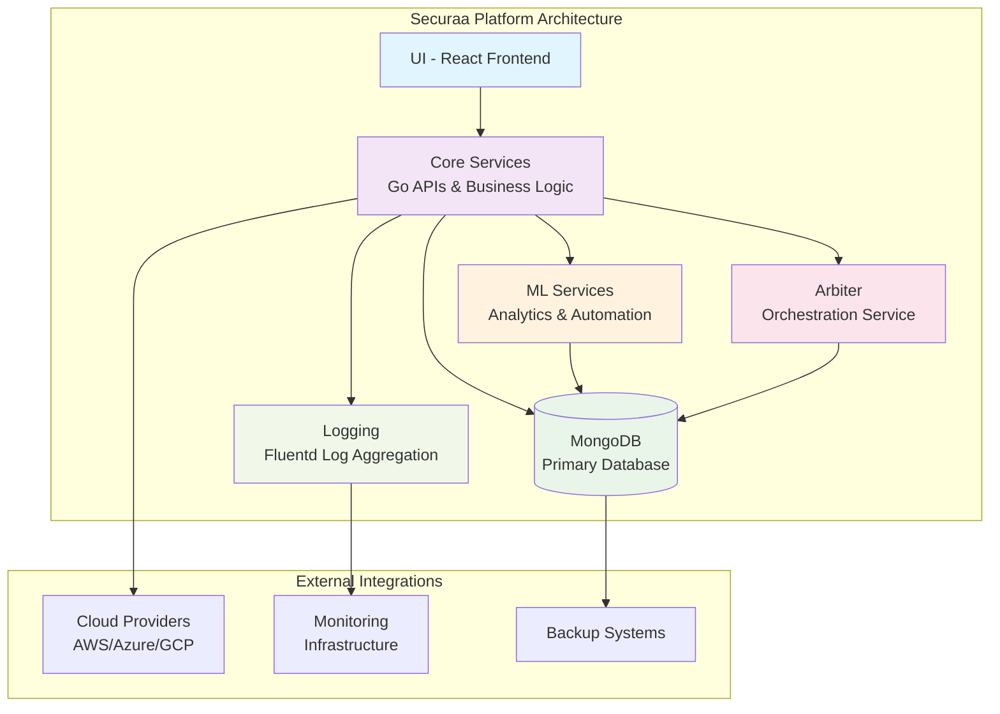

# Securaa High-Level Design (High Level Design)

## 1. Overview
Securaa is a modular cybersecurity platform designed for scalable, secure, and automated deployment across cloud and on-premise environments. The system is composed of multiple services, packaged for both Docker-based development and production-grade RPM/DEB installations.

---

## 2. Architecture

### 2.1. Core Components
- **Core Services**: Main backend logic, APIs, and business rules (Go-based, in `securaa/` and `executedb/`).
- **UI**: React-based frontend, built and served as a static site or via Docker.
- **ML Services**: Machine learning modules for analytics and automation.
- **Arbiter**: Specialized service for orchestration or arbitration tasks.
- **Database**: MongoDB (Dockerized for dev, native for prod).
- **Logging**: Fluentd for log aggregation and forwarding.

### 2.2. Supporting Components
- **Scripts**: Automation for build, deployment, and cloud provisioning (`scripts/`, `core_scripts/`, `deployment_scripts/`).
- **Packaging**: RPM/DEB build system for RedHat and Debian-based deployments (`pkg/`).
- **Cloud Automation**: AWS EC2 provisioning and remote install via shell scripts.

---

## 3. Deployment Topologies

### 3.1. Local Development
- **Docker Compose**: All services (MongoDB, Fluentd, Core, UI, ML) run as containers.
- **Config**: `appliance/docker-compose.yml`, `appliance/local/config.json`.

### 3.2. Production
- **RedHat/CentOS**: RPM packages for core, UI, ML, Arbiter, and dependencies.
- **Debian/Ubuntu**: DEB packages for all components.
- **Cloud**: Automated EC2 launch and install via scripts.

---

## 4. Build & Release Flow
1. **Source Checkout**: Git-based, multi-repo support.
2. **Build**: Scripts for Go services, React UI, ML modules.
3. **Package**: Makefiles and spec files for RPM/DEB creation.
4. **Deploy**: Install scripts for each OS, Docker Compose for dev.
5. **Post-Install**: Systemd service enablement, config, and cleanup.

---

## 5. Security & Compliance
- **AVX Check**: Ensures hardware compatibility for MongoDB 7.0.
- **SELinux Handling**: Temporarily disabled during install for Docker.
- **SSH/SCP**: Secure remote operations for cloud installs.
- **Environment Variables**: Managed via `.env` files.

---

## 6. Extensibility
- **Modular Packaging**: Each service can be built, packaged, and deployed independently.
- **Scripted Automation**: Easy to extend for new services or cloud providers.
- **Configurable**: All major parameters are externalized in config files.

---

## 7. Key Directories
- `appliance/`: Docker Compose, local config, and scripts.
- `core_scripts/`, `deployment_scripts/`, `scripts/`: Automation and deployment logic.
- `pkg/`: Packaging, specs, and control files.
- `securaa/`, `executedb/`: Go source code for core services.

---

## 8. System Architecture Diagram

---

## 9. References
- See deployment document for detailed install and build steps.
- All scripts and configs are in the root and respective subfolders.
