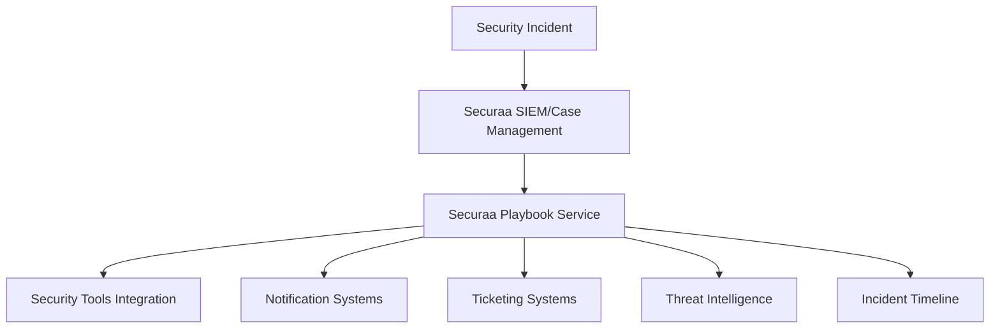
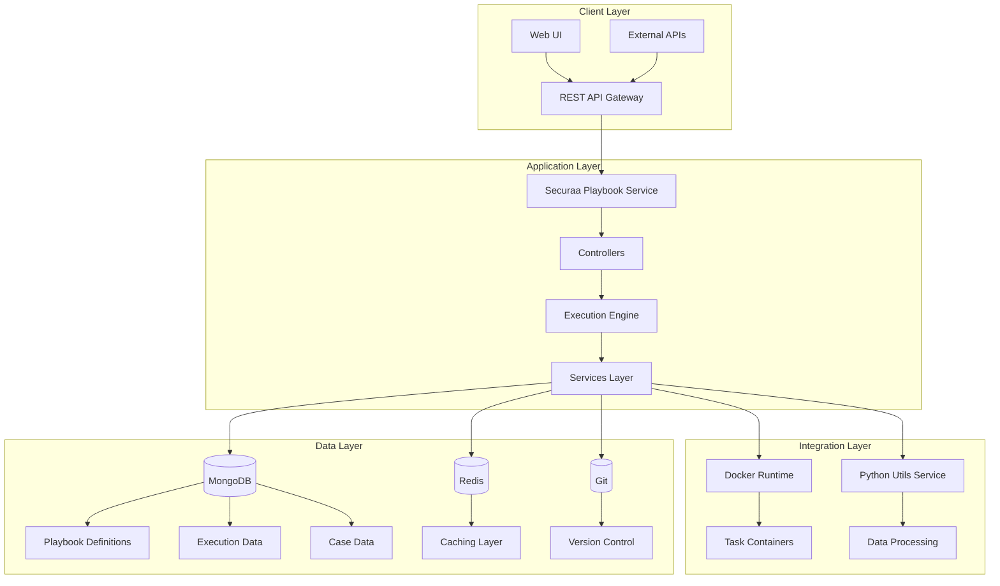
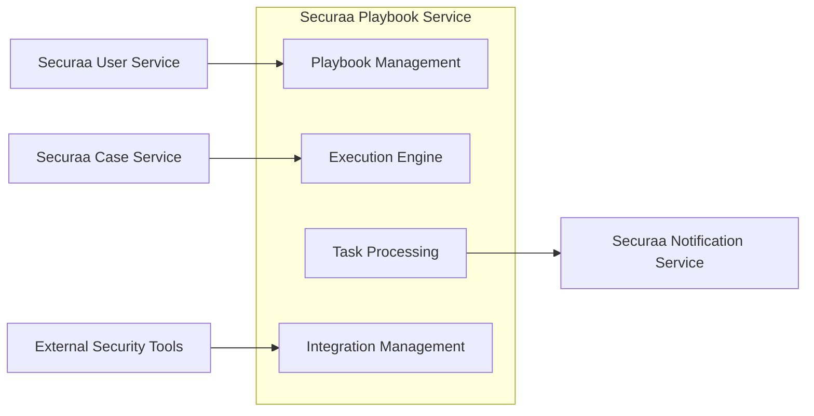
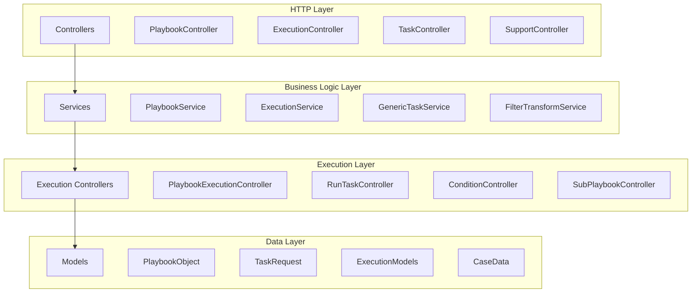
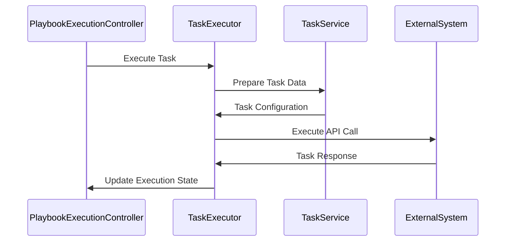
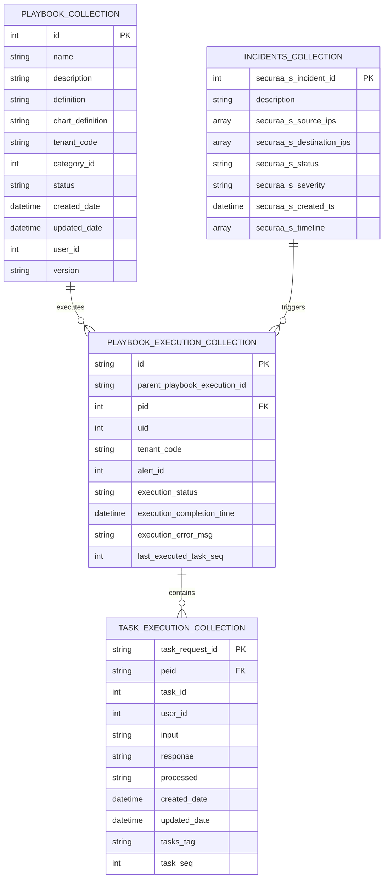
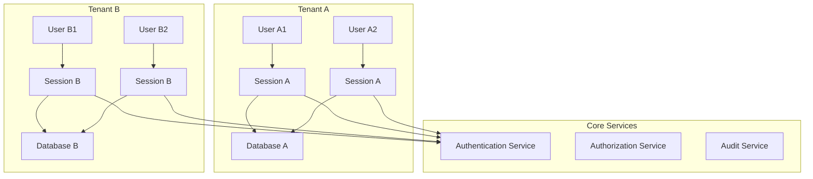
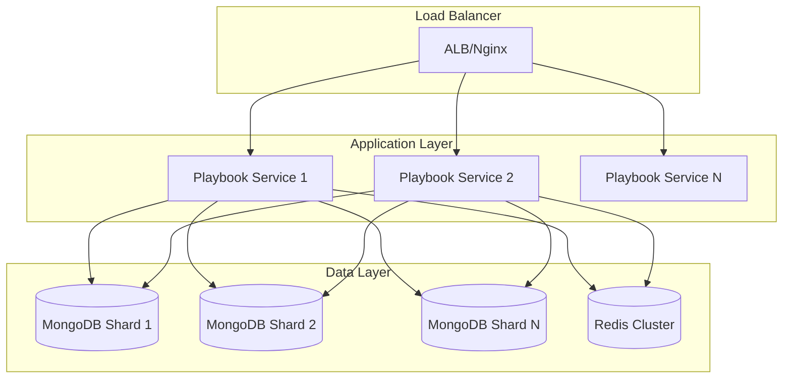
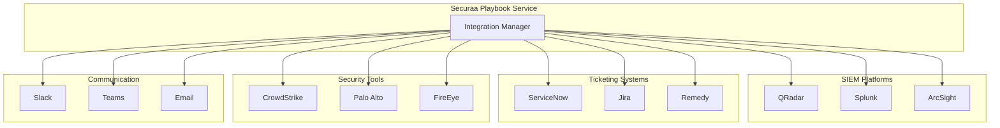

# Securaa Playbook Service - High Level Design Document

## Document Information
- **Service Name**: Securaa Playbook Service
- **Version**: 1.0
- **Date**: September 11, 2025
- **Author**: System Architecture Team

## Table of Contents
1. [Overview](#overview)
2. [System Architecture](#system-architecture)
3. [Component Design](#component-design)
4. [Data Architecture](#data-architecture)
5. [API Design](#api-design)
6. [Security Architecture](#security-architecture)
7. [Scalability & Performance](#scalability--performance)
8. [Deployment Architecture](#deployment-architecture)
9. [Monitoring & Observability](#monitoring--observability)
10. [Error Handling & Recovery](#error-handling--recovery)
11. [Integration Architecture](#integration-architecture)

---

## 1. Overview

### 1.1 Purpose
The Securaa Playbook Service is a core component of the Securaa Security Platform that provides automated security orchestration, automation, and response (SOAR) capabilities. It enables organizations to create, execute, and manage security playbooks for incident response and threat mitigation.

### 1.2 Key Features
- **Automated Workflow Execution**: Execute complex security workflows with conditional logic
- **Multi-tenant Architecture**: Support for multiple organizations with complete data isolation
- **Visual Playbook Designer**: Drag-and-drop interface for creating security workflows
- **Parallel Task Execution**: Concurrent execution of independent tasks for performance
- **Integration Hub**: Connect with 100+ security tools and platforms
- **Real-time Monitoring**: Live execution tracking and performance metrics
- **Audit & Compliance**: Complete audit trails for regulatory compliance

### 1.3 Business Context


---

## 2. System Architecture

### 2.1 High-Level Architecture


### 2.2 Technology Stack
| Layer | Technology | Purpose |
|-------|------------|---------|
| Runtime | Go 1.17+ | High-performance backend service |
| Web Framework | Gorilla Mux | HTTP routing and middleware |
| Database | MongoDB | Primary data store with sharding |
| Cache | Redis | High-speed data caching |
| Containerization | Docker | Isolated task execution |
| Version Control | Git | Playbook versioning |
| Message Queue | Go Channels | Internal communication |
| Monitoring | Custom Metrics | Performance tracking |

### 2.3 Service Boundaries


---

## 3. Component Design

### 3.1 Component Architecture


### 3.2 Key Components

#### 3.2.1 Playbook Execution Controller
**Purpose**: Orchestrates the entire playbook execution lifecycle

**Key Responsibilities**:
- Manages playbook execution state
- Coordinates parallel task execution
- Handles task dependencies and flow control
- Implements stop/resume functionality

**Key Methods**:
```go
type PlaybookExecutionController struct {
    PlayBookTasksMap map[int]executionModels.PlayBookTask
    MapMutex         sync.RWMutex
    Completed        bool
    Stopped          bool
    // ... other fields
}
func (pec *PlaybookExecutionController) RunSelectedPlaybook()
func (pec *PlaybookExecutionController) ReadAndRunPlayBook()
func (pec *PlaybookExecutionController) ProcessAndExecuteTask()
```

#### 3.2.2 Task Execution Engine
**Purpose**: Executes individual tasks within playbooks

**Task Types Supported**:
- **Integration Tasks**: API calls to external systems
- **Utility Tasks**: Data processing and transformation
- **Condition Tasks**: Decision points in workflow
- **Manual Tasks**: Human intervention required
- **Sub-Playbook Tasks**: Nested workflow execution
- **Approval Tasks**: Workflow gates requiring approval

**Execution Flow**:


#### 3.2.3 Filter & Transform Engine
**Purpose**: Processes and transforms data within task execution

**Features**:
- **Conditional Processing**: Execute tasks based on case data conditions
- **Data Transformation**: Format and process data using Python utilities
- **Field Resolution**: Dynamic field value extraction from case metadata
- **Filter Chaining**: Multiple condition evaluation

#### 3.2.4 Integration Management
**Purpose**: Manages connections to external security tools

**Supported Integration Types**:
- SIEM platforms (QRadar, Splunk, ArcSight)
- Ticketing systems (Jira, ServiceNow, Remedy)
- Security tools (Endpoint protection, Firewalls, SOAR platforms)
- Communication platforms (Slack, Teams, Email)
- Threat intelligence feeds

---

## 4. Data Architecture

### 4.1 Database Design

#### 4.1.1 MongoDB Collections


#### 4.1.2 Sharding Strategy
**Sharding Key**: `securaa_s_incident_id % SHARD_BUCKET_COUNT`
- Distributes case data across multiple shards
- Ensures even data distribution
- Optimizes query performance for case-based operations

#### 4.1.3 Data Models

**Playbook Definition**:
```go
type PlaybookObject struct {
    ID                 int      `json:"id" bson:"id"`
    Name               string   `json:"name" bson:"name"`
    Description        string   `json:"description" bson:"description"`
    Definition         string   `json:"definition" bson:"definition"`
    ChartDefinition    string   `json:"chartdefinition" bson:"chartdefinition"`
    TenantCode         string   `json:"tenantcode" bson:"tenantcode"`
    CategoryID         int      `json:"category_id" bson:"category_id"`
    Status             string   `json:"status" bson:"status"`
    IsParallelPlaybook bool     `json:"is_parallel_playbook" bson:"is_parallel_playbook"`
    TotalTasksCount    int      `json:"total_tasks_count" bson:"total_tasks_count"`
}
```

**Task Execution Model**:
```go
type PlayBookTask struct {
    TaskSeq                int                    `json:"task_seq"`
    Type                   string                 `json:"type"`
    TaskName               string                 `json:"task_name"`
    TaskTag                string                 `json:"tasks_tag"`
    InputFields            []models.Inputfields   `json:"inputfields"`
    NextTask               interface{}            `json:"next_task"`
    Conditions             []PlayBookCondition    `json:"conditions"`
    ConditionOperator      string                 `json:"condition_operator"`
    Status                 string
    HasFlowControl         bool
    TotalTasksCount        int
    TotalUtilsCount        int
}
```

### 4.2 Caching Strategy

#### 4.2.1 Redis Cache Structure
```
securaa_playbook:tenant:{tenant_code}:playbook:{playbook_name}
securaa_playbook:tenant:{tenant_code}:task:{task_tag}
securaa_playbook:tenant:{tenant_code}:lists
securaa_playbook:tenant:{tenant_code}:user:{user_id}
securaa_playbook:execution:{execution_id}:count
```

#### 4.2.2 Cache Policies
- **Playbook Definitions**: Long-term caching with manual invalidation
- **Task Metadata**: Medium-term caching (1 hour TTL)
- **Execution State**: Short-term caching (5 minutes TTL)
- **User Sessions**: Session-based TTL

---

## 5. API Design

### 5.1 RESTful API Structure

#### 5.1.1 Core Endpoints
```yaml
# Playbook Management
GET    /getplaybookinfo/{tenantcode}/{category_id}/{status}/{type}/
POST   /createplaybook/
PUT    /updateplaybook/
DELETE /deleteplaybook/{tenantcode}/{playbook_id}/{userid}/
POST   /importplaybook/
POST   /exportplaybook/
# Playbook Execution
POST   /runplaybook/
GET    /getinprogressplaybooks/{tenantcode}/{caseid}/{userid}/{type}/{indicator}/
POST   /stopplaybook/
POST   /getrunningplaybooks/
# Task Management
POST   /runtask/
GET    /getplaybooktasks/{tenantcode}/{playbook_name}/{type}/

# Data Processing
POST   /executeRest/
POST   /validateregex/
POST   /stringtoarray/
POST   /arraytostring/
POST   /deduplicate/
```

#### 5.1.2 Request/Response Patterns

**Playbook Execution Request**:
```json
{
  "tenantcode": "tenant123",
  "playbook_name": "Malware Response",
  "case_id": "12345",
  "is_bot": "false",
  "uid": "1001",
  "username": "security_analyst",
  "type": "case",
  "indicator": "192.168.1.100",
  "resume_playbook": "false"
}
```

**Standard API Response**:
```json
{
  "success": true,
  "data": {
    "playbook_execution_id": "pb_exec_123456",
    "status": "inprogress",
    "total_tasks": 15,
    "completed_tasks": 5
  },
  "error": "",
  "displayMessage": "Playbook execution started successfully",
  "time": 1694443200000
}
```

### 5.2 WebSocket Integration
For real-time updates during playbook execution:
- Execution progress updates
- Task completion notifications
- Error alerts
- Status changes

---

## 6. Security Architecture

### 6.1 Multi-Tenant Security Model

#### 6.1.1 Tenant Isolation


#### 6.1.2 Authentication & Authorization
- **JWT-based Authentication**: Stateless token-based auth
- **Role-Based Access Control (RBAC)**: Granular permissions
- **Tenant-Scoped Resources**: Complete data isolation
- **Session Management**: Configurable session timeouts

#### 6.1.3 Data Security
- **Encryption at Rest**: MongoDB encrypted storage
- **Encryption in Transit**: TLS/SSL for all communications
- **Credential Management**: Secure storage of integration credentials
- **Audit Logging**: Complete audit trail for compliance

### 6.2 Security Controls

#### 6.2.1 Input Validation
- Schema validation for all API inputs
- SQL injection prevention
- XSS protection
- Parameter sanitization

#### 6.2.2 Access Control
```go
// Middleware example
func (a *App) loggingMiddleware(next http.Handler) http.Handler {
    return http.HandlerFunc(func(w http.ResponseWriter, r *http.Request) {
        // Tenant verification
        // Access token validation
        // Permission checks
        // Audit logging
    })
}
```

---

## 7. Scalability & Performance

### 7.1 Horizontal Scaling

#### 7.1.1 Service Scaling


#### 7.1.2 Database Sharding
- **Horizontal Partitioning**: Case data distributed across shards
- **Query Routing**: Automatic routing to appropriate shard
- **Cross-Shard Queries**: Aggregation across multiple shards
- **Replication**: Master-slave replication for high availability

### 7.2 Performance Optimization

#### 7.2.1 Caching Strategy
- **Multi-level Caching**: Application, database, and CDN caching
- **Cache Warming**: Proactive cache population
- **Intelligent Invalidation**: Smart cache invalidation policies
- **Cache Metrics**: Monitoring cache hit/miss ratios

#### 7.2.2 Parallel Processing
```go
// Parallel task execution example
func (executionController *PlaybookExecutionController) executeParallelTasks() {
    var wg sync.WaitGroup
    for i := 0; i < taskCount; i++ {
        wg.Add(1)
        go func(taskIndex int) {
            defer wg.Done()
            executionController.ProcessAndExecuteTask(taskIndex, ...)
        }(i)
    }
    wg.Wait()
}
```

### 7.3 Resource Management

#### 7.3.1 Docker Container Management
- **Resource Limits**: CPU and memory constraints
- **Container Lifecycle**: Automatic cleanup
- **Image Management**: Optimized container images
- **Health Checks**: Container health monitoring

#### 7.3.2 Connection Pooling
- **Database Connections**: MongoDB connection pooling
- **Redis Connections**: Connection pool for cache operations
- **HTTP Client Pooling**: Reusable HTTP clients for integrations

---

## 8. Deployment Architecture

### 8.1 Containerization

#### 8.1.1 Docker Configuration
```dockerfile
FROM golang:1.17-alpine AS builder
WORKDIR /app
COPY . .
RUN go mod download
RUN CGO_ENABLED=0 GOOS=linux go build -o securaa-playbook-service

FROM alpine:latest
RUN apk --no-cache add ca-certificates
WORKDIR /root/
COPY --from=builder /app/securaa-playbook-service .
EXPOSE 8040
CMD ["./securaa-playbook-service"]
```

### 8.2 Infrastructure Requirements

#### 8.2.1 Compute Resources
- **CPU**: 2+ cores per service instance
- **Memory**: 4GB+ RAM per service instance
- **Storage**: SSD storage for optimal performance
- **Network**: Low-latency networking for real-time execution

#### 8.2.2 Database Infrastructure
- **MongoDB**: Replica set with 3+ nodes
- **Redis**: Cluster mode with persistence
- **Backup**: Automated backup and recovery
- **Monitoring**: Real-time performance monitoring

---

## 9. Monitoring & Observability

### 9.1 Metrics & KPIs

#### 9.1.1 Business Metrics
- **Playbook Execution Success Rate**: % of successful executions
- **Mean Time to Resolution (MTTR)**: Average incident response time
- **Task Completion Rate**: Individual task success rates
- **User Adoption**: Active playbook usage statistics

#### 9.1.2 Technical Metrics
- **Response Time**: API response latencies
- **Throughput**: Requests per second
- **Error Rates**: 4xx/5xx error percentages
- **Resource Utilization**: CPU, memory, disk usage

### 9.2 Logging Strategy

#### 9.2.1 Log Levels
```go
logger.Debug("Task execution started")
logger.Info("Playbook execution completed successfully")
logger.Warn("Task execution timeout, retrying...")
logger.Error("Database connection failed", err.Error())
```

#### 9.2.2 Structured Logging
```json
{
  "timestamp": "2025-09-11T10:30:00Z",
  "level": "INFO",
  "service": "securaa-playbook-service",
  "tenant": "tenant123",
  "playbook_id": "pb_001",
  "execution_id": "exec_123456",
  "message": "Task completed successfully",
  "duration_ms": 1250,
  "task_seq": 5
}
```

### 9.3 Alerting & Notifications

#### 9.3.1 Alert Conditions
- **High Error Rate**: >5% error rate over 5 minutes
- **High Latency**: P95 response time >2 seconds
- **Resource Exhaustion**: CPU/Memory >80%
- **Database Issues**: Connection failures or timeouts

#### 9.3.2 Notification Channels
- Email alerts for critical issues
- Slack/Teams integration for team notifications
- PagerDuty integration for on-call escalation
- Dashboard alerts for operations team

---

## 10. Error Handling & Recovery

### 10.1 Error Handling Strategy

#### 10.1.1 Error Categories
- **Transient Errors**: Network timeouts, temporary service unavailability
- **Permanent Errors**: Invalid configuration, authentication failures
- **Business Logic Errors**: Invalid playbook definitions, condition failures
- **System Errors**: Database failures, resource exhaustion

#### 10.1.2 Error Response Pattern
```go
type Response struct {
    Success        bool        `json:"success"`
    Data           interface{} `json:"data"`
    Error          string      `json:"error"`
    DisplayMessage string      `json:"displaymessage"`
    ErrorPath      string      `json:"errorpath"`
    Status         string      `json:"status"`
}
```

### 10.2 Recovery Mechanisms

#### 10.2.1 Retry Logic
```go
func retryWithBackoff(operation func() error, maxRetries int) error {
    for i := 0; i < maxRetries; i++ {
        err := operation()
        if err == nil {
            return nil
        }
        backoffTime := time.Duration(math.Pow(2, float64(i))) * time.Second
        time.Sleep(backoffTime)
    }
    return fmt.Errorf("operation failed after %d retries", maxRetries)
}
```

#### 10.2.2 Circuit Breaker Pattern
- **Closed State**: Normal operation
- **Open State**: Fail fast when service is down
- **Half-Open State**: Test if service has recovered

### 10.3 Data Consistency

#### 10.3.1 Transaction Management
- **ACID Compliance**: Ensure data consistency
- **Compensating Transactions**: Rollback on failures
- **Idempotent Operations**: Safe retry mechanisms
- **Event Sourcing**: Audit trail for state changes

#### 10.3.2 Backup & Recovery
- **Automated Backups**: Daily full backups
- **Point-in-Time Recovery**: Restore to specific timestamps
- **Cross-Region Replication**: Disaster recovery
- **Data Validation**: Integrity checks after recovery

---

## 11. Integration Architecture

### 11.1 External System Integration

#### 11.1.1 Integration Types


#### 11.1.2 Integration Patterns
- **RESTful APIs**: HTTP-based integrations
- **Webhook Support**: Event-driven integration
- **Custom Connectors**: Proprietary protocol support
- **Batch Processing**: Bulk data operations

### 11.2 Data Exchange

#### 11.2.1 Data Formats
- **JSON**: Primary data format
- **XML**: Legacy system support
- **CSV**: Bulk data operations
- **Binary**: File transfers and attachments

#### 11.2.2 Transformation Engine
```go
type Transformer struct {
    Name   string      `json:"name"`
    Data   interface{} `json:"data"`
    Filter interface{} `json:"filter"`
}
func TransformValues(alertData models.RunPlayBookRequest2, 
                    inputFields models.Inputfields) (interface{}, error) {
    // Apply filters
    // Transform data
    // Validate output
}
```

### 11.3 API Management

#### 11.3.1 Rate Limiting
- **Per-tenant limits**: Prevent resource exhaustion
- **API quotas**: Fair usage policies
- **Burst handling**: Handle traffic spikes
- **Throttling**: Graceful degradation

#### 11.3.2 Authentication Methods
- **API Keys**: Simple authentication
- **OAuth 2.0**: Secure delegated access
- **JWT Tokens**: Stateless authentication
- **Mutual TLS**: Certificate-based auth

---

## Conclusion

The Securaa Playbook Service represents a sophisticated, enterprise-grade security orchestration platform designed for high-scale, multi-tenant environments. Its modular architecture, robust error handling, and comprehensive integration capabilities make it suitable for large security operations centers and managed security service providers.

### Key Strengths
- **Scalable Architecture**: Supports horizontal scaling and high availability
- **Security First**: Comprehensive security controls and multi-tenant isolation
- **Extensible Design**: Easy integration with new security tools
- **Performance Optimized**: Parallel execution and intelligent caching
- **Operations Ready**: Comprehensive monitoring and observability

### Future Considerations
- **AI/ML Integration**: Intelligent playbook optimization
- **Event Streaming**: Real-time event processing
- **GraphQL API**: Enhanced query capabilities
- **Serverless Functions**: Event-driven microservices
- **Edge Computing**: Distributed execution capabilities

This design document serves as the foundation for understanding, maintaining, and extending the Securaa Playbook Service architecture.
