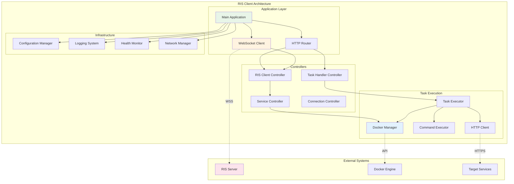

# RIS Client Documentation

## Table of Contents
1. [Overview](#overview)
2. [Architecture](#architecture)
3. [Installation & Setup](#installation--setup)
4. [Configuration](#configuration)
5. [API Reference](#api-reference)
6. [Task Execution](#task-execution)
7. [Docker Service Management](#docker-service-management)
8. [Security Features](#security-features)
9. [Monitoring & Logging](#monitoring--logging)
10. [Troubleshooting](#troubleshooting)
11. [Best Practices](#best-practices)
12. [Development Guide](#development-guide)

## Overview

The RIS (Remote Integrated Services) Client is a lightweight, secure agent that enables remote management and task execution across distributed environments. It serves as the intelligent endpoint in the RIS ecosystem, communicating with the central RIS Server to execute tasks, manage Docker services, and provide real-time status updates.

### Key Features

- **Real-time Communication**: WebSocket-based persistent connection with the RIS Server
- **Task Execution**: Support for HTTP requests, system commands, and Docker operations
- **Service Management**: Comprehensive Docker container and service lifecycle management
- **Security**: TLS encryption, authentication, and secure credential management
- **Network Intelligence**: Automatic network discovery and adaptation
- **Health Monitoring**: Continuous health checks and status reporting
- **Multi-tenant Support**: Isolated execution environments for different tenants

### System Requirements

#### Minimum Requirements
- **Operating System**: Linux (Ubuntu 18.04+, CentOS 7+, RHEL 7+)
- **CPU**: 1 vCore
- **Memory**: 512 MB RAM
- **Storage**: 1 GB available disk space
- **Network**: Outbound HTTPS/WSS connectivity

#### Recommended Requirements
- **Operating System**: Linux (Ubuntu 20.04+, CentOS 8+, RHEL 8+)
- **CPU**: 2 vCores
- **Memory**: 2 GB RAM
- **Storage**: 5 GB available disk space
- **Network**: High-speed internet connection

#### Dependencies
- **Docker**: Version 20.10+ (for service management features)
- **Go Runtime**: Version 1.19+ (for development)
- **TLS Certificates**: Valid certificates for secure communication

## Architecture

### Component Overview



### Core Components

#### 1. Application Framework
- **Main Application (`App`)**: Central orchestration and lifecycle management
- **HTTP Router**: RESTful API endpoint handling
- **WebSocket Client**: Persistent server communication
- **Configuration Manager**: Dynamic configuration management

#### 2. Task Execution Engine
- **Task Handler Controller**: Task routing and execution coordination
- **HTTP Client**: External API communication
- **Command Executor**: System command execution
- **Docker Manager**: Container and service management

#### 3. Infrastructure Services
- **Health Monitor**: System and service health tracking
- **Network Manager**: IP detection and connectivity management
- **Logging System**: Structured logging and audit trails
- **Security Manager**: Authentication and encryption

## Installation & Setup

### Docker Installation (Recommended)

#### Using Docker Compose
```yaml
version: '3.8'
services:
  ris-client:
    image: securaa/ris-client:latest
    container_name: ris-client
    restart: unless-stopped
    environment:
      - RIS_SERVER_HOST=https://your-ris-server.com
      - RIS_CLIENT_NAME=client-001
      - RIS_TENANT_CODE=your-tenant
    volumes:
      - ./config:/app/config
      - ./logs:/app/logs
      - /var/run/docker.sock:/var/run/docker.sock
    ports:
      - "9000:9000"
    networks:
      - ris-network
    cap_add:
      - NET_ADMIN
    security_opt:
      - no-new-privileges:true

networks:
  ris-network:
    driver: bridge
```

#### Using Docker Run
```bash
docker run -d \
  --name ris-client \
  --restart unless-stopped \
  -e RIS_SERVER_HOST=https://your-ris-server.com \
  -e RIS_CLIENT_NAME=client-001 \
  -e RIS_TENANT_CODE=your-tenant \
  -v ./config:/app/config \
  -v ./logs:/app/logs \
  -v /var/run/docker.sock:/var/run/docker.sock \
  -p 9000:9000 \
  --cap-add NET_ADMIN \
  --security-opt no-new-privileges:true \
  securaa/ris-client:latest
```

### Binary Installation

#### Download and Install
```bash
# Download the latest release
wget https://github.com/securaa/ris-client/releases/latest/download/ris-client-linux-amd64.tar.gz

# Extract the binary
tar -xzf ris-client-linux-amd64.tar.gz

# Move to system path
sudo mv ris-client /usr/local/bin/
sudo chmod +x /usr/local/bin/ris-client

# Create configuration directory
sudo mkdir -p /etc/ris-client
sudo mkdir -p /var/log/ris-client
```

#### Create Systemd Service
```bash
sudo tee /etc/systemd/system/ris-client.service << EOF
[Unit]
Description=RIS Client Service
After=network.target
Wants=network.target

[Service]
Type=simple
User=ris-client
Group=ris-client
ExecStart=/usr/local/bin/ris-client
Restart=always
RestartSec=10
Environment=CONFIG_PATH=/etc/ris-client/config.json
WorkingDirectory=/opt/ris-client

[Install]
WantedBy=multi-user.target
EOF

# Create user and directories
sudo useradd -r -s /bin/false ris-client
sudo chown -R ris-client:ris-client /etc/ris-client /var/log/ris-client

# Enable and start service
sudo systemctl daemon-reload
sudo systemctl enable ris-client
sudo systemctl start ris-client
```

### Source Installation

#### Prerequisites
```bash
# Install Go 1.19+
wget https://go.dev/dl/go1.21.3.linux-amd64.tar.gz
sudo tar -C /usr/local -xzf go1.21.3.linux-amd64.tar.gz
export PATH=$PATH:/usr/local/go/bin

# Install dependencies
sudo apt-get update
sudo apt-get install -y git make build-essential
```

#### Build from Source
```bash
# Clone repository
git clone https://github.com/securaa/ris-client.git
cd ris-client

# Build application
make build

# Install binary
sudo make install

# Copy configuration template
sudo cp config/config.json.template /etc/ris-client/config.json
```

## Configuration

### Configuration File Structure

```json
{
  "server": {
    "host": "https://ris-server.example.com",
    "port": 8057,
    "websocket_path": "/pingpong",
    "api_version": "v1",
    "timeout": 30,
    "retry_attempts": 3,
    "retry_delay": 5
  },
  "client": {
    "name": "ris-client-001",
    "unique_id": "auto-generated-uuid",
    "tenant_code": "default",
    "port": 9000,
    "host_type": "auto",
    "external_ip": "auto",
    "internal_ip": "auto"
  },
  "security": {
    "tls": {
      "enabled": true,
      "cert_file": "/etc/ris-client/certs/client.crt",
      "key_file": "/etc/ris-client/certs/client.key",
      "ca_file": "/etc/ris-client/certs/ca.crt",
      "verify_server": true,
      "cipher_suites": ["TLS_AES_256_GCM_SHA384", "TLS_CHACHA20_POLY1305_SHA256"]
    },
    "authentication": {
      "method": "certificate",
      "token_refresh_interval": 3600
    }
  },
  "docker": {
    "enabled": true,
    "socket": "/var/run/docker.sock",
    "api_version": "1.41",
    "timeout": 60,
    "registry": {
      "url": "registry.example.com",
      "username": "",
      "password": ""
    }
  },
  "logging": {
    "level": "info",
    "format": "json",
    "output": "file",
    "file": {
      "path": "/var/log/ris-client/client.log",
      "max_size": 100,
      "max_backups": 5,
      "max_age": 30,
      "compress": true
    },
    "audit": {
      "enabled": true,
      "file": "/var/log/ris-client/audit.log"
    }
  },
  "monitoring": {
    "enabled": true,
    "interval": 30,
    "health_check": {
      "endpoint": "/health",
      "timeout": 10
    },
    "metrics": {
      "enabled": true,
      "port": 9001,
      "path": "/metrics"
    }
  },
  "features": {
    "task_execution": true,
    "service_management": true,
    "health_monitoring": true,
    "auto_update": false,
    "debug_mode": false
  }
}
```

### Environment Variables

The RIS Client supports configuration through environment variables:

| Variable | Description | Default |
|----------|-------------|---------|
| `RIS_SERVER_HOST` | RIS Server URL | `https://localhost:8057` |
| `RIS_CLIENT_NAME` | Client identifier | `ris-client` |
| `RIS_CLIENT_PORT` | Client listening port | `9000` |
| `RIS_TENANT_CODE` | Tenant identifier | `default` |
| `RIS_LOG_LEVEL` | Logging level | `info` |
| `RIS_TLS_ENABLED` | Enable TLS | `true` |
| `RIS_DOCKER_ENABLED` | Enable Docker management | `true` |
| `CONFIG_PATH` | Configuration file path | `/etc/ris-client/config.json` |

### Network Configuration

#### Host Type Detection
The client automatically detects its network environment:

- **`auto`**: Automatic detection (recommended)
- **`private`**: Private network environment
- **`public`**: Public-facing environment
- **`nat`**: Behind NAT/firewall

#### IP Address Configuration
```json
{
  "client": {
    "ip_detection": {
      "method": "auto",
      "external_ip_services": [
        "https://api.ipify.org",
        "https://checkip.amazonaws.com",
        "https://icanhazip.com"
      ],
      "timeout": 10,
      "fallback_ip": "127.0.0.1"
    }
  }
}
```

## API Reference

### REST API Endpoints

#### Health Check
```http
GET /health
```

**Response:**
```json
{
  "status": "healthy",
  "version": "1.0.0",
  "uptime": 3600,
  "connections": {
    "server": "connected",
    "docker": "available"
  },
  "resources": {
    "cpu_usage": 25.5,
    "memory_usage": 512,
    "disk_usage": 75.2
  }
}
```

#### Task Execution
```http
POST /runtask/
Content-Type: application/json

{
  "method": "GET",
  "resturl": "https://api.example.com/status",
  "headers": "{\"Authorization\": \"Bearer token\"}",
  "authtype": "bearer",
  "bearertoken": "jwt-token"
}
```

**Response:**
```json
{
  "success": true,
  "data": {
    "status_code": 200,
    "headers": {},
    "body": "response data"
  },
  "execution_time": 1250,
  "timestamp": "2025-10-07T10:30:00Z"
}
```

#### Service Management
```http
POST /manageservices/
Content-Type: application/json

{
  "action": "deploy",
  "service_name": "web-app",
  "image": "nginx:latest",
  "replicas": 3,
  "ports": [
    {
      "containerPort": 80,
      "hostPort": 8080
    }
  ],
  "environment": {
    "ENV": "production"
  }
}
```

**Response:**
```json
{
  "success": true,
  "service_id": "service_web-app_123",
  "status": "deployed",
  "message": "Service deployed successfully"
}
```

### WebSocket Communication

#### Connection Establishment
```javascript
const ws = new WebSocket('wss://client-ip:9000/pingpong');

ws.onopen = function(event) {
    console.log('Connected to RIS Client');
    
    // Send registration
    ws.send(JSON.stringify({
        type: 'register',
        client_id: 'client-001',
        capabilities: ['task_execution', 'service_management']
    }));
};
```

#### Message Types

**Registration Message:**
```json
{
  "type": "register",
  "client_id": "client-001",
  "version": "1.0.0",
  "capabilities": ["task_execution", "service_management"],
  "timestamp": "2025-10-07T10:30:00Z"
}
```

**Task Execution Message:**
```json
{
  "type": "execute_task",
  "task_id": "task-123",
  "payload": {
    "method": "POST",
    "url": "https://api.example.com/endpoint",
    "data": "request data"
  }
}
```

**Status Update Message:**
```json
{
  "type": "status_update",
  "status": "running",
  "services": [
    {
      "name": "web-app",
      "status": "running",
      "replicas": 3
    }
  ],
  "resources": {
    "cpu": 25.5,
    "memory": 512,
    "disk": 75.2
  }
}
```

## Task Execution

### Supported Task Types

#### HTTP Requests
```json
{
  "method": "POST",
  "resturl": "https://api.example.com/users",
  "headers": "{\"Content-Type\": \"application/json\"}",
  "data": "{\"name\": \"John Doe\", \"email\": \"john@example.com\"}",
  "authtype": "bearer",
  "bearertoken": "jwt-token-here",
  "timeout": 30
}
```

#### System Commands
```json
{
  "type": "command",
  "command": "systemctl status nginx",
  "timeout": 10,
  "environment": {
    "PATH": "/usr/local/bin:/usr/bin:/bin"
  }
}
```

#### Docker Operations
```json
{
  "type": "docker",
  "operation": "container_list",
  "filters": {
    "status": "running"
  }
}
```

### Authentication Methods

#### Bearer Token
```json
{
  "authtype": "bearer",
  "bearertoken": "eyJhbGciOiJIUzI1NiIsInR5cCI6IkpXVCJ9..."
}
```

#### Basic Authentication
```json
{
  "authtype": "basic",
  "username": "admin",
  "password": "secure-password"
}
```

#### Custom Headers
```json
{
  "authtype": "custom",
  "headers": "{\"X-API-Key\": \"api-key-value\", \"X-Client-ID\": \"client-123\"}"
}
```

### Error Handling

#### Task Execution Errors
```json
{
  "success": false,
  "error": "connection_timeout",
  "message": "Request timed out after 30 seconds",
  "error_code": "TIMEOUT_001",
  "details": {
    "url": "https://api.example.com/endpoint",
    "timeout": 30,
    "retry_count": 3
  },
  "timestamp": "2025-10-07T10:30:00Z"
}
```

#### Retry Logic
```json
{
  "retry_policy": {
    "max_attempts": 3,
    "backoff_strategy": "exponential",
    "initial_delay": 1000,
    "max_delay": 30000,
    "retry_conditions": [
      "network_error",
      "timeout",
      "server_error_5xx"
    ]
  }
}
```

## Docker Service Management

### Service Deployment

#### Basic Deployment
```json
{
  "action": "deploy",
  "service_name": "web-server",
  "image": "nginx:1.21-alpine",
  "replicas": 2,
  "ports": [
    {
      "containerPort": 80,
      "hostPort": 8080,
      "protocol": "TCP"
    }
  ],
  "environment": {
    "NGINX_HOST": "localhost",
    "NGINX_PORT": "80"
  },
  "volumes": [
    {
      "host_path": "/var/www/html",
      "container_path": "/usr/share/nginx/html",
      "mode": "ro"
    }
  ],
  "networks": ["web-network"],
  "restart_policy": "unless-stopped"
}
```

#### Advanced Deployment with Health Checks
```json
{
  "action": "deploy",
  "service_name": "api-server",
  "image": "myapp/api:v1.2.3",
  "replicas": 3,
  "deploy_config": {
    "update_strategy": "rolling",
    "max_replicas_unavailable": 1,
    "health_check": {
      "test": ["CMD", "curl", "-f", "http://localhost:8080/health"],
      "interval": "30s",
      "timeout": "10s",
      "retries": 3,
      "start_period": "60s"
    }
  },
  "resources": {
    "limits": {
      "memory": "512m",
      "cpu": "0.5"
    },
    "reservations": {
      "memory": "256m",
      "cpu": "0.25"
    }
  },
  "secrets": [
    {
      "name": "db-password",
      "target": "/run/secrets/db_password"
    }
  ],
  "configs": [
    {
      "name": "app-config",
      "target": "/etc/app/config.yml"
    }
  ]
}
```

### Service Operations

#### Scale Service
```json
{
  "action": "scale",
  "service_name": "web-server",
  "replicas": 5
}
```

#### Update Service
```json
{
  "action": "update",
  "service_name": "api-server",
  "image": "myapp/api:v1.2.4",
  "update_strategy": "rolling",
  "update_config": {
    "parallelism": 1,
    "delay": "10s",
    "failure_action": "rollback",
    "monitor": "30s"
  }
}
```

#### Stop Service
```json
{
  "action": "stop",
  "service_name": "web-server",
  "timeout": 30
}
```

#### Remove Service
```json
{
  "action": "remove",
  "service_name": "web-server",
  "force": false
}
```

### Service Monitoring

#### Get Service Status
```json
{
  "action": "status",
  "service_name": "web-server"
}
```

**Response:**
```json
{
  "success": true,
  "data": {
    "service_name": "web-server",
    "status": "running",
    "replicas": {
      "desired": 3,
      "running": 3,
      "ready": 3
    },
    "image": "nginx:1.21-alpine",
    "created": "2025-10-07T10:00:00Z",
    "updated": "2025-10-07T10:30:00Z",
    "tasks": [
      {
        "id": "task_123",
        "node": "worker-1",
        "status": "running",
        "current_state": "running",
        "desired_state": "running"
      }
    ]
  }
}
```

#### List All Services
```json
{
  "action": "list",
  "filters": {
    "status": "running"
  }
}
```

### Docker Compose Support

#### Deploy Stack
```json
{
  "action": "deploy_stack",
  "stack_name": "webapp",
  "compose_content": "version: '3.8'\nservices:\n  web:\n    image: nginx:latest\n    ports:\n      - 80:80",
  "environment_file": ".env"
}
```

#### Remove Stack
```json
{
  "action": "remove_stack",
  "stack_name": "webapp"
}
```

## Security Features

### TLS Configuration

#### Certificate Management
```json
{
  "security": {
    "tls": {
      "enabled": true,
      "cert_file": "/etc/ris-client/certs/client.crt",
      "key_file": "/etc/ris-client/certs/client.key",
      "ca_file": "/etc/ris-client/certs/ca.crt",
      "verify_server": true,
      "min_version": "1.2",
      "max_version": "1.3",
      "cipher_suites": [
        "TLS_AES_256_GCM_SHA384",
        "TLS_CHACHA20_POLY1305_SHA256",
        "TLS_AES_128_GCM_SHA256"
      ]
    }
  }
}
```

#### Certificate Rotation
```bash
# Automatic certificate rotation
ris-client cert rotate --ca-cert /path/to/new-ca.crt

# Manual certificate update
ris-client cert update \
  --cert /path/to/new-client.crt \
  --key /path/to/new-client.key \
  --restart
```

### Access Control

#### Role-Based Permissions
```json
{
  "security": {
    "rbac": {
      "enabled": true,
      "roles": {
        "admin": {
          "permissions": ["*"]
        },
        "operator": {
          "permissions": [
            "task:execute",
            "service:read",
            "service:deploy",
            "service:scale"
          ]
        },
        "readonly": {
          "permissions": [
            "service:read",
            "health:read"
          ]
        }
      }
    }
  }
}
```

#### IP Whitelist
```json
{
  "security": {
    "network": {
      "allowed_ips": [
        "10.0.0.0/8",
        "172.16.0.0/12",
        "192.168.0.0/16",
        "203.0.113.0/24"
      ],
      "deny_all_others": true
    }
  }
}
```

### Audit Logging

#### Audit Configuration
```json
{
  "logging": {
    "audit": {
      "enabled": true,
      "file": "/var/log/ris-client/audit.log",
      "max_size": 100,
      "events": [
        "authentication",
        "task_execution",
        "service_management",
        "configuration_change",
        "security_event"
      ],
      "format": "json",
      "include_payload": false
    }
  }
}
```

#### Audit Event Example
```json
{
  "timestamp": "2025-10-07T10:30:00Z",
  "event_type": "task_execution",
  "user": "admin@example.com",
  "source_ip": "192.168.1.100",
  "action": "execute_http_task",
  "resource": "https://api.example.com/users",
  "result": "success",
  "duration": 1250,
  "metadata": {
    "task_id": "task-123",
    "method": "GET",
    "status_code": 200
  }
}
```

## Monitoring & Logging

### Health Monitoring

#### Health Check Endpoint
```http
GET /health
```

**Response:**
```json
{
  "status": "healthy",
  "version": "1.0.0",
  "uptime": "2h30m15s",
  "components": {
    "server_connection": {
      "status": "connected",
      "last_ping": "2025-10-07T10:29:45Z",
      "latency": 45
    },
    "docker": {
      "status": "available",
      "version": "20.10.17",
      "containers_running": 12
    },
    "filesystem": {
      "status": "healthy",
      "usage": {
        "total": "100GB",
        "used": "75GB",
        "available": "25GB"
      }
    },
    "memory": {
      "status": "healthy",
      "usage": {
        "total": "8GB",
        "used": "2GB",
        "available": "6GB"
      }
    }
  }
}
```

#### Metrics Endpoint
```http
GET /metrics
```

**Prometheus Format Response:**
```text
# HELP ris_client_uptime_seconds Total uptime in seconds
# TYPE ris_client_uptime_seconds counter
ris_client_uptime_seconds 9015

# HELP ris_client_tasks_total Total number of tasks executed
# TYPE ris_client_tasks_total counter
ris_client_tasks_total{status="success"} 1250
ris_client_tasks_total{status="error"} 23

# HELP ris_client_services_running Number of running services
# TYPE ris_client_services_running gauge
ris_client_services_running 8

# HELP ris_client_memory_usage_bytes Memory usage in bytes
# TYPE ris_client_memory_usage_bytes gauge
ris_client_memory_usage_bytes 536870912
```

### Logging Configuration

#### Structured Logging
```json
{
  "logging": {
    "level": "info",
    "format": "json",
    "output": "file",
    "file": {
      "path": "/var/log/ris-client/client.log",
      "max_size": 100,
      "max_backups": 5,
      "max_age": 30,
      "compress": true
    },
    "console": {
      "enabled": true,
      "level": "error"
    },
    "fields": {
      "service": "ris-client",
      "version": "1.0.0",
      "environment": "production"
    }
  }
}
```

#### Log Example
```json
{
  "timestamp": "2025-10-07T10:30:00Z",
  "level": "info",
  "message": "Task executed successfully",
  "service": "ris-client",
  "version": "1.0.0",
  "task_id": "task-123",
  "method": "GET",
  "url": "https://api.example.com/status",
  "duration": 1250,
  "status_code": 200,
  "correlation_id": "req-456"
}
```

### Monitoring Integration

#### Prometheus Integration
```yaml
# prometheus.yml
scrape_configs:
  - job_name: 'ris-client'
    static_configs:
      - targets: ['client-1:9001', 'client-2:9001']
    scrape_interval: 30s
    metrics_path: /metrics
```

#### Grafana Dashboard
```json
{
  "dashboard": {
    "title": "RIS Client Monitoring",
    "panels": [
      {
        "title": "Task Execution Rate",
        "type": "graph",
        "targets": [
          {
            "expr": "rate(ris_client_tasks_total[5m])",
            "legendFormat": "{{status}}"
          }
        ]
      },
      {
        "title": "Service Status",
        "type": "stat",
        "targets": [
          {
            "expr": "ris_client_services_running",
            "legendFormat": "Running Services"
          }
        ]
      }
    ]
  }
}
```

## Troubleshooting

### Common Issues

#### Connection Issues

**Problem**: Client cannot connect to RIS Server
```bash
# Check network connectivity
curl -k https://ris-server.example.com:8057/health

# Verify certificates
openssl s_client -connect ris-server.example.com:8057 -cert client.crt -key client.key

# Check client logs
tail -f /var/log/ris-client/client.log | grep -i error
```

**Solution**:
1. Verify server URL and port
2. Check firewall rules
3. Validate TLS certificates
4. Review network configuration

#### Docker Issues

**Problem**: Docker service management fails
```bash
# Check Docker daemon
systemctl status docker

# Verify Docker socket permissions
ls -la /var/run/docker.sock

# Test Docker API
docker version
```

**Solution**:
1. Ensure Docker daemon is running
2. Check socket permissions
3. Verify Docker API version compatibility
4. Review Docker configuration

#### Task Execution Failures

**Problem**: HTTP tasks timing out
```bash
# Check network connectivity
curl -v https://target-api.example.com/endpoint

# Review task configuration
cat /etc/ris-client/config.json | jq '.task_execution'

# Monitor client logs
tail -f /var/log/ris-client/client.log | grep -i timeout
```

**Solution**:
1. Increase timeout values
2. Check target service availability
3. Verify authentication credentials
4. Review network configuration

### Debugging Tools

#### Enable Debug Mode
```json
{
  "features": {
    "debug_mode": true
  },
  "logging": {
    "level": "debug"
  }
}
```

#### Health Check Script
```bash
#!/bin/bash
# health-check.sh

echo "=== RIS Client Health Check ==="

# Check service status
if systemctl is-active --quiet ris-client; then
    echo "✓ Service is running"
else
    echo "✗ Service is not running"
    exit 1
fi

# Check server connectivity
if curl -sf http://localhost:9000/health > /dev/null; then
    echo "✓ Client is responding"
else
    echo "✗ Client is not responding"
    exit 1
fi

# Check Docker connectivity
if docker version > /dev/null 2>&1; then
    echo "✓ Docker is available"
else
    echo "✗ Docker is not available"
fi

# Check logs for errors
if grep -q "ERROR" /var/log/ris-client/client.log; then
    echo "⚠ Errors found in logs"
    grep "ERROR" /var/log/ris-client/client.log | tail -5
else
    echo "✓ No recent errors in logs"
fi

echo "=== Health Check Complete ==="
```

#### Log Analysis
```bash
# Find connection issues
grep -i "connection" /var/log/ris-client/client.log | tail -20

# Find task failures
grep -i "task.*failed" /var/log/ris-client/client.log | tail -10

# Monitor real-time activity
tail -f /var/log/ris-client/client.log | jq '.message'
```

### Performance Tuning

#### Resource Optimization
```json
{
  "performance": {
    "max_concurrent_tasks": 10,
    "task_queue_size": 100,
    "connection_pool_size": 20,
    "memory_limit": "512m",
    "gc_threshold": 50
  }
}
```

#### Network Optimization
```json
{
  "network": {
    "keepalive": true,
    "keepalive_interval": 30,
    "tcp_nodelay": true,
    "buffer_size": 8192,
    "compression": true
  }
}
```

## Best Practices

### Security Best Practices

1. **Use Strong Certificates**
   - Generate certificates with 2048-bit or higher RSA keys
   - Use proper certificate chains
   - Implement certificate rotation

2. **Network Security**
   - Use firewall rules to restrict access
   - Implement IP whitelisting
   - Use VPN for remote access

3. **Access Control**
   - Implement least privilege principle
   - Use role-based access control
   - Regular access reviews

4. **Audit and Monitoring**
   - Enable comprehensive audit logging
   - Monitor security events
   - Set up alerting for suspicious activities

### Operational Best Practices

1. **Configuration Management**
   - Use version control for configurations
   - Implement configuration validation
   - Use environment-specific configurations

2. **Monitoring and Alerting**
   - Monitor key metrics and health indicators
   - Set up proactive alerting
   - Implement log aggregation

3. **Backup and Recovery**
   - Regular configuration backups
   - Test recovery procedures
   - Document recovery processes

4. **Updates and Maintenance**
   - Regular security updates
   - Planned maintenance windows
   - Rollback procedures

### Development Best Practices

1. **Code Quality**
   - Follow Go coding standards
   - Implement comprehensive testing
   - Use static code analysis

2. **Error Handling**
   - Implement graceful error handling
   - Provide meaningful error messages
   - Use structured logging

3. **Performance**
   - Optimize resource usage
   - Implement proper caching
   - Use connection pooling

## Development Guide

### Setting Up Development Environment

#### Prerequisites
```bash
# Install Go 1.19+
go version

# Install development tools
go install github.com/golangci/golangci-lint/cmd/golangci-lint@latest
go install github.com/goreleaser/goreleaser@latest

# Install Docker
docker --version
```

#### Clone and Build
```bash
# Clone repository
git clone https://github.com/securaa/ris-client.git
cd ris-client

# Install dependencies
go mod download

# Run tests
make test

# Build for development
make build-dev

# Run locally
./bin/ris-client -config config/dev.json
```

### Project Structure

```
ris-client/
├── cmd/
│   └── ris-client/
│       └── main.go
├── internal/
│   ├── app/
│   │   ├── app.go
│   │   └── router.go
│   ├── controllers/
│   │   ├── task_handler.go
│   │   ├── ris_client.go
│   │   └── service.go
│   ├── models/
│   │   ├── task.go
│   │   ├── client.go
│   │   └── response.go
│   ├── services/
│   │   ├── docker.go
│   │   ├── network.go
│   │   └── websocket.go
│   └── utils/
│       ├── config.go
│       ├── logger.go
│       └── http.go
├── pkg/
│   ├── common/
│   └── types/
├── config/
│   ├── config.json.template
│   └── dev.json
├── deployments/
│   ├── docker/
│   └── kubernetes/
├── docs/
├── scripts/
├── tests/
└── Makefile
```

### Adding New Features

#### 1. Create Controller
```go
// internal/controllers/new_feature.go
package controllers

import (
    "net/http"
    "github.com/gorilla/mux"
)

type NewFeatureController struct{}

func (nfc NewFeatureController) HandleNewFeature(w http.ResponseWriter, r *http.Request) {
    // Implementation here
}

func (nfc NewFeatureController) RegisterRoutes(router *mux.Router) {
    router.HandleFunc("/new-feature", nfc.HandleNewFeature).Methods("POST")
}
```

#### 2. Add Service
```go
// internal/services/new_service.go
package services

type NewService struct {
    config Config
    logger Logger
}

func NewNewService(config Config, logger Logger) *NewService {
    return &NewService{
        config: config,
        logger: logger,
    }
}

func (ns *NewService) ProcessRequest(request Request) (*Response, error) {
    // Service logic here
    return &Response{}, nil
}
```

#### 3. Update Configuration
```json
{
  "new_feature": {
    "enabled": true,
    "option1": "value1",
    "option2": 123
  }
}
```

### Testing

#### Unit Tests
```go
// internal/controllers/task_handler_test.go
package controllers

import (
    "testing"
    "net/http/httptest"
    "github.com/stretchr/testify/assert"
)

func TestTaskHandlerController_RunTask(t *testing.T) {
    // Setup
    controller := TaskHandlerController{}
    req := httptest.NewRequest("POST", "/runtask/", nil)
    w := httptest.NewRecorder()
    
    // Execute
    controller.RunTask(w, req)
    
    // Assert
    assert.Equal(t, 200, w.Code)
}
```

#### Integration Tests
```go
// tests/integration/api_test.go
package integration

import (
    "testing"
    "net/http"
    "github.com/stretchr/testify/suite"
)

type APITestSuite struct {
    suite.Suite
    client *http.Client
    baseURL string
}

func (suite *APITestSuite) TestHealthCheck() {
    resp, err := suite.client.Get(suite.baseURL + "/health")
    suite.NoError(err)
    suite.Equal(200, resp.StatusCode)
}

func TestAPITestSuite(t *testing.T) {
    suite.Run(t, new(APITestSuite))
}
```

### Building and Releasing

#### Build Commands
```bash
# Development build
make build-dev

# Production build
make build

# Build for all platforms
make build-all

# Run tests
make test

# Code quality checks
make lint

# Generate documentation
make docs
```

#### Release Process
```bash
# Tag release
git tag -a v1.0.0 -m "Release v1.0.0"
git push origin v1.0.0

# Build release
goreleaser release --clean

# Docker release
make docker-build
make docker-push
```

---

*Document Version: 1.0*  
*Last Updated: October 7, 2025*  
*Comprehensive RIS Client Documentation*