# Remote Integrated Services (RIS) System - High-Level Design (HLD)

## Table of Contents
1. [System Overview](#system-overview)
2. [Business Context and Requirements](#business-context-and-requirements)
3. [Architecture Overview](#architecture-overview)
4. [System Architecture Diagrams](#system-architecture-diagrams)
5. [System Components](#system-components)
6. [Component Interactions](#component-interactions)
7. [Data Flow and Process Flows](#data-flow-and-process-flows)
8. [Communication Protocols](#communication-protocols)
9. [Security Architecture](#security-architecture)
10. [Deployment Architecture](#deployment-architecture)
11. [Network Topology](#network-topology)
12. [System Interfaces](#system-interfaces)
13. [Scalability and Performance](#scalability-and-performance)
14. [Operational Workflows](#operational-workflows)
15. [Integration Patterns](#integration-patterns)

## System Overview

The Remote Integrated Services (RIS) System is a sophisticated distributed architecture designed to enable secure, real-time remote execution of tasks and comprehensive management of services across multiple client environments. This enterprise-grade solution bridges the gap between centralized control and distributed execution, providing organizations with the ability to manage, monitor, and execute operations across geographically dispersed infrastructure.

### Key Business Objectives
- **Centralized Remote Management**: Provide unified control over distributed client environments from a central management console
- **Real-time Operational Visibility**: Maintain continuous monitoring and health assessment of remote services and infrastructure
- **Secure Task Execution**: Execute critical business tasks on remote systems with enterprise-grade security protocols
- **Scalable Service Management**: Manage containerized applications and services across multiple deployment environments
- **Multi-tenant Support**: Support multiple organizational units or customers with complete data isolation and security
- **High Availability Operations**: Ensure continuous service availability with fault tolerance and automatic recovery capabilities

### System Capabilities

#### Core Functional Capabilities
1. **Remote Task Orchestration**: Execute complex workflows and tasks on distributed client systems
2. **Service Lifecycle Management**: Complete Docker container and service management including deployment, scaling, and monitoring
3. **Real-time Status Monitoring**: Continuous health checks and status reporting across all connected clients
4. **Configuration Management**: Dynamic configuration distribution and management across client environments
5. **Security Enforcement**: Comprehensive security controls including authentication, authorization, and audit logging
6. **Multi-protocol Support**: Support for various communication protocols including WebSocket, HTTPS, and Docker APIs

#### Advanced Capabilities
1. **Intelligent Load Distribution**: Smart routing of tasks based on client capacity and availability
2. **Automated Failover**: Automatic detection and recovery from client failures
3. **Network Adaptability**: Dynamic adaptation to network changes including IP address changes and connectivity issues
4. **Tenant Isolation**: Complete data and operational isolation for multi-tenant environments
5. **Audit and Compliance**: Comprehensive logging and audit trails for regulatory compliance
6. **Performance Analytics**: Detailed performance metrics and analytics for optimization

## Business Context and Requirements

### Business Drivers

#### Operational Efficiency
The RIS system addresses the critical need for organizations to manage distributed infrastructure efficiently. Traditional approaches to remote management often involve manual processes, multiple tools, and complex coordination. RIS provides a unified platform that streamlines operations, reduces manual intervention, and ensures consistent execution across all environments.

#### Security and Compliance
In today's security-conscious environment, organizations require robust security controls for remote operations. RIS implements enterprise-grade security measures including end-to-end encryption, multi-factor authentication, and comprehensive audit logging to meet stringent security and compliance requirements.

#### Scalability and Growth
As organizations grow and expand their infrastructure footprint, the need for scalable management solutions becomes critical. RIS is designed to scale horizontally, supporting hundreds of remote clients while maintaining performance and reliability.

### Functional Requirements

#### Core Requirements
1. **Real-time Communication**: Establish and maintain persistent, low-latency connections between server and clients
2. **Task Execution**: Support various types of task execution including HTTP requests, system commands, and service management
3. **Service Management**: Comprehensive Docker service lifecycle management including deployment, scaling, monitoring, and termination
4. **Status Monitoring**: Real-time monitoring of client health, service status, and system performance
5. **Configuration Management**: Dynamic configuration distribution and updates without service interruption
6. **Multi-tenancy**: Support multiple isolated tenant environments with secure data separation

#### Advanced Requirements
1. **High Availability**: 99.9% uptime with automatic failover and recovery
2. **Security**: End-to-end encryption, authentication, authorization, and audit logging
3. **Scalability**: Support for 1000+ concurrent client connections
4. **Performance**: <100ms response time for API calls, <5s for task execution
5. **Integration**: RESTful APIs and WebSocket interfaces for external system integration
6. **Monitoring**: Comprehensive monitoring and alerting capabilities

### Non-Functional Requirements

#### Performance Requirements
- **Response Time**: API calls must respond within 100 milliseconds under normal load
- **Throughput**: System must support 1000+ concurrent WebSocket connections per server instance
- **Task Execution**: Remote tasks must complete within 5 seconds for standard operations
- **Database Performance**: Database queries must complete within 50 milliseconds for 95% of requests

#### Reliability Requirements
- **Availability**: 99.9% uptime (8.76 hours downtime per year maximum)
- **Recovery Time**: System must recover from failures within 30 seconds
- **Data Consistency**: Zero data loss during normal operations and planned maintenance
- **Connection Resilience**: Automatic reconnection with exponential backoff for network interruptions

#### Security Requirements
- **Data Encryption**: All data must be encrypted in transit using TLS 1.2 or higher
- **Authentication**: Multi-factor authentication for administrative access
- **Authorization**: Role-based access control with principle of least privilege
- **Audit Logging**: Complete audit trail of all system operations and access
- **Network Security**: Network segmentation and firewall protection

## Architecture Overview

The RIS system implements a sophisticated **Hub-and-Spoke** architectural pattern, enhanced with microservices principles and cloud-native design patterns. This architecture provides a robust foundation for distributed operations while maintaining centralized control and monitoring capabilities.

### Architectural Philosophy

#### Hub-and-Spoke Design
The architecture centers around a powerful RIS Server (hub) that manages multiple distributed RIS Clients (spokes). This design provides several key advantages:

1. **Centralized Control**: All management operations flow through the central hub, providing unified control and visibility
2. **Simplified Communication**: Client-to-client communication is eliminated, reducing complexity and potential security vulnerabilities
3. **Scalable Management**: Adding new clients requires only connection to the hub, not reconfiguration of existing clients
4. **Consistent Policy Enforcement**: Security policies, configurations, and operational procedures are enforced consistently across all clients

#### Cloud-Native Principles
The system embraces cloud-native design principles including:

1. **Containerization**: All components run in containers for portability and consistency
2. **Microservices**: Loosely coupled services with specific responsibilities
3. **API-First Design**: All interactions occur through well-defined APIs
4. **Observability**: Built-in monitoring, logging, and tracing capabilities
5. **Resilience**: Self-healing capabilities with automatic recovery

```
                    ┌─────────────────────────────────────┐
                    │         RIS Server Hub              │
                    │                                     │
                    │  ┌─────────────┐ ┌─────────────┐   │
                    │  │   WebSocket │ │    REST     │   │
                    │  │   Gateway   │ │  API Gateway│   │
                    │  └─────────────┘ └─────────────┘   │
                    │                                     │
                    │  ┌─────────────┐ ┌─────────────┐   │
                    │  │   Task      │ │   Service   │   │
                    │  │  Orchestrator│ │  Manager    │   │
                    │  └─────────────┘ └─────────────┘   │
                    │                                     │
                    │  ┌─────────────────────────────┐   │
                    │  │     Database Cluster        │   │
                    │  │   (MongoDB + Redis)         │   │
                    │  └─────────────────────────────┘   │
                    └───────────┬─────────────────────────┘
                                │
            ┌───────────────────┼───────────────────┐
            │                   │                   │
      ┌─────▼─────┐       ┌─────▼─────┐       ┌─────▼─────┐
      │RIS Client │       │RIS Client │       │RIS Client │
      │    Spoke  │       │    Spoke  │       │    Spoke  │
      │     1     │       │     2     │       │     N     │
      │           │       │           │       │           │
      │┌─────────┐│       │┌─────────┐│       │┌─────────┐│
      ││ Docker  ││       ││ Docker  ││       ││ Docker  ││
      ││ Engine  ││       ││ Engine  ││       ││ Engine  ││
      │└─────────┘│       │└─────────┘│       │└─────────┘│
      └───────────┘       └───────────┘       └───────────┘
```

### Design Patterns Implementation

#### 1. Event-Driven Architecture
The system implements event-driven patterns for real-time responsiveness:
- **Event Sourcing**: All state changes are captured as events
- **CQRS (Command Query Responsibility Segregation)**: Separate read and write operations for optimal performance
- **Pub/Sub Messaging**: Asynchronous communication between components

#### 2. Circuit Breaker Pattern
Protection against cascading failures:
- **Failure Detection**: Automatic detection of service failures
- **Graceful Degradation**: Partial functionality during component failures
- **Automatic Recovery**: Self-healing when services recover

#### 3. Bulkhead Pattern
Isolation of critical resources:
- **Resource Isolation**: Separate connection pools for different operations
- **Failure Containment**: Prevent failures in one area from affecting others
- **Performance Isolation**: Dedicated resources for critical operations

#### 4. Saga Pattern
Distributed transaction management:
- **Choreography**: Distributed coordination without central orchestrator
- **Compensation**: Rollback mechanisms for failed operations
- **Consistency**: Eventual consistency across distributed components

### Architectural Layers

#### Presentation Layer
- **API Gateway**: Single entry point for all external requests
- **WebSocket Gateway**: Real-time communication hub
- **Load Balancer**: Traffic distribution and high availability

#### Application Layer
- **Business Logic Services**: Core application functionality
- **Orchestration Services**: Workflow and task coordination
- **Integration Services**: External system connectivity

#### Data Layer
- **Primary Database**: MongoDB cluster for operational data
- **Cache Layer**: Redis for high-performance data access
- **Message Queue**: Asynchronous communication
- **File Storage**: Document and artifact storage

#### Infrastructure Layer
- **Container Runtime**: Docker for application packaging
- **Service Mesh**: Inter-service communication
- **Monitoring Stack**: Observability and alerting
- **Security Stack**: Authentication, authorization, and encryption

## System Architecture Diagrams

### High-Level System Architecture

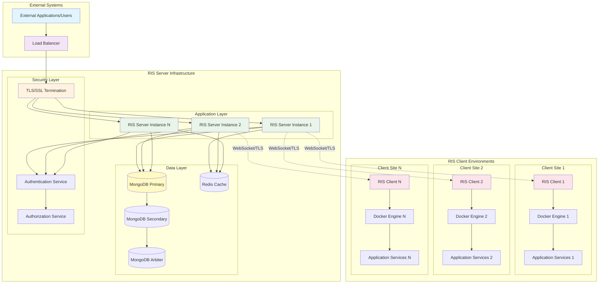

### Deployment Architecture

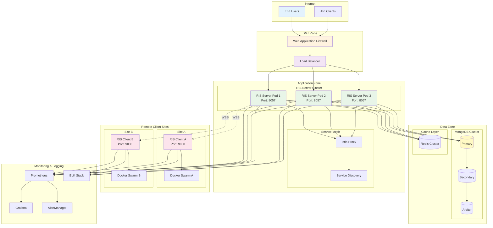

### Component Interaction Architecture

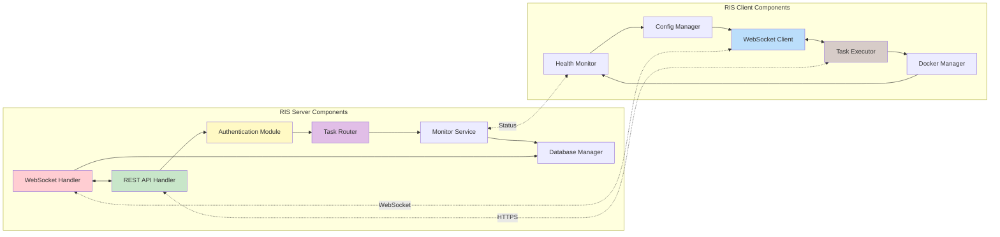

## System Components

The RIS system is architected as a collection of specialized components that work together to provide comprehensive remote service management capabilities. Each component has specific responsibilities and interfaces that enable seamless integration and operation.

### 1. RIS Server Components

The RIS Server serves as the central command and control hub for the entire system, providing unified management, monitoring, and coordination capabilities.

#### Core Application Layer (`zona_ris_server`)

**Main Application Engine**
- **Purpose**: Serves as the primary entry point and orchestration engine for all server operations
- **Responsibilities**: 
  - Application lifecycle management and initialization
  - Graceful startup and shutdown procedures
  - Global error handling and recovery mechanisms
  - Performance monitoring and optimization
- **Key Features**:
  - Multi-threaded request processing with goroutine pools
  - Memory management and garbage collection optimization
  - Configuration hot-reloading capabilities
  - Health check endpoints for load balancer integration

**HTTP/WebSocket Server**
- **Purpose**: Provides dual-protocol communication capabilities for different interaction patterns
- **HTTP Server Capabilities**:
  - RESTful API endpoints for CRUD operations
  - Request routing and middleware processing
  - Content negotiation and response formatting
  - Rate limiting and throttling
- **WebSocket Server Capabilities**:
  - Persistent bidirectional communication channels
  - Real-time event broadcasting
  - Connection lifecycle management
  - Heartbeat and keepalive mechanisms

**TLS Security Engine**
- **Purpose**: Ensures all communications are encrypted and secure
- **Features**:
  - TLS 1.2/1.3 support with configurable cipher suites
  - Certificate management and rotation
  - Perfect Forward Secrecy (PFS)
  - HSTS (HTTP Strict Transport Security) enforcement

**Middleware Infrastructure**
- **Authentication Middleware**: JWT token validation and user session management
- **Authorization Middleware**: Role-based access control and permission enforcement
- **Logging Middleware**: Comprehensive request/response logging with sanitization
- **Metrics Middleware**: Performance metrics collection and aggregation
- **Tenant Isolation Middleware**: Multi-tenant request routing and data isolation

#### Business Logic Layer

**RIS Controller**
- **Client Lifecycle Management**:
  - New client registration and onboarding
  - Client authentication and authorization
  - Connection status monitoring and management
  - Client configuration distribution
- **Operations Management**:
  - Task routing and distribution
  - Load balancing across available clients
  - Failover and recovery coordination
  - Performance optimization and tuning

**Tenant Management Controller**
- **Multi-tenancy Support**:
  - Tenant provisioning and deprovisioning
  - Data isolation and security enforcement
  - Resource allocation and quota management
  - Billing and usage tracking integration
- **Database Management**:
  - Tenant-specific database connections
  - Schema management and migration
  - Backup and disaster recovery coordination

**Task Orchestration Controller**
- **Workflow Management**:
  - Complex task workflow definition and execution
  - Dependency management and sequencing
  - Parallel execution and synchronization
  - Error handling and retry mechanisms
- **Resource Management**:
  - Client capacity monitoring and allocation
  - Queue management and prioritization
  - SLA monitoring and enforcement

#### Data Management Layer

**MongoDB Integration Engine**
- **Primary Database Operations**:
  - Connection pooling and management
  - Transaction coordination and consistency
  - Index optimization and maintenance
  - Query performance monitoring
- **High Availability Features**:
  - Replica set management
  - Automatic failover coordination
  - Read preference optimization
  - Write concern configuration

**Caching Infrastructure**
- **Redis Integration**:
  - Session state management
  - Frequently accessed data caching
  - Pub/sub messaging for real-time events
  - Distributed locking mechanisms
- **Cache Strategies**:
  - Write-through and write-behind caching
  - Cache invalidation and consistency
  - TTL management and optimization
  - Memory usage monitoring and optimization

### 2. RIS Client Components

RIS Clients serve as intelligent agents that execute tasks and manage services in remote environments while maintaining constant communication with the central server.

#### Client Application Core (`zona_task_handler`)

**Application Framework**
- **Purpose**: Provides the foundational runtime environment for client operations
- **Capabilities**:
  - Lightweight, resource-efficient operation
  - Self-monitoring and health reporting
  - Automatic updates and configuration synchronization
  - Local caching and offline operation support
- **Resilience Features**:
  - Circuit breaker patterns for external dependencies
  - Exponential backoff for retry operations
  - Graceful degradation during connectivity issues
  - Local queue management for delayed execution

**WebSocket Client Engine**
- **Connection Management**:
  - Persistent connection establishment and maintenance
  - Automatic reconnection with intelligent backoff
  - Network change detection and adaptation
  - Connection health monitoring and reporting
- **Message Processing**:
  - Real-time command processing
  - Asynchronous response handling
  - Message queuing and delivery guarantees
  - Protocol version negotiation

**Docker Integration Platform**
- **Container Management**:
  - Docker API integration and abstraction
  - Service lifecycle management (create, start, stop, remove)
  - Image management and optimization
  - Resource monitoring and allocation
- **Orchestration Capabilities**:
  - Docker Compose support
  - Swarm mode integration
  - Health check configuration and monitoring
  - Log aggregation and forwarding

#### Task Execution Framework

**Task Handler Controller**
- **Execution Engine**:
  - Multi-protocol task execution (HTTP, shell, Docker)
  - Timeout management and cancellation
  - Resource isolation and sandboxing
  - Result validation and formatting
- **Security Features**:
  - Execution environment isolation
  - Input validation and sanitization
  - Output filtering and anonymization
  - Audit logging for all operations

**Remote Connection Manager**
- **Connectivity Testing**:
  - Network reachability verification
  - Protocol-specific health checks
  - Performance benchmarking
  - Latency and throughput monitoring
- **Authentication Integration**:
  - LDAP/Active Directory connectivity testing
  - Certificate validation and management
  - SSO integration verification
  - Multi-factor authentication support

**Service Management Controller**
- **Docker Service Operations**:
  - Service deployment and scaling
  - Configuration management
  - Version control and rollback
  - Performance monitoring and optimization
- **Application Lifecycle**:
  - Blue-green deployments
  - Canary releases
  - Backup and recovery operations
  - Disaster recovery coordination

#### Client Infrastructure Services

**Network Intelligence Module**
- **Network Discovery**:
  - IP address detection and monitoring
  - Network topology mapping
  - Bandwidth and latency measurement
  - Route optimization
- **Adaptive Connectivity**:
  - Dynamic IP address updates
  - NAT traversal and firewall adaptation
  - VPN and proxy integration
  - Quality of service optimization

**Configuration Management System**
- **Dynamic Configuration**:
  - Real-time configuration updates
  - Configuration validation and rollback
  - Environment-specific settings
  - Secret and credential management
- **Change Management**:
  - Configuration versioning and history
  - Change approval workflows
  - Impact analysis and testing
  - Automated rollback procedures

**Monitoring and Observability**
- **Health Monitoring**:
  - System resource monitoring (CPU, memory, disk)
  - Application performance monitoring
  - Service dependency health checks
  - Predictive failure analysis
- **Logging and Metrics**:
  - Structured logging with correlation IDs
  - Metrics collection and aggregation
  - Distributed tracing support
  - Real-time alerting and notification

## Component Interactions

### 1. Client Registration Flow
```
RIS Client → WebSocket Connection → RIS Server
    │                                    │
    ├─ Send ClientInfo                   ├─ Validate Client
    ├─ Network Detection                 ├─ Update Database
    ├─ Status Updates                    ├─ Send Acknowledgment
    └─ Periodic Heartbeat                └─ Monitor Connection
```

### 2. Task Execution Flow
```
External Request → RIS Server → Target RIS Client
      │                │              │
      ├─ Authentication  ├─ Route Task  ├─ Execute Task
      ├─ Authorization   ├─ Monitor     ├─ Return Result
      └─ Response        └─ Log         └─ Update Status
```

### 3. Service Management Flow
```
Management Request → RIS Client → Docker Engine
        │                │            │
        ├─ Validate       ├─ Parse     ├─ Service Action
        ├─ Authorize      ├─ Execute   ├─ Status Update
        └─ Monitor        └─ Report    └─ Health Check
```

## Data Flow and Process Flows

The RIS system implements sophisticated data flow patterns that ensure reliable, secure, and efficient information exchange between all system components. These flows are designed to handle various operational scenarios while maintaining data integrity and system performance.

### Primary Data Flow Patterns

#### 1. Client Registration and Onboarding Flow

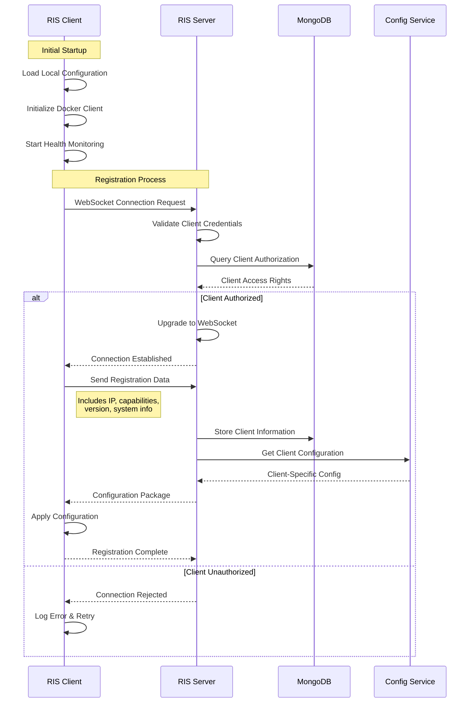

**Detailed Flow Description:**
- **Phase 1 - Client Initialization**: Client loads configuration, initializes Docker client, and starts monitoring services
- **Phase 2 - Connection Establishment**: Secure WebSocket connection with mutual authentication
- **Phase 3 - Registration**: Exchange of client capabilities, system information, and network details
- **Phase 4 - Configuration**: Server provides client-specific configuration and policies
- **Phase 5 - Activation**: Client becomes active and ready for task execution

#### 2. Task Execution Flow Architecture

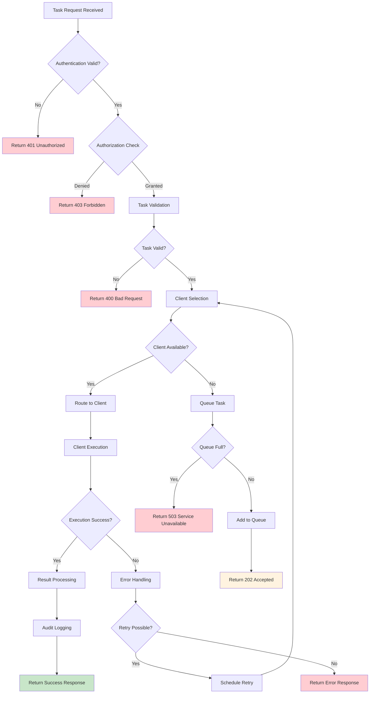

**Task Execution States:**
1. **Queued**: Task accepted and waiting for available client
2. **Routing**: Task being assigned to appropriate client
3. **Executing**: Task currently running on client
4. **Completed**: Task finished successfully
5. **Failed**: Task execution failed
6. **Retrying**: Task being retried after failure
7. **Cancelled**: Task cancelled by user or system

#### 3. Real-time Monitoring and Status Flow

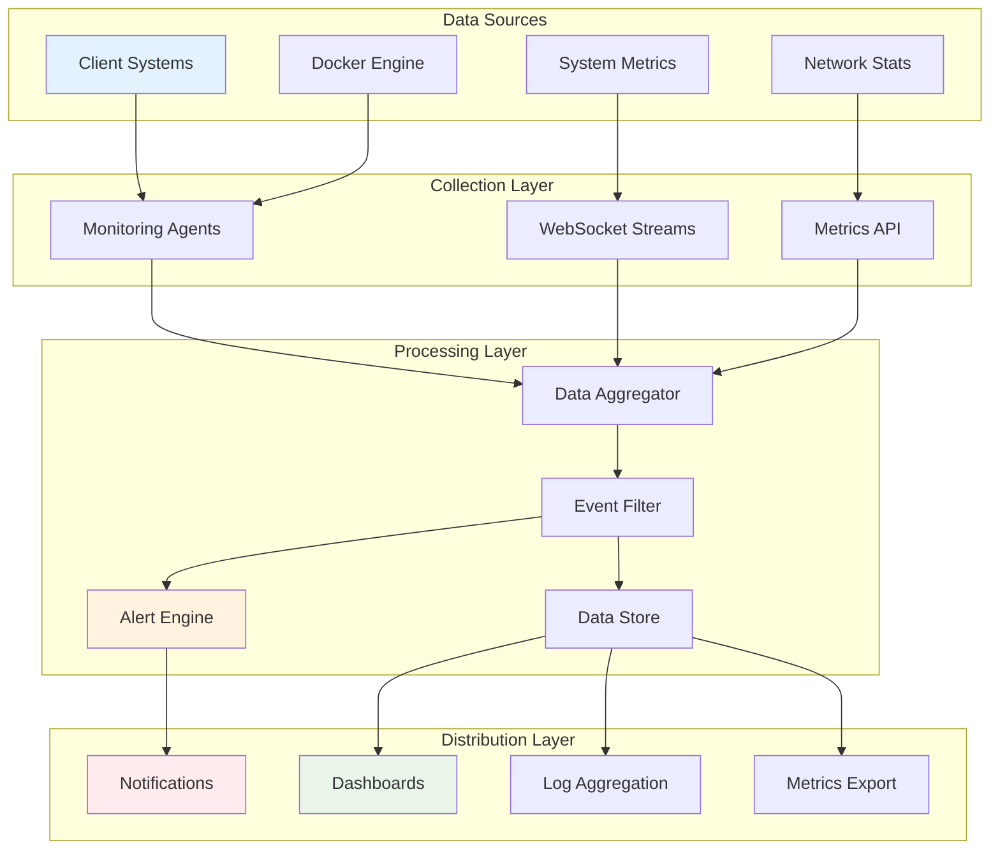

### Advanced Data Flow Scenarios

#### 4. Multi-Tenant Data Isolation Flow

**Tenant Context Propagation:**
1. **Request Ingress**: All requests include tenant identification
2. **Context Extraction**: Middleware extracts and validates tenant context
3. **Session Routing**: Requests routed to tenant-specific database sessions
4. **Data Access**: All data operations scoped to tenant context
5. **Response Isolation**: Responses filtered for tenant-specific data only

**Data Isolation Mechanisms:**
- **Database Level**: Separate databases or collections per tenant
- **Application Level**: Tenant-aware queries and data filtering
- **Network Level**: VLAN or subnet isolation for sensitive tenants
- **Encryption Level**: Tenant-specific encryption keys

#### 5. Configuration Management Flow

**Configuration Distribution Pipeline:**
1. **Configuration Change**: Admin updates configuration through UI/API
2. **Validation**: Configuration validated against schema and policies
3. **Staging**: Configuration deployed to staging environment for testing
4. **Approval**: Change approval workflow (manual or automated)
5. **Rollout**: Phased deployment to production clients
6. **Monitoring**: Real-time monitoring of configuration impact
7. **Rollback**: Automatic rollback on error detection

#### 6. Disaster Recovery Flow

**Failure Detection and Recovery:**
1. **Health Monitoring**: Continuous health checks and monitoring
2. **Failure Detection**: Automated detection of service failures
3. **Impact Assessment**: Analysis of failure scope and impact
4. **Failover Initiation**: Automatic or manual failover procedures
5. **Service Recovery**: Restoration of services on backup infrastructure
6. **Data Synchronization**: Synchronization of data and state
7. **Service Validation**: Comprehensive testing of recovered services
8. **Traffic Restoration**: Gradual restoration of normal traffic flow

### Data Quality and Integrity

#### Data Validation Framework
- **Input Validation**: Schema-based validation for all incoming data
- **Business Rules**: Application of business logic validation
- **Data Consistency**: Cross-reference validation and consistency checks
- **Audit Trail**: Complete audit trail for all data modifications

#### Data Synchronization Strategies
- **Eventually Consistent**: Asynchronous synchronization for performance
- **Strongly Consistent**: Synchronous updates for critical data
- **Conflict Resolution**: Automated conflict detection and resolution
- **Versioning**: Data versioning for conflict resolution and rollback

## Communication Protocols

### 1. WebSocket Protocol
- **Connection Management**: Persistent bidirectional channels
- **Message Format**: JSON-based message structures
- **Heartbeat Mechanism**: Periodic ping/pong for connection health
- **Reconnection Logic**: Automatic reconnection with exponential backoff

### 2. HTTPS/REST API
- **Authentication**: JWT token-based authentication
- **Authorization**: Role-based access control
- **Versioning**: API versioning for backward compatibility
- **Rate Limiting**: Request throttling and quota management

### 3. Docker API
- **Service Management**: Docker Swarm/Compose service operations
- **Container Monitoring**: Health checks and resource monitoring
- **Image Management**: Container image deployment and updates

## Security Architecture

The RIS system implements a comprehensive, defense-in-depth security architecture that protects against a wide range of threats while maintaining system usability and performance. The security model is built on industry best practices and compliance frameworks.

### Security Design Principles

#### 1. Zero Trust Architecture
The system operates on a "never trust, always verify" principle:
- **Identity Verification**: Every user and device must be authenticated
- **Device Validation**: All devices are validated before access
- **Network Segmentation**: Micro-segmentation limits lateral movement
- **Continuous Monitoring**: Real-time security monitoring and analysis

#### 2. Defense in Depth
Multiple layers of security controls:
- **Perimeter Security**: Firewalls, WAF, and DDoS protection
- **Network Security**: VPNs, network segmentation, and monitoring
- **Application Security**: Input validation, output encoding, authentication
- **Data Security**: Encryption, access controls, and data classification
- **Infrastructure Security**: Hardened systems, patch management, monitoring

### Security Layers Implementation

#### Network Security Layer

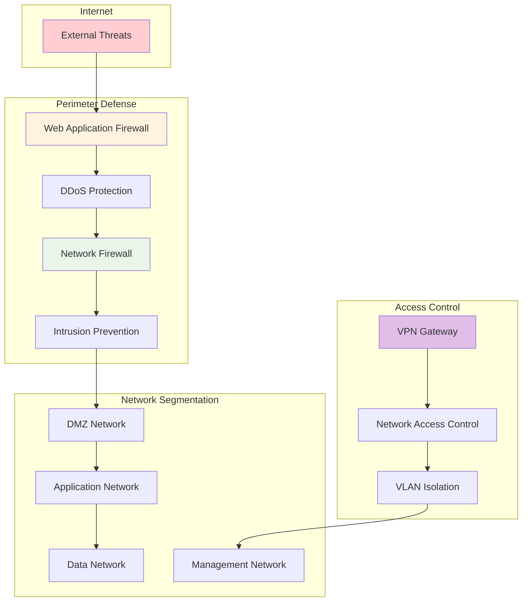

**Network Security Features:**
- **Firewall Rules**: Stateful inspection with application-aware filtering
- **VPN Access**: Site-to-site and remote access VPN with strong encryption
- **Network Segmentation**: Isolated network zones with controlled access
- **Intrusion Detection**: Real-time monitoring for malicious activities
- **DDoS Protection**: Traffic analysis and automated mitigation

#### Application Security Layer

**Authentication and Authorization Framework:**

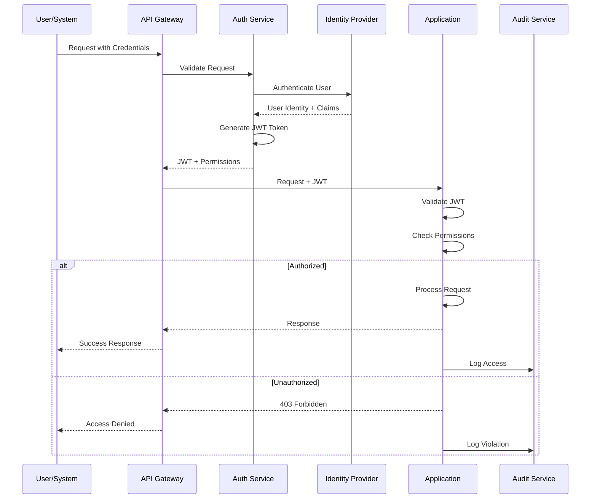

**Security Controls:**
- **Multi-Factor Authentication**: TOTP, SMS, hardware tokens
- **Single Sign-On**: SAML, OAuth 2.0, OpenID Connect integration
- **Role-Based Access Control**: Granular permissions and role inheritance
- **Session Management**: Secure session handling with timeout controls
- **API Security**: Rate limiting, input validation, output encoding

#### Data Security Layer

**Encryption Strategy:**

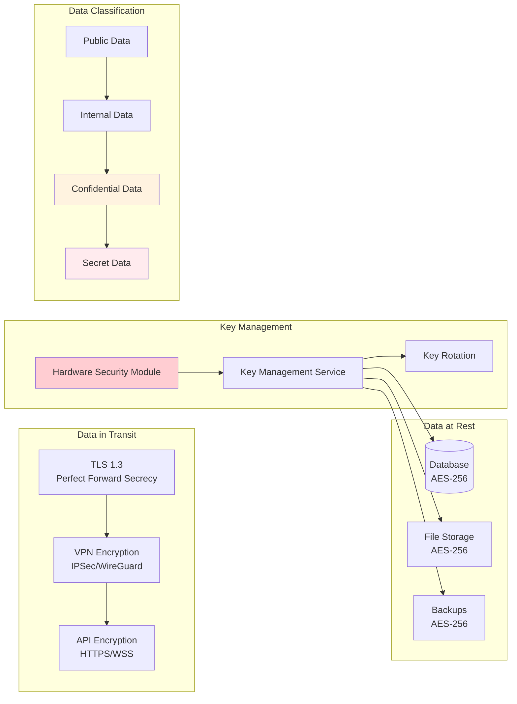

**Data Protection Features:**
- **Encryption at Rest**: AES-256 encryption for all stored data
- **Encryption in Transit**: TLS 1.3 with Perfect Forward Secrecy
- **Key Management**: Hardware Security Module (HSM) for key protection
- **Data Classification**: Automated data classification and labeling
- **Access Logging**: Comprehensive audit trail for all data access
- **Data Loss Prevention**: Monitoring and prevention of data exfiltration

### Compliance and Governance

#### Regulatory Compliance
- **SOC 2 Type II**: Security, availability, processing integrity
- **ISO 27001**: Information security management systems
- **GDPR**: Data protection and privacy compliance
- **HIPAA**: Healthcare data protection (where applicable)
- **PCI DSS**: Payment card industry standards (where applicable)

#### Security Governance Framework
- **Security Policies**: Comprehensive security policy framework
- **Risk Assessment**: Regular security risk assessments and mitigation
- **Incident Response**: 24/7 security incident response procedures
- **Vulnerability Management**: Continuous vulnerability scanning and remediation
- **Security Training**: Regular security awareness training programs

### Threat Detection and Response

#### Security Monitoring

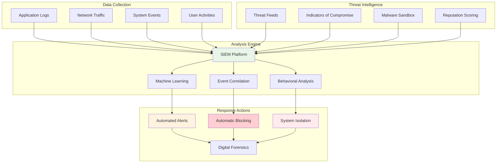

#### Incident Response Procedures
1. **Detection**: Automated threat detection and alert generation
2. **Analysis**: Security team analysis and threat classification
3. **Containment**: Immediate containment to prevent spread
4. **Eradication**: Complete removal of threats and vulnerabilities
5. **Recovery**: Secure restoration of affected systems
6. **Lessons Learned**: Post-incident analysis and improvement

### Security Operations

#### Continuous Security Monitoring
- **24/7 SOC**: Security Operations Center with round-the-clock monitoring
- **Threat Hunting**: Proactive threat hunting and investigation
- **Vulnerability Scanning**: Continuous vulnerability assessment
- **Penetration Testing**: Regular penetration testing and security assessments
- **Security Metrics**: Key security performance indicators and reporting

#### Security Automation
- **Automated Patching**: Automated security patch deployment
- **Threat Response**: Automated incident response and remediation
- **Compliance Monitoring**: Continuous compliance monitoring and reporting
- **Security Orchestration**: SOAR platform integration for workflow automation

## Network Topology

The RIS system implements a sophisticated network architecture designed for security, performance, and scalability. The topology incorporates multiple network zones, redundant paths, and advanced networking features to ensure reliable and secure operations.

### Network Architecture Overview

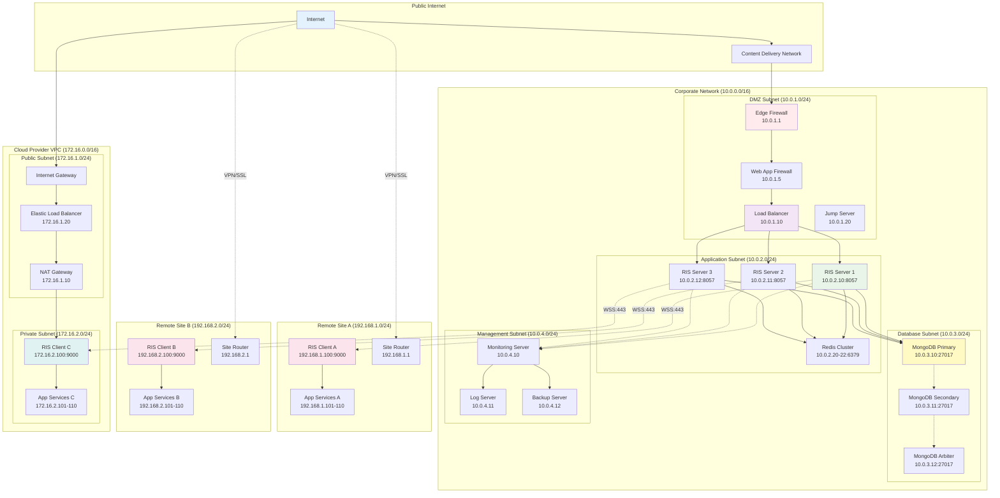

### Network Zones and Segmentation

#### Zone-Based Architecture

**DMZ Zone (Demilitarized Zone)**
- **Purpose**: Hosts public-facing services and security controls
- **Security Level**: High security with restricted access
- **Components**: Firewalls, load balancers, WAF, jump servers
- **Access Control**: Strictly controlled ingress/egress rules

**Application Zone**
- **Purpose**: Hosts core application services
- **Security Level**: Medium security with application-specific controls
- **Components**: RIS servers, application services, caching layer
- **Network Controls**: Inter-service communication policies

**Data Zone**
- **Purpose**: Hosts databases and persistent storage
- **Security Level**: Highest security with minimal external access
- **Components**: MongoDB cluster, backup systems
- **Encryption**: All data encrypted at rest and in transit

**Management Zone**
- **Purpose**: Hosts monitoring, logging, and administrative services
- **Security Level**: High security with audit logging
- **Components**: Monitoring systems, log aggregation, backup services
- **Access**: Restricted to authorized administrators only

### Network Services and Protocols

#### Load Balancing Architecture

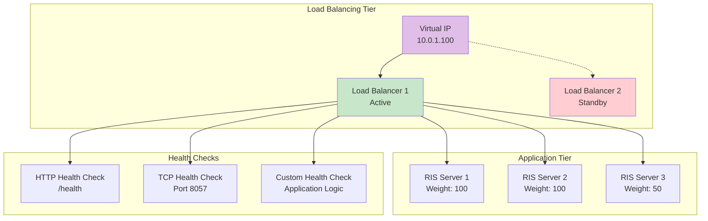

**Load Balancing Features:**
- **Algorithm**: Weighted round-robin with health check integration
- **Session Persistence**: Sticky sessions for WebSocket connections
- **SSL Termination**: TLS termination at load balancer level
- **Health Monitoring**: Multi-tier health checks with automatic failover
- **Geographic Distribution**: Support for multiple data center deployments

#### DNS and Service Discovery

**DNS Architecture:**
- **External DNS**: Public DNS for external service resolution
- **Internal DNS**: Private DNS for internal service discovery
- **Service Discovery**: Consul-based service registration and discovery
- **Load Balancing**: DNS-based load balancing with health checks

### Network Security Implementation

#### Firewall Rules and Policies

**Ingress Rules:**
```
Protocol | Source | Destination | Port | Action | Description
HTTPS   | ANY    | DMZ         | 443  | ALLOW  | Public web access
HTTP    | ANY    | DMZ         | 80   | REDIRECT | Redirect to HTTPS
SSH     | MGMT   | DMZ         | 22   | ALLOW  | Management access
WSS     | CLIENT | APP         | 8057 | ALLOW  | WebSocket connections
```

**East-West Traffic Rules:**
```
Protocol | Source | Destination | Port  | Action | Description
HTTP    | APP    | APP         | 8057  | ALLOW  | Inter-service communication
MongoDB | APP    | DATA        | 27017 | ALLOW  | Database access
Redis   | APP    | APP         | 6379  | ALLOW  | Cache access
ICMP    | ANY    | ANY         | ANY   | ALLOW  | Network diagnostics
```

#### VPN and Remote Access

**Site-to-Site VPN:**
- **Protocol**: IPSec with IKEv2
- **Encryption**: AES-256-GCM with SHA-256 HMAC
- **Authentication**: Pre-shared keys and certificate-based
- **Redundancy**: Multiple VPN tunnels for high availability

**Remote Access VPN:**
- **Protocol**: SSL VPN with OpenVPN or WireGuard
- **Authentication**: Multi-factor authentication required
- **Client Certificates**: X.509 client certificates for device authentication
- **Split Tunneling**: Configured based on security policies

### Network Monitoring and Performance

#### Network Performance Monitoring

**Metrics Collection:**
- **Bandwidth Utilization**: Real-time bandwidth monitoring
- **Latency Measurement**: End-to-end latency tracking
- **Packet Loss Detection**: Network reliability monitoring
- **Connection Quality**: WebSocket connection quality metrics

**Performance Optimization:**
- **Quality of Service (QoS)**: Traffic prioritization and shaping
- **Bandwidth Management**: Dynamic bandwidth allocation
- **Caching Strategies**: Network-level caching for performance
- **Content Delivery**: CDN integration for static content

#### Network Security Monitoring

**Traffic Analysis:**
- **Deep Packet Inspection**: Real-time traffic analysis
- **Anomaly Detection**: ML-based network anomaly detection
- **Threat Intelligence**: Integration with threat intelligence feeds
- **Behavioral Analysis**: Network behavior baseline and deviation detection

**Incident Response:**
- **Automated Blocking**: Automatic blocking of malicious traffic
- **Traffic Redirection**: Redirection of suspicious traffic to honeypots
- **Network Isolation**: Rapid isolation of compromised network segments
- **Forensic Analysis**: Network traffic capture and analysis capabilities

## System Interfaces

### 1. External Interfaces
- **REST API**: Standard HTTP/HTTPS endpoints for external integration
- **WebSocket API**: Real-time bidirectional communication
- **Docker API**: Container and service management
- **Database API**: MongoDB driver for data persistence

### 2. Internal Interfaces
- **Controller Interfaces**: Standardized request/response handling
- **Model Interfaces**: Data access and manipulation
- **Service Interfaces**: Business logic encapsulation

## Scalability and Performance

### 1. Horizontal Scaling
- **Server Clustering**: Multiple RIS server instances with load balancing
- **Database Sharding**: MongoDB replica sets and sharding
- **Client Distribution**: Geographic distribution of RIS clients

### 2. Performance Optimization
- **Connection Pooling**: Efficient database connection management
- **Caching**: Redis/Memory caching for frequently accessed data
- **Async Processing**: Non-blocking I/O and concurrent task execution

### 3. Monitoring and Metrics
- **Real-time Dashboards**: System health and performance monitoring
- **Alerting**: Proactive issue detection and notification
- **Analytics**: Historical data analysis and trending

## Technology Stack

### Server Side
- **Language**: Go (Golang)
- **Web Framework**: Gorilla Mux
- **Database**: MongoDB with replica sets
- **Caching**: Redis/In-memory caching
- **Security**: TLS, JWT, X.509 certificates

### Client Side
- **Language**: Go (Golang)
- **Container Platform**: Docker/Docker Swarm
- **Networking**: WebSocket, HTTPS
- **Configuration**: JSON-based configuration
- **Logging**: Structured logging with rotation

### Infrastructure
- **Containerization**: Docker containers
- **Orchestration**: Docker Swarm/Kubernetes
- **Load Balancing**: NGINX/HAProxy
- **Monitoring**: Prometheus/Grafana
- **Service Mesh**: Istio (optional)

## Quality Attributes

### 1. Reliability
- **High Availability**: 99.9% uptime target
- **Fault Tolerance**: Graceful degradation and recovery
- **Data Consistency**: ACID transactions and data integrity

### 2. Security
- **Defense in Depth**: Multiple security layers
- **Compliance**: Industry standard compliance (SOC2, ISO27001)
- **Vulnerability Management**: Regular security assessments

### 3. Performance
- **Response Time**: <100ms for API calls, <5s for task execution
- **Throughput**: 1000+ concurrent connections per server
- **Scalability**: Linear scaling with additional resources

### 4. Maintainability
- **Modular Design**: Loosely coupled components
- **Documentation**: Comprehensive technical documentation
- **Monitoring**: Detailed logging and metrics collection

## Future Considerations

### 1. Enhancement Opportunities
- **AI/ML Integration**: Intelligent task routing and optimization
- **Multi-cloud Support**: Cross-cloud deployment capabilities
- **Enhanced Security**: Zero-trust architecture implementation

### 2. Technology Evolution
- **Kubernetes Migration**: Container orchestration platform upgrade
- **gRPC Integration**: High-performance RPC communication
- **Event-driven Architecture**: Message queue integration

## Integration Patterns

The RIS system implements various integration patterns to support seamless connectivity with external systems, third-party services, and enterprise infrastructure. These patterns ensure flexibility, reliability, and maintainability of integrations.

### API Integration Patterns

#### 1. RESTful API Gateway Pattern
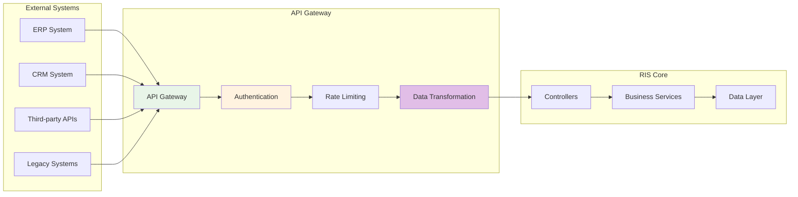

#### 2. Event-Driven Integration Pattern
The system supports asynchronous integration through event-driven patterns:

- **Event Publishing**: System publishes events for external consumption
- **Event Subscription**: System subscribes to external events
- **Event Routing**: Intelligent routing of events to appropriate handlers
- **Event Transformation**: Format transformation for different systems

#### 3. Webhook Integration Pattern
Support for webhook-based integrations:

- **Outbound Webhooks**: RIS system calls external webhook endpoints
- **Inbound Webhooks**: External systems call RIS webhook endpoints
- **Webhook Security**: HMAC signature verification and authentication
- **Retry Logic**: Intelligent retry mechanisms for failed webhook deliveries

### Enterprise Integration Patterns

#### Message Queue Integration
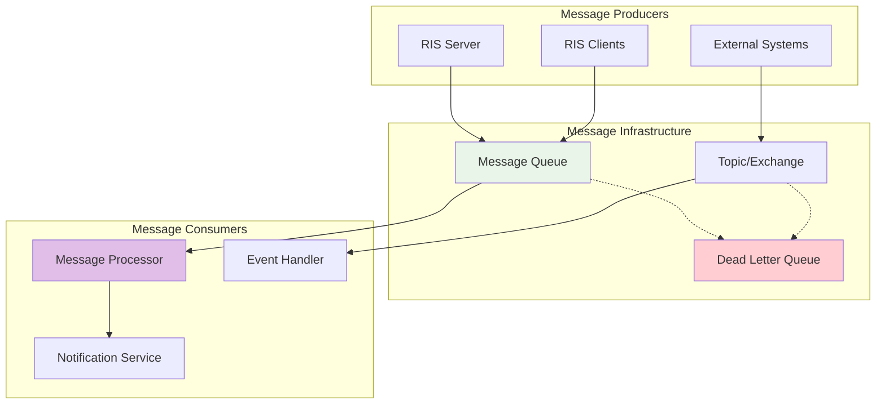

### Database Integration Patterns

#### Multi-Database Support
- **Primary Database**: MongoDB for operational data
- **Time-Series Database**: InfluxDB for metrics and monitoring data
- **Search Engine**: Elasticsearch for full-text search and analytics
- **Cache Layer**: Redis for high-performance caching

#### Data Synchronization Patterns
- **Change Data Capture**: Real-time data change detection and propagation
- **Event Sourcing**: Event-based data synchronization
- **Bulk Synchronization**: Scheduled batch data synchronization
- **Conflict Resolution**: Automated conflict detection and resolution

## Technology Stack Deep Dive

### Server-Side Technology Stack

#### Programming Language and Framework
- **Go (Golang) 1.21+**: High-performance, concurrent programming language
- **Gorilla Mux**: HTTP router and dispatcher for Go
- **Gorilla WebSocket**: WebSocket implementation for real-time communication
- **Standard Library**: Extensive use of Go standard library for reliability

#### Database Technologies
- **MongoDB 6.0+**: Primary NoSQL database with replica set configuration
  - **Features**: ACID transactions, GridFS for file storage, aggregation framework
  - **Drivers**: Official MongoDB Go driver with connection pooling
- **Redis 7.0+**: In-memory data structure store for caching and session management
  - **Features**: Pub/Sub messaging, Redis Cluster for high availability
  - **Use Cases**: Session storage, caching, message queuing

#### Security Technologies
- **TLS 1.3**: Latest transport layer security protocol
- **JWT**: JSON Web Tokens for stateless authentication
- **bcrypt**: Password hashing with configurable cost
- **X.509 Certificates**: Public key infrastructure for client authentication

### Client-Side Technology Stack

#### Container Platform
- **Docker Engine 24.0+**: Container runtime for application packaging
- **Docker Compose**: Multi-container application definition and deployment
- **Docker Swarm**: Optional container orchestration for multi-node deployments

#### Networking and Communication
- **WebSocket Client**: Persistent real-time communication with server
- **HTTP Client**: RESTful API communication
- **Network Discovery**: Automatic network configuration detection

### Infrastructure Technology Stack

#### Orchestration and Deployment
- **Kubernetes 1.28+**: Container orchestration platform (optional)
- **Docker Swarm**: Lightweight container orchestration
- **Helm Charts**: Kubernetes package management
- **Docker Compose**: Development and small-scale deployments

#### Monitoring and Observability
- **Prometheus**: Metrics collection and alerting
- **Grafana**: Visualization and dashboards
- **ELK Stack**: Centralized logging (Elasticsearch, Logstash, Kibana)
- **Jaeger**: Distributed tracing (optional)

#### Load Balancing and Proxy
- **NGINX**: Reverse proxy and load balancer
- **HAProxy**: High-availability load balancer
- **Istio**: Service mesh for advanced traffic management (optional)

## Performance and Scalability Analysis

### Performance Characteristics

#### Throughput Metrics
- **WebSocket Connections**: 1,000+ concurrent connections per server instance
- **HTTP Requests**: 10,000+ requests per second
- **Database Operations**: 5,000+ operations per second
- **Task Execution**: 100+ concurrent task executions

#### Latency Metrics
- **API Response Time**: <100ms for 95% of requests
- **WebSocket Latency**: <50ms for real-time messages
- **Database Query Time**: <10ms for indexed queries
- **Task Execution Time**: <5 seconds for standard operations

### Scalability Strategies

#### Horizontal Scaling
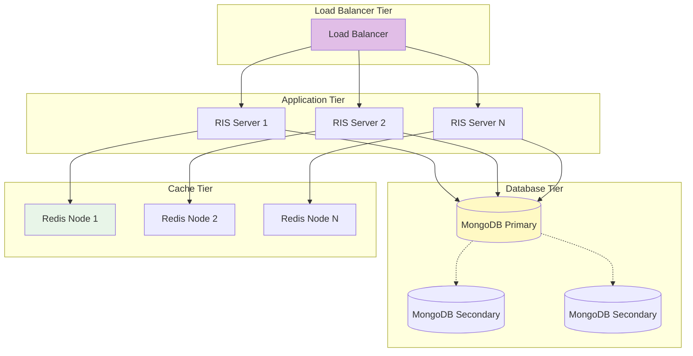

#### Vertical Scaling
- **CPU Scaling**: Multi-core utilization with goroutine-based concurrency
- **Memory Scaling**: Efficient memory management with garbage collection optimization
- **Storage Scaling**: SSD storage with optimized I/O patterns
- **Network Scaling**: High-bandwidth network interfaces

### Performance Optimization Techniques

#### Database Optimization
- **Index Strategy**: Comprehensive indexing for query optimization
- **Connection Pooling**: Efficient database connection management
- **Query Optimization**: Query plan analysis and optimization
- **Caching Strategy**: Multi-level caching for frequent operations

#### Application Optimization
- **Goroutine Pools**: Worker pool pattern for concurrent processing
- **Memory Management**: Efficient memory allocation and garbage collection
- **Protocol Optimization**: Binary protocols for high-performance communication
- **Compression**: Data compression for network and storage efficiency

---

*Document Version: 2.0*  
*Last Updated: October 6, 2025*  
*Comprehensive High-Level Design for RIS System*