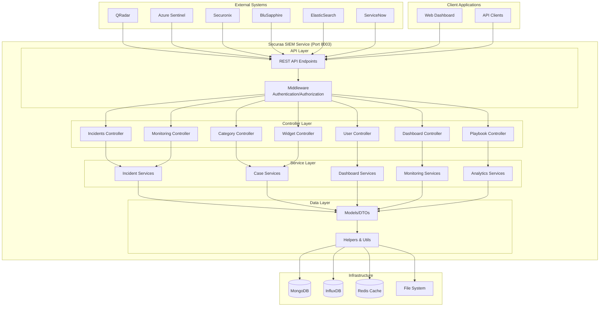
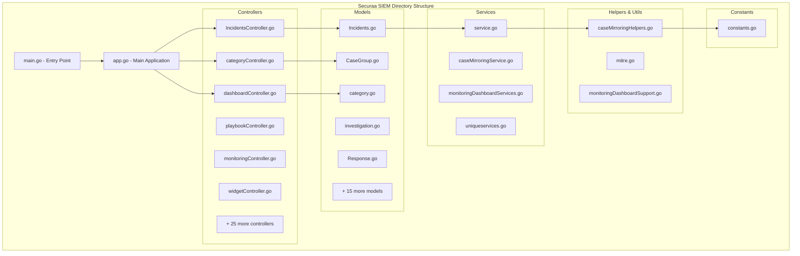
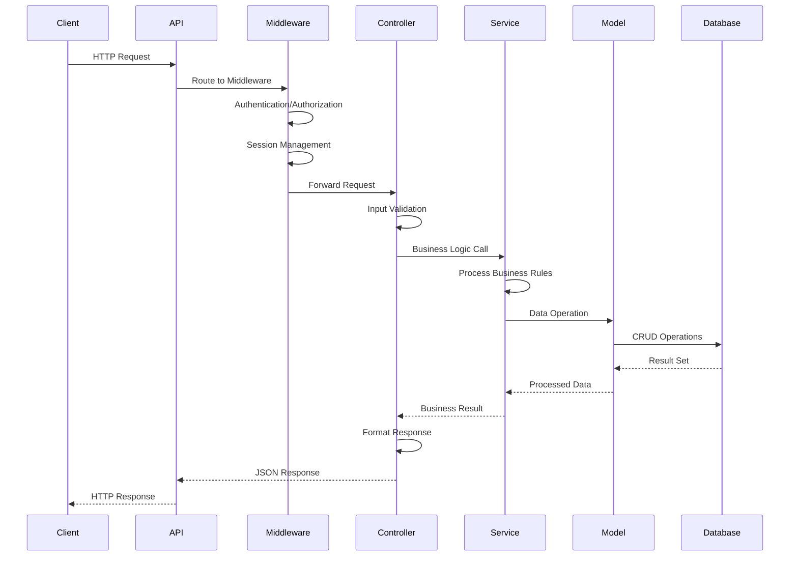
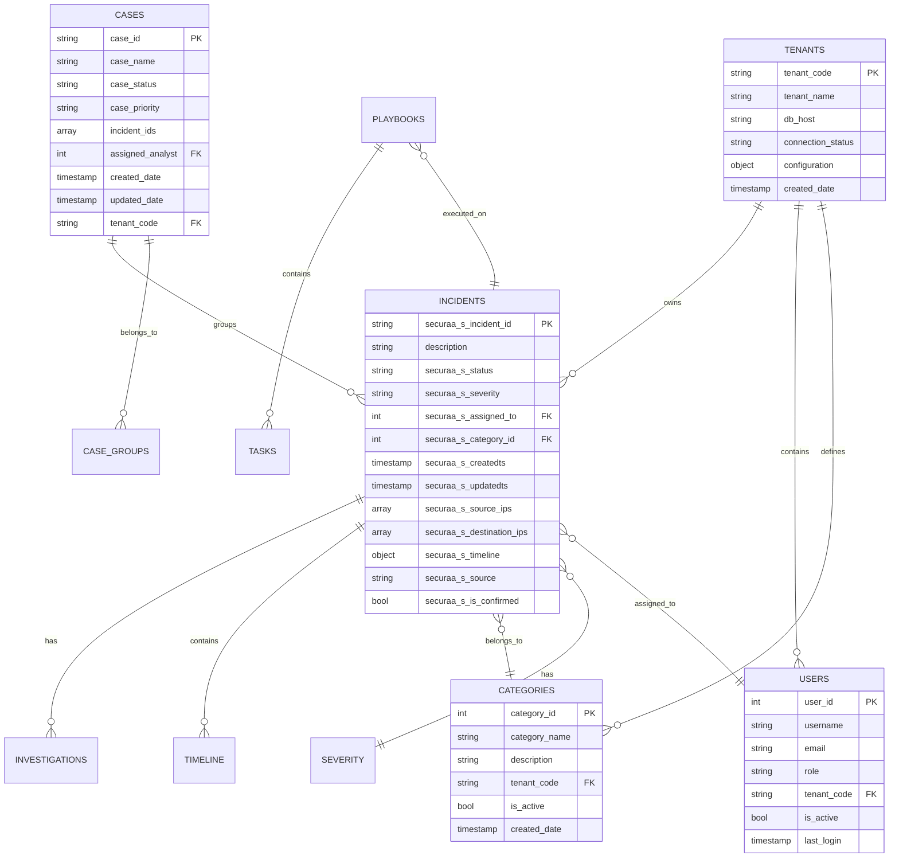
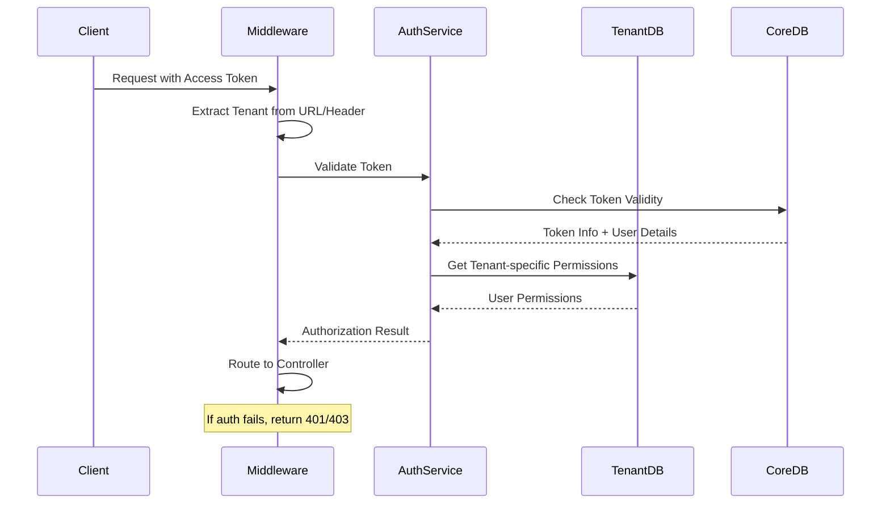
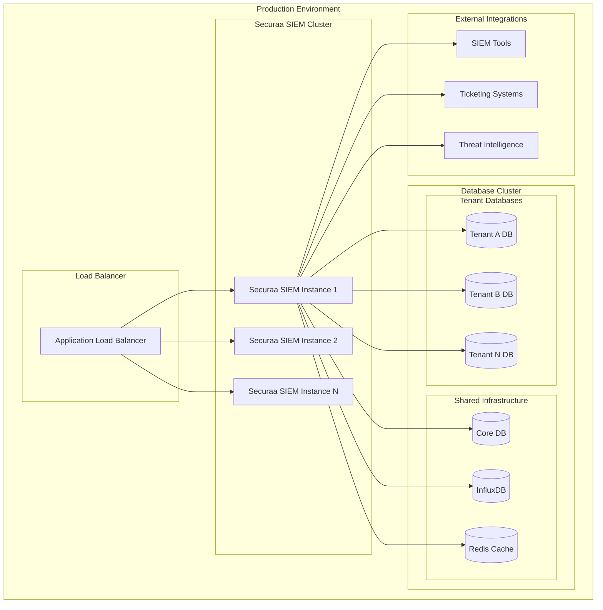
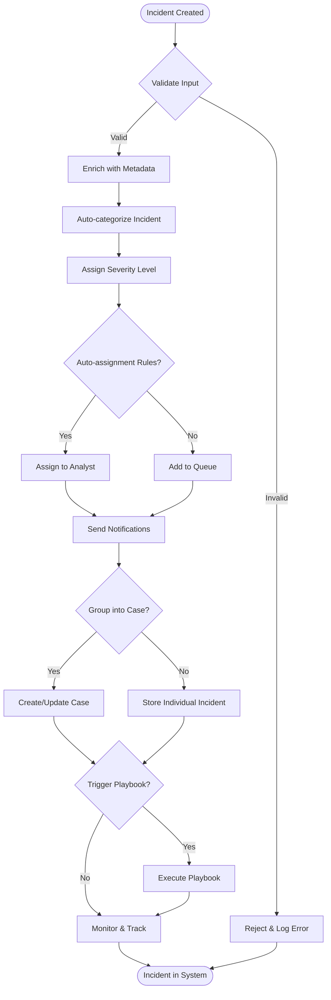
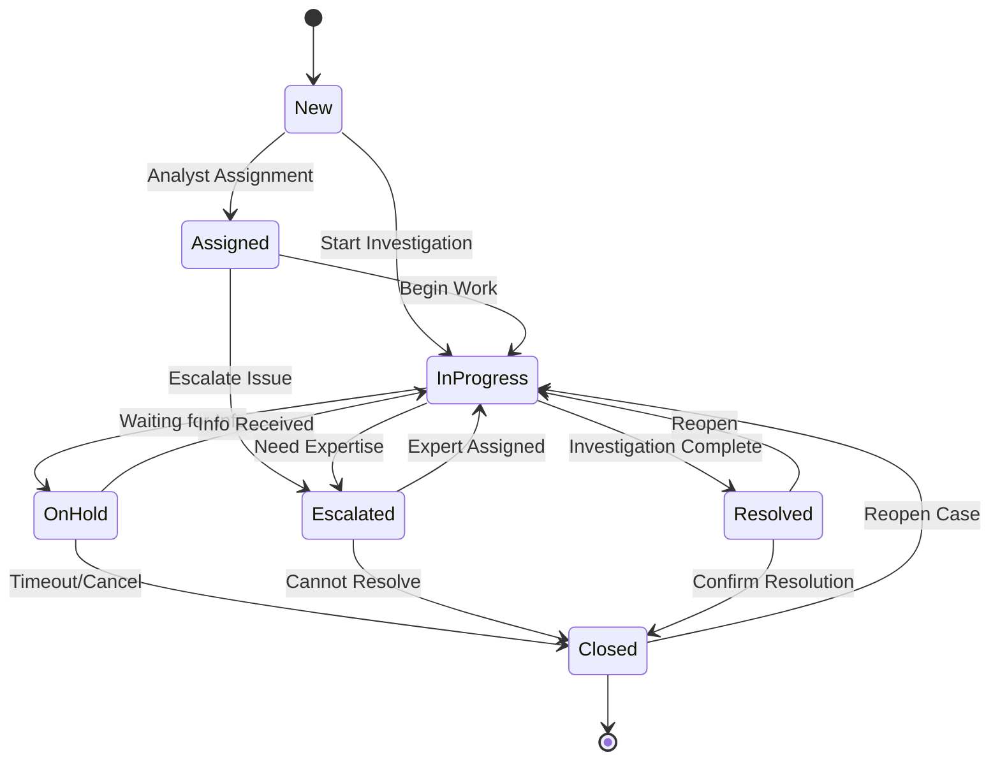
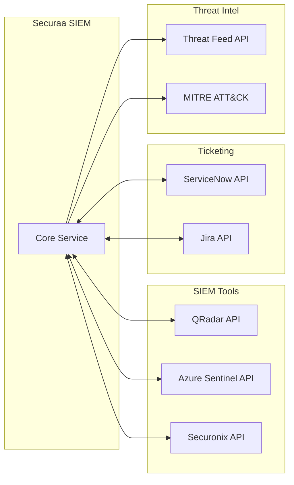

# Securaa SIEM Service - High-Level Design Document

## 1. Executive Summary

The **Securaa SIEM (Security Information and Event Management)** service is a comprehensive, multi-tenant security platform designed to collect, process, analyze, and manage security incidents and events. It provides APIs for incident management, case handling, dashboard analytics, playbook automation, and integrations with external SIEM tools.

---

## 2. System Architecture Overview



---

## 3. Detailed Component Architecture

### 3.1 Application Structure



### 3.2 Data Flow Architecture



---

## 4. Core Features & Capabilities

### 4.1 Incident Management
- **Incident CRUD Operations**: Create, Read, Update, Delete incidents
- **Incident Status Management**: Open, In Progress, Closed, Escalated
- **Incident Assignment**: Assign to analysts/teams
- **Incident Categorization**: Security categories and severity levels
- **Incident Timeline**: Track all actions and changes
- **Bulk Operations**: Update/delete multiple incidents

### 4.2 Case Management
- **Case Grouping**: Group related incidents into cases
- **Case Mirroring**: Synchronize cases across tenants
- **Case Workflow**: Define case lifecycle and approval processes
- **Case Analytics**: Generate insights from case data
- **Case Export**: Download case data in various formats

### 4.3 Dashboard & Analytics
- **Real-time Dashboards**: Live security metrics and KPIs
- **Custom Widgets**: Configurable dashboard components
- **Trend Analysis**: Historical data analysis and forecasting
- **Geographic Analysis**: Location-based threat visualization
- **MITRE ATT&CK Mapping**: Threat technique classification

### 4.4 Integration & Data Sources
- **SIEM Tool Integration**: QRadar, Splunk, Azure Sentinel, etc.
- **Ticketing System Integration**: ServiceNow, Jira
- **Threat Intelligence**: External threat feed integration
- **API Gateway**: RESTful APIs for third-party integrations

### 4.5 Multi-Tenant Architecture
- **Tenant Isolation**: Complete data separation between tenants
- **Tenant-specific Configuration**: Custom settings per tenant
- **Cross-tenant Analytics**: Master tenant view capabilities
- **Tenant Onboarding**: Automated tenant setup and configuration

---

## 5. Database Design

### 5.1 Core Collections/Tables



### 5.2 Key Data Models

#### SecuraaOffenses (Main Incident Model)
```go
type SecuraaOffenses struct {
    SecuraaSIncidentID           int                `json:"securaa_s_incident_id"`
    SecuraaDescription           string             `json:"description"`
    SecuraaSStatus              string             `json:"securaa_s_status"`
    SecuraaSSeverity            string             `json:"securaa_s_severity"`
    SecuraaSAssignedTo          int                `json:"securaa_s_assigned_to"`
    SecuraaScategoryID          int                `json:"securaa_s_category_id"`
    SecuraaSTimeline            []IncidentTimeLine `json:"securaa_s_timeline"`
    SecuraaSSourceIPs           []string           `json:"securaa_s_source_ips"`
    SecuraaSDestinationIPs      []string           `json:"securaa_s_destination_ips"`
    SecuraaSCreatedts           int64              `json:"securaa_s_createdts"`
    SecuraaSUpdatedts           int64              `json:"securaa_s_updatedts"`
    // ... additional fields
}
```

#### CaseGrouping Model
```go
type CaseGrouping struct {
    CaseID          string    `json:"case_id"`
    CaseName        string    `json:"case_name"`
    CaseStatus      string    `json:"case_status"`
    CasePriority    string    `json:"case_priority"`
    IncidentIDs     []string  `json:"incident_ids"`
    AssignedAnalyst int       `json:"assigned_analyst"`
    TenantCode      string    `json:"tenant_code"`
    CreatedDate     time.Time `json:"created_date"`
}
```

---

## 6. API Design

### 6.1 Core API Categories

```mermaid
graph LR
    subgraph "Securaa SIEM APIs"
        subgraph "Incident APIs"
            I1[GET /securaaincidentslist]
            I2[GET /securaaincident/{id}]
            I3[POST /securaaincident]
            I4[PUT /securaaincident]
            I5[DELETE /deletemultipleincidents]
        end
        
        subgraph "Case APIs"
            C1[GET /getalltenantscases]
            C2[POST /createcasegroup]
            C3[PUT /updatecasestatus]
            C4[GET /getcasescount]
        end
        
        subgraph "Dashboard APIs"
            D1[GET /getmeantimetodetect]
            D2[GET /getmeantimetoacknowledge]
            D3[GET /geographicalalerts]
            D4[GET /incidentsbycategory]
        end
        
        subgraph "Analytics APIs"
            A1[GET /cyberkillchain]
            A2[GET /analystworkload]
            A3[GET /incidenttrends]
            A4[GET /threatactors]
        end
        
        subgraph "Configuration APIs"
            CF1[GET /categories]
            CF2[POST /categories]
            CF3[GET /severities]
            CF4[GET /sla]
        end
    end
```

### 6.2 Authentication & Authorization Flow



---

## 7. Technology Stack

### 7.1 Core Technologies
- **Programming Language**: Go (Golang) 1.17+
- **Web Framework**: Gorilla Mux (HTTP routing)
- **Database**: MongoDB (Primary), InfluxDB (Metrics)
- **Caching**: Redis
- **Containerization**: Docker
- **Build System**: Makefile

### 7.2 External Dependencies
- **SIEM Integrations**: QRadar, Azure Sentinel, Securonix, BluSapphire
- **Ticketing Systems**: ServiceNow integration
- **File Processing**: Excel/CSV export capabilities
- **Monitoring**: InfluxDB for system metrics
- **Security**: JWT token-based authentication

### 7.3 Libraries & Frameworks
```go
// Key Go modules
go.mongodb.org/mongo-driver    // MongoDB driver
github.com/gorilla/mux         // HTTP router
github.com/influxdata/influxdb-client-go/v2  // InfluxDB client
github.com/Luxurioust/excelize  // Excel processing
```

---

## 8. Security & Compliance

### 8.1 Security Features
- **Multi-factor Authentication**: Token-based auth with session management
- **Role-based Access Control**: Granular permissions per tenant
- **Data Encryption**: At-rest and in-transit encryption
- **Audit Logging**: Complete audit trail for all operations
- **Input Validation**: Comprehensive input sanitization
- **Session Management**: Secure session handling with timeouts

### 8.2 Compliance Standards
- **SOC 2**: Security controls and monitoring
- **ISO 27001**: Information security management
- **GDPR**: Data privacy and protection
- **NIST Cybersecurity Framework**: Security standards alignment

---

## 9. Performance & Scalability

### 9.1 Performance Characteristics
- **Horizontal Scaling**: Multi-tenant architecture supports scaling
- **Database Optimization**: Indexed queries and aggregation pipelines
- **Caching Strategy**: Redis caching for frequently accessed data
- **Connection Pooling**: Efficient database connection management
- **Background Processing**: Asynchronous task processing

### 9.2 Monitoring & Metrics
- **System Metrics**: CPU, Memory, Disk usage via InfluxDB
- **Application Metrics**: API response times, error rates
- **Business Metrics**: Incident volumes, case resolution times
- **Health Checks**: Service availability monitoring

---

## 10. Deployment Architecture

### 10.1 Multi-Tenant Deployment Model



### 10.2 Configuration Management
- **Environment-specific Configs**: Development, staging, production
- **Tenant-specific Settings**: Per-tenant customization
- **Feature Flags**: Dynamic feature enablement
- **Secret Management**: Secure credential storage

---

## 11. Business Logic Flow

### 11.1 Incident Processing Workflow



### 11.2 Case Management Workflow



---

## 12. Integration Points

### 12.1 SIEM Tool Integrations

| SIEM Tool | Integration Type | Data Flow | Authentication |
|-----------|------------------|-----------|----------------|
| QRadar | REST API | Bi-directional | API Key/OAuth |
| Azure Sentinel | REST API | Pull/Push | Service Principal |
| Securonix | REST API | Pull | API Token |
| BluSapphire | REST API | Pull | API Key |
| ElasticSearch | REST API | Pull/Push | Basic Auth |

### 12.2 External System APIs



---

## 13. Error Handling & Resilience

### 13.1 Error Handling Strategy
- **Graceful Degradation**: Service continues with reduced functionality
- **Circuit Breaker Pattern**: Prevent cascade failures
- **Retry Mechanisms**: Configurable retry policies
- **Dead Letter Queues**: Handle failed message processing
- **Comprehensive Logging**: Structured logging for debugging

### 13.2 Disaster Recovery
- **Database Backups**: Regular automated backups
- **Multi-region Deployment**: Geographic redundancy
- **Health Monitoring**: Proactive health checks
- **Failover Procedures**: Automated failover capabilities

---

## 14. Future Roadmap

### 14.1 Planned Enhancements
- **Machine Learning Integration**: AI-powered threat detection
- **Advanced Analytics**: Predictive analytics capabilities
- **API Gateway**: Centralized API management
- **Microservices Migration**: Break down into smaller services

### 14.2 Technology Upgrades
- **Go Version**: Upgrade to latest Go versions
- **Database Optimization**: Performance improvements
- **Cloud Native**: Cloud-first architecture
- **Real-time Processing**: Stream processing capabilities

---

## 15. Conclusion

The Securaa SIEM service represents a comprehensive, enterprise-grade security information and event management platform. Its multi-tenant architecture, extensive integration capabilities, and robust feature set make it suitable for organizations of all sizes looking to enhance their security operations.

The modular design allows for easy maintenance and extension, while the Go-based implementation ensures high performance and scalability. The extensive API surface area provides flexibility for integration with existing security tools and workflows.

This high-level design serves as a blueprint for understanding the system architecture, data flows, and key components that make up the Securaa SIEM service.
