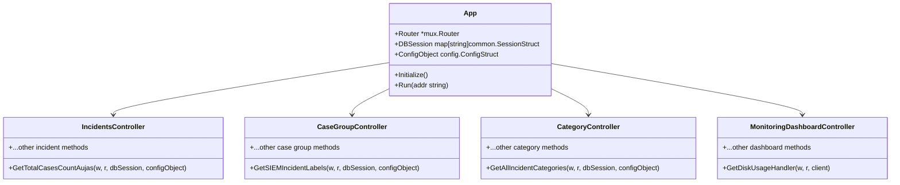
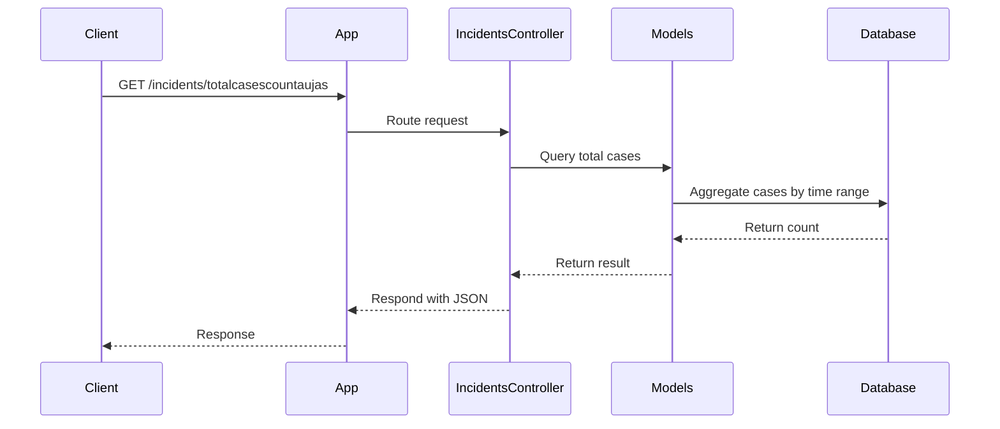

# zona_siem Service

## Overview

`zona_siem` is a multi-tenant Security Information and Event Management (SIEM) service written in Go. It provides RESTful APIs for incident and case management, dashboard analytics, playbook automation, and integrations with external SIEM tools. The service is modular, scalable, and designed for extensibility.

---

## Directory Structure

```
zona_siem/
├── controllers/   # API endpoint handlers
├── services/      # Business logic modules
├── models/        # Data models and DB access
├── helpers/       # Utility functions
├── utils/         # Shared utilities
├── constant/      # Application-wide constants
├── main.go        # Service entry point
├── app.go         # Application setup and router
```

---

## Component Design

### Main Components

- **controllers/**: Handles HTTP requests, authentication, and input validation.
- **services/**: Implements business logic (incident processing, case management, dashboard metrics).
- **models/**: Defines data structures and manages database operations.
- **helpers/**: Provides reusable functions (e.g., MITRE mapping, case mirroring).
- **utils/**: Shared utility functions.
- **constant/**: Centralized configuration and static values.

---

### Class Diagram (Mermaid)



---

## Data Structures

### Incident (ZonaOffenses)

```go
type ZonaOffenses struct {
    ZonaZIncidentID int `json:"zona_z_incident_id" bson:"zona_z_incident_id"`
    ZonaCredibility int `json:"zona_credibility" bson:"credibility"`
    ZonaSourceAddressIDs []int `json:"zona_source_address_ids" bson:"source_address_ids"`
    ZonaRemoteDestinationCount int `json:"zona_remote_destination_count" bson:"remote_destination_count"`
    ZonaLocalDestinationAddressIDs []int `json:"zona_local_destination_address_ids" bson:"local_destination_address_ids"`
    ZonaAssignedTo interface{} `json:"zona_assigned_to" bson:"zona_assigned_to"`
    ZonaLocalDestinationCount int `json:"zona_local_destination_count" bson:"local_destination_count"`
    ZonaSourceCount int `json:"zona_source_count" bson:"source_count"`
    ZonaStartTime int64 `json:"zona_start_time" bson:"start_time"`
    // ... more fields
}
```

### Case Grouping

```go
type CaseGrouping struct {
    GroupName string `json:"group_name" bson:"group_name"`
    CaseID int `json:"caseid" bson:"caseid"`
    CaseSource string `json:"case_source" bson:"case_source"`
    Category string `json:"category" bson:"category"`
    // ... more fields
}
```

### Category

```go
type Category struct {
    ID int `json:"id" bson:"id"`
    Name string `json:"name" bson:"name"`
    Status string `json:"status" bson:"status"`
    TenantCode string `json:"tenantcode" bson:"tenantcode"`
    // ... more fields
}
```

### Monitoring Dashboard

```go
type DiskUsage struct {
    Total string `json:"total"`
    Used string `json:"used"`
    Remaining string `json:"remaining"`
    UtilizationPercent string `json:"utilization_percent"`
}
```

---

## Database Design

### Entity Relationship Diagram (Mermaid)

```mermaid
erDiagram
    ZONAOFFENSES ||--o{ CASEGROUPING : grouped_in
    ZONAOFFENSES {
        int zona_z_incident_id PK
        int zona_credibility
        ...
    }
    CASEGROUPING {
        int caseid PK
        string group_name
        string category
        ...
    }
    CATEGORY {
        int id PK
        string name
        string status
        string tenantcode
        ...
    }
```

---

## API Design

### Example Endpoints

- `/incidents/totalcasescountaujas` (GET): Get total cases count for a tenant in a time range
- `/casegroup/siemincidentlabels` (GET): Get SIEM incident labels for a tenant
- `/category/allincidentcategories` (GET): Get all incident categories for a tenant
- `/dashboard/diskusage` (GET): Get disk usage metrics

### Request/Response Example

**Request:**
```json
GET /incidents/totalcasescountaujas?tenantcode=abc&from_date=1690000000&to_date=1699999999
```

**Response:**
```json
{
  "success": true,
  "data": {
    "total_cases": 42
  }
}
```

---

## Sequence Diagram: Incident Count Retrieval



---

## Configuration & Constants

- Constants are defined in `constant/constants.go` (e.g., default columns, function names).
- Configuration is loaded via `ConfigObject` in `app.go`.
- Environment variables and config files are used for DB, SIEM endpoints, and secrets.

---

## Error Handling & Logging

- Errors are handled in controllers and returned as JSON responses.
- Logging is performed using `securaalog`.
- Standardized error messages and paths for debugging.

---

## Performance & Scalability

- Uses MongoDB for scalable data storage.
- Modular controller/service/model structure for maintainability.
- Can be containerized and deployed with Docker.
- Caching and aggregation for dashboard metrics.

---

## Getting Started

1. Clone the repository.
2. Configure environment variables and config files.
3. Build and run the service:
   ```bash
   go build -o zona_siem
   ./zona_siem
   ```
4. Access APIs on the configured port (default: 8003).

---

## Contact & Contribution

For questions or contributions, please open an issue or pull request.

---

**End of README**
