# Securaa User Service - High Level Design

## 🎯 **EXECUTIVE OVERVIEW**

### ⚠️ **CRITICAL SERVICE CLASSIFICATION**
The Securaa User Service is a **mission-critical component** that serves as the foundation of the entire Securaa security platform ecosystem. This service is the central nervous system for security operations, handling all aspects of user identity, access control, and tenant management across the platform.

**Critical Impact Areas:**
- **Security Posture**: Controls access to all security operations and sensitive data
- **Compliance Requirements**: Manages audit trails and regulatory compliance
- **Business Continuity**: Essential for all platform operations and user workflows
- **Data Protection**: Enforces data access policies and tenant isolation
- **Operational Excellence**: Enables monitoring, alerting, and incident response

### 🎯 **BUSINESS CONTEXT & OBJECTIVES**

#### Primary Business Functions
- **Identity & Access Management (IAM)**: Centralized authentication and authorization
- **Multi-Tenant Security**: Secure isolation and resource management across tenants  
- **Compliance Management**: Audit trails, access controls, and regulatory compliance
- **Security Operations**: Real-time monitoring, threat detection, and incident response
- **Enterprise Integration**: Seamless integration with corporate identity systems

#### Key Business Stakeholders
- **Security Teams**: Threat analysts, SOC operators, security engineers
- **Compliance Officers**: Audit managers, risk assessors, compliance specialists
- **IT Operations**: Infrastructure teams, platform engineers, DevOps specialists
- **Business Users**: End users, administrators, tenant managers
- **Executive Leadership**: CISOs, CTOs, risk management executives

## 🏗️ **SYSTEM ARCHITECTURE OVERVIEW**

### **High-Level System Architecture**

The Securaa User Service follows a **microservice architecture** deployed on traditional servers or cloud infrastructure without container orchestration. The system is designed for high availability through load balancing and database replication.

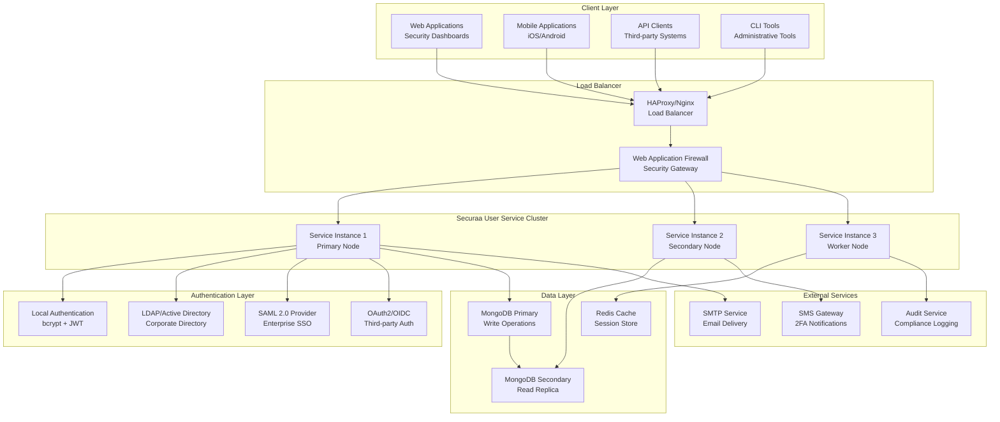

**Architecture Overview:**
This architecture represents a traditional three-tier application deployed across multiple servers for high availability. The system uses:
- **Load Balancing**: HAProxy or Nginx for traffic distribution
- **Service Clustering**: Multiple service instances for redundancy
- **Database Replication**: MongoDB primary-secondary setup
- **Caching Layer**: Redis for session management and performance
- **External Integrations**: SMTP, SMS, and audit services

### **Enterprise Security Architecture**

The security architecture implements a **defense-in-depth approach** with multiple security layers protecting the Securaa User Service. Each layer provides specific security controls and works together to create a comprehensive security posture.

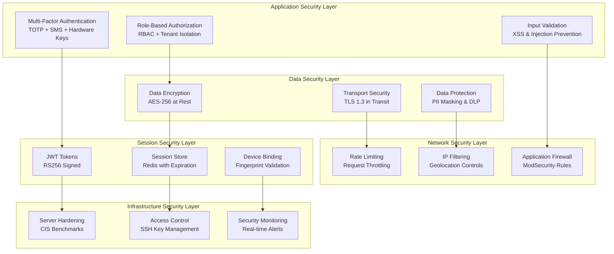

**Security Implementation Details:**

**Layer 1 - Application Security:**
- **Authentication**: Supports local credentials, LDAP/AD, SAML 2.0, and OAuth2 with mandatory MFA for privileged accounts
- **Authorization**: Implements RBAC with fine-grained permissions and complete tenant data isolation
- **Input Validation**: Comprehensive sanitization preventing SQL/NoSQL injection, XSS, and CSRF attacks

**Layer 2 - Data Security:**
- **Encryption at Rest**: All sensitive data encrypted using AES-256 with rotating keys
- **Encryption in Transit**: TLS 1.3 for all communications with perfect forward secrecy
- **Data Protection**: PII masking in logs and exports with DLP controls

**Layer 3 - Session Security:**
- **JWT Implementation**: Stateless tokens signed with RS256 algorithm
- **Session Management**: Redis-backed sessions with configurable timeouts
- **Device Security**: Browser fingerprinting and device binding for anomaly detection

**Layer 4 - Network Security:**
- **Web Application Firewall**: ModSecurity with OWASP Core Rule Set
- **Rate Limiting**: Configurable request throttling per IP and user
- **Access Controls**: IP whitelisting and geolocation-based restrictions

**Layer 5 - Infrastructure Security:**
- **Server Hardening**: CIS benchmark compliance with automated configuration management
- **Access Management**: SSH key-based authentication with audit logging
- **Monitoring**: Real-time security event monitoring with automated alerting

## 🎯 **CORE BUSINESS CAPABILITIES**

### **Enterprise Identity & Access Management**

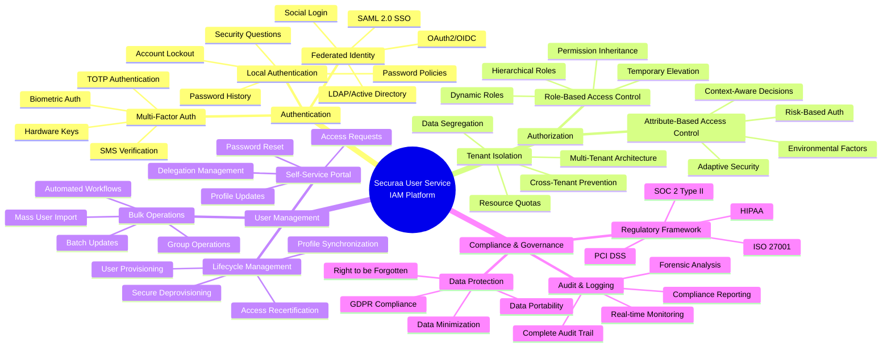

### **Multi-Tenant Architecture Capabilities**

```mermaid
graph TB
    subgraph "Tenant Management Ecosystem"
        subgraph "Tenant Onboarding"
            TENANT_CREATE[Tenant Creation<br/>Automated Provisioning]
            TENANT_CONFIG[Configuration<br/>Custom Settings]
            TENANT_BRANDING[White-Label<br/>Custom Branding]
            TENANT_INTEGRATION[Integration Setup<br/>External Systems]
        end
        
        subgraph "Resource Management"
            QUOTA_MGT[Resource Quotas<br/>CPU/Memory/Storage]
            RATE_LIMITING[API Rate Limiting<br/>Per-tenant Throttling]
            PERFORMANCE_SLA[Performance SLAs<br/>Guaranteed Response Times]
            COST_ALLOCATION[Cost Allocation<br/>Usage-based Billing]
        end
        
        subgraph "Data Isolation"
            LOGICAL_SEPARATION[Logical Separation<br/>Database Schemas]
            PHYSICAL_ISOLATION[Physical Isolation<br/>Dedicated Resources]
            ENCRYPTION_KEYS[Tenant-Specific Keys<br/>Crypto Boundaries]
            DATA_RESIDENCY[Data Residency<br/>Geographic Controls]
        end
        
        subgraph "Security Controls"
            TENANT_RBAC[Tenant-specific RBAC<br/>Role Hierarchies]
            CROSS_TENANT_PREVENTION[Cross-tenant Prevention<br/>Access Controls]
            SECURITY_POLICIES[Security Policies<br/>Custom Rules]
            COMPLIANCE_BOUNDARIES[Compliance Boundaries<br/>Regulatory Controls]
        end
        
        subgraph "Operational Excellence"
            MONITORING[Tenant Monitoring<br/>Usage Analytics]
            BACKUP_RECOVERY[Backup & Recovery<br/>Per-tenant Policies]
            DISASTER_RECOVERY[Disaster Recovery<br/>Business Continuity]
            SUPPORT_ESCALATION[Support Escalation<br/>Tenant-specific SLAs]
        end
    end
    
    %% Flow Connections
    TENANT_CREATE --> TENANT_CONFIG
    TENANT_CONFIG --> TENANT_BRANDING
    TENANT_BRANDING --> TENANT_INTEGRATION
    
    QUOTA_MGT --> RATE_LIMITING
    RATE_LIMITING --> PERFORMANCE_SLA
    PERFORMANCE_SLA --> COST_ALLOCATION
    
    LOGICAL_SEPARATION --> PHYSICAL_ISOLATION
    PHYSICAL_ISOLATION --> ENCRYPTION_KEYS
    ENCRYPTION_KEYS --> DATA_RESIDENCY
    
    TENANT_RBAC --> CROSS_TENANT_PREVENTION
    CROSS_TENANT_PREVENTION --> SECURITY_POLICIES
    SECURITY_POLICIES --> COMPLIANCE_BOUNDARIES
    
    MONITORING --> BACKUP_RECOVERY
    BACKUP_RECOVERY --> DISASTER_RECOVERY
    DISASTER_RECOVERY --> SUPPORT_ESCALATION
```

## 🔄 **CRITICAL BUSINESS PROCESSES**

### **User Authentication Flow**

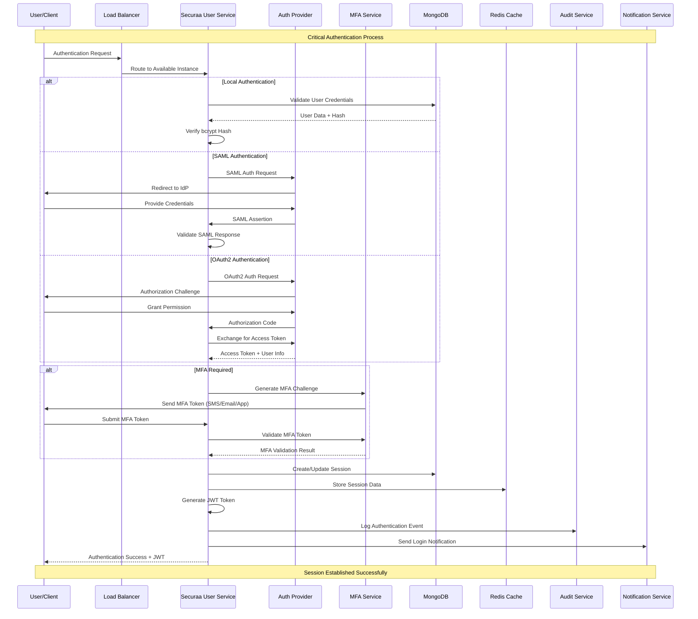

### **Real-Time Notification System**

The notification system processes security events and user activities in real-time, delivering alerts through multiple channels. The system is designed for high throughput and reliable delivery with comprehensive audit trails.

**System Components:**

**Event Processing Pipeline:**
The notification system begins with event ingestion from multiple sources including security monitors, user actions, and system events. Each event undergoes validation, enrichment with contextual data, and priority assignment based on severity and business impact.

**Notification Engine:**
The core engine processes validated events through template formatting, intelligent routing based on user preferences and policies, and channel selection for optimal delivery. Built-in rate limiting prevents notification flooding while retry mechanisms ensure reliable delivery.

**Delivery Channels:**
Multiple delivery channels support diverse user preferences and urgency levels:
- **WebSocket**: Real-time browser notifications for immediate awareness
- **Email**: Detailed notifications with rich formatting and attachments
- **SMS**: Critical alerts for urgent security events
- **Mobile Push**: Native mobile app notifications
- **Webhooks**: Integration with external systems and ITSM tools

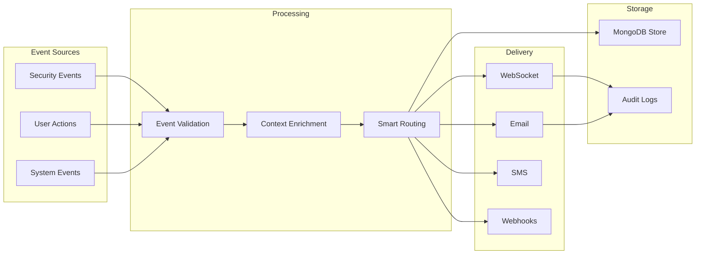

**Delivery Guarantees:**
- **At-least-once delivery** for critical security notifications
- **Duplicate detection** to prevent notification spam
- **Retry policies** with exponential backoff for failed deliveries
- **Dead letter queues** for undeliverable notifications
- **Delivery confirmation** tracking and analytics

**Performance Characteristics:**
- **Event Processing**: 10,000+ events per second capacity
- **Delivery Latency**: < 100ms for WebSocket notifications
- **Email Delivery**: < 30 seconds for non-critical notifications
- **SMS Delivery**: < 5 seconds for urgent security alerts
- **System Reliability**: 99.9% delivery success rate with monitoring

**Configuration Management:**
Users and administrators can configure notification preferences including:
- **Channel Preferences**: Primary and fallback delivery channels
- **Frequency Controls**: Rate limiting and quiet hours
- **Content Filtering**: Event type and severity preferences
- **Escalation Policies**: Automatic escalation for unacknowledged critical alerts

## 🛡️ **ENTERPRISE SECURITY STRATEGY**

### **Zero-Trust Security Model**

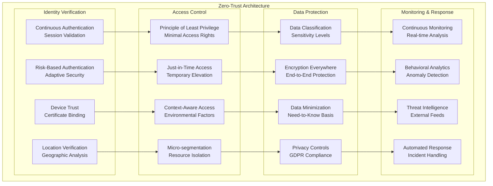

## 📊 **BUSINESS INTELLIGENCE & ANALYTICS**

### **Security Operations Dashboard**

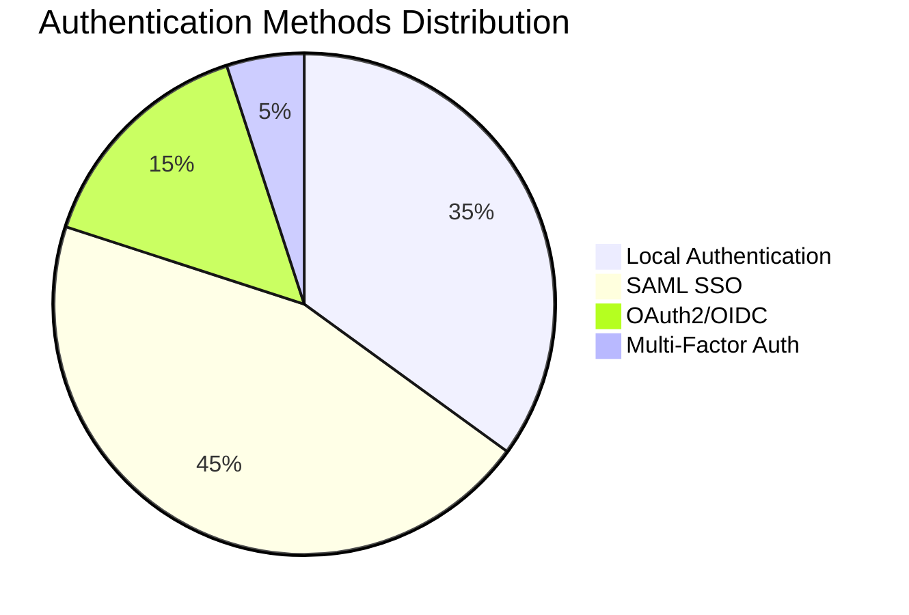

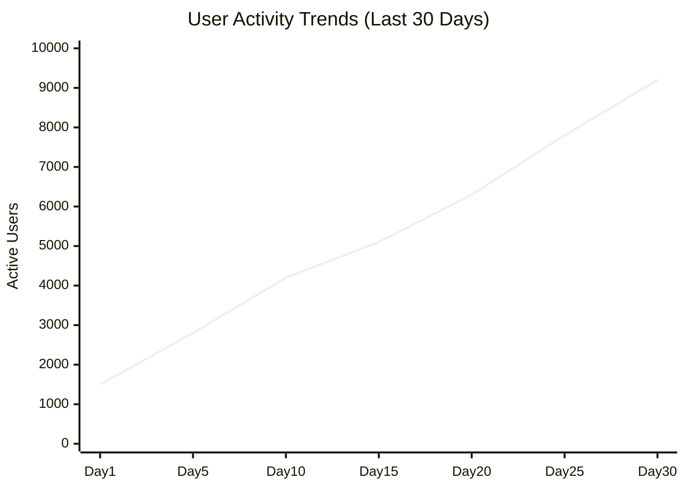

```mermaid
gitgraph
    commit id: "System Baseline"
    branch security-updates
    commit id: "MFA Implementation"
    commit id: "SAML Integration"
    checkout main
    merge security-updates
    commit id: "Production Release"
    branch compliance
    commit id: "GDPR Features"
    commit id: "SOC2 Controls"
    checkout main
    merge compliance
    commit id: "Compliance Ready"
    branch performance
    commit id: "Redis Clustering"
    commit id: "Auto-scaling"
    checkout main
    merge performance
    commit id: "Enterprise Scale"
```

## 🚀 **SCALABILITY & PERFORMANCE STRATEGY**

### **Horizontal Scaling Approach**

The Securaa User Service is designed for horizontal scaling using traditional load balancing and database replication techniques. This approach provides high availability and performance without requiring complex orchestration platforms.

**Scaling Architecture:**

**Load Distribution Strategy:**
- **Primary Load Balancer**: HAProxy or Nginx distributing traffic across service instances
- **Health Check Integration**: Automatic removal of unhealthy instances from rotation
- **Session Affinity**: Optional sticky sessions for WebSocket connections
- **Geographic Distribution**: Regional deployment for reduced latency

**Service Instance Scaling:**
- **Stateless Design**: Service instances maintain no local state for easy scaling
- **Auto-scaling**: Scripted scaling based on CPU, memory, and request metrics
- **Manual Scaling**: Administrative tools for planned capacity adjustments
- **Blue-Green Deployment**: Zero-downtime deployments during scaling operations

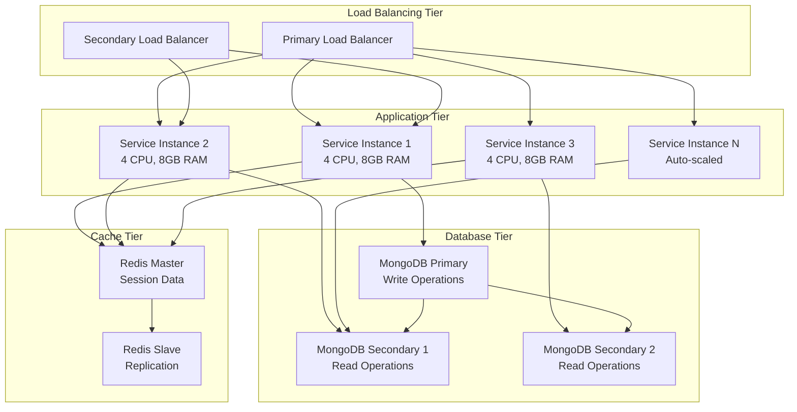

**Performance Optimization Techniques:**

**Database Performance:**
- **Connection Pooling**: Optimized connection management with configurable pool sizes
- **Read Replicas**: Distributed read operations across secondary database instances
- **Query Optimization**: Proper indexing and efficient aggregation pipelines
- **Sharding Strategy**: Horizontal database partitioning for large datasets

**Caching Strategy:**
- **Multi-Level Caching**: In-memory application cache + Redis distributed cache
- **Cache Patterns**: Write-through, write-behind, and cache-aside patterns
- **TTL Management**: Intelligent expiration policies for different data types
- **Cache Warming**: Preloading frequently accessed data during startup

**Application Performance:**
- **Goroutine Optimization**: Efficient concurrent processing with worker pools
- **Memory Management**: Optimized garbage collection and memory allocation
- **HTTP Keep-Alive**: Connection reuse for reduced overhead
- **Compression**: Response compression for reduced bandwidth usage

**Capacity Planning:**

**Performance Targets:**
- **Concurrent Users**: 10,000+ simultaneous active sessions
- **Request Throughput**: 5,000+ requests per second per instance
- **Response Time**: < 100ms for authentication requests (95th percentile)
- **Database Operations**: < 50ms for typical CRUD operations
- **Cache Operations**: < 1ms for Redis operations

**Resource Requirements:**
- **CPU**: 4 cores minimum per service instance for production workloads
- **Memory**: 8GB RAM minimum with JVM heap optimization
- **Storage**: SSD storage for database and logs with IOPS optimization
- **Network**: Gigabit network connectivity with low latency requirements

**Monitoring and Alerting:**
- **Performance Metrics**: Real-time monitoring of response times and throughput
- **Resource Utilization**: CPU, memory, and disk usage tracking
- **Auto-scaling Triggers**: Automated scaling based on performance thresholds
- **Capacity Alerts**: Proactive alerting for capacity planning needs

## 🔍 **INTEGRATION ARCHITECTURE**

### **External System Integration Strategy**

The Securaa User Service integrates with various external systems to provide comprehensive identity management and security operations. These integrations are designed for reliability, security, and maintainability.

**Integration Categories:**

**Identity Provider Integrations:**
The service supports multiple authentication protocols to accommodate diverse enterprise environments:
- **SAML 2.0**: Enterprise SSO with digital signature validation and metadata exchange
- **OAuth2/OIDC**: Modern authentication with authorization code flow and PKCE
- **LDAP/Active Directory**: Corporate directory integration with connection pooling
- **Local Authentication**: Native credential management with bcrypt hashing

**Communication Service Integrations:**
Multi-channel communication capabilities ensure reliable notification delivery:
- **SMTP Services**: Email delivery with template support and delivery tracking
- **SMS Gateways**: Text message delivery for two-factor authentication and alerts
- **WebSocket**: Real-time browser notifications for immediate user feedback
- **Webhook Endpoints**: Custom integrations with external systems and ITSM tools

**Security Tool Integrations:**
Integration with security infrastructure enhances the overall security posture:
- **SIEM Platforms**: Security event forwarding and correlation
- **Audit Systems**: Compliance logging and long-term storage
- **Key Management**: External key storage and rotation services
- **Threat Intelligence**: Security feed integration for risk assessment

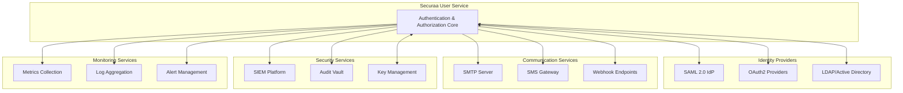

**Integration Patterns:**

**Synchronous Integrations:**
- **Authentication Flows**: Real-time validation with external identity providers
- **Authorization Checks**: Immediate permission validation with directory services
- **Configuration Retrieval**: On-demand configuration from external systems

**Asynchronous Integrations:**
- **Audit Logging**: Batch or streaming audit data to compliance systems
- **Notification Delivery**: Queued message delivery through various channels
- **Metrics Reporting**: Periodic performance and security metrics transmission

**Error Handling and Resilience:**
- **Circuit Breakers**: Automatic fallback when external services are unavailable
- **Retry Policies**: Exponential backoff for transient failures
- **Timeout Management**: Configurable timeouts to prevent hanging requests
- **Fallback Mechanisms**: Local caching and degraded functionality options

**Security Considerations:**
- **API Authentication**: Mutual TLS or API keys for all external communications
- **Data Encryption**: All sensitive data encrypted in transit and at rest
- **Network Security**: VPN or private network connections where possible
- **Access Control**: Principle of least privilege for service-to-service communication

## 📋 **COMPLIANCE & GOVERNANCE FRAMEWORK**

### **Regulatory Compliance Matrix**

| Requirement | SOC 2 | ISO 27001 | GDPR | HIPAA | PCI DSS |
|-------------|-------|-----------|------|-------|---------|
| **Access Controls** | ✅ CC6.1-6.8 | ✅ A.9.1-9.4 | ✅ Art.32 | ✅ 164.312 | ✅ Req.7-8 |
| **Encryption** | ✅ CC6.7 | ✅ A.10.1 | ✅ Art.32 | ✅ 164.312 | ✅ Req.3-4 |
| **Audit Logging** | ✅ CC3.3 | ✅ A.12.4 | ✅ Art.30 | ✅ 164.312 | ✅ Req.10 |
| **Data Protection** | ✅ CC6.1 | ✅ A.13.1 | ✅ Art.25 | ✅ 164.306 | ✅ Req.3 |
| **Incident Response** | ✅ CC7.4 | ✅ A.16.1 | ✅ Art.33 | ✅ 164.308 | ✅ Req.12 |
| **Risk Management** | ✅ CC3.1 | ✅ A.12.6 | ✅ Art.35 | ✅ 164.308 | ✅ Req.12 |

### **Data Governance Architecture**

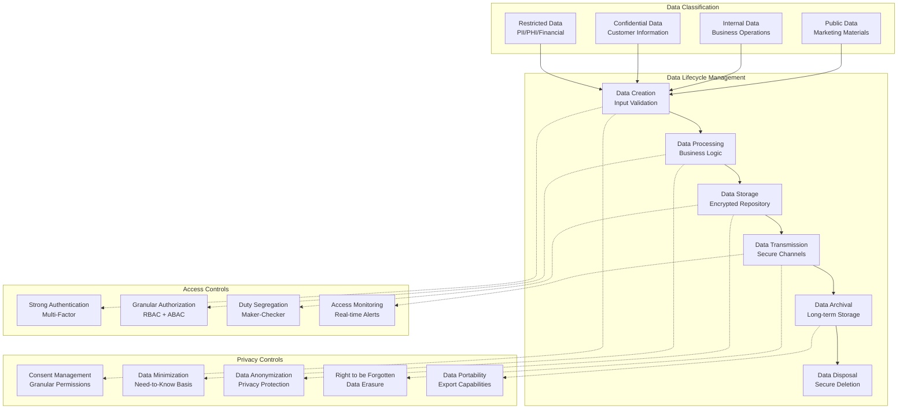

## 🎯 **BUSINESS CONTINUITY & DISASTER RECOVERY**

### **Business Continuity Strategy**

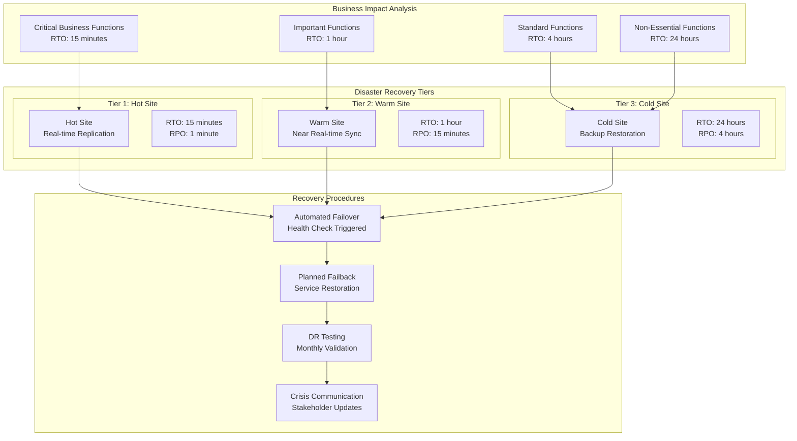

## 📈 **KEY PERFORMANCE INDICATORS**

### **Service Level Objectives (SLOs)**
- **Availability**: 99.99% uptime (52.6 minutes downtime/year)
- **Authentication Response Time**: < 100ms for 95th percentile
- **API Response Time**: < 200ms for 99th percentile
- **Throughput**: 10,000+ concurrent user sessions
- **Data Durability**: 99.999999999% (11 9's)
- **Recovery Time Objective (RTO)**: < 15 minutes
- **Recovery Point Objective (RPO)**: < 5 minutes

### **Security Metrics**
- **Authentication Success Rate**: > 99.5%
- **Failed Login Threshold**: < 2% of total attempts
- **MFA Adoption Rate**: > 95% for admin users
- **Session Timeout Compliance**: 100% enforcement
- **Encryption Coverage**: 100% data at rest and in transit
- **Vulnerability Detection**: < 24 hours for critical issues

### **Business Metrics**
- **User Onboarding Time**: < 5 minutes for new users
- **Password Reset Resolution**: < 2 minutes average
- **Tenant Provisioning**: < 30 minutes for new tenants
- **Compliance Audit Ready**: < 1 hour for data collection
- **Support Ticket Resolution**: < 4 hours for P1 issues
- **Cost per User**: Optimized for enterprise scale