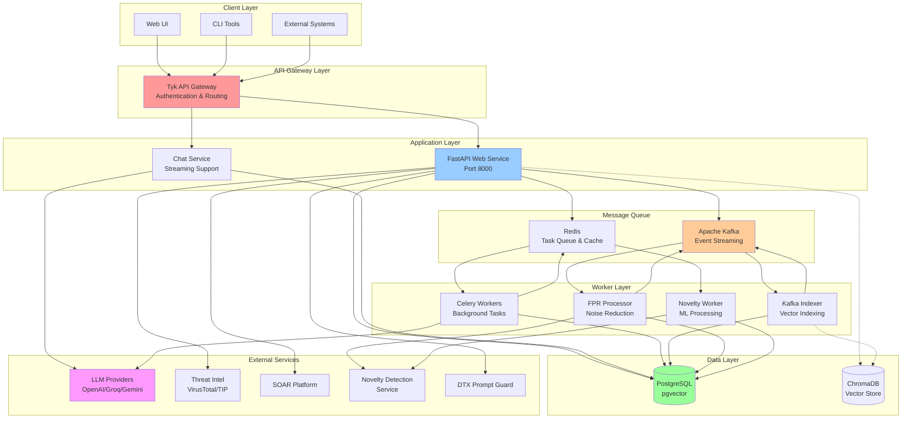
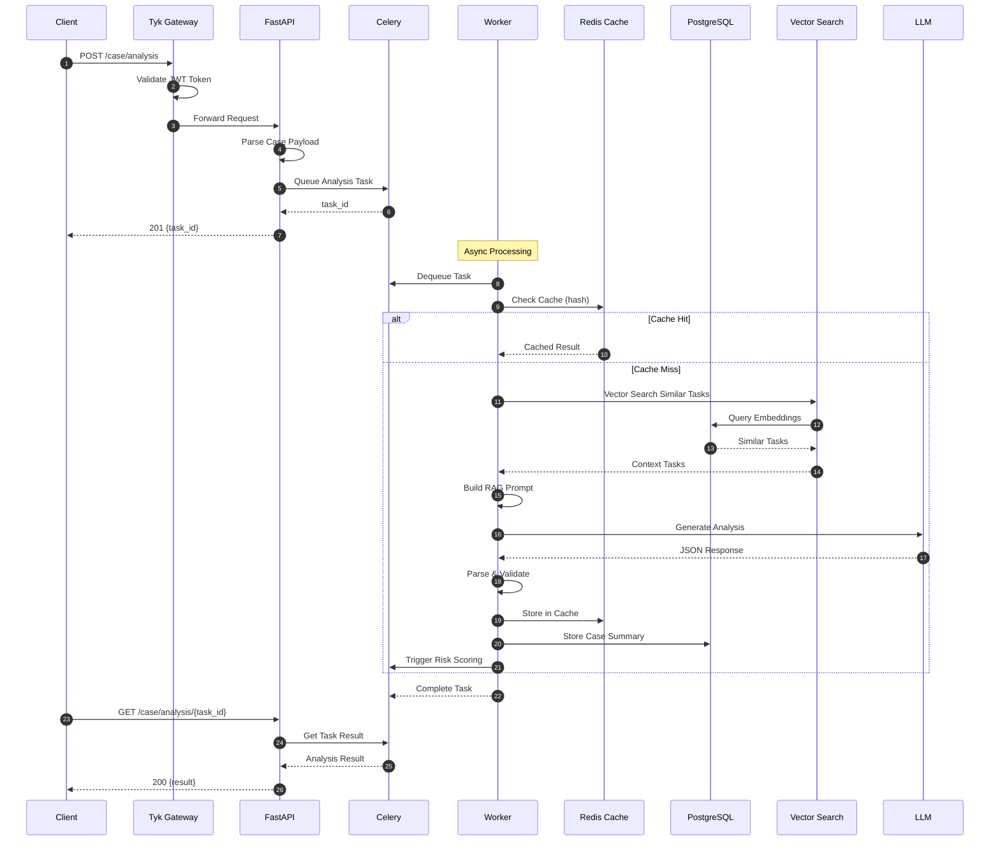
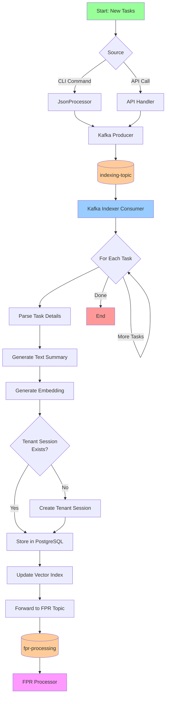
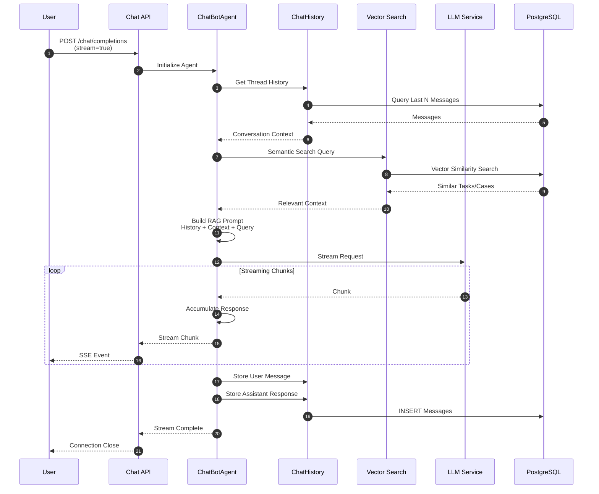
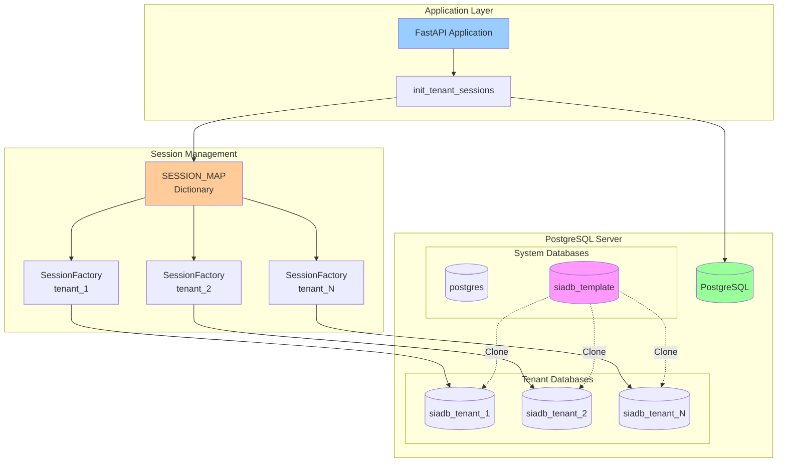
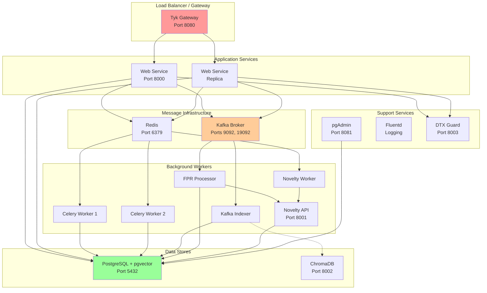
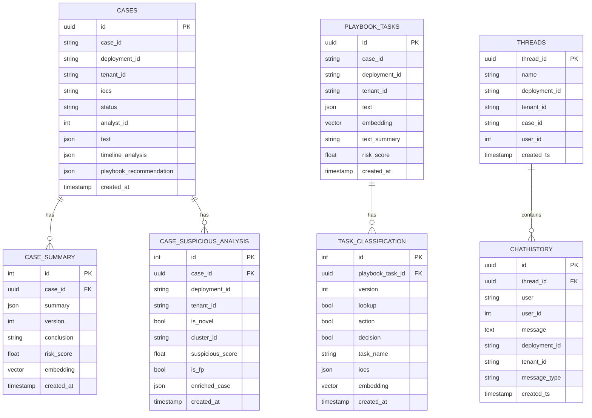
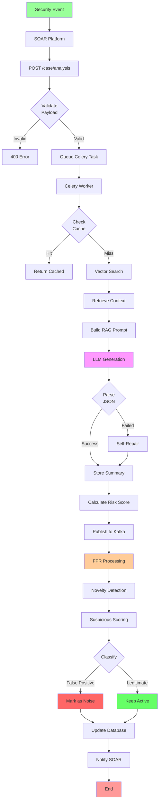
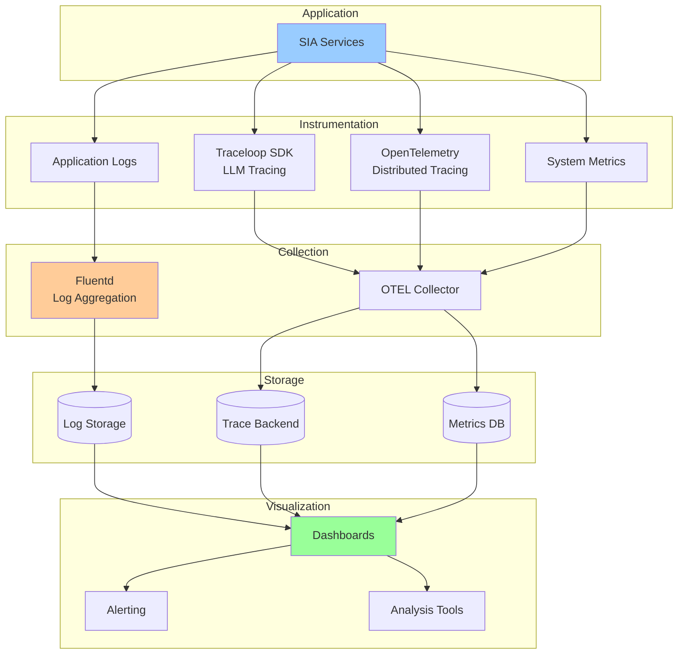

# High-Level Design (HLD) - SIA Service
## Comprehensive Architecture Documentation

**Document Version**: 1.0  
**Last Updated**: November 11, 2025  
**Status**: Active Development

---

## Table of Contents

1. [Executive Summary](#1-executive-summary)
2. [System Architecture Overview](#2-system-architecture-overview)
3. [Architecture Diagrams](#3-architecture-diagrams)
4. [Component Details](#4-component-details)
5. [Data Flow & Workflows](#5-data-flow--workflows)
6. [Security Architecture](#6-security-architecture)
7. [Scalability & Performance](#7-scalability--performance)
8. [Deployment Architecture](#8-deployment-architecture)
9. [Integration Points](#9-integration-points)
10. [Configuration Management](#10-configuration-management)
11. [High Availability & Disaster Recovery](#11-high-availability--disaster-recovery)
12. [Technology Stack](#12-technology-stack)
13. [Development Guidelines](#13-development-guidelines)
14. [Monitoring & Observability](#14-monitoring--observability)
15. [Future Roadmap](#15-future-roadmap)

---

## 1. Executive Summary

**SIA (Securaa Intelligent Agent)** is an AI-powered Security Operations Center (SOC) automation platform that leverages Large Language Models (LLMs) to automate case analysis, playbook generation, task execution, and threat intelligence operations. The system is designed to streamline security incident response workflows, reduce false positives, and provide intelligent recommendations to security analysts.

### Key Capabilities:
- **Automated Case Analysis**: AI-driven analysis of security incidents with contextual intelligence
- **Playbook Management**: Automated playbook suggestions and generation
- **Task Indexing & Search**: Vector-based semantic search across security tasks
- **Chat Interface**: Interactive AI assistant for SOC analysts
- **False Positive Reduction**: ML-based noise reduction and novelty detection
- **Multi-Tenancy**: Complete tenant isolation with dedicated databases
- **Real-time Processing**: Event-driven architecture using Kafka

### System Highlights:
- 🚀 **Performance**: Sub-second vector search across millions of tasks
- 🔒 **Security**: Multi-layered security with JWT, encryption, and prompt injection prevention
- 📈 **Scalability**: Horizontal scaling of all components
- 🤖 **AI-Powered**: Multiple LLM providers (OpenAI, Groq, Gemini, On-Prem)
- 🔄 **Event-Driven**: Kafka-based asynchronous processing
- 🗄️ **Multi-Tenant**: Complete database isolation per tenant

---

## 2. System Architecture Overview

### 2.1 Architecture Pattern
SIA follows a **microservices-based architecture** with the following patterns:
- **Event-Driven Architecture (EDA)**: Using Kafka for asynchronous processing
- **CQRS Pattern**: Separation of command and query responsibilities
- **Repository Pattern**: Data access abstraction
- **API Gateway Pattern**: Tyk gateway for authentication and routing
- **Multi-Tenancy**: Database-per-tenant isolation strategy

### 2.2 Core Components Summary

| Component | Technology | Purpose | Scaling Strategy |
|-----------|-----------|---------|------------------|
| Web Service | FastAPI + Uvicorn | RESTful APIs | Horizontal (multiple instances) |
| Worker | Celery | Background tasks | Horizontal (worker pool) |
| Kafka Indexer | Confluent Kafka | Stream processing | Partitioned topics |
| FPR Processor | Python + ML | Noise reduction | Batch processing |
| API Gateway | Tyk | Auth & routing | Load balanced |
| Database | PostgreSQL + pgvector | Data storage | Read replicas |
| Cache | Redis | Queue & cache | Cluster mode |
| Vector Store | ChromaDB (optional) | Vector search | Sharded |
| Message Queue | Apache Kafka | Event streaming | Multi-broker |

### 2.3 High-Level Architecture Diagram

```
┌─────────────────────────────────────────────────────────────────┐
│                         Client Layer                             │
│              (Web UI, CLI, External Systems)                     │
└─────────────────────────────────────────────────────────────────┘
                              │
                              ▼
┌─────────────────────────────────────────────────────────────────┐
│                    API Gateway (Tyk)                             │
│          (Authentication, Rate Limiting, SSL/TLS)                │
└─────────────────────────────────────────────────────────────────┘
                              │
                ┌─────────────┴─────────────┐
                ▼                           ▼
┌───────────────────────────┐   ┌──────────────────────────────┐
│   FastAPI Web Service     │   │    Chat Service              │
│   (main.py)               │   │    (Streaming Support)       │
│   - Case Analysis         │   │    - Thread Management       │
│   - Indexing              │   │    - Chat History            │
│   - User Management       │   │    - LLM Integration         │
└───────────────────────────┘   └──────────────────────────────┘
                │                           │
                └─────────────┬─────────────┘
                              ▼
┌─────────────────────────────────────────────────────────────────┐
│                    Message Queue (Kafka)                         │
│   Topics: indexing-topic, fpr-processing, fpr-results           │
└─────────────────────────────────────────────────────────────────┘
                              │
        ┌─────────────────────┼─────────────────────┐
        ▼                     ▼                     ▼
┌──────────────┐    ┌──────────────────┐   ┌──────────────────┐
│ Celery       │    │ Kafka Indexer    │   │ FPR Processor    │
│ Worker       │    │ (Vector DB       │   │ (Novelty         │
│ (Background  │    │  Indexing)       │   │  Detection)      │
│  Tasks)      │    │                  │   │                  │
└──────────────┘    └──────────────────┘   └──────────────────┘
        │                     │                     │
        └─────────────────────┼─────────────────────┘
                              ▼
┌─────────────────────────────────────────────────────────────────┐
│                      Data Layer                                  │
│  ┌──────────────┐  ┌──────────────┐  ┌──────────────┐         │
│  │ PostgreSQL   │  │ Redis Cache  │  │ ChromaDB     │         │
│  │ (pgvector)   │  │ (Celery +    │  │ (Optional    │         │
│  │ Multi-Tenant │  │  Cache)      │  │  Vector DB)  │         │
│  └──────────────┘  └──────────────┘  └──────────────┘         │
└─────────────────────────────────────────────────────────────────┘
                              │
                              ▼
┌─────────────────────────────────────────────────────────────────┐
│                    External Services                             │
│  - LLM Providers (OpenAI, Groq, Gemini, On-Prem)               │
│  - Threat Intel (VirusTotal, TIP)                               │
│  - SOAR Platform Integration                                     │
│  - DTX Prompt Guard (Security)                                   │
│  - Novelty Detection Service                                     │
└─────────────────────────────────────────────────────────────────┘
```

---

## 3. Architecture Diagrams

### 3.1 System Architecture Overview



### 3.2 Case Analysis Flow Diagram



### 3.3 Task Indexing Pipeline



### 3.4 False Positive Reduction Pipeline

```mermaid
flowchart LR
    subgraph "Input"
        KAFKA[(fpr-processing<br/>Topic)]
    end
    
    subgraph "Batching"
        BUFFER[Tenant Buffer]
        BATCH{Batch Size<br/>Reached?}
    end
    
    subgraph "Feature Engineering"
        ENRICH[Enrich Case Data]
        EXTRACT[Extract Features]
        FEATURES[IOC Count<br/>Text Length<br/>Temporal<br/>Patterns]
    end
    
    subgraph "Novelty Detection"
        EMBED[Generate Embedding]
        NDS[NDS API Call]
        NOVEL{Is Novel?}
        CLUSTER[Assign Cluster]
    end
    
    subgraph "Scoring"
        SCORE[Calculate Score]
        RULES[Apply Rules]
        CLASSIFY{Classify}
    end
    
    subgraph "Output"
        UPDATE[Update DB]
        MARK_FP[Mark as False Positive]
        MARK_LEGIT[Mark as Legitimate]
        PUBLISH[(fpr-results<br/>Topic)]
    end
    
    KAFKA --> BUFFER
    BUFFER --> BATCH
    BATCH -->|No| BUFFER
    BATCH -->|Yes| ENRICH
    
    ENRICH --> EXTRACT
    EXTRACT --> FEATURES
    
    FEATURES --> EMBED
    EMBED --> NDS
    NDS --> NOVEL
    NOVEL -->|Yes| CLUSTER
    NOVEL -->|No| CLUSTER
    
    CLUSTER --> SCORE
    FEATURES --> SCORE
    SCORE --> RULES
    RULES --> CLASSIFY
    
    CLASSIFY -->|FP| MARK_FP
    CLASSIFY -->|Legit| MARK_LEGIT
    
    MARK_FP --> UPDATE
    MARK_LEGIT --> UPDATE
    
    UPDATE --> PUBLISH
    
    style KAFKA fill:#ffcc99
    style NDS fill:#ff99ff
    style PUBLISH fill:#ffcc99
    style MARK_FP fill:#ff9999
    style MARK_LEGIT fill:#99ff99
```



### 3.5 Chat with RAG Flow



### 3.6 Multi-Tenant Database Architecture



### 3.7 Deployment Architecture



### 3.8 Database Schema (ER Diagram)



---

## 4. Component Details

### 3.1 Web Service (FastAPI)
**Purpose**: Primary API service handling HTTP requests

**Key Responsibilities**:
- RESTful API endpoints for case management
- Chat interface endpoints
- User and tenant management
- Indexing operations
- Application and playbook management

**Technology Stack**:
- FastAPI framework
- Uvicorn ASGI server
- OpenTelemetry tracing (Traceloop)
- JWT authentication via Tyk

**Key Routers**:
- `/case` - Case analysis and management
- `/chat` - Chat and conversational AI
- `/indexing` - Task and playbook indexing
- `/user` - User management
- `/tenant` - Tenant operations
- `/application` - Application definitions
- `/code` - Code generation/analysis

### 3.2 Celery Worker
**Purpose**: Asynchronous task execution for long-running operations

**Key Tasks**:
- `create_case_analysis_task`: Main case analysis orchestration
- `set_risk`: Risk scoring and recommendation generation

**Features**:
- Distributed task queue
- Result backend (Redis)
- Retry mechanisms
- LLM tracing integration

**Configuration**:
- Broker: Redis
- Result Backend: Redis
- Concurrency: Configurable per environment

### 3.3 Kafka Indexer
**Purpose**: Stream processing for task indexing into vector databases

**Workflow**:
1. Consumes messages from `indexing-topic`
2. Generates embeddings using AI models
3. Stores in PostgreSQL with pgvector
4. Forwards enriched data to FPR processing

**Components**:
- `KafkaConsumer_PgvIndexer`: Main consumer
- `FpProcessingProducer`: Forwards to FPR pipeline

### 3.4 False Positive Reduction (FPR) Processor
**Purpose**: ML-based noise reduction and novelty detection

**Pipeline**:
1. **Enrichment**: Add contextual information to cases
2. **Feature Building**: Extract ML features from case data
3. **Novelty Detection**: Identify novel vs. recurring patterns
4. **Scoring**: Calculate suspicious scores
5. **Classification**: Mark as FP or legitimate threat

**Key Modules**:
- `FeatureBuilderModuleV2`: Feature engineering
- `SuspiciousScoringModule`: ML-based scoring
- `NDSClient`: Novelty Detection Service client

### 3.5 Database Layer

#### PostgreSQL (Primary Data Store)
**Schema Design**:
- **Multi-tenant isolation**: Separate database per tenant (`siadb_<tenant_id>`)
- **pgvector extension**: Vector similarity search
- **HNSW indexes**: Fast nearest neighbor search

**Key Tables**:
- `cases`: Security incidents/cases
- `case_summary`: AI-generated summaries
- `playbook_tasks`: Executed tasks with embeddings
- `task_classification`: ML-based task classifications
- `chathistory` & `threads`: Chat conversations
- `playbook_definitions`: Available playbooks
- `task_definitions`: Task templates
- `application_definitions`: Integrated applications
- `users`: User profiles
- `ioc_reputation`: IOC lookup cache
- `event_streams`: Novelty detection events
- `case_suspicious_analysis`: FPR results

#### Redis
**Use Cases**:
- Celery broker and result backend
- Response caching (deduplication)
- Session management
- Rate limiting data

#### ChromaDB (Optional)
**Use Cases**:
- Alternative vector store
- Document embeddings
- Semantic search

### 3.6 LLM Integration Layer

**Supported Backends**:
- **OpenAI**: GPT-4, GPT-3.5-turbo
- **Groq**: Fast inference (llama3)
- **Google Gemini**: Gemini Pro
- **On-Premise**: Ollama, custom deployments

**LLMWrapper Features**:
- Unified interface across providers
- Streaming support (sync/async)
- Structured output parsing
- Temperature control
- Retry logic

**Embedding Models**:
- OpenAI embeddings (text-embedding-ada-002)
- On-premise embedding endpoints
- Configurable via environment

### 3.7 API Gateway (Tyk)
**Purpose**: Security, authentication, and routing

**Features**:
- JWT-based authentication
- API key management
- Rate limiting
- SSL/TLS termination
- Request/response transformation
- API versioning

---

## 5. Data Flow & Workflows

### 5.1 Complete Case Analysis Workflow



### 5.2 Case Analysis Flow Details
```
1. Client → Tyk Gateway → FastAPI
2. FastAPI → Celery (async) → Task Queue
3. Worker retrieves case details
4. Worker searches relevant playbook tasks (vector similarity)
5. Worker constructs LLM prompt with context
6. LLM generates analysis (findings, recommendations, conclusion)
7. Result stored in PostgreSQL
8. Risk scoring triggered (background)
9. Client polls for results
```

### 4.2 Task Indexing Flow
```
1. CLI/API → Kafka (indexing-topic)
2. Kafka Indexer consumes message
3. Generate embeddings for task
4. Store in PostgreSQL with vector
5. Forward to FPR processing topic
6. FPR processor analyzes for novelty
7. Results published to output topic
```

### 4.3 Chat Flow
```
1. Client → Chat API (streaming)
2. Retrieve thread context from DB
3. Search relevant playbook tasks/cases
4. Construct RAG prompt
5. Stream LLM response to client
6. Store message in chat history
```

### 4.4 False Positive Reduction Flow
```
1. Enriched cases → fpr-processing topic
2. Batch cases by tenant
3. Extract features (IOCs, patterns)
4. Query Novelty Detection Service
5. Calculate suspicious scores
6. Classify as FP or legitimate
7. Update case status
8. Publish results
```

---

## 5. Security Architecture

### 5.1 Authentication & Authorization
- **API Gateway**: Tyk handles all authentication
- **JWT Tokens**: Bearer token authentication
- **API Keys**: Per-tenant/application keys
- **Multi-Tenancy**: Complete data isolation per tenant

### 5.2 Data Security
- **Encryption at Rest**: Database encryption
- **Encryption in Transit**: TLS/SSL for all communications
- **Secrets Management**: Environment variables, secure vaults
- **PII Protection**: DTX Prompt Guard for sensitive data

### 5.3 Network Security
- **Container Isolation**: Docker networks (sia, vectordb, tyk)
- **Firewall Rules**: Port restrictions
- **Internal Services**: No external exposure

### 5.4 Prompt Security
- **DTX Prompt Guard**: Pre-processing to prevent prompt injection
- **Input Validation**: Pydantic models for all inputs
- **Output Sanitization**: Parsing and validation

---

## 6. Scalability & Performance

### 6.1 Horizontal Scaling
- **Web Service**: Multiple FastAPI instances behind load balancer
- **Workers**: Scale Celery workers independently
- **Kafka**: Partitioned topics for parallel processing
- **Database**: Read replicas for query scaling

### 6.2 Caching Strategy
- **Redis Caching**: Deduplication of LLM responses
- **Vector Search**: HNSW indexes for fast similarity search
- **IOC Caching**: Reputation lookups cached in DB

### 6.3 Performance Optimizations
- **Batch Processing**: Group operations for efficiency
- **Async Operations**: Non-blocking I/O
- **Connection Pooling**: Database connection reuse
- **Streaming Responses**: Immediate feedback to users

### 6.4 Resource Management
- **Memory Limits**: Container memory constraints
- **CPU Quotas**: Controlled resource allocation
- **Task Limits**: Max tasks per worker
- **Queue Priorities**: Critical tasks prioritized

---

## 7. Deployment Architecture

### 7.1 Container Orchestration
**Docker Compose Services**:
- `web`: Main FastAPI application
- `worker`: Celery workers
- `kafka-indexer`: Vector indexing service
- `fpr-processor`: False positive reduction
- `novelty_api`: Novelty detection API
- `novelty_worker`: Novelty detection workers
- `tyk-gateway`: API gateway
- `postgres`: Primary database
- `kafka`: Message broker
- `redis`: Cache and queue
- `chromadb`: Optional vector store
- `dtxguard`: Prompt security
- `fluentd`: Log aggregation
- `pgadmin`: Database management

### 7.2 Network Topology
**Networks**:
- `sia`: Internal service communication
- `vectordb`: Database access
- `tyk`: API gateway network

### 7.3 Volume Management
- `pgdata`: PostgreSQL persistent storage
- `chromadata`: ChromaDB persistent storage
- `/opt/sia/manuals`: Document storage

### 7.4 Health Checks
- PostgreSQL: `pg_isready` checks
- ChromaDB: Heartbeat endpoint
- DTXGuard: Health endpoint
- Service Dependencies: Managed via `depends_on`

---

## 8. Integration Points

### 8.1 External Systems
- **SOAR Platform**: Case updates, field updates, playbook execution
- **Threat Intelligence Platforms (TIP)**: IOC reputation checks
- **CSAM**: Asset information fetching
- **Events API**: Event data retrieval
- **Novelty Detection Service**: ML-based novelty scoring

### 8.2 LLM Providers
- **OpenAI API**: GPT models
- **Groq API**: Fast inference
- **Google Gemini API**: Gemini models
- **On-Premise LLMs**: Custom deployments (Ollama)
- **LiteLLM Proxy**: Unified LLM interface

### 8.3 Monitoring & Observability
- **Traceloop SDK**: LLM operation tracing
- **OpenTelemetry**: Distributed tracing
- **Fluentd**: Log aggregation
- **Prometheus**: Metrics (configurable)

---

## 9. Configuration Management

### 9.1 Environment Variables
**Categories**:
- **Database**: Connection strings, credentials
- **LLM**: API keys, model names, backends
- **Kafka**: Brokers, topics, partitions
- **Security**: JWT keys, access tokens, API keys
- **Integration**: External service URLs
- **Feature Flags**: Enable/disable features

### 9.2 Configuration Files
- `.env`: Environment-specific settings
- `prompts.yaml`: LLM prompt templates
- `litellm.yaml`: LLM proxy configuration
- `alembic.ini`: Database migration settings
- `docker-compose.yml`: Service orchestration

---

## 10. High Availability & Disaster Recovery

### 10.1 High Availability
- **Service Redundancy**: Multiple instances of critical services
- **Database Replication**: PostgreSQL streaming replication (configurable)
- **Message Queue**: Kafka replication factor
- **Load Balancing**: Tyk gateway distribution

### 10.2 Fault Tolerance
- **Retry Mechanisms**: Celery task retries
- **Circuit Breakers**: Fail-fast for external services
- **Graceful Degradation**: Fallback to cached results
- **Health Checks**: Automatic container restart

### 10.3 Backup Strategy
- **Database Backups**: Regular PostgreSQL dumps
- **Volume Snapshots**: Docker volume backups
- **Configuration Backups**: Version-controlled configs

---

## 11. Technology Stack Summary

### Backend
- **Language**: Python 3.11+
- **Framework**: FastAPI
- **Task Queue**: Celery
- **Message Broker**: Apache Kafka
- **ASGI Server**: Uvicorn

### Databases
- **Primary**: PostgreSQL 16 with pgvector
- **Cache**: Redis 7
- **Vector Store**: ChromaDB, pgvector

### AI/ML
- **LLM Frameworks**: LangChain, LangGraph
- **LLM Providers**: OpenAI, Groq, Gemini, On-Prem
- **Embeddings**: OpenAI, custom endpoints
- **Prompt Security**: DTX Prompt Guard

### Infrastructure
- **Containerization**: Docker
- **Orchestration**: Docker Compose
- **API Gateway**: Tyk
- **Logging**: Fluentd

### Development
- **Package Manager**: Poetry
- **Migration**: Alembic
- **Testing**: Pytest
- **Linting**: Flake8, Black

---

## 12. Future Enhancements

---

## 13. Development Guidelines

### 13.1 Code Organization Best Practices

**Module Structure**:
```
siaservice/
├── routers/          # API endpoint definitions (thin layer)
├── apis/services/    # Business logic (core functionality)
├── domain/           # Domain models (data structures)
├── repositories/     # Data access (database operations)
├── analysis/         # AI/ML analysis engines
├── llm/             # LLM integration
├── parsers/         # Output parsing
└── common.py        # Shared utilities
```

**Coding Standards**:
- Follow PEP 8 style guide
- Use type hints for all functions
- Document complex logic with docstrings
- Write unit tests for business logic
- Use Pydantic models for validation

**Example Function**:
```python
from typing import Optional, List
from siaservice.domain.soar.cases import Case
from siaservice.common import get_logger

logger = get_logger(__name__)

def process_case(
    case: Case,
    tenant_id: str,
    options: Optional[dict] = None
) -> List[dict]:
    """
    Process a security case with given options.
    
    Args:
        case: Case object to process
        tenant_id: Tenant identifier
        options: Optional processing parameters
        
    Returns:
        List of processing results
        
    Raises:
        ValueError: If case is invalid
        ProcessingError: If processing fails
    """
    logger.info(f"Processing case {case.case_id} for tenant {tenant_id}")
    
    # Implementation
    results = []
    return results
```

### 13.2 Git Workflow

**Branch Strategy**:
- `main` - Production-ready code
- `develop` - Integration branch
- `feature/*` - New features
- `bugfix/*` - Bug fixes
- `hotfix/*` - Critical production fixes

**Commit Messages**:
```
feat: add case priority scoring
fix: resolve vector search timeout issue
docs: update API documentation
refactor: optimize database queries
test: add unit tests for chat service
```

### 13.3 Development Workflow

1. **Create Feature Branch**:
   ```bash
   git checkout -b feature/add-risk-scoring
   ```

2. **Implement Changes**:
   - Write code with tests
   - Follow coding standards
   - Update documentation

3. **Run Quality Checks**:
   ```bash
   poetry run flake8
   poetry run black .
   poetry run pytest
   ```

4. **Submit Pull Request**:
   - Clear description
   - Link to issue/ticket
   - Request reviews

5. **Merge After Approval**:
   - Squash commits
   - Update changelog

---

## 14. Monitoring & Observability

### 14.1 Observability Stack



### 14.2 Key Metrics to Monitor

**Application Metrics**:
- Request rate (requests/sec)
- Response time (p50, p95, p99)
- Error rate (4xx, 5xx)
- Task queue length
- Active connections

**LLM Metrics**:
- LLM latency (generation time)
- Token usage (input/output)
- Cache hit rate
- Cost per request
- Error rate by provider

**Database Metrics**:
- Query execution time
- Connection pool usage
- Vector search latency
- Index performance
- Replication lag

**Infrastructure Metrics**:
- CPU utilization
- Memory usage
- Disk I/O
- Network throughput
- Container health

### 14.3 Logging Strategy

**Log Levels**:
```python
# DEBUG: Detailed diagnostic information
logger.debug(f"Vector search params: {params}")

# INFO: General informational messages
logger.info(f"Case analysis started: {case_id}")

# WARNING: Warning messages
logger.warning(f"High memory usage: {usage}%")

# ERROR: Error messages
logger.error(f"Failed to generate analysis: {error}")

# CRITICAL: Critical errors
logger.critical(f"Database connection lost")
```

**Structured Logging**:
```python
logger.info(
    "case_analysis_completed",
    extra={
        "case_id": case.case_id,
        "tenant_id": case.tenant_id,
        "duration_ms": duration,
        "llm_provider": "openai",
        "cache_hit": False
    }
)
```

### 14.4 Alerting Rules

**Critical Alerts**:
- Service down (health check fails)
- Database connection lost
- Kafka broker unavailable
- Error rate > 5%
- Response time > 10s

**Warning Alerts**:
- High memory usage (>80%)
- Queue length > 1000
- Cache miss rate > 50%
- Slow queries (>5s)

**Informational**:
- Deployment completed
- Tenant onboarded
- Configuration updated

### 14.5 Tracing Example

```python
# Automatic tracing with Traceloop
from traceloop.sdk import Traceloop

Traceloop.init(app_name="siaservice", disable_batch=True)

# LLM calls are automatically traced
result = llm.invoke(prompt)  # Traced automatically

# Manual span creation
from opentelemetry import trace

tracer = trace.get_tracer(__name__)

with tracer.start_as_current_span("process_case") as span:
    span.set_attribute("case_id", case_id)
    span.set_attribute("tenant_id", tenant_id)
    
    # Your code here
    result = process()
    
    span.set_attribute("result_status", "success")
```

---

## 15. Future Roadmap

### 15.1 Short-term (Q1 2026)
- ✅ **Advanced Analytics Dashboard**: Real-time metrics and insights
- ✅ **Enhanced Chat Experience**: Multi-modal support (images, PDFs)
- ✅ **Improved FPR**: Advanced ML models for better accuracy
- ✅ **Performance Optimization**: Sub-100ms vector search
- ✅ **API Versioning**: Support for v2 APIs

### 15.2 Medium-term (Q2-Q3 2026)
- 🔄 **Multi-Model Ensemble**: Combine multiple LLM outputs
- 🔄 **Automated Playbook Generation**: AI-generated remediation workflows
- 🔄 **Threat Hunting**: Proactive threat detection capabilities
- 🔄 **Knowledge Graph**: Entity relationship mapping
- 🔄 **GraphQL API**: Alternative API interface
- 🔄 **Advanced RBAC**: Fine-grained access control

### 15.3 Long-term (Q4 2026+)
- 📅 **Kubernetes Support**: Cloud-native deployment
- 📅 **Multi-Region Deployment**: Geographic distribution
- 📅 **Explainable AI**: Transparency in AI decisions
- 📅 **Real-time Streaming**: WebSocket support
- 📅 **Database Sharding**: Horizontal partitioning
- 📅 **Edge Deployment**: On-premise + cloud hybrid

### 15.4 Research Areas
- 🔬 **Advanced NLP**: Domain-specific language models
- 🔬 **Reinforcement Learning**: Automated response optimization
- 🔬 **Federated Learning**: Privacy-preserving ML
- 🔬 **Quantum-Resistant Crypto**: Future-proof security

---

## 17. Troubleshooting & Operations

### 17.1 Common Issues & Solutions

#### Service Won't Start
**Symptoms**: Container exits, port conflicts, database connection failures

**Solutions**:
```bash
# Check port availability
netstat -tlnp | grep :8000

# Verify database connectivity
docker exec -it sia-postgres psql -U admin -d postgres

# Restart services in order
docker-compose down
docker-compose up -d postgres redis kafka
sleep 10
docker-compose up -d
```

#### LLM Integration Failures
**Symptoms**: Timeout, authentication errors, rate limits

**Solutions**:
- Verify API keys in environment variables
- Test provider connectivity manually
- Switch to alternative provider (Groq, Gemini)
- Implement rate limiting and backoff

#### Vector Search Issues
**Symptoms**: No context retrieved, slow queries

**Solutions**:
```sql
-- Verify pgvector extension
SELECT * FROM pg_extension WHERE extname = 'vector';

-- Rebuild index
REINDEX INDEX playbook_tasks_embedding_idx;
ANALYZE playbook_tasks_with_embeddings;
```

#### Celery Workers Not Processing
**Solutions**:
```bash
# Check worker status
docker exec sia-worker celery -A worker inspect active

# Restart and scale workers
docker-compose up -d --scale sia-worker=3
```

### 17.2 Health Check Endpoints

```bash
curl http://localhost:8000/health          # Overall health
curl http://localhost:8000/health/db       # Database
curl http://localhost:8000/health/redis    # Cache
curl http://localhost:8000/health/kafka    # Message broker
curl http://localhost:8000/health/llm      # LLM providers
```

### 17.3 Performance Optimization

**Database**:
- Add indexes for frequently queried columns
- Run VACUUM ANALYZE regularly
- Monitor slow queries with pg_stat_statements

**Cache**:
- Tune Redis eviction policy (allkeys-lru)
- Monitor cache hit rates
- Implement cache warming for common queries

**Application**:
- Adjust worker concurrency based on CPU cores
- Increase timeouts for long-running operations
- Use connection pooling effectively

### 17.4 Backup & Recovery

```bash
# Backup tenant databases
docker exec sia-postgres pg_dump -U admin siadb_tenant123 > backup.sql

# Backup Redis data
docker exec sia-redis redis-cli BGSAVE

# Restore database
docker exec -i sia-postgres psql -U admin siadb_tenant123 < backup.sql
```

---

## 18. Conclusion

SIA Service represents a comprehensive AI-powered SOC automation platform that combines modern microservices architecture, advanced ML/LLM capabilities, and enterprise-grade security. The system is designed for scalability, maintainability, and extensibility, providing security teams with intelligent automation to enhance their incident response capabilities.

The architecture supports:
- ✅ **Multi-tenancy** with complete data isolation
- ✅ **Event-driven processing** for real-time operations
- ✅ **AI/LLM integration** with multiple providers
- ✅ **Vector-based semantic search** for intelligent context retrieval
- ✅ **False positive reduction** through ML-based scoring
- ✅ **Extensible plugin architecture** for integrations
- ✅ **Enterprise security** with authentication and encryption

---

**Document Version**: 1.0  
**Last Updated**: November 11, 2025  
**Status**: Active Development
