# Low-Level Design (LLD) - SIA Service
## Comprehensive Implementation Specification

**Document Version**: 1.0  
**Last Updated**: November 11, 2025  
**Status**: Active Development

---

## Table of Contents

1. [Component Architecture](#1-component-architecture)
2. [Domain Models](#2-domain-models)
3. [Database Schema](#3-database-schema)
4. [API Design](#4-api-design)
5. [Service Layer Implementation](#5-service-layer-implementation)
6. [Repository Pattern](#6-repository-pattern)
7. [LLM Integration](#7-llm-integration)
8. [Message Processing](#8-message-processing)
9. [Analysis Pipeline](#9-analysis-pipeline)
10. [False Positive Reduction](#10-false-positive-reduction)
11. [Implementation Diagrams](#11-implementation-diagrams)
12. [Design Patterns](#12-design-patterns)
13. [Error Handling](#13-error-handling)
14. [Performance Optimizations](#14-performance-optimizations)
15. [Testing Strategy](#15-testing-strategy)
16. [Code Examples](#16-code-examples)

---

## 1. Component Architecture

### 1.1 FastAPI Application Structure

```python
main.py
├── Lifespan Management
│   └── init_tenant_sessions()
├── Router Registration
│   ├── users.router       (/user)
│   ├── chat.router        (/chat)
│   ├── case.router        (/case)
│   ├── index.router       (/indexing)
│   ├── tenant.router      (/tenant)
│   ├── application.router (/application)
│   └── code.router        (/code)
└── Middleware
    └── Traceloop (OpenTelemetry)
```

### 1.2 Module Organization

```
siaservice/
├── routers/              # API route handlers
├── apis/services/        # Business logic services
├── domain/soar/          # Domain models (Case, PlaybookTask, etc.)
├── repositories/         # Data access layer
├── db/
│   ├── pgv/             # PostgreSQL with pgvector
│   ├── embed/           # Embedding generation
│   └── vectordb/        # Vector database operations
├── llm/                 # LLM integration layer
├── analysis/            # Analysis engines and agents
├── parsers/             # Output parsers
├── noise_reduction/     # FPR pipeline
└── common.py            # Shared utilities
```

---

## 2. Domain Models

### 2.1 Case Model

```python
class Case(BaseModel):
    """
    Represents a security incident/case
    """
    deployment_id: str      # Deployment identifier
    tenant_id: str          # Tenant identifier
    case_id: str           # Unique case identifier
    case_detail: str       # Detailed case description
    iocs: str              # Indicators of Compromise
    findings: Optional[List[Finding]] = None
    
    def to_dict(self) -> dict
    @model_validator(mode='before')
    def check_non_empty_fields(cls, values)
```

**Validation Rules**:
- All fields except `findings` are required
- No empty strings allowed for required fields
- Automatic validation via Pydantic

### 2.2 PlaybookTask Model

```python
class PlaybookTask(BaseModel):
    """
    Represents an executed task within a playbook
    """
    deployment_id: str
    tenant_id: str
    case_id: str
    playbook_run_id: str
    task_details: dict      # Full task execution details
    
    def to_dict(self) -> dict
    @model_validator(mode='before')
    def check_non_empty_fields(cls, values)
```

**Usage**:
- Captures historical task executions
- Used for similarity search and context retrieval
- Indexed in vector database

### 2.3 Finding Model

```python
class Finding(BaseModel):
    """
    Individual finding from case analysis
    """
    source: str        # Source system or tool
    finding: str       # Description of the finding
```

---

## 3. Database Schema

### 3.1 Core Tables

#### cases
```sql
CREATE TABLE cases (
    id UUID PRIMARY KEY DEFAULT uuid_generate_v4(),
    case_id VARCHAR(256) NOT NULL,
    deployment_id VARCHAR(256) NOT NULL,
    tenant_id VARCHAR(256) NOT NULL,
    iocs VARCHAR(1000),
    status VARCHAR(256),
    analyst_id INTEGER,
    text JSON NOT NULL,
    timeline_analysis JSON,
    playbook_recommendation JSON,
    analyst_recommendation JSON,
    investigation_report JSON,
    created_at TIMESTAMP WITH TIME ZONE DEFAULT NOW(),
    updated_at TIMESTAMP WITH TIME ZONE DEFAULT NOW()
);

CREATE INDEX idx_cases_case_id ON cases(case_id);
CREATE INDEX idx_cases_deployment_id ON cases(deployment_id);
CREATE INDEX idx_cases_tenant_id ON cases(tenant_id);
CREATE INDEX idx_cases_iocs ON cases(iocs);
CREATE INDEX idx_cases_status ON cases(status);
```

#### case_summary
```sql
CREATE TABLE case_summary (
    id SERIAL PRIMARY KEY,
    case_id UUID REFERENCES cases(id) ON DELETE CASCADE,
    summary JSON NOT NULL,
    version INTEGER DEFAULT 1,
    conclusion VARCHAR(256) DEFAULT 'unknown',
    risk_score FLOAT DEFAULT 0.0,
    embedding VECTOR(1536),  -- pgvector type
    created_at TIMESTAMP WITH TIME ZONE DEFAULT NOW(),
    updated_at TIMESTAMP WITH TIME ZONE DEFAULT NOW()
);

CREATE INDEX idx_case_summary_conclusion ON case_summary(conclusion);
CREATE INDEX idx_case_summary_risk_score ON case_summary(risk_score);
CREATE INDEX embedding_case_summary_idx ON case_summary 
    USING hnsw (embedding vector_l2_ops) 
    WITH (m = 16, ef_construction = 64);
```

#### playbook_tasks
```sql
CREATE TABLE playbook_tasks (
    id UUID PRIMARY KEY DEFAULT uuid_generate_v4(),
    case_id VARCHAR(256) NOT NULL,
    deployment_id VARCHAR(256) NOT NULL,
    tenant_id VARCHAR(256) NOT NULL,
    text JSON NOT NULL,
    embedding VECTOR(1536),
    text_summary VARCHAR(4096) NOT NULL,
    risk_score FLOAT DEFAULT 0.0,
    created_at TIMESTAMP WITH TIME ZONE DEFAULT NOW(),
    updated_at TIMESTAMP WITH TIME ZONE DEFAULT NOW()
);

CREATE INDEX idx_playbook_tasks_case_id ON playbook_tasks(case_id);
CREATE INDEX idx_playbook_tasks_risk_score ON playbook_tasks(risk_score);
CREATE INDEX embedding_hnsw_index ON playbook_tasks 
    USING hnsw (embedding vector_l2_ops) 
    WITH (m = 16, ef_construction = 64);
```

#### task_classification
```sql
CREATE TABLE task_classification (
    id SERIAL PRIMARY KEY,
    playbook_task_id UUID REFERENCES playbook_tasks(id) ON DELETE CASCADE,
    version INTEGER DEFAULT 1,
    lookup BOOLEAN NOT NULL,
    action BOOLEAN NOT NULL,
    decision BOOLEAN NOT NULL,
    playbook_name VARCHAR(256) NOT NULL,
    task_name VARCHAR(256) NOT NULL,
    case_id VARCHAR(256) NOT NULL,
    task_id VARCHAR(256) NOT NULL,
    playbook_id VARCHAR(256) NOT NULL,
    summary VARCHAR(1024),
    target JSON,
    source JSON,
    iocs JSON,
    result VARCHAR(1024),
    malicious BOOLEAN,
    malicious_reason VARCHAR(1024),
    timestamp BIGINT NOT NULL,
    embedding VECTOR(1536),
    created_at TIMESTAMP WITH TIME ZONE DEFAULT NOW(),
    updated_at TIMESTAMP WITH TIME ZONE DEFAULT NOW()
);
```

### 3.2 Chat & Thread Tables

#### chathistory
```sql
CREATE TABLE chathistory (
    id UUID PRIMARY KEY DEFAULT uuid_generate_v4(),
    user VARCHAR NOT NULL,
    user_id INTEGER,
    created_ts TIMESTAMP WITH TIME ZONE DEFAULT NOW(),
    updated_ts TIMESTAMP WITH TIME ZONE DEFAULT NOW(),
    message TEXT NOT NULL,
    deployment_id VARCHAR NOT NULL,
    tenant_id VARCHAR NOT NULL,
    thread_id UUID REFERENCES threads(thread_id) ON DELETE CASCADE,
    topic VARCHAR,
    entity VARCHAR NOT NULL,
    message_type VARCHAR NOT NULL
);

CREATE INDEX idx_chathistory_deployment_id ON chathistory(deployment_id);
CREATE INDEX idx_chathistory_tenant_id ON chathistory(tenant_id);
```

#### threads
```sql
CREATE TABLE threads (
    thread_id UUID PRIMARY KEY DEFAULT uuid_generate_v4(),
    name VARCHAR(1024),
    deployment_id VARCHAR NOT NULL,
    tenant_id VARCHAR NOT NULL,
    case_id VARCHAR(256),
    user_id INTEGER,
    entity VARCHAR(256),
    created_ts TIMESTAMP WITH TIME ZONE DEFAULT NOW(),
    updated_ts TIMESTAMP WITH TIME ZONE DEFAULT NOW()
);
```

### 3.3 Definition Tables

#### playbook_definitions
```sql
CREATE TABLE playbook_definitions (
    id SERIAL PRIMARY KEY,
    deployment_id VARCHAR(256) NOT NULL,
    tenant_id VARCHAR(256) NOT NULL,
    playbook_id INTEGER NOT NULL,
    description TEXT NOT NULL,
    name VARCHAR(255) NOT NULL,
    categoryname VARCHAR(255),
    summary JSON NOT NULL,
    embedding VECTOR(1536),
    eliminate_threat VARCHAR(256) DEFAULT 'No',
    restore_systems VARCHAR(256) DEFAULT 'No',
    enhance_measures VARCHAR(256) DEFAULT 'No',
    created_at TIMESTAMP WITH TIME ZONE DEFAULT NOW(),
    updated_at TIMESTAMP WITH TIME ZONE DEFAULT NOW()
);

CREATE INDEX idx_playbook_deployment_id ON playbook_definitions(deployment_id);
CREATE INDEX idx_playbook_eliminate_threat ON playbook_definitions(eliminate_threat);
```

#### task_definitions
```sql
CREATE TABLE task_definitions (
    id SERIAL PRIMARY KEY,
    deployment_id VARCHAR(256) NOT NULL,
    tenant_id VARCHAR(256) NOT NULL,
    task_id INTEGER NOT NULL,
    task_type VARCHAR(255) NOT NULL,
    integration_id INTEGER,
    name VARCHAR(255),
    summary JSON,
    role VARCHAR(255),
    embedding VECTOR(1536),
    task_tag VARCHAR(255) NOT NULL,
    created_ts TIMESTAMP WITH TIME ZONE DEFAULT NOW(),
    updated_ts TIMESTAMP WITH TIME ZONE DEFAULT NOW()
);

CREATE INDEX idx_task_definitions_task_type ON task_definitions(task_type);
CREATE INDEX idx_task_definitions_task_tag ON task_definitions(task_tag);
```

### 3.4 Noise Reduction Tables

#### case_suspicious_analysis
```sql
CREATE TABLE case_suspicious_analysis (
    id SERIAL PRIMARY KEY,
    case_id UUID REFERENCES cases(id) ON DELETE CASCADE UNIQUE,
    deployment_id VARCHAR(256) NOT NULL,
    tenant_id VARCHAR(256) NOT NULL,
    is_novel BOOLEAN NOT NULL,
    cluster_id VARCHAR(256) NOT NULL,
    suspicious_score FLOAT,
    suspicious_reason VARCHAR(512),
    enriched_case JSON,
    is_fp BOOLEAN,
    created_at TIMESTAMP WITH TIME ZONE DEFAULT NOW(),
    updated_at TIMESTAMP WITH TIME ZONE DEFAULT NOW()
);

CREATE INDEX ix_case_suspicious_analysis_deployment_tenant_case 
    ON case_suspicious_analysis(deployment_id, tenant_id, case_id);
```

#### event_streams & events
```sql
CREATE TABLE event_streams (
    stream_id UUID PRIMARY KEY DEFAULT uuid_generate_v4(),
    name VARCHAR,
    window_length INTEGER NOT NULL,
    created_at TIMESTAMP DEFAULT NOW()
);

CREATE TABLE events (
    id UUID PRIMARY KEY DEFAULT uuid_generate_v4(),
    stream_id UUID REFERENCES event_streams(stream_id),
    event_id VARCHAR NOT NULL,
    content JSON NOT NULL,
    tags JSON,
    embedding VECTOR(384),  -- MiniLM-L6-v2
    created_at TIMESTAMP DEFAULT NOW()
);
```

---

## 4. API Design

### 4.1 Case Analysis Endpoints

#### POST /case/analysis
**Request**:
```json
{
  "case": {
    "deployment_id": "prod-001",
    "tenant_id": "customer-123",
    "case_id": "CASE-2024-001",
    "case_detail": "Suspicious IP 211.226.165.33 detected...",
    "iocs": "211.226.165.33, malicious-domain.com",
    "findings": [
      {
        "source": "VirusTotal",
        "finding": "High community score of 96/100"
      }
    ]
  }
}
```

**Response**:
```json
{
  "task_id": "e09f6929-f562-4428-a155-0f3ccf74a1b1"
}
```

#### GET /case/analysis/{task_id}
**Response**:
```json
{
  "task_id": "e09f6929-f562-4428-a155-0f3ccf74a1b1",
  "task_status": "SUCCESS",
  "task_result": {
    "result": {
      "executive_summary": "...",
      "conclusion": {
        "status": "malicious",
        "reason": "...",
        "score": 10
      },
      "findings": [...],
      "recommendations": [...]
    }
  }
}
```

### 4.2 Chat Endpoints

#### POST /chat/completions
**Request**:
```json
{
  "model": "gpt-4",
  "messages": [
    {"role": "system", "content": "You are a security analyst assistant"},
    {"role": "user", "content": "Analyze this case..."}
  ],
  "stream": true
}
```

**Response** (Streaming):
```
data: {"chunk": "Based on the analysis..."}
data: {"chunk": " the IP address..."}
data: {"chunk": " is malicious."}
```

#### POST /chat/thread
**Request**:
```json
{
  "deployment_id": "prod-001",
  "tenant_id": "customer-123",
  "user_id": 1,
  "case_id": "CASE-2024-001",
  "entity": "case",
  "name": "Investigation Thread"
}
```

### 4.3 Indexing Endpoints

#### POST /indexing/case/playbook/task
**Request**:
```json
{
  "tasks": [
    {
      "deployment_id": "prod-001",
      "tenant_id": "customer-123",
      "case_id": "CASE-2024-001",
      "playbook_run_id": "playbook-run-123",
      "task_details": {
        "task_id": "task-456",
        "name": "Check IP Reputation",
        "result": "Malicious",
        ...
      }
    }
  ]
}
```

---

## 5. Service Layer

### 5.1 CaseAnalysisService

```python
class OpenAICaseAnalysisService:
    """
    Main service for case analysis using LLM
    """
    
    def __init__(self, playbook_task_repo: PlaybookTaskRepo, 
                 model_name: str = "llama3.1:8b"):
        self.model = LLMWrapper()
        self.parser = SelfRepairJsonOutputParser()
        self.templates_factory = AnalysisTemplatesFactory()
        self.case2template = Case2UserTemplateConverter()
        self._case_analysis = CaseAnalysis(...)
    
    @retry((NoneResultException), tries=3, delay=2, backoff=2)
    def run(self, case: Case) -> Tuple[dict, bool]:
        """
        Execute case analysis with retry logic
        
        Returns:
            Tuple[dict, bool]: (result, is_cached)
        """
        result, existing = self._case_analysis.run(case)
        if result is None:
            raise NoneResultException()
        return result, existing
```

### 5.2 CaseAnalysis Engine

```python
class CaseAnalysis:
    """
    Core analysis logic with RAG (Retrieval-Augmented Generation)
    """
    
    def run(self, case: Case) -> Tuple[dict, bool]:
        # 1. Check cache (Redis)
        hash_value = generate_hash_value(case)
        cached_result = get_redis_value(hash_value)
        if cached_result:
            return cached_result, True
        
        # 2. Retrieve relevant context (Vector search)
        question = "Find all threat intel lookup tasks..."
        playbook_tasks = self.playbook_task_repo.search_by_case(
            question, case.deployment_id, case.tenant_id, 
            case.case_id, limit=50
        )
        
        # 3. Build prompt
        contexts = [task.text_summary for task in playbook_tasks]
        system_template = self.templates_factory.get_by_case(case)
        user_template = self.case2template.convert(case, contexts)
        
        # 4. Generate with LLM
        prompt = ChatPromptTemplate.from_messages([
            ("system", system_template),
            ("user", user_template)
        ])
        chain = prompt | self.model | self.parser
        result = chain.invoke({})
        
        # 5. Store in cache
        store_redis_value(hash_value, result)
        
        return result, False
```

### 5.3 ChatBotAgent

```python
class ChatBotAgent:
    """
    Handles interactive chat with RAG context
    """
    
    async def stream(self, db: Session, deployment_id: str, 
                    tenant_id: str, case_id: str, user_id: int,
                    user_name: str, thread_id: str, 
                    prompt: str) -> AsyncGenerator[str, None]:
        """
        Stream LLM response with context retrieval
        """
        # 1. Retrieve chat history
        history = ChatHistory(...)
        messages = history.get_latest_chat_history(thread_id, 5, user_id)
        
        # 2. Search relevant context
        playbook_repo = PlaybookTaskRepo(db, embedding_client)
        contexts = playbook_repo.search_by_case(
            prompt, deployment_id, tenant_id, case_id, limit=10
        )
        
        # 3. Build RAG prompt
        context_str = "\n".join([c.text_summary for c in contexts])
        full_prompt = f"Context: {context_str}\n\nUser: {prompt}"
        
        # 4. Stream response
        llm = LLMWrapper(streaming=True)
        async for chunk in llm.astream(full_prompt):
            yield chunk.content
        
        # 5. Store in history
        history.store_chat_history({
            "thread_id": thread_id,
            "user": user_name,
            "message": prompt,
            "response": accumulated_response
        })
```

---

## 6. Repository Pattern

### 6.1 PlaybookTaskRepo

```python
class PlaybookTaskRepo:
    """
    Repository for playbook task CRUD and vector search
    """
    
    def __init__(self, session: Session, embedding: AIEmbedding):
        self.session = session
        self.embedding = embedding
    
    def add_task(self, task: PlaybookTask) -> PlaybookTaskModel:
        """Create new task with embedding"""
        text_summary = self._generate_summary(task.task_details)
        embedding_vector = self.embedding.embed_text(text_summary)
        
        db_task = PlaybookTaskModel(
            case_id=task.case_id,
            deployment_id=task.deployment_id,
            tenant_id=task.tenant_id,
            text=task.task_details,
            text_summary=text_summary,
            embedding=embedding_vector
        )
        self.session.add(db_task)
        self.session.commit()
        return db_task
    
    def search_by_case(self, query: str, deployment_id: str,
                      tenant_id: str, case_id: str, 
                      limit: int = 10) -> List[PlaybookTaskModel]:
        """Vector similarity search"""
        query_embedding = self.embedding.embed_text(query)
        
        results = self.session.query(PlaybookTaskModel).filter(
            PlaybookTaskModel.deployment_id == deployment_id,
            PlaybookTaskModel.tenant_id == tenant_id,
            PlaybookTaskModel.case_id == case_id
        ).order_by(
            PlaybookTaskModel.embedding.l2_distance(query_embedding)
        ).limit(limit).all()
        
        return results
```

### 6.2 CaseRepo

```python
class CaseRepo:
    """
    Repository for case management
    """
    
    def create_case(self, case: Case) -> CaseModel:
        """Create new case record"""
        db_case = CaseModel(
            case_id=case.case_id,
            deployment_id=case.deployment_id,
            tenant_id=case.tenant_id,
            iocs=case.iocs,
            text={"case_detail": case.case_detail}
        )
        self.session.add(db_case)
        self.session.commit()
        return db_case
    
    def add_summary(self, case_uuid: UUID, summary: dict,
                   conclusion: str, risk_score: float) -> CaseSummary:
        """Add AI-generated summary"""
        embedding = self.embedding.embed_text(
            json.dumps(summary)
        )
        
        db_summary = CaseSummary(
            case_id=case_uuid,
            summary=summary,
            conclusion=conclusion,
            risk_score=risk_score,
            embedding=embedding,
            version=1
        )
        self.session.add(db_summary)
        self.session.commit()
        return db_summary
```

### 6.3 ChatHistory Repo

```python
class ChatHistory:
    """
    Repository for chat thread and message management
    """
    
    def add_thread(self, data: dict) -> dict:
        """Create new chat thread"""
        thread = Threads(
            deployment_id=data["deployment_id"],
            tenant_id=data["tenant_id"],
            case_id=data.get("case_id", ""),
            user_id=data["user_id"],
            entity=data.get("entity", "case"),
            name=data.get("name", f"Thread {datetime.now()}")
        )
        self.session.add(thread)
        self.session.commit()
        return {"thread_id": str(thread.thread_id)}
    
    def store_chat_history(self, data: dict) -> dict:
        """Store chat message"""
        chat = ChatHistoryModel(
            thread_id=UUID(data["thread_id"]),
            user=data["user"],
            user_id=data.get("user_id"),
            message=data["message"],
            deployment_id=data["deployment_id"],
            tenant_id=data["tenant_id"],
            entity=data.get("entity", "case"),
            message_type=data.get("message_type", "text")
        )
        self.session.add(chat)
        self.session.commit()
        return {"id": str(chat.id)}
    
    def get_chat_history(self, thread_id: str, skip: int, 
                        limit: int, user_id: int) -> List[dict]:
        """Retrieve paginated chat history"""
        results = self.session.query(ChatHistoryModel).filter(
            ChatHistoryModel.thread_id == UUID(thread_id)
        ).order_by(
            ChatHistoryModel.created_ts.desc()
        ).offset(skip).limit(limit).all()
        
        return [self._to_dict(r) for r in results]
```

---

## 7. LLM Integration

### 7.1 LLMWrapper

```python
class LLMWrapper(Runnable):
    """
    Unified LLM interface supporting multiple backends
    """
    
    def __init__(self, model: str = os.getenv('MODEL_NAME'),
                 backend: str = os.getenv('LLM_BACKEND'),
                 temperature: float = 0.0,
                 streaming: bool = False):
        self.backend = backend
        self.model = model
        self.temperature = temperature
        self.streaming = streaming
        
        if backend == "OPENAI":
            self.llm = ChatOpenAI(
                model=model,
                temperature=temperature,
                streaming=streaming
            )
        else:  # On-premise (Ollama)
            self.llm = ChatOllama(
                model=model,
                base_url=os.getenv("ONPREM_MODEL_BASE_URL"),
                temperature=temperature,
                streaming=streaming
            )
    
    def invoke(self, prompt: Union[str, List[BaseMessage]], 
              *args, **kwargs) -> Any:
        """Synchronous invocation"""
        messages = self._prepare_messages(prompt)
        response = self.llm.invoke(messages, *args, **kwargs)
        if self.structured_parser:
            return self.structured_parser.parse(response.content)
        return response
    
    async def astream(self, prompt: Union[str, List[BaseMessage]], 
                     *args, **kwargs) -> AsyncGenerator[Any, None]:
        """Asynchronous streaming"""
        messages = self._prepare_messages(prompt)
        async for chunk in self.llm.astream(messages, *args, **kwargs):
            if self.structured_parser:
                yield self.structured_parser.parse(chunk)
            else:
                yield chunk
    
    def with_structured_output(self, output_class: Type[Any]):
        """Enable structured output parsing"""
        self.structured_parser = PydanticOutputParser(
            pydantic_object=output_class
        )
        return self
```

### 7.2 AIEmbedding

```python
class AIEmbedding:
    """
    Embedding generation with multiple backends
    """
    
    def __init__(self):
        self.backend = os.getenv("EMBEDDING_BACKEND", "OPENAI")
        self.model = os.getenv("EMBEDDING_MODEL_NAME")
        
        if self.backend == "OPENAI":
            self.client = OpenAI()
        else:
            self.base_url = os.getenv("ONPREM_EMBEDDING_URL")
    
    def embed_text(self, text: str) -> List[float]:
        """Generate embedding vector"""
        if self.backend == "OPENAI":
            response = self.client.embeddings.create(
                model=self.model,
                input=text
            )
            return response.data[0].embedding
        else:
            # On-premise embedding
            response = requests.post(
                f"{self.base_url}/embed",
                json={"text": text}
            )
            return response.json()["embedding"]
    
    def embed_batch(self, texts: List[str]) -> List[List[float]]:
        """Batch embedding generation"""
        return [self.embed_text(text) for text in texts]
```

---

## 8. Message Processing

### 8.1 Kafka Consumer (Indexer)

```python
class KafkaConsumer_PgvIndexer:
    """
    Consumes indexing messages and stores in PostgreSQL
    """
    
    def __init__(self, uri: str, embedding: AIEmbedding,
                 upstream_kafka_producer: FpProcessingProducer):
        self.uri = uri
        self.embedding = embedding
        self.upstream_producer = upstream_kafka_producer
    
    def subscribe_and_index(self, topic: str):
        """Main processing loop"""
        consumer = KafkaConsumer(
            topic,
            bootstrap_servers=[self.uri],
            value_deserializer=lambda m: json.loads(m.decode('utf-8')),
            auto_offset_reset='earliest'
        )
        
        for message in consumer:
            tasks = message.value
            for task_dict in tasks:
                self._process_task(task_dict)
    
    def _process_task(self, task_dict: dict):
        """Process individual task"""
        task = PlaybookTask(**task_dict)
        
        # Generate embedding
        text_summary = self._summarize_task(task.task_details)
        embedding = self.embedding.embed_text(text_summary)
        
        # Store in database
        db = get_session_for_tenant(task.tenant_id)
        try:
            repo = PlaybookTaskRepo(db, self.embedding)
            db_task = repo.add_task(task)
            
            # Forward to FPR processing
            self.upstream_producer.publish({
                "task_id": str(db_task.id),
                "case_id": task.case_id,
                "tenant_id": task.tenant_id,
                "deployment_id": task.deployment_id
            })
        finally:
            db.close()
```

### 8.2 Celery Worker

```python
@celery.task(name="create_case_analysis_task")
def create_case_analysis_task(case_dict: dict):
    """
    Background task for case analysis
    """
    case = Case(**case_dict)
    logger.info(f"Processing case {case.case_id}")
    
    # Get database session for tenant
    with db_session(case.tenant_id) as session:
        # Initialize services
        playbook_task_repo = PlaybookTaskRepo(
            session=session,
            embedding=embedding_client
        )
        case_service = OpenAICaseAnalysisService(
            playbook_task_repo=playbook_task_repo
        )
        
        # Run analysis
        result, existing = case_service.run(case)
        
        # Store result
        case_repo = CaseRepo(session)
        case_repo.add_summary(
            case.case_id,
            result,
            result["conclusion"]["status"],
            result["conclusion"]["score"]
        )
        
        # Trigger risk scoring (async)
        if not existing:
            set_risk.delay(
                case.deployment_id,
                case.tenant_id,
                case.case_id,
                case.case_detail,
                case.iocs,
                result
            )
        
        return {"result": result}
```

---

## 9. Analysis Pipeline

### 9.1 Template Factory

```python
class AnalysisTemplatesFactory:
    """
    Provides analysis prompt templates
    """
    
    def get_by_case(self, case: Case) -> str:
        """
        Returns system prompt based on case type
        """
        return """
You are an expert security analyst. Your task is to analyze 
security cases and provide:

1. Executive Summary: Brief overview of the incident
2. Findings: Detailed findings from each source
3. Conclusion: Assessment (malicious/benign/suspicious) with score
4. Recommendations: Actionable remediation steps

Use the provided context from historical tasks to inform your analysis.
Output must be valid JSON following this structure:
{
  "executive_summary": "...",
  "findings": [...],
  "conclusion": {"status": "...", "reason": "...", "score": 0-10},
  "recommendations": [...]
}
"""
```

### 9.2 Output Parser

```python
class SelfRepairJsonOutputParser(JsonOutputParser):
    """
    JSON parser with self-repair capability
    """
    
    def parse(self, text: str) -> dict:
        """
        Parse LLM output with error recovery
        """
        try:
            # Try standard JSON parsing
            return json.loads(text)
        except json.JSONDecodeError as e:
            logger.warning(f"JSON parse error: {e}")
            
            # Try to repair JSON
            from json_repair import repair_json
            try:
                repaired = repair_json(text)
                return json.loads(repaired)
            except Exception as e2:
                logger.error(f"JSON repair failed: {e2}")
                
                # Last resort: extract JSON from markdown
                import re
                json_match = re.search(
                    r'```json\s*(\{.*?\})\s*```',
                    text,
                    re.DOTALL
                )
                if json_match:
                    return json.loads(json_match.group(1))
                
                raise ValueError("Unable to parse JSON response")
```

### 9.3 Risk Scoring

```python
def analyze_risk_and_recommendation(session: Session,
                                   deployment_id: str,
                                   tenant_id: str,
                                   case_id: str,
                                   case_detail: str,
                                   iocs: str,
                                   summary: dict,
                                   is_novel: bool,
                                   cluster_id: str,
                                   case_uuid: str):
    """
    Calculate risk score and generate recommendations
    """
    # 1. Extract features
    conclusion = summary.get("conclusion", {})
    base_score = conclusion.get("score", 5)
    status = conclusion.get("status", "unknown")
    
    # 2. Adjust score based on factors
    risk_score = base_score
    
    if status == "malicious":
        risk_score = min(risk_score + 2, 10)
    elif status == "suspicious":
        risk_score = min(risk_score + 1, 10)
    
    if is_novel:
        risk_score = min(risk_score + 1, 10)
    
    if len(iocs) > 100:  # Multiple IOCs
        risk_score = min(risk_score + 0.5, 10)
    
    # 3. Generate recommendations
    recommendations = []
    if risk_score >= 8:
        recommendations.append({
            "priority": "critical",
            "action": "Immediate investigation required"
        })
    elif risk_score >= 6:
        recommendations.append({
            "priority": "high",
            "action": "Review within 4 hours"
        })
    
    # 4. Store in database
    case_repo = CaseRepo(session)
    case_repo.update_risk_score(case_uuid, risk_score)
    case_repo.add_recommendations(case_uuid, recommendations)
```

---

## 10. False Positive Reduction

### 10.1 FPR Worker

```python
class CaseFPReductionWorker:
    """
    Main worker for false positive reduction
    """
    
    def __init__(self, config: FPReductionConfig):
        self.config = config
        self.nds_client = NDSClient()
        self.embedding_client = AIEmbedding()
        self.batch_buffer = defaultdict(list)
    
    def start_fpr_case_processor(self):
        """Process enriched cases"""
        consumer = KafkaConsumer(
            self.config.processing_topic,
            bootstrap_servers=[self.config.kafka_broker],
            value_deserializer=lambda m: json.loads(m.decode('utf-8')),
            group_id=self.config.processing_group_id
        )
        
        for msg in consumer:
            case = msg.value
            tenant_id = case.get("tenant_id")
            
            # Buffer cases by tenant
            self.batch_buffer[tenant_id].append(case)
            
            # Process when batch is full
            if len(self.batch_buffer[tenant_id]) >= self.config.batch_size:
                self.process_tenant_batch(
                    case["deployment_id"],
                    tenant_id,
                    self.batch_buffer[tenant_id]
                )
                self.batch_buffer[tenant_id] = []
    
    def process_tenant_batch(self, deployment_id: str,
                            tenant_id: str,
                            cases: List[dict]):
        """Process batch of cases"""
        db = get_session_for_tenant(tenant_id)
        try:
            for case in cases:
                # 1. Build features
                features = FeatureBuilderModuleV2.build(case)
                
                # 2. Check novelty
                novelty_result = self.nds_client.check_novelty(
                    deployment_id,
                    tenant_id,
                    case,
                    self.config.nds_window_length
                )
                
                # 3. Score suspiciousness
                score, reason = SuspiciousScoringModule.score(
                    case,
                    features,
                    novelty_result
                )
                
                # 4. Classify as FP or legit
                is_fp = self._classify_fp(score, novelty_result)
                
                # 5. Store results
                upsert_case_suspicious_analysis(
                    db,
                    case["case_id"],
                    deployment_id,
                    tenant_id,
                    novelty_result["is_novel"],
                    novelty_result["cluster_id"],
                    score,
                    reason,
                    is_fp
                )
                
                # 6. Update case status
                if is_fp:
                    set_case_as_noise(
                        db,
                        deployment_id,
                        tenant_id,
                        case["case_id"]
                    )
        finally:
            db.close()
    
    def _classify_fp(self, score: float, novelty: dict) -> bool:
        """Determine if case is false positive"""
        if not novelty["is_novel"] and score < 3.0:
            return True
        if score < 1.0:
            return True
        return False
```

### 10.2 Feature Builder

```python
class FeatureBuilderModuleV2:
    """
    Extract ML features from case data
    """
    
    @staticmethod
    def build(case: dict) -> dict:
        """
        Build feature vector
        """
        features = {
            # IOC features
            "num_iocs": len(case.get("iocs", "").split(",")),
            "has_ip": bool(re.search(r'\d+\.\d+\.\d+\.\d+', case.get("iocs", ""))),
            "has_domain": bool(re.search(r'[a-z0-9-]+\.[a-z]{2,}', case.get("iocs", ""))),
            "has_hash": bool(re.search(r'[a-f0-9]{32,64}', case.get("iocs", ""))),
            
            # Case features
            "case_length": len(case.get("case_detail", "")),
            "num_findings": len(case.get("findings", [])),
            
            # Temporal features
            "hour_of_day": datetime.now().hour,
            "day_of_week": datetime.now().weekday(),
            
            # Text features
            "contains_malicious": "malicious" in case.get("case_detail", "").lower(),
            "contains_suspicious": "suspicious" in case.get("case_detail", "").lower(),
        }
        
        return features
```

### 10.3 Novelty Detection Client

```python
class NDSClient:
    """
    Client for Novelty Detection Service
    """
    
    def __init__(self):
        self.base_url = os.getenv("NDS_API_URL")
    
    def check_novelty(self, deployment_id: str, tenant_id: str,
                     case: dict, window_length: int) -> dict:
        """
        Check if case is novel
        """
        # Generate embedding for case
        embedding = self._generate_embedding(case)
        
        # Call NDS API
        response = requests.post(
            f"{self.base_url}/api/v1/novelty/check",
            json={
                "stream_id": f"{deployment_id}_{tenant_id}",
                "event_id": case["case_id"],
                "content": case,
                "embedding": embedding,
                "window_length": window_length
            }
        )
        
        result = response.json()
        return {
            "is_novel": result["is_novel"],
            "similarity_score": result["similarity_score"],
            "similar_cases": result.get("similar_event_ids", []),
            "cluster_id": result.get("cluster_id", "")
        }
```

---

## 11. Implementation Diagrams

### 11.1 Component Interaction Diagram

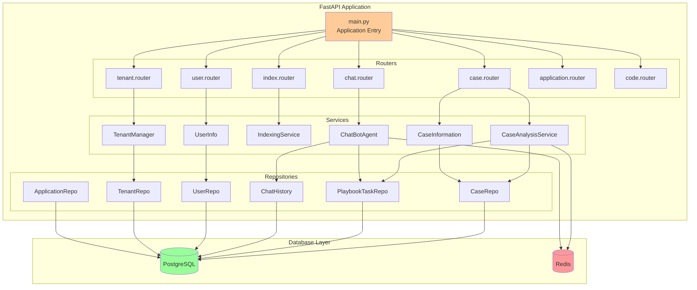

### 11.2 LLM Integration Architecture

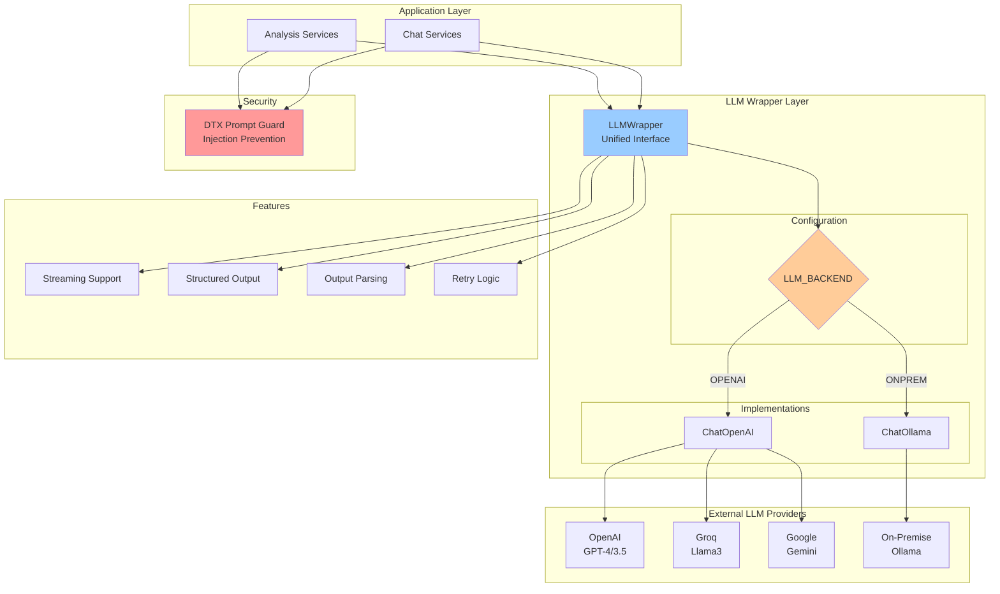

### 11.3 Vector Search Implementation

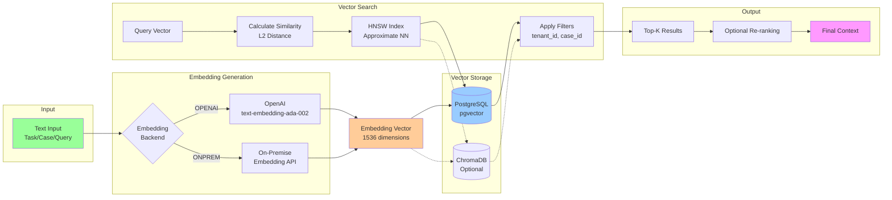

### 11.4 Celery Task State Machine

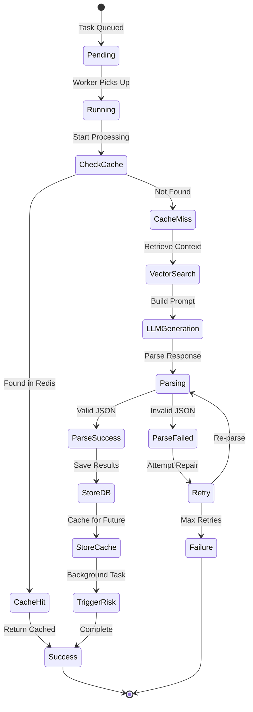

### 11.5 Kafka Topic Flow

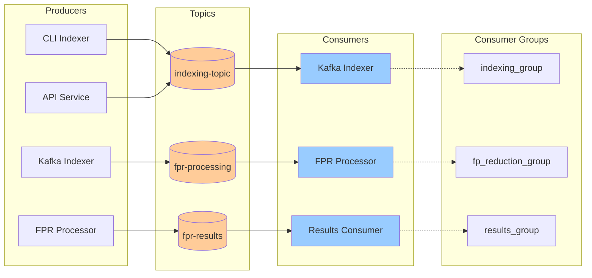

### 11.6 Sequence Diagram: Case Analysis Flow

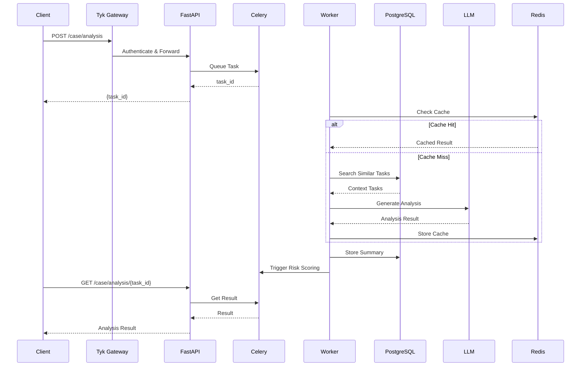

### 11.2 Task Indexing Flow

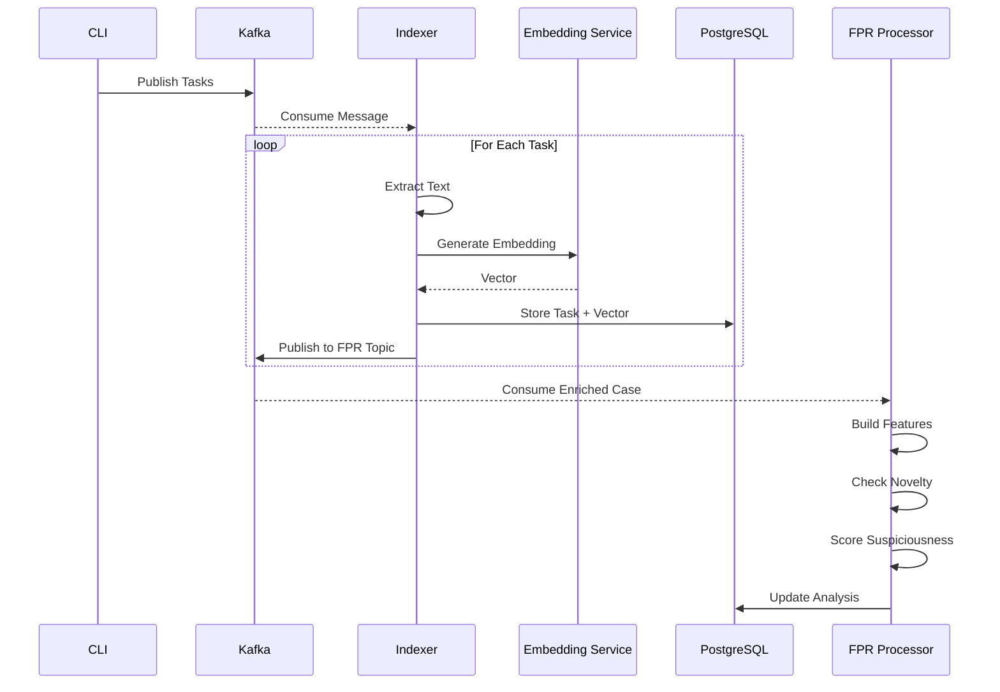

### 11.3 Chat Flow with RAG

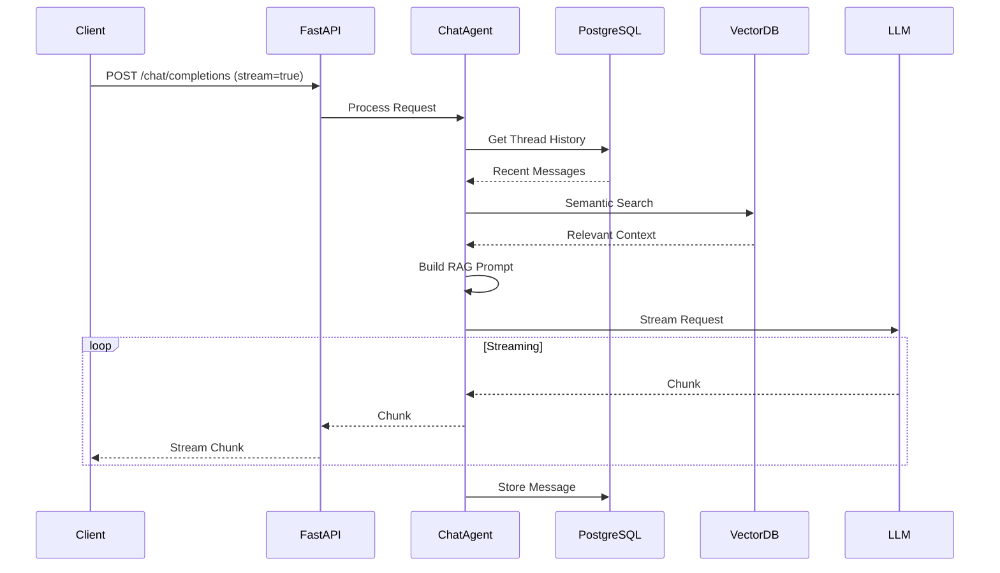

### 11.4 Repository Pattern Class Diagram

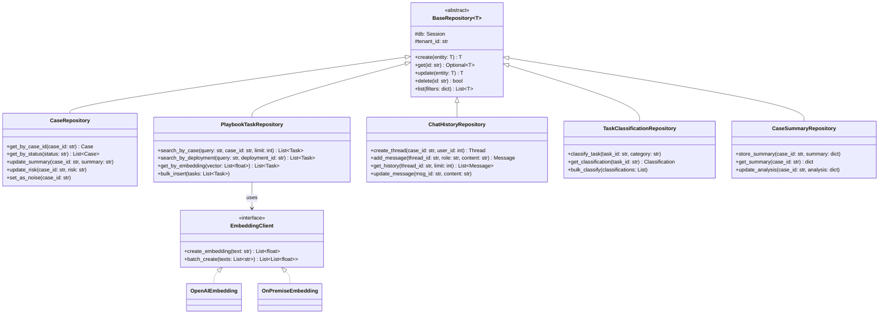

### 11.5 Tenant Onboarding Workflow

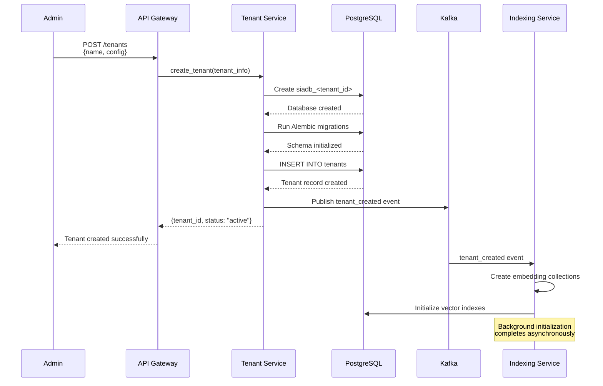

### 11.6 Error Handling Flow

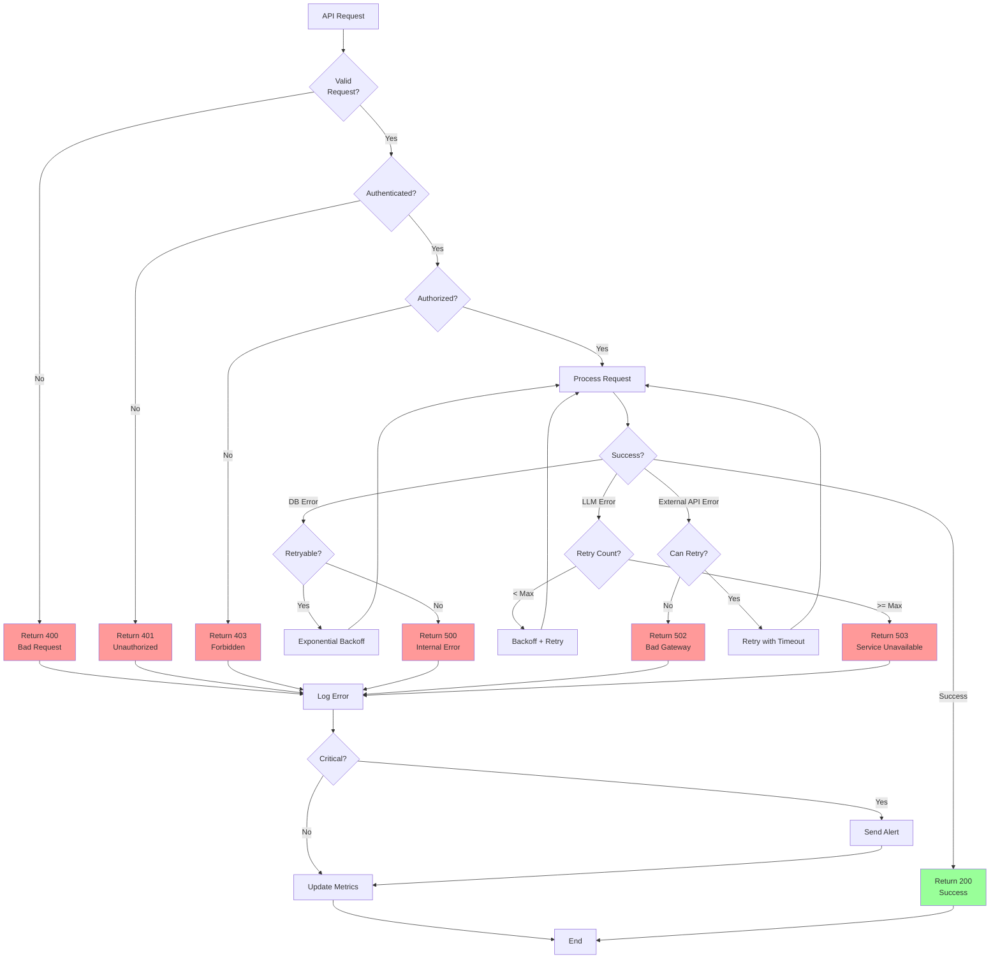

---

## 12. Class Diagrams

### 12.1 Domain Model

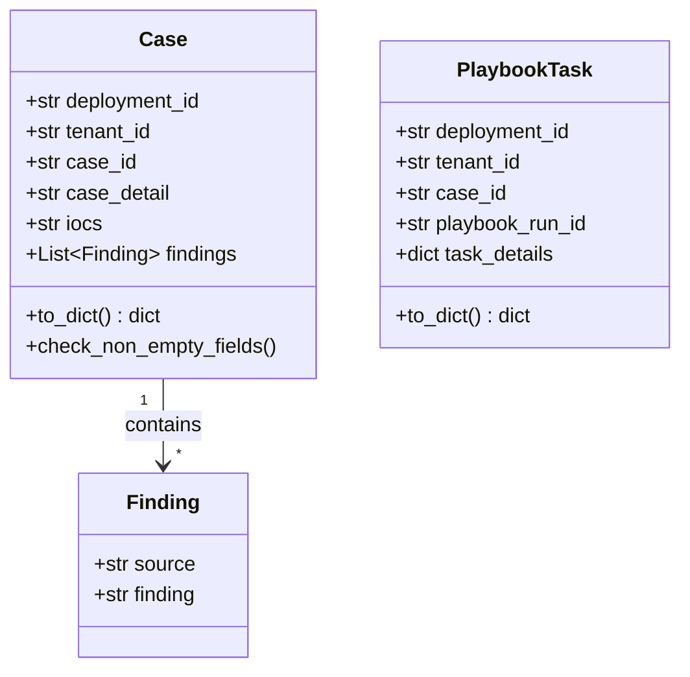

### 12.2 Service Layer

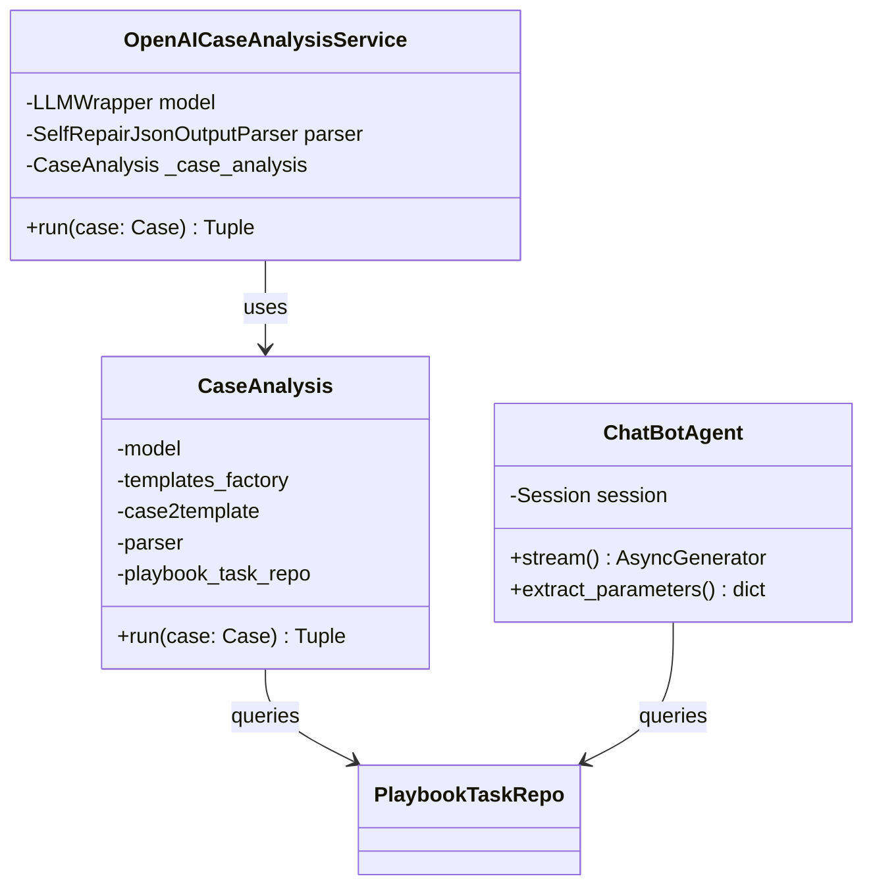

### 12.3 Repository Layer

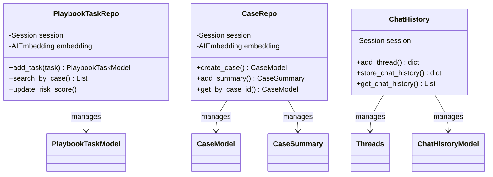

### 12.4 LLM Integration

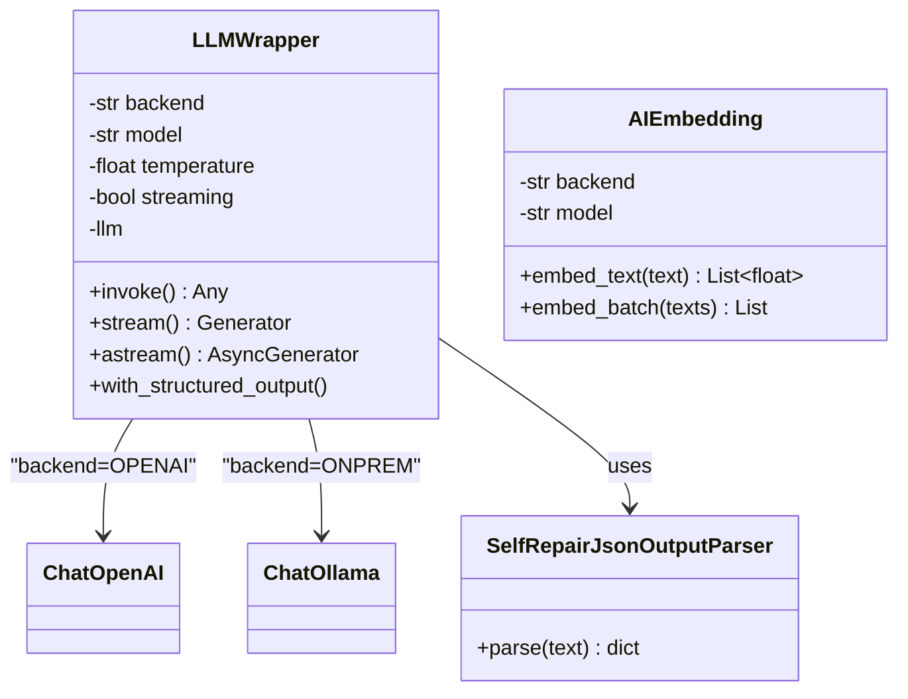

---

## 13. Key Design Patterns

### 13.1 Repository Pattern
- **Purpose**: Abstract data access logic
- **Implementation**: Separate repository classes for each entity
- **Benefits**: Testability, decoupling, consistency

### 13.2 Dependency Injection
- **Purpose**: Manage dependencies cleanly
- **Implementation**: FastAPI Depends(), constructor injection
- **Benefits**: Testability, flexibility, loose coupling

### 13.3 Strategy Pattern
- **Purpose**: Switch LLM backends dynamically
- **Implementation**: LLMWrapper with backend selection
- **Benefits**: Flexibility, extensibility

### 13.4 Observer Pattern
- **Purpose**: Event-driven processing
- **Implementation**: Kafka pub/sub
- **Benefits**: Scalability, decoupling

### 13.5 Factory Pattern
- **Purpose**: Create objects based on type
- **Implementation**: AnalysisTemplatesFactory
- **Benefits**: Centralized creation logic

---

## 14. Error Handling

### 14.1 Exception Hierarchy

```python
class SiaException(Exception):
    """Base exception"""
    pass

class InvalidInputException(SiaException):
    """Invalid user input"""
    pass

class NoneResultException(SiaException):
    """LLM returned None"""
    pass

class DatabaseException(SiaException):
    """Database operation failed"""
    pass
```

### 14.2 Retry Logic

```python
@retry((NoneResultException), tries=3, delay=2, backoff=2)
def run_analysis(case: Case):
    """Retry on specific exceptions"""
    result = analyze(case)
    if result is None:
        raise NoneResultException()
    return result
```

---

## 15. Performance Optimizations

### 15.1 Caching Strategy
- **Redis**: LLM response caching
- **Hash-based keys**: Deterministic cache hits
- **TTL**: Configurable expiration

### 15.2 Vector Search Optimization
- **HNSW Index**: Fast approximate nearest neighbor
- **Batch Processing**: Group operations
- **Selective Filtering**: Reduce search space

### 15.3 Connection Pooling
- **SQLAlchemy**: Automatic connection pooling
- **Redis**: Connection pool configuration
- **Kafka**: Reusable consumers

---

## 15. Testing Strategy

### 15.1 Unit Testing

```python
# tests/apis/test_case_service.py
import pytest
from siaservice.apis.services.cases import OpenAICaseAnalysisService
from siaservice.domain.soar.cases import Case

@pytest.fixture
def mock_playbook_repo(mocker):
    repo = mocker.Mock()
    repo.search_by_case.return_value = []
    return repo

@pytest.fixture
def case_service(mock_playbook_repo):
    return OpenAICaseAnalysisService(
        playbook_task_repo=mock_playbook_repo
    )

def test_case_analysis_success(case_service):
    case = Case(
        deployment_id="test",
        tenant_id="test",
        case_id="CASE-001",
        case_detail="Test case",
        iocs="192.168.1.1"
    )
    
    result, is_cached = case_service.run(case)
    
    assert result is not None
    assert "executive_summary" in result
    assert "conclusion" in result
    assert isinstance(is_cached, bool)
```

### 15.2 Integration Testing

```python
# tests/integration/test_case_flow.py
import pytest
from fastapi.testclient import TestClient
from main import app

@pytest.fixture
def client():
    return TestClient(app)

def test_case_analysis_flow(client):
    # Submit case
    response = client.post(
        "/case/analysis",
        json={
            "case": {
                "deployment_id": "test",
                "tenant_id": "test",
                "case_id": "CASE-001",
                "case_detail": "Test",
                "iocs": "192.168.1.1"
            }
        }
    )
    assert response.status_code == 201
    task_id = response.json()["task_id"]
    
    # Poll for result
    result_response = client.get(f"/case/analysis/{task_id}")
    assert result_response.status_code == 200
```

### 15.3 Performance Testing

```python
# tests/performance/test_vector_search.py
import time
import pytest
from siaservice.repositories.playbook_tasks_repo import PlaybookTaskRepo

def test_vector_search_performance(db_session, embedding_client):
    repo = PlaybookTaskRepo(db_session, embedding_client)
    
    start = time.time()
    results = repo.search_by_case(
        "malicious IP",
        "test-dep",
        "test-tenant",
        "CASE-001",
        limit=100
    )
    duration = time.time() - start
    
    assert duration < 1.0  # Sub-second search
    assert len(results) > 0
```

---

## 16. Code Examples

### 16.1 Adding a New API Endpoint

```python
# siaservice/routers/example.py
from fastapi import APIRouter, Depends
from sqlalchemy.orm import Session
from siaservice.db.pgv.db import get_db_for_tenant
from siaservice.apis.services.base.models import ExamplePayload
from siaservice.common import get_logger

logger = get_logger(__name__)
router = APIRouter(prefix="/example", tags=["Example"])

@router.post("/process", status_code=201)
def process_example(
    payload: ExamplePayload,
    db: Session = Depends(get_db_for_tenant)
):
    logger.info(f"Processing example: {payload.id}")
    
    # Business logic here
    result = {"status": "success"}
    
    return result
```

### 16.2 Creating a New Repository

```python
# siaservice/repositories/example_repo.py
from sqlalchemy.orm import Session
from siaservice.db.pgv.models import ExampleModel
from siaservice.db.embed.embedding import AIEmbedding
from typing import List, Optional

class ExampleRepo:
    def __init__(self, session: Session, embedding: AIEmbedding):
        self.session = session
        self.embedding = embedding
    
    def create(self, data: dict) -> ExampleModel:
        """Create new record"""
        # Generate embedding if needed
        text = data.get("description", "")
        embedding_vector = self.embedding.embed_text(text)
        
        model = ExampleModel(
            **data,
            embedding=embedding_vector
        )
        
        self.session.add(model)
        self.session.commit()
        self.session.refresh(model)
        
        return model
    
    def search_similar(
        self,
        query: str,
        tenant_id: str,
        limit: int = 10
    ) -> List[ExampleModel]:
        """Vector similarity search"""
        query_vector = self.embedding.embed_text(query)
        
        results = self.session.query(ExampleModel).filter(
            ExampleModel.tenant_id == tenant_id
        ).order_by(
            ExampleModel.embedding.l2_distance(query_vector)
        ).limit(limit).all()
        
        return results
```

### 16.3 Adding a New Celery Task

```python
# worker.py - Add new task
from celery import Celery
from siaservice.db.pgv.db import db_session
from siaservice.common import get_logger

logger = get_logger(__name__)
celery = Celery(__name__)

@celery.task(name="process_example_task")
def process_example_task(data: dict):
    """
    Background task for processing examples
    """
    tenant_id = data["tenant_id"]
    logger.info(f"Processing example for tenant: {tenant_id}")
    
    with db_session(tenant_id) as session:
        # Your logic here
        result = perform_processing(session, data)
        
        return {"result": result}

def perform_processing(session, data):
    # Implementation
    return {"status": "completed"}
```

### 16.4 Adding a New LLM Prompt Template

```python
# siaservice/analysis/templates.py
class AnalysisTemplatesFactory:
    def get_example_template(self) -> str:
        """
        Returns prompt template for example analysis
        """
        return """
You are an expert security analyst. Analyze the following data:

Context:
{context}

Data to analyze:
{data}

Provide your analysis in JSON format:
{{
  "summary": "...",
  "findings": [...],
  "recommendations": [...]
}}
"""
    
    def get_by_type(self, analysis_type: str) -> str:
        """Get template by type"""
        templates = {
            "case": self.get_by_case,
            "example": self.get_example_template,
        }
        
        return templates.get(analysis_type, self.get_default)()
```

### 16.5 Database Migration Example

```python
# migrations/versions/xxxxx_add_example_table.py
"""Add example table

Revision ID: xxxxx
Revises: yyyyy
Create Date: 2025-11-11 16:00:00.000000

"""
from alembic import op
import sqlalchemy as sa
from pgvector.sqlalchemy import Vector

# revision identifiers
revision = 'xxxxx'
down_revision = 'yyyyy'
branch_labels = None
depends_on = None

def upgrade():
    op.create_table(
        'examples',
        sa.Column('id', sa.UUID(), nullable=False),
        sa.Column('tenant_id', sa.String(256), nullable=False),
        sa.Column('name', sa.String(255), nullable=False),
        sa.Column('description', sa.Text(), nullable=True),
        sa.Column('embedding', Vector(1536), nullable=True),
        sa.Column('created_at', sa.DateTime(timezone=True), 
                  server_default=sa.text('now()'), nullable=False),
        sa.PrimaryKeyConstraint('id')
    )
    
    op.create_index(
        'ix_examples_tenant_id',
        'examples',
        ['tenant_id']
    )
    
    op.create_index(
        'ix_examples_embedding',
        'examples',
        ['embedding'],
        postgresql_using='hnsw',
        postgresql_with={'m': 16, 'ef_construction': 64},
        postgresql_ops={'embedding': 'vector_l2_ops'}
    )

def downgrade():
    op.drop_index('ix_examples_embedding', table_name='examples')
    op.drop_index('ix_examples_tenant_id', table_name='examples')
    op.drop_table('examples')
```

### 16.6 Adding Environment Configuration

```python
# .env additions
# Example Service Configuration
EXAMPLE_API_KEY=your_api_key_here
EXAMPLE_BASE_URL=https://api.example.com
EXAMPLE_TIMEOUT=30
EXAMPLE_MAX_RETRIES=3
```

```python
# siaservice/services/example_client.py
import os
import requests
from typing import Dict, Any
from siaservice.common import get_logger

logger = get_logger(__name__)

class ExampleClient:
    def __init__(self):
        self.api_key = os.getenv("EXAMPLE_API_KEY")
        self.base_url = os.getenv("EXAMPLE_BASE_URL")
        self.timeout = int(os.getenv("EXAMPLE_TIMEOUT", 30))
        self.max_retries = int(os.getenv("EXAMPLE_MAX_RETRIES", 3))
    
    def call_api(self, endpoint: str, data: Dict[str, Any]) -> Dict[str, Any]:
        """Make API call with retry logic"""
        url = f"{self.base_url}/{endpoint}"
        headers = {"Authorization": f"Bearer {self.api_key}"}
        
        for attempt in range(self.max_retries):
            try:
                response = requests.post(
                    url,
                    json=data,
                    headers=headers,
                    timeout=self.timeout
                )
                response.raise_for_status()
                return response.json()
                
            except requests.RequestException as e:
                logger.warning(f"API call failed (attempt {attempt + 1}): {e}")
                if attempt == self.max_retries - 1:
                    raise
        
        return {}
```

---

**Document Version**: 1.0  
**Last Updated**: November 11, 2025  
**Status**: Active Development
